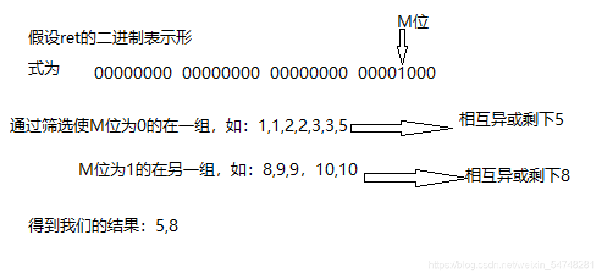

<h1 align="center">数组中出现一次的两个数</h1>

## 题目

【剑指offer】给定一个整数数组nums，其中恰好有两个元素只出现一次，其余所有元素均出现两次，请找出只出现一次的那两个元素。

## 解题思路

题目说了只有两个数出现了一次，其他的都出现了2次，我们把所有值都异或一遍，异或的结果就是那两个只出现一次的异或值，因为出现两次的异或结果都为0。因为这两个值不相同，所以他们的异或结果肯定不为0，也就是说这个结果转化为二进制的某一位上肯定有1，我们就根据这个1可以把数组分为两个部分，并且这两个只出现一次的肯定不会在同一组，根据这个特性我们很容易就能找到这两个值。

```java
    public int[] singleNumber(int[] nums) {
        int diff = 0;
        for (int num : nums) {
            diff ^= num;
        }
        diff &= -diff;
        int[] rets = {0, 0};
        for (int num : nums) {
            if ((num & diff) == 0) {
                rets[0] ^= num;
            } else {
                rets[1] ^= num;
            }
        }
        return rets;
    }
```

## 解题思路2

给定一个整数数组nums，其中恰好有两个元素只出现一次，其余所有元素均出现两次，请找出只出现一次的那两个元素。你能否仅使用常数空间复杂度来实现？
示例 ： 输入：num=【1,2，2,3，3,4】 输出：1,4
题目给定初始程序为

```
intsingleNumber( int nums, int numsSize, int*returnSize )
{
}
```


思路一：要想从数组中得到那两个数，我们可以将数组中所有元素***异或***，这样想的的两个数都异或为0了，只留下只出现一次的那两个元素。
## 实现
```c
int*singleNumber(  int* nums,         int numsSize,        int*returnSize )
{
   int ret=0;//0和如何元素异或都不会改变其结果，我们用0去异或
       for（int i=0;i<numsSize;i++)
          {
               ret^=nums[i];
          }
}
```

通过以上步骤，此时我们得到的ret是那两个元素的异或，并不是独立的两个元素，现在我们应该思考如何把那两个元素拆出来呢？
显然，要想从ret中拆出独立的两个元素非常困难，我们可以换个思路，既然ret是那两个元素的异或，那么在ret的二进制一个位置上（如M位）为1，必然两个元素（假设为x1，x2）其中一个的M位为1，另一个为0（异或时，相同为0，相异为一，二进制仅有0和1两种表示方法）。想到这里，那我们可以将原先数组中M为1的分成一组，M位为0的分成一组，相同的元素，必然会分到同一组，再让为1的一组全部异或得到其中一个独立元素，M为0的一组全部异或，得到另一个独立元素。



实现：

```c
int* singleNumber(int* nums, int numsSize, int* returnSize )
{
   int ret=0;//0和如何元素异或都不会改变其结果，我们用0去异或
       for(int i=0;i<numsSize;i++)
          {
               ret^=nums[i];
          }
   int m=0;//找出ret第m位为1
        while(m<32)
          {
              if(ret&(1<<m))//与上1左移m位，ret中一定有一位是1，只需要不断地将m左移一位，当第ret的第m位为1时，if语句里不为0，进入if，break跳出去，得到m的值
              break;
              else
              ++m;
          }
//做完以上步骤，我们接下来分离ret中所有m位为1和m位为0的元素,其中一组为x1，另一组为x2
int x1=0,x2=0;
         for(int j=0;j<numsSize;j++)
         {
         if(nums[j]&(1<<m))
         {
           x1^=nums[j];//m为1进入if，到x1相互异或，最后相同的消失，只剩一个m位为1的独立元素
           }
           else
           {
           x2^=nums[j];//m为0不会进入if，到x2相互异或，最后相同的消失，只剩一个m位为0的独立元素
           }
         }
         int*retArr=(int*)malloc(sizeof(int)*2);
         retArr[0]=x1;
         retArr[1]=x2;
         *returnSize=2;
         return retArr;
}
```

## 解题思路-java

做题思路：先将字符串自己异或一边，得到一个数。找到其二进制状态下为 1 的任一位置。两个只出现一次的元素在这个位置上的数字一个为 1 另一个为 0。那么我们可以把这个数组的的元素分为两部分，一部分在这一位的数字为 1 ，另一部分在这一位的数字为 0. 然后把这两部分的数字与自己异或，就会的到两个数。这两个数就是只出现一次的元素。
素。

```java
public class lianxi{
	public static void main(String[] args){
		Solution S = new Solution();
		int[] nums = new int[] {1,2,1,3,2,5};
		int[] a = S.singleNumber(nums);
		for(int i = 0; i< 2 ;i++) {
			System.out.print(a[i] + " ");
		}

​	}

}

class Solution {
    public int[] singleNumber(int[] nums) {
        int a = nums[0];
        int b = 0;
        int c = 0;
        int n = 1;
        int[] result = new int[2];
        for(int i = 1; i<nums.length;i++){
            a ^=nums[i];     
        }
        while(true){
            if((a & n )== n ){
               //找到为 1 的位置
                break;
            }
            n *= 2;
        }
        for(int i = 0; i < nums.length; i++){
            if((nums[i] & n )==n){
                b ^= nums[i];
            }else{
                c ^=nums[i];
            }
        }
        result[0] = b;
        result[1] = c;
        return result;
    }
}
```


## 参考

[314，只出现一次的数字 III_山大王算法_51CTO博客](https://blog.51cto.com/u_4774266/2902533)

[【面试题】【剑指offer】给定一个整数数组nums，其中恰好有两个元素只出现一次，其余所有元素均出现两次，请找出只出现一次的那两个元素。_阳明斌的博客-CSDN博客](https://blog.csdn.net/weixin_54748281/article/details/115315831)