<h1 align="center">Java中的移位运算符</h1>


在[HashMap底层实现原理（上）](https://zhuanlan.zhihu.com/p/28501879)一文中，我们讲了一段源码，HashMap里的hash方法，并在文后抛出了一个疑问

> 在put放入元素时，HashMap又自己写了一个hash方法来计算hash值，大家想想看，为什么不用key本身的hashCode方法，而是又处理了一下

为了让大家深入理解这段代码的含义，准备写三篇文章来拓展一下基础知识，然后再回归到HashMap中去，这三篇文章分别是**Java中的二进制**，**移位运算符**（左移运算符：<< ，右移运算符：>>，无符号右移运算符：>>>），和**位运算符**（与：&，或：| ，非：~，异或：^），我们再看一下DEFAULT_INITIAL_CAPACITY这个常量赋值和hash方法的源码，这段源码中就用到了移位运算符和位运算符（^）：

```java
static final int DEFAULT_INITIAL_CAPACITY = 1 << 4;
static final int hash(Object key) {
     int h;
     return (key == null) ? 0 : (h = key.hashCode()) ^ (h >>> 16);
}
```

计算机看似能干很多活，其实也很苯，只认识0和1。因为电路的逻辑只有0和1两个状态，这里的0和1并不是数字的0和1，0和1是表示两种不同的状态，0表示低电平，1表示高电平。计算机是由无数个逻辑电路组成的，通过0和1的无限位数和组合来表达信息。也就是说，计算机是采用二进制来表示数据的。为了说清楚二进制，先说一下我们生活中常用的十进制，十进制看起来很简单，那是因为我们从小接受的就是十进制的教育：

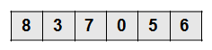

这是一个普通的十进制数，八十三万七千零五十六，这个数字可以表示如下：

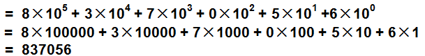

再来看看二进制

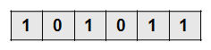

这是一个二进制数101011，这个数字可以表示如下：

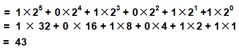

和十进制一样，只不过把底数（幂）从10变成了2，用十进制表示二进制里的101011就是43。有一点Java基础的人，都知道**int类型在Java中是占4个字节的，1个字节8位**，43表示如下：

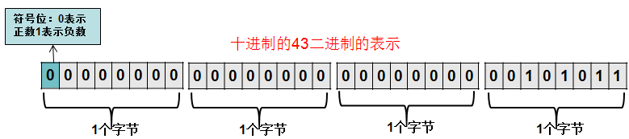

其中每段为1个字节，一个字节是8位，首位表示符号位。在Java中，**负数是用补码来表示的，也就是其绝对值取反加1得到的**，并用首位来标识符号位为负数，看一下-43是怎么表示的：

1、先取反，取反其实很简单，就是0变1，1变0

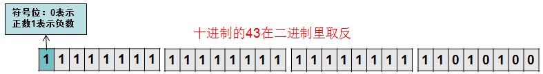

2、加1

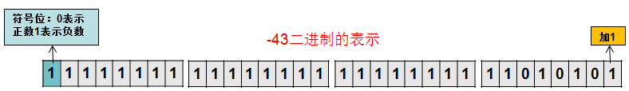


相信看到这里，大家就知道为什么int能表示的最大数和最小数分别是2147483647和-2147483648了。先看int的最大值2147483647，二进制是这样表示的，原来并不是定义的，只是说实在装不下了

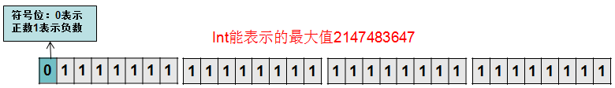

再看看int里的最小值-2147483648，二进制是这样表示的

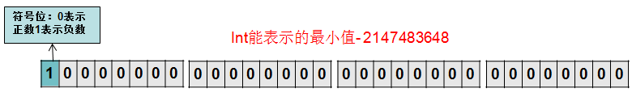

写到这儿了，再扩展一下知识点吧，来看一下32位的int类型转换成16位的short类型时，系统是怎么转换的，随手写了一个二进制数，相当于十进制的20080557

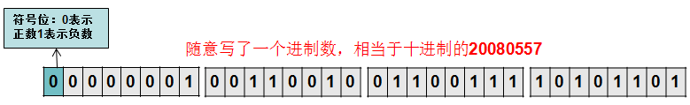

准备转换，截掉前面的16位


取后面的16位，并把第1位变为符号位

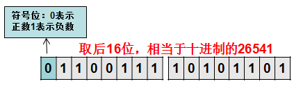

强制转换以后，十进制的20080557变成了十进制的26541，怎么样，简单吧。

有人说，好麻烦，每次都要这么算吗？不用担心，Java提供了丰富的API来供我们使用，我们写一段代码来测试一下

```java
public static void main(String[] args) {
	System.out.println("int最大正数：" + Integer.MAX_VALUE);
	System.out.println("int最大正数二进制表示：" + Integer.toBinaryString(Integer.MAX_VALUE));
	System.out.println("int最小负数：" + Integer.MIN_VALUE);
	System.out.println("int最小负数二进制表示：" + Integer.toBinaryString(Integer.MIN_VALUE));
		
	System.out.println("二进制定义打印int能表示的最大数：" + 0b01111111_11111111_11111111_11111111);
	System.out.println("二进制定义打印int能表示的最小数：" + 0b10000000_00000000_00000000_00000000);
		
	System.out.println("43的二进制表现：" + Integer.toBinaryString(43));//结果省略了前面的0
	System.out.println("-43的二进制表现：" + Integer.toBinaryString(-43));

	//下划线无意义，只是为了方便看，可以随意写
	int a = 0b00000000_00000000_00000000_00000000_00101011;//0b表示为二进制，a相当于十进制的43
	int a1 = 0b101011;//这也是十进制的43，只不过省略了上面的0
	System.out.println("打印a的值：" + a);
	System.out.println("打印a1的值：" + a1);
	int b = 0b11111111_11111111_111111111_1010101;//二进制43取反加1，变成-43，下划线无意义
	System.out.println("打印b的值：" + b);
		
	int i = 0b00000001_00110010_01100111_10101101;//随手写了个十进制的24274861
	System.out.println("打印10进制的i：" + i);
	System.out.println("打印强制转换为short的i：" + (short)i);
	System.out.println("打印short的二进制表示：" + Integer.toBinaryString((short)i));
}
```

最后我们来看一下结果

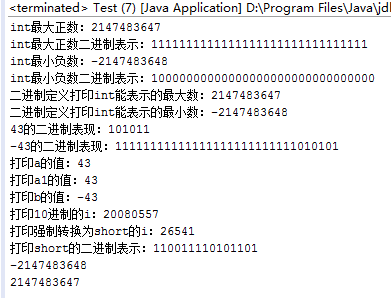

整理了一个表格，帮大家回顾一下Java中的四种整形，byte，short，long这三种类型本文就不详细解说了，其中API的调用都是一样的

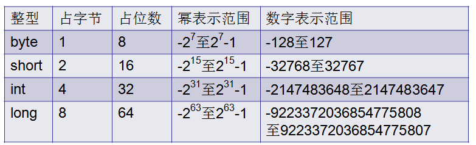

思考以下代码执行结果，结合本文中的图片一起看

```java
System.out.println(Integer.MAX_VALUE + 1);
System.out.println(Integer.MIN_VALUE - 1);
```

在阅读源码的过程中，经常会看到这些符号<< ，>>，>>>，这些符号在Java中叫移位运算符，在写代码的过程中，虽然我们基本上不会去写这些符号，但需要明白这些符号的运算原理，比如HashMap中有以下代码：

```java
static final int DEFAULT_INITIAL_CAPACITY = 1 << 4;//左移
static final int hash(Object key) {
     int h;
     return (key == null) ? 0 : (h = key.hashCode()) ^ (h >>> 16);//无符号右移
}
```

上段代码中就包含左移运算符<<，无符号右移运算符>>>。这篇文章详细说一下这三个符号：

**1、左移运算符：<<**

先随便定义一个int类型的数int，十进制的value = 733183670，转换成二进制在计算机中的表示如下：

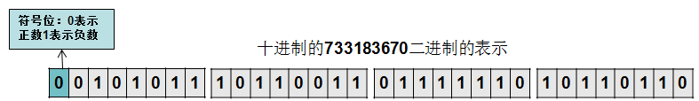

value << 1，左移1位

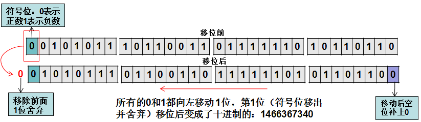

左移1位后换算成十进制的值为：1466367340，刚好是733183670的两倍， 有些人在乘2操作时喜欢用左移运算符来替代。

value << 8，左移8位看一下：

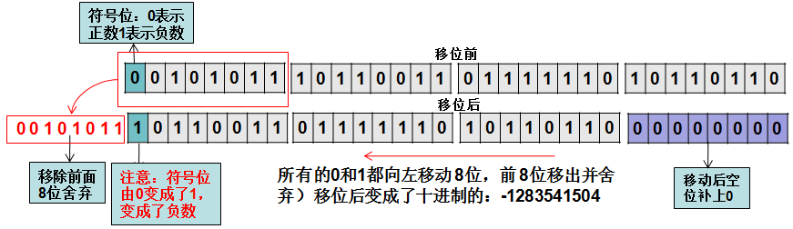

左移8位后变成了十进制的值为：-1283541504，移动8位后，由于首位变成了1，也就是说成了负数，在使用中要考虑变成负数的情况。

根据这个规则，左移32位后，右边补上32个0值是不是就变成了十进制的0了？**答案是NO，**当int类型进行左移操作时，**左移位数大于等于32位操作时，会先求余（%）后再进行左移操作。**也就是说左移32位相当于不进行移位操作，左移40位相当于左移8位（40%32=8）。当long类型进行左移操作时，long类型在二进制中的体现是64位的，因此求余操作的基数也变成了64，也就是说左移64位相当于没有移位，左移72位相当于左移8位（72%64=8），写一段代码来测试一下

```java
int intValue = 733183670;//随意写一个数	
System.out.println("intValue：" + (intValue));//打印intValue
System.out.println("intValue左移1位：" + (intValue << 1));//左移1位
System.out.println("intValue左移8位：" + (intValue << 8));//左移8位
//当int类型左移位数大于等于32位操作时，会先求余后再进行移位操作
System.out.println("intValue左移32位：" + (intValue << 32));//求余为32%32=0，相当于左移0位（不移位）
System.out.println("intValue左移40位：" + (intValue << 40));//求余为40%32=8，相当于左移8位
System.out.println("intValue左移64位：" + (intValue << 64));//求余为64%32=0，相当于左移0位（不移位）
		
long longValue = 733183670L;
System.out.println("longValue：" + (longValue));//打印longValue
System.out.println("longValue左移1位：" + (longValue << 1));//左移1位
System.out.println("longValue左移8位：" + (longValue << 8));//左移8位
//当long类型左移位数大于等于64位操作时，会先求余后再进行移位操作
System.out.println("longValue左移64位：" + (longValue << 64));//求余为64%64=0，相当于左移0位（不移位）
System.out.println("longValue左移72位：" + (longValue << 72));//求余为72%64=8，相当于左移8位
System.out.println("longValue左移128位：" + (longValue << 128));//求余为128%64=0，相当于左移0位（不移位）
```

看一下结果：

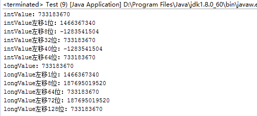

由于double，float在二进制中的表现比较特殊，因此不能来进行移位操作，报错，编译不过，如下图：

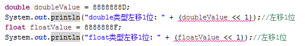

注意：其它几种整形byte，short移位前会先转换为int类型（32位）再进行移位，这里就不写代码测试了，大家有兴趣可自行测试。

综上所述：左移 << 其实很简单，也就是说**丢弃左边指定位数，右边补0。**

**2、右移运算符：>>**

还是这个数：**733183670**

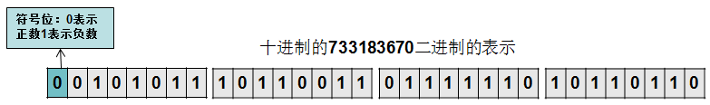

value >> 1，右移1位

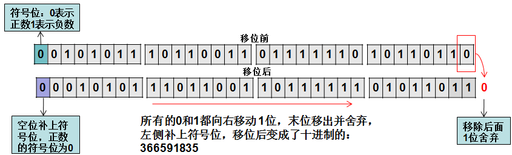

右移1位后换算成十进制的值为：366591835，刚好是733183670的1半， 有些人在除2操作时喜欢用右移运算符来替代

value >> 8，右移8位看一下

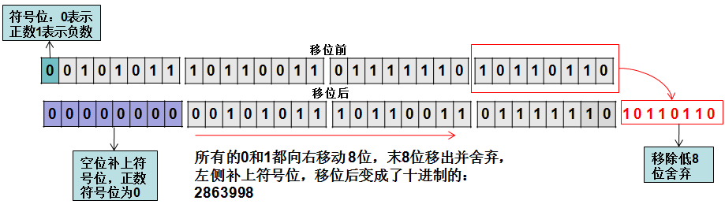

写一段代码测试一下

```java
int intValue = 733183670;//随意写一个数
System.out.println("intValue：" + (intValue));//打印intValue
System.out.println("intValue右移1位：" + (intValue >> 1));//右移1位
System.out.println("intValue右移8位：" + (intValue >> 8));//右移8位
//当int类型右移位数大于等于32位操作时，会先求余后再进行移位操作
System.out.println("intValue右移32位：" + (intValue >> 32));//求余为32%32=0，相当于右移0位（不移位）
System.out.println("intValue右移40位：" + (intValue >> 40));//求余为40%32=8，相当于右移8位
System.out.println("intValue右移64位：" + (intValue >> 64));//求余为64%32=0，相当于右移0位（不移位）
		
long longValue = 733183670L;
System.out.println("longValue：" + (longValue));//打印longValue
System.out.println("longValue右移1位：" + (longValue >> 1));//右移1位
System.out.println("longValue右移8位：" + (longValue >> 8));//右移8位
//当long类型右移位数大于等于64位操作时，会先求余后再进行移位操作
System.out.println("longValue右移64位：" + (longValue >> 64));//求余为64%64=0，相当于右移0位（不移位）
System.out.println("longValue右移72位：" + (longValue >> 72));//求余为72%64=8，相当于右移8位
System.out.println("longValue右移128位：" + (longValue >> 128));//求余为128%64=0，相当于右移0位（不移位）
```

结果：

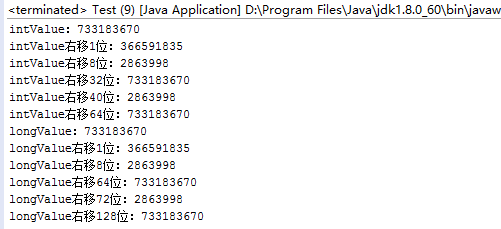

和左移一样，int类型移位大于等于32位时，long类型大于等于64位时，会先做求余处理再位移处理，byte，short移位前会先转换为int类型（32位）再进行移位。以上是正数的位移，我们再来看看负数的右移运算，如图，负数intValue：-733183670的二进制表现如下图：

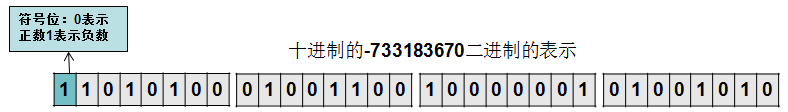

右移8位，intValue >> 8

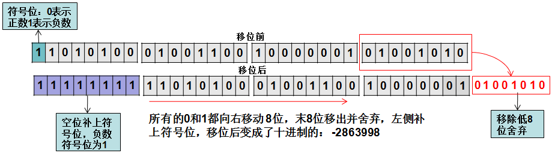

综上所述：右移运算符>>的运算规则也很简单，**丢弃右边指定位数，左边补上符号位。**

**3、无符号右移运算符：>>>**

无符号右移运算符>>>和右移运算符>>是一样的，只不过右移时左边是补上符号位，而无符号右移运算符是补上0，也就是说，对于正数移位来说等同于：>>，负数通过此移位运算符能移位成正数。以-733183670>>>8为例来画一下图

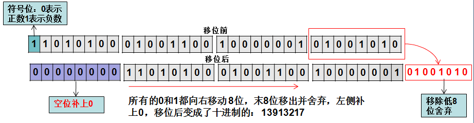

无符号右移运算符>>的运算规则也很简单，**丢弃右边指定位数，左边补上0。**

> 注：本专栏示例代码已上传至公众号：saysayJava，需要可自行关注下载。

如果喜欢本专栏的系列文章，请为我点赞或顺手分享，您的支持是我继续下去的动力，您也可以在评论区留言想了解的内容，有机会本专栏会做讲解，最后别忘了关注一下我。


## 参考

[Java中的二进制 - 知乎 (zhihu.com)](https://zhuanlan.zhihu.com/p/29187389)

[Java中的移位运算符 - 知乎 (zhihu.com)](https://zhuanlan.zhihu.com/p/30108890)

