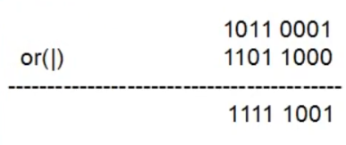
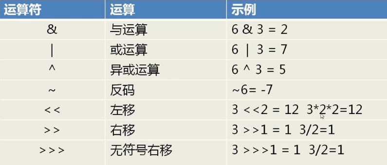
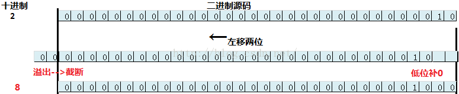
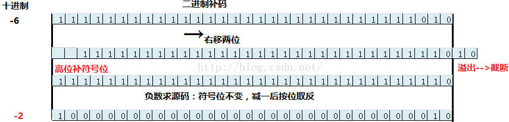
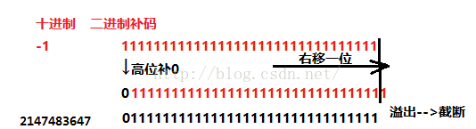
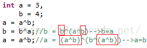
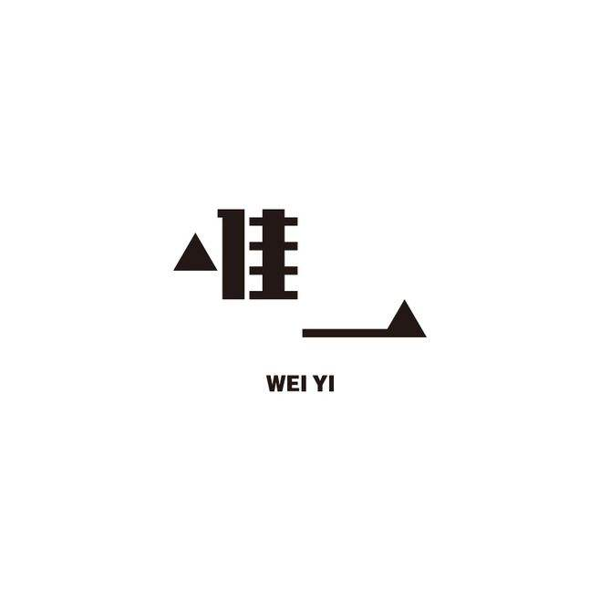

<h1 align="center">Java二进制和位运算</h1>

[toc]

## ✍前言

你好，我是YourBatman。

本号正在连载Jackson深度解析系列，虽然目前还只讲到了其**流式API**层面，但已接触到其多个`Feature`特征。更为重要的是我在文章里赞其设计精妙，处理优雅，因此就有小伙伴私信给我问这样的话：

题外话：Jackson这个话题本就非常小众，看着阅读量我自己都快没信心写下去。但自己说过的话就是**欠下的债**，熬夜也得把承诺的付费内容给公开完了，毕竟还有那么几个人在白嫖不是😄。

> 话外音：以后闷头做事，少吹牛逼┭┮﹏┭┮

虽然小众，竟然还有想深入了解一波的小伙伴，确实让我为之振奋了那么三秒。既然如此那就干吧，本文就先行来认识认识**Java中的位运算**。位运算在Java中很少被使用，那么为何Jackson里爱不释手呢？一切就为两字：**性能**/**高效**。用计算机能直接看懂的语言跟它打交道，你说快不快，不用多想嘛。


## ✍正文

提及位运算，对绝大多数Java程序员来说，是一种**既熟悉又陌生**的感觉。熟悉是因为你在学JavaSE时肯定学过，并且在看一些开源框架（特别是JDK源码）时都能看到它的身影；陌生是因为大概率我们不会去使用它。当然，不能“流行”起来是有原因的：不好理解，不符合人类的思维，阅读性差…...

> 小贴士：一般来说，程序让人看懂远比被机器看懂来得更重要些

位运算它在`low-level`的语言里使用得比较多，但是对于Java这种高级语言它就很少被提及了。虽然我们使用得很少但Java也是支持的，毕竟很多时候使用位运算才是**最佳实践**。

位运算在日常开发中使用得较少，但是巧妙的使用位运算可以大量减少运行开销，优化算法。**一条语句可能对代码没什么影响，但是在高重复，大数据量的情况下将会节省很多开销。**

## 二进制

在了解什么是位运算之前，十分有必要先科普下二进制的概念。

二进制是计算技术中广泛采用的一种数制。二进制数据是用0和1两个数码来表示的数。它的基数为2，进位规则是**逢二进一**，借位规则是**借一当二**。因为它只使用0、1两个数字符号，非常简单方便，易于用电子方式实现。

> 小贴士：半导体开代表1，关代表0，这也就是CPU计算的最底层原理😄

先看一个例子：

```
求 1011（二进制）+ 11（二进制） 的和？
结果为：1110（二进制）
```

二进制理解起来非常非常的简单，比10进制简单多了。你可能还会思考二进制怎么和十进制互转呢？毕竟1110这个也看不到啊。有或者往深了继续思考：如何转为八进制、十六进制、三十二进制......进制转换并非本文所想讲述的内容，请有兴趣者自行度娘。

### 二进制与编码

这个虽然和本文内容关联系并不是很大，但顺带捞一捞，毕竟编码问题在开发中还是比较常见的。

计算机能识别的只有1和0，也就是二进制，1和0可以表达出全世界的**所有**文字和语言符号。那如何表达文字和符号呢？这就涉及到**字符编码**了。字符编码强行将每一个字符对应一个十进制数字（请注意字符和数字的区别，比如`0`字符对应的十进制数字是`48`），再将十进制数字转换成计算机理解的二进制，而计算机读到这些1和0之后就会显示出对应的文字或符号。

- 一般对**英文字符**而言，一个字节表示一个字符，但是对汉字而言，由于低位的编码已经被使用(早期计算机并不支持中文，因此为了扩展支持，唯一的办法就是采用更多的字节数)只好向高位扩展
- 字符集编码的范围`utf-8>gbk>iso-8859-1(latin1)>ascll`。ascll编码是美国标准信息交换码的英文缩写，包含了常用的字符，如阿拉伯数字，英文字母和一些打印符号共255个（一般说成共128个字符问题也不大）

> `UTF-8`：一套以 8 位为一个编码单位的**可变长**编码，会将一个码位（Unicode）编码为1到4个字节（英文1字节，大部分汉字3字节）。

## Java中的二进制

在Java7版本以前，Java是不支持直接书写除十进制以外的其它进制字面量。但这在Java7以及以后版本就允许了：

- 二进制：前置0b/0B
- 八进制：前置0
- 十进制：默认的，无需前置
- 十六进制：前置0x/0X

```java
@Test
public void test1() {
    //二进制
    int i = 0B101;
    System.out.println(i); //5
    System.out.println(Integer.toBinaryString(i));
    //八进制
    i = 0101;
    System.out.println(i); //65
    System.out.println(Integer.toBinaryString(i));
    //十进制
    i = 101;
    System.out.println(i); //101
    System.out.println(Integer.toBinaryString(i));
    //十六进制
    i = 0x101;
    System.out.println(i); //257
    System.out.println(Integer.toBinaryString(i));
}
```

结果程序，输出：

```java
5
101
65
1000001
101
1100101
257
100000001
```

说明：`System.out.println()`会先自动转为10进制后再输出的；`toBinaryString()`表示转换为二进制进行**字符串**进行输出。

### 便捷的进制转换API

JDK自`1.0`开始便提供了非常便捷的进制转换的API，这在我们有需要时非常有用。

```java
@Test
public void test2() {
    int i = 192;
    System.out.println("---------------------------------");
    System.out.println("十进制转二进制：" + Integer.toBinaryString(i)); //11000000
    System.out.println("十进制转八进制：" + Integer.toOctalString(i)); //300
    System.out.println("十进制转十六进制：" + Integer.toHexString(i)); //c0
    System.out.println("---------------------------------");
    // 统一利用的为Integer的valueOf()方法,parseInt方法也是ok的
    System.out.println("二进制转十进制：" + Integer.valueOf("11000000", 2).toString()); //192
    System.out.println("八进制转十进制：" + Integer.valueOf("300", 8).toString()); //192
    System.out.println("十六进制转十进制：" + Integer.valueOf("c0", 16).toString()); //192
    System.out.println("---------------------------------");
}
```

运行程序，输出：

```java
---------------------------------
十进制转二进制：11000000
十进制转八进制：300
十进制转十六进制：c0
---------------------------------
二进制转十进制：192
八进制转十进制：192
十六进制转十进制：192
---------------------------------
```

### 如何证明Long是64位的？

我相信每个Javaer都知道Java中的Long类型占8个字节（64位），那如何证明呢？

> 小贴士：这算是一道经典面试题，至少我提问过多次~

有个最简单的方法：拿到Long类型的**最大值**，用2进制表示转换成字符串看看长度就行了，代码如下：

```java
@Test
public void test3() {
    long l = 100L;
    //如果不是最大值 前面都是0  输出的时候就不会有那么长了（所以下面使用最大/最小值示例）
    System.out.println(Long.toBinaryString(l)); //1100100
    System.out.println(Long.toBinaryString(l).length()); //7

    System.out.println("---------------------------------------");

    l = Long.MAX_VALUE; // 2的63次方 - 1
    //正数长度为63为（首位为符号位，0代表正数，省略了所以长度是63）
    //111111111111111111111111111111111111111111111111111111111111111
    System.out.println(Long.toBinaryString(l));
    System.out.println(Long.toBinaryString(l).length()); //63

    System.out.println("---------------------------------------");

    l = Long.MIN_VALUE; // -2的63次方
    //负数长度为64位（首位为符号位，1代表负数）
    //1000000000000000000000000000000000000000000000000000000000000000
    System.out.println(Long.toBinaryString(l));
    System.out.println(Long.toBinaryString(l).length()); //64
}
```

运行程序，输出：

```java
1100100
7
---------------------------------------
111111111111111111111111111111111111111111111111111111111111111
63
---------------------------------------
1000000000000000000000000000000000000000000000000000000000000000
64
```

说明：在计算机中，负数以其正值的**补码**的形式表达。因此，用同样的方法你可以自行证明Integer类型是32位的（占4个字节）。

## Java中的位运算



Java语言支持的位运算符还是非常多的，列出如下：

- `&`：按位与
- `|`：按位或
- `~`：按位非
- `^`：按位异或
- `<<`：左位移运算符
- `>>`：右位移运算符
- `>>>`：无符号右移运算符

除`～`以 外，其余均为**二元**运算符，操作的数据只能是整型（长短均可）或者char字符型。针对这些运算类型，下面分别给出示例，一目了然。

既然是运算，依旧可以分为简单运算和复合运算两大类进行归类和讲解。

> 小贴士：为了便于理解，字面量例子我就都使用二进制表示了，使用十进制（任何进制）不影响运算结果

### 简单运算

简单运算，顾名思义，一次只用一个运算符。

#### &：按位与

操作规则：**同为1则1，否则为0**。仅当两个操作数都为1时，输出结果才为1，否则为0。

> 说明：1、本示例（下同）中所有的字面值使用的都是十进制表示的，理解的时候请用二进制思维去理解；2、关于负数之间的位运算本文章统一不做讲述

```java
@Test
public void test() {
    int i = 0B100; // 十进制为4
    int j = 0B101; // 十进制为5

    // 二进制结果：100
    // 十进制结果：4
    System.out.println("二进制结果：" + Integer.toBinaryString(i & j));
    System.out.println("十进制结果：" + (i & j));
}
```

#### |：按位或

操作规则：**同为0则0，否则为1**。仅当两个操作数都为0时，输出的结果才为0。

```java
@Test
public void test() {
    int i = 0B100; // 十进制为4
    int j = 0B101; // 十进制为5

    // 二进制结果：101
    // 十进制结果：5
    System.out.println("二进制结果：" + Integer.toBinaryString(i | j));
    System.out.println("十进制结果：" + (i | j));
}
```

#### ~：按位非

操作规则：**0为1，1为0**。全部的0置为1，1置为0。

> 小贴士：请务必注意是全部的，别忽略了正数前面的那些0哦~

```java
@Test
public void test() {
    int i = 0B100; // 十进制为4

    // 二进制结果：11111111111111111111111111111011
    // 十进制结果：-5
    System.out.println("二进制结果：" + Integer.toBinaryString(~i));
    System.out.println("十进制结果：" + (~i));
}
```

#### ^：按位异或

操作规则：**相同为0，不同为1**。操作数不同时（1遇上0，0遇上1）对应的输出结果才为1，否则为0。

```java
@Test
public void test() {
    int i = 0B100; // 十进制为4
    int j = 0B101; // 十进制为5

    // 二进制结果：1
    // 十进制结果：1
    System.out.println("二进制结果：" + Integer.toBinaryString(i ^ j));
    System.out.println("十进制结果：" + (i ^ j));
}
```

#### <<：按位左移

> 符号位不变，低位补0。

操作规则：把一个数的**全部位数**都向左移动若干位。

```java
@Test
public void test() {
    int i = 0B100; // 十进制为4

    // 二进制结果：100000
    // 十进制结果：32 = 4 * (2的3次方)
    System.out.println("二进制结果：" + Integer.toBinaryString(i << 2));
    System.out.println("十进制结果：" + (i << 3));
}
```

左移**用得非常多**，理解起来并不费劲。x左移N位，效果同十进制里直接乘以2的N次方就行了，但是需要注意值**溢出**的情况，使用时稍加注意。



当移动的位数超过数字本身的位数时，那么不就都需要补0操作，实际上不是的，java不可能做那么浪费资源的事情。在真正执行位移前，其对要移动的位数做了一些预处理，比如32处理为0，-1处理为31.


#### >>：按位右移

>低位溢出，符号位不变，并用符号位补溢出的高位。

操作规则：把一个数的**全部位数**都向右移动若干位。

```java
@Test
public void test() {
    int i = 0B100; // 十进制为4

    // 二进制结果：10
    // 十进制结果：2
    System.out.println("二进制结果：" + Integer.toBinaryString(i >> 1));
    System.out.println("十进制结果：" + (i >> 1));
}
```

负数右移：

```java
@Test
public void test() {
    int i = -0B100; // 十进制为-4

    // 二进制结果：11111111111111111111111111111110
    // 十进制结果：-2
    System.out.println("二进制结果：" + Integer.toBinaryString(i >> 1));
    System.out.println("十进制结果：" + (i >> 1));
}
```

右移用得也比较多，也比较理解：操作其实就是把二进制数**右边的N位**直接**砍掉**，然后`正数右移高位补0，负数右移高位补1`。




#### >>>：无符号右移

> 低位溢出，高位补0。注意，无符号右移（>>>）中的符号位（最高位）也跟着变，无符号的意思是将符号位当作数字位看待。如：-1>>>1结果为2147483647
>
> 注意：没有无符号左移，并没有`<<<`这个符号的

它和`>>`有符号右移的区别是：无论是正数还是负数，**高位通通补0**。所以说对于正数而言，没有区别；那么看看对于负数的表现：

```java
@Test
public void test() {
    int i = -0B100; // 十进制为-4

    // 二进制结果：11111111111111111111111111111110（>>的结果）
	  // 二进制结果：1111111111111111111111111111110（>>>的结果）
    // 十进制结果：2147483646
    System.out.println("二进制结果：" + Integer.toBinaryString(i >>> 1));
    System.out.println("十进制结果：" + (i >>> 1));
  
  	// 1111111111111111111111111111111
  	// 1111111111111111111111111111111
  	System.out.println(Integer.toBinaryString(-1>>>1));
		System.out.println(Integer.toBinaryString(Integer.MAX_VALUE));
  
}
```

我特意把>>的结果放上面了，方便你对比。因为高位补的是0，所以就没有显示啦，但是你心里应该清楚是怎么回事。



除了使用-1>>>1能得到Integer.MAX_VALUE，以下的也能得到同样的结果：

```java
//maxInt
System.*out*.println(~(1 << 31));
System.*out*.println((1 << -1)-1);
System.*out*.println(~(1 << -1));
```

使用位运算往往能很巧妙的实现某些算法完成一些复杂的功能。


### 复合运算

广义上的复合运算指的是多个运算**嵌套起来**，通常这些运算都是同种类型的。这里指的复合运算指的就是和=号一起来使用，类似于`+= -=`。本来这属于基础常识不用做单独解释，但谁让A哥管生管养，管杀管埋呢😄。

> 混合运算：指同一个算式里包含了bai多种运算符，如加减乘除乘方开du方等。

以&与运算为例，其它类同：

```java
@Test
public void test() {
    int i = 0B110; // 十进制为6
    i &= 0B11; // 效果同：i = i & 3

	// 二进制结果：10
	// 十进制结果：2
    System.out.println("二进制结果：" + Integer.toBinaryString(i));
    System.out.println("十进制结果：" + (i));
}
```

复习一下`&`的运算规则是：**同为1则1，否则为0**。

## 位运算使用场景示例

位运算除了**高效**的特点，还有一个特点在应用场景下不容忽视：**计算的可逆性**。通过这个特点我们可以用来达到**隐蔽数据**的效果，并且还保证了效率。

在JDK的原码中。有很多初始值都是通过位运算计算的。最典型的如HashMap：

```java
HashMap:
	
	static final int DEFAULT_INITIAL_CAPACITY = 1 << 4; // aka 16
	static final int MAXIMUM_CAPACITY = 1 << 30;
```

位运算有很多优良特性，能够在**线性增长**的数据中起到作用。且对于一些运算，位运算是最直接、最简便的方法。下面我安排一些具体示例（一般都是面试题），感受一把。

### 位运算常用技巧：

| 去掉最后一位          | 101101->10110        | x>>1             |
| --------------------- | -------------------- | ---------------- |
| 在最后加一个0         | 101101->1011010      | x<<1             |
| 在最后加一个1         | 101101->1011011      | (x<<1)+1         |
| 把最后一位变成1       | 101100->101101       | x \| 1           |
| 把最后一位变成0       | 101101->101100       | (x \|1) - 1      |
| 最后一位取反          | 101101->101100       | x ^ 1            |
| 把右数第K位变成1      | 101001->101101,k=3   | x  \| (1<<(k-1)) |
| 把右数第K位变成0      | 101101->101101,k=3   | x & ~(1<<(k-1))  |
| 右数第k位取反         | 101001->101101,k=3   | x ^ (1<<(k-1))   |
| 取末三位              | 1101101->101         | x &7             |
| 取末k位               | 1101101->1101,k=5    | x & (1<<k-1)     |
| 取右数第k位           | 1101101->1,k=4       | x >> (k-1)&1     |
| 把末k位变成1          | 101001->101111,k=4   | x\|(1<<k-1)      |
| 末k位取反             | 101001->100110,k=4   | x^(1<<k-1)       |
| 把右边连续的1变成0    | 100101111->100100000 | x&(x+1)          |
| 把右起第一个0变成1    | 100101111->100111111 | x\|(x+1)         |
| 把右边连续的0变成1    | 11011000->11011111   | x\|(x-1)         |
| 取右边连续的1         | 100101111->1111      | (x^(x+1))>>1     |
| 去掉右起第一个1的左边 | 100101000->1000      | x&(x^(x-1))      |

```
x + y = x xor y + ((x&y)<<1)
(x and y) + (x or y) == x + y
```

### 判断两个数字符号是否相同

同为正数or同为负数都表示相同，否则为不同。像这种小小case用十进制加上`>/<`比较符当然可以做，但用位运算符处理来得更加直接（效率最高）：

```java
@Test
public void test4() {
    int i = 100;
    int j = -2;

    System.out.println(((i >> 31) ^ (j >> 31)) == 0);

    j = 10;
    System.out.println(((i >> 31) ^ (j >> 31)) == 0);
}
```

运行程序，输出：

```
false
true
```

int类型共32bit，右移31位那么就只剩下1个符号位了（因为是**带符号右移动**，所以正数剩0负数剩1），再对两个符号位做`^`异或操作结果为0就表明二者一致。

> 复习一下`^`异或操作规则：**相同为0，不同为1**。

### 判断一个数的奇偶性

在十进制数中可以通过和2取余来做，对于位运算有一个更为**高效**的方式：

```java
@Test
public void test5() {
    System.out.println(isEvenNum(1)); //false
    System.out.println(isEvenNum(2)); //true
    System.out.println(isEvenNum(3)); //false
    System.out.println(isEvenNum(4)); //true
    System.out.println(isEvenNum(5)); //false
}

/**
 * 是否为偶数
 */
private static boolean isEvenNum(int n) {
    return (n & 1) == 0;
}
```

为何`&1`能判断基偶性？因为在二进制下**偶数的末位肯定是0，奇数的最低位肯定是1**。
而二进制的1它的前31位均为0，所以在和其它数字的前31位**与运算**后肯定所有位数都是0（无论是1&0还是0&0结果都是0），那么唯一区别就是看最低位和1进行与运算的结果喽：结果为1表示奇数，反则结果为0就表示偶数。

**n & 1 == 1 ? ”奇数” : ”偶数”**

为什么与1能判断奇偶？所谓的二进制就是满2进1，那么好了，偶数的最低位肯定是0（恰好满2，对不对？），同理，奇数的最低位肯定是1.int类型的1，前31位都是0，无论是1&0还是0&0结果都是0，那么有区别的就是1的最低位上的1了，若n的二进制最低位是1（奇数）与上1，结果为1，反则结果为0.

例如：

n = 3;  n = 4

二进制：

```
  0000 0011     0000 0100
& 0000 0001   & 0000 0001
-----------   -----------
  0000 0001     0000 0000
```


### 交换两个数的值（不借助第三方变量）

这是一个很古老的面试题了，交换A和B的值。本题如果没有括号里那几个字，是一道大家都会的题目，可以这么来解：

```java
@Test
public void test6() {
    int a = 3, b = 5;
    System.out.println(a + "-------" + b);
    a = a + b;
    b = a - b;
    a = a - b;
    System.out.println(a + "-------" + b);
}
```

运行程序，输出（成功交换）：

```
3-------5
5-------3
```

使用这种方式最大的好处是：容易理解。最大的坏处是：**a+b,可能会超出int型的最大范围，造成精度丢失导致错误，造成非常隐蔽的bug**。所以若你这样运用在生产环境的话，是有比较大的安全隐患的。

> 小贴士：如果你们评估数字**绝无可能**超过最大值，这种做法尚可。当然如果你是字符串类型，请当我没说

因为这种方式既引入了第三方变量，又存在重大安全隐患。所以本文介绍一种安全的替代方式，借助位运算的**可逆性**来完成操作：

```java
@Test
public void test7() {
    // 这里使用最大值演示，以证明这样方式是不会溢出的
    int a = Integer.MAX_VALUE, b = Integer.MAX_VALUE - 10;
    System.out.println(a + "-------" + b);
    a = a ^ b;
    b = a ^ b;
    a = a ^ b;
    System.out.println(a + "-------" + b);
}
```

运行程序，输出（成功完成交换）：

```
2147483647-------2147483637
2147483637-------2147483647
```

由于全文都没有对a/b做加法运算，因此不能出现溢出现象，所以是安全的。这种做法的核心原理依据是：**位运算的可逆性**，使用异或来达成目的。

位与操作解释：

第一步：a ^= b ---> a = (a^b);

第二步：b ^= a ---> b = b^(a^b) ---> b = (b^b)^a = a

第三步：a ^= b ---> a = (a^b)^a = (a^a)^b = b



上面的计算主要遵循了一个计算公式：b^(a^b)=a。

我们可以对以上公式做如下的推导：

任何数异或本身结果为0.且有定理a^b=b^a。异或是一个无顺序的运算符，则 b^a^b = b^b^a，结果为0^a。

再次列出异或的计算表:

| 操作数1  | 0    | 0    | 1    | 1    |
| -------- | ---- | ---- | ---- | ---- |
| 操作数2  | 0    | 1    | 0    | 1    |
| 按位异或 | 0    | 1    | 1    | 0    |

可以发现，异或0具有保持的特点，而异或1具有翻转的特点。使用这些特点可以进行取数的操作。

​     那么0^a，使用异或0具有保持的特点，最终结果就是a。

其实java中的异或运算法则完全遵守数学中的计算法则：

①  a ^ a =0

②  a ^ b =b ^ a

③  a ^b ^ c = a ^ (b ^ c) = (a ^ b) ^ c;

④  d = a ^b ^ c 可以推出 a = d ^ b ^ c.

⑤  a ^ b ^a = b.


### m * 2 ^ n

可以使用m<<n求得结果，如：

```java
    System.*out*.println("2^3=" + (1<<3));//2^3=8
    System.*out*.println("3*2^3=" + (3<<3));//3*2^3=24
```

计算结果是不是很正确呢？如果非要说2<<-1为什么不等于0.5，前面说过，位运算的操作数只能是整型和字符型。在求int所能表示的最小值时，可以使用

```java
// minInt
System.*out*.println(1 << 31);
System.*out*.println(1 << -1);
```

可以发现左移31位和-1位所得的结果是一样的，同理，左移30位和左移-2所得的结果也是一样的。移动一个负数位，是不是等同于右移该负数的绝对值位呢？输出一下就能发现不是的。java中int所能表示的最大数值是31位，加上符号位共32位。在这里可以有这样的位移法则：

法则一：任何数左移（右移）32的倍数位等于该数本身。

法则二：在位移运算m<<n的计算中，若n为正数，则实际移动的位数为n%32，若n为负数，则实际移动的位数为(32+n%32)，右移，同理。

左移是乘以2的幂，对应着右移则是除以2的幂。

### 取绝对值

(a^(a>>31))-(a>>31)

先整理一下使用位运算取绝对值的思路：若a为正数，则不变，需要用异或0保持的特点；若a为负数，则其补码为源码翻转每一位后+1，先求其源码，补码-1后再翻转每一位，此时需要使用异或1具有翻转的特点。

任何正数右移31后只剩符号位0，最终结果为0，任何负数右移31后也只剩符号位1，溢出的31位截断，空出的31位补符号位1，最终结果为-1.右移31操作可以取得任何整数的符号位。

那么综合上面的步骤，可得到公式。a>>31取得a的符号，若a为正数，a>>31等于0，a^0=a，不变；若a为负数,a>>31等于-1 ，a^-1翻转每一位.

### 位操作交换符号

- 交换符号将正数变成负数，负数变成正数

```java
int reversal(int a) {
  return ~a + 1;
}
```

整数取反加1，正好变成其对应的负数(补码表示)；负数取反加一，则变为其原码，即正数

### 位操作进行高低位交换

- 给定一个 16 位的无符号整数，将其高 8 位与低 8 位进行交换，求出交换后的值，如：

```
34520的二进制表示：
10000110 11011000

将其高8位与低8位进行交换，得到一个新的二进制数：
11011000 10000110
其十进制为55430
```

从上面移位操作我们可以知道，只要将无符号数 a>>8 即可得到其高 8 位移到低 8 位，高位补 0；将 a>8 和 a<<8 进行或操作既可求得交换后的结果。

```
unsigned short a = 34520;
a = (a >> 8) | (a << 8);
```

### 位操作进行二进制逆序

将无符号数的二进制表示进行逆序，求取逆序后的结果，如

```
数34520的二进制表示：
10000110 11011000

逆序后则为：
00011011 01100001
它的十进制为7009
```

在字符串逆序过程中，可以从字符串的首尾开始，依次交换两端的数据。在二进制中使用位的高低位交换会更方便进行处理，这里我们分组进行多步处理。

- 第一步:以每 2 位为一组，组内进行高低位交换

```
交换前： 10 00 01 10 11 01 10 00
交换后： 01 00 10 01 11 10 01 00
```

- 第二步：在上面的基础上，以每 4 位为 1 组，组内高低位进行交换

```
交换前： 0100 1001 1110 0100
交换后： 0001 0110 1011 0001
```

- 第三步：以每 8 位为一组，组内高低位进行交换

```
交换前： 00010110 10110001
交换后： 01100001 00011011
```

- 第四步：以每16位为一组，组内高低位进行交换

```
交换前： 0110000100011011
交换后： 0001101101100001
```

对于上面的第一步，依次以 2 位作为一组，再进行组内高低位交换，这样处理起来比较繁琐，下面介绍另外一种方法进行处理。先分别取原数 10000110 11011000 的奇数位和偶数位，将空余位用 0 填充：

```
原数：  10000110 11011000
奇数位： 10000010 10001000
偶数位： 00000100 01010000
```

再将奇数位右移一位，偶数位左移一位，此时将两个数据相或即可以达到奇偶位上数据交换的效果：

```
原数：  10000110 11011000
奇数位右移一位： 0 10000010 1000100
偶数位左移一位：0000100 01010000 0
两数相或得到： 01001001 11100100
```

上面的方法用位操作可以表示为：

- 取a的奇数位并用 0 进行填充可以表示为：a & 0xAAAA
- 取a的偶数为并用 0 进行填充可以表示为：a & 0x5555 因此，上面的第一步可以表示为：
  a = ((a & 0xAAAA) >> 1) | ((a & 0x5555) << 1)
  同理，可以得到其第二、三和四步为：
  a = ((a & 0xCCCC) >> 2) | ((a & 0x3333) << 2)
  a = ((a & 0xF0F0) >> 4) | ((a & 0x0F0F) << 4)
  a = ((a & 0xFF00) >> 8) | ((a & 0x00FF) << 8)
  因此整个操作为：

```c
unsigned short a = 34520;

a = ((a & 0xAAAA) >> 1) | ((a & 0x5555) << 1);
a = ((a & 0xCCCC) >> 2) | ((a & 0x3333) << 2);
a = ((a & 0xF0F0) >> 4) | ((a & 0x0F0F) << 4);
a = ((a & 0xFF00) >> 8) | ((a & 0x00FF) << 8);
```

### 位操作统计二进制中 1 的个数

统计二进制1的个数可以分别获取每个二进制位数，然后再统计其1的个数，此方法效率比较低。这里介绍另外一种高效的方法，同样以 34520 为例，我们计算其 a &= (a-1)的结果：

- 第一次：计算前：1000 0110 1101 1000 计算后：1000 0110 1101 0000
- 第二次：计算前：1000 0110 1101 0000 计算后：1000 0110 1100 0000
- 第二次：计算前：1000 0110 1100 0000 计算后：1000 0110 1000 0000 我们发现，没计算一次二进制中就少了一个 1，则我们可以通过下面方法去统计：

```java
count = 0  
while(a){  
  a = a & (a - 1);  
  count++;  
}  
```

### 判断一个数是不是2^n

```c
bool fun(int i){
	return (i > 0) && ((i & (i - 1)) == 0); 
} 
```

原理是假如x为2的N次方整数，由于2的N次方的数二进制表示是第1位(最高位)为1，其余为0，而x-1得到的数的二进制表示恰恰是第1位为0，其余为1，两者按位与，结果为0，否则假设不成立。

###  统计一个数，其二进制形式中0的个数

```c
int fun(unsigned int x) {
  int n = 0;    
  while(x+1) {
    n++;
    x = x | (x+1);
  }
  return n; 
} 
```

其原理是，每次循环当中，把x的二进制从右往左的最后一位0变成1，当x全为1时，x+1溢出为0，结束循环，返回统计结果。

### 统计一个数，其二进制形式中1的个数

```c
int fun(unsigned int x) {
  int n = 0;  
  while(x)  {
    n++;   
    x = x & (x-1); 
  }   
  return n; 
} 
```

其原理与2类似，每次循环当中，把x的二进制从右往左的最后一位1变成0，当x全为0时，结束循环，返回统计结果。注意循环条件和位运算表达式与2中的区别

### 输出二进制：

```java
for (int j = 0; j < 32; ++j) {
    printf("%d",(x>>(31-j))&1);//把一个数的二进制数全部输出
}
```

### 取出x最右边那个１：（八皇后二进制代码）

```java
int y = x & -x;
```

把最左边的1改成0

```java
int y = (x - 1) & x; 
```

把左边连续的1改成0:

```java
int y = (x + 1) & x;
```

因为左边连续的1有进位，一直进位到0，然后一&就直接全成零了，而之前的数字并不会改变

### 位运算用在数据库字段上（重要）

这个使用case是**极具**实际应用意义的，因为在生产上我以用过多次，感觉不是一般的好。

业务系统中数据库设计的尴尬现象：通常我们的数据表中可能会包含各种状态属性， 例如 blog表中，我们需要有字段表示其是否公开，是否有设置密码，是否被管理员封锁，是否被置顶等等。 **也会遇到在后期运维中，策划要求增加新的功能而造成你需要增加新的字段**，这样会造成后期的维护困难，字段过多，索引增大的情况， 这时使用位运算就可以**巧妙的**解决。

举个例子：我们在网站上进行认证授权的时候，一般支持多种授权方式，比如：

- 个人认证 0001 -> 1
- 邮箱认证 0010 -> 2
- 微信认证 0100 -> 4
- 超管认证 1000 -> 8

这样我们就可以使用`1111`这四位来表达各自位置的认证与否。要查询通过微信认证的条件语句如下：

```sql
select * from xxx where status = status & 4;
```

要查询既通过了个人认证，又通过了微信认证的：

```sql
select * from xxx where status = status & 5;
```

当然你也可能有排序需求，形如这样：

```sql
select * from xxx order by status & 1 desc
```

这种case和每个人都熟悉的Linux权限控制一样，它就是使用位运算来控制的：权限分为 r 读, w 写, x 执行,其中它们的权值分别为4，2，1，你可以随意组合授权。比如 `chomd 7`，即7=4+2+1表明这个用户具有**rwx**权限，

#### 注意事项

1. 需要你的DB存储支持位运算，比如MySql是支持的
2. 请确保你的字段类型不是char字符类型，而应该是**数字类型**
3. 这种方式它会导致**索引失效**，但是一般情况下状态值是不需要索引的
4. 具体业务具体分析，别一味地为了show而用，若用错了容易遭对有喷的

### 流水号生成器（订单号生成器）

生成订单流水号，当然这其实这并不是一个很难的功能，最直接的方式就是日期+主机Id+随机字符串来拼接一个流水号，甚至看到非常多的地方直接使用UUID，当然这是非常不推荐的。

> UUID是字符串，太长，无序，不能承载有效的信息从而不能给定位问题提供有效帮助，因此一般属于备选方案

今天学了位运算，有个我认为比较优雅方式来实现。什么叫优雅：可以参考淘宝、京东的订单号，**看似有规律，实则没规律**：

- 不想把相关信息直接暴露出去。
- 通过流水号可以快速得到相关业务信息，快速定位问题（这点非常重要，这是UUID不建议使用的最重要原因）。
- 使用AtomicInteger可提高并发量，降低了冲突（这是不使用UUID另一重要原因，因为数字的效率比字符串高）



#### 实现原理简介

此流水号构成：日期+Long类型的值 组成的一个一长串数字，形如`2020010419492195304210432`。很显然前面是日期数据，后面的一长串就蕴含了不少的含义：当前秒数、商家ID（也可以是你其余的业务数据）、机器ID、一串随机码等等。

各部分介绍：

1. 第一部分为当前时间的毫秒值。最大999，所以占10位
2. 第二部分为：serviceType表示业务类型。比如订单号、操作流水号、消费流水号等等。最大值定为30，**足够用了吧**。占5位
3. 第三部分为：shortParam，表示用户自定义的短参数。可以放置比如订单类型、操作类型等等类别参数。最大值定为30，肯定也是足够用了的。占5位
4. 第四部分为：longParam，同上。用户一般可放置id参数，如用户id、商家id等等，最大支持9.9999亿。绝大多数足够用了，占30位
5. 第五部分：剩余的位数交给随机数，随机生成一个数，占满剩余位数。一般至少有15位剩余（**此部分位数是浮动的**），所以能支持2的15次方的并发，也是足够用了的
6. 最后，在上面的long值前面加上日期时间（年月日时分秒）

这是A哥编写的一个基于位运算实现的流水号生成工具，已用于生产环境。考虑到源码较长（一个文件，共200行左右，无任何其它依赖）就不贴了，若有需要，**请到公众号后台回复`流水号生成器`免费获取**。

## ✍总结

位运算在**工程的角度**里缺点还是蛮多的，在实际工作中，如果只是为了数字的计算，是不建议使用位运算符的，只有一些比较特殊的场景，使用位运算去做会给你柳暗花明的感觉，如：

- N多状态的控制，需要兼具扩展性。比如数据库**是否状态**的字段设计
- 对效率有极致要求。比如JDK
- 场景非常适合。比如Jackson的Feature特针值

切忌为了炫（zhuang）技（bi）而使用，炫技一时爽，掉坑火葬场；小伙还年轻，还望你谨慎。代码在大多情况下，**人能容易读懂比机器能读懂来得更重要**。


## 参考

[Java二进制和位运算，这一万字准能喂饱你 - YourBatman - 博客园 (cnblogs.com)](https://www.cnblogs.com/yourbatman/p/13566731.html)

[Java位运算原理及使用讲解 - FindBetterMe - 博客园 (cnblogs.com)](https://www.cnblogs.com/findbetterme/p/10787118.html)

[2.位运算 · java核心知识整理 · 看云 (kancloud.cn)](https://www.kancloud.cn/imnotdown1019/java_core_full/2155217)

[Bitwise operation - Wikipedia](https://en.wikipedia.org/wiki/Bitwise_operation)

