<h1 align="center">万字长文！位运算面试看这篇就够了！</h1>

[toc]

今天是小浩算法 “365刷题计划” 位运算超长 - 整合篇。把之前已经出过的位运算系列，进行了一次整合。

整合工作很漫长，我对其中的所有图片都重新进行了绘制，同时也砍去了一些不适的内容。以下是最终整合后的目录，列出的全部内容都应该进行掌握：

- 位运算基础
- 位运算的奇淫技巧
- 两数之和
- 二的幂
- 一的个数
- 只出现一次的数字Ⅰ
- 只出现一次的数字Ⅱ

## 01 位运算基础

程序中的所有数在计算机内存中都是以二进制的形式储存的，位运算就是直接对整数在内存中的二进制位进行操作。

首先我们还是简单列下常规的位运算：


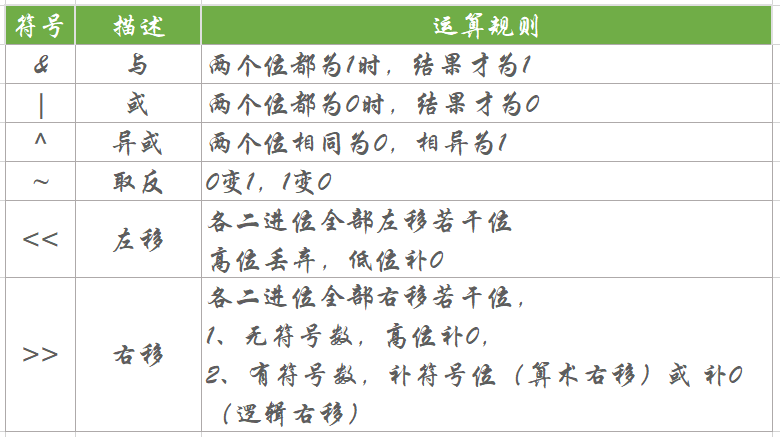


基本常用常考的，也就这么多。相信大家都知道，也就没什么好说的。

## 02 位运算的奇淫技巧

上面的内容相对比较常规，**但是一般面试我们遇到的，都不是常规内容**。所以下面这些，是必须掌握的。

下面的这八个技巧，基本cover了位运算90%的面试题：

位运算的奇淫技巧

1、使用 x & 1 == 1 判断奇偶数。（注意，一些编辑器底层会把用%判断奇偶数的代码，自动优化成位运算）

2、不使用第三个数，交换两个数。x = x ^ y ， y = x ^ y ， x = x ^ y。（早些年喜欢问到，现在如果谁再问，大家会觉得很low）

3、两个相同的数异或的结果是 0，一个数和 0 异或的结果是它本身。（对于找数这块，异或往往有一些别样的用处。）

4、x & (x - 1) ，可以将最右边的 1 设置为 0。（这个技巧可以用来检测 2的幂，或者检测一个整数二进制中 1 的个数，又或者别人问你一个数变成另一个数其中改变了多少个bit位，统统都是它）

5、异或可以被当做无进位加法使用，与操作可以用来获取进位。

6、i+(~i)=-1，i 取反再与 i 相加，相当于把所有二进制位设为1，其十进制结果为-1。

7、对于int32而言，使用 n >> 31取得 n 的正负号。并且可以通过 (n ^ (n >> 31)) - (n >> 31) 来得到绝对值。（n为正，n >> 31 的所有位等于0。若n为负数，n >> 31 的所有位等于1，其值等于-1）

8、使用 (x ^ y) >= 0 来判断符号是否相同。（如果两个数都是正数,则二进制的第一位均为0,x^y=0；如果两个数都是负数,则二进制的第一位均为1；x^y=0 如果两个数符号相反,则二进制的第一位相反,x^y=1。有0的情况例外，^相同得0，不同得1）

## 03 两数之和

从最简单的开始讲起。这个题很老了，拿出来给不会的同学看一看，会的直接跳过。（值得一说的是，这个题目在国外上，有2000个dislike，可以看到大家的嫌弃！）

第268题：不使用运算符 + 和 - ，计算两整数 a 、b 之和。

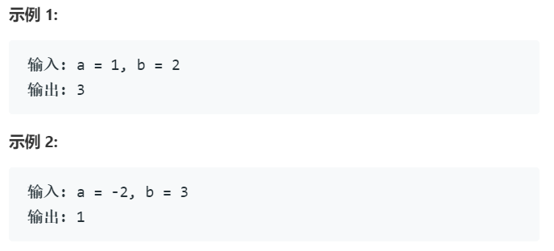


直接使用上面我们讲过的奇淫技巧进行解题：


“异或”是一个**无进位加法**，说白了就是把进位砍掉。比如01^01=00。

“与”**可以用来获取进位，**比如01&01=01，然后再把结果左移一位，就可以获取进位结果。


根据上面两个技巧，假设有 12+7：


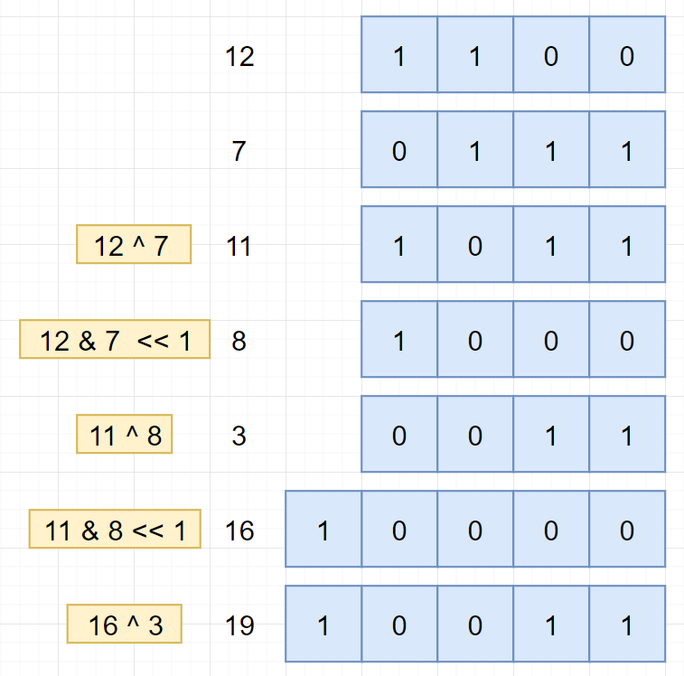


根据分析，完成题解：

```
 //JAVA
 class Solution {
     public int getSum(int a, int b){
         while(b != 0){
             int temp = a ^ b;
             b = (a & b) << 1;
             a = temp;
         }
         return a;
    }
}
```

对，就是这么简单。

## 04 2的幂

做这道题前，可以翻到最前面，看一看可以使用哪一个技巧。找到了，你就会了。

第231题：给定一个整数，编写一个函数来判断它是否是 2 的幂次方。

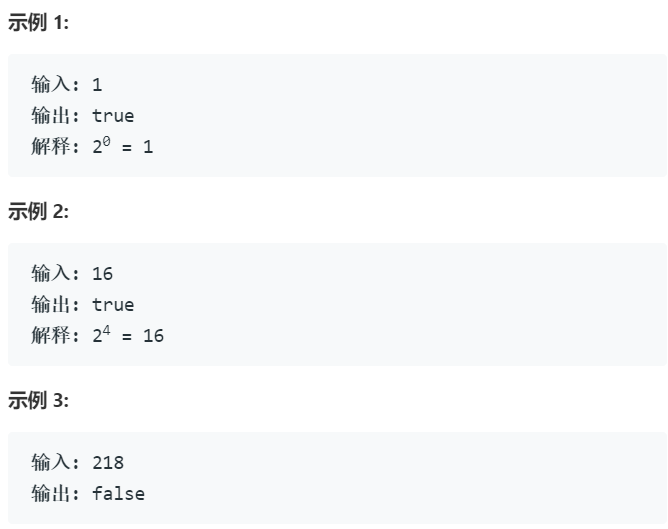

先观察一些是2的幂的二进制数：

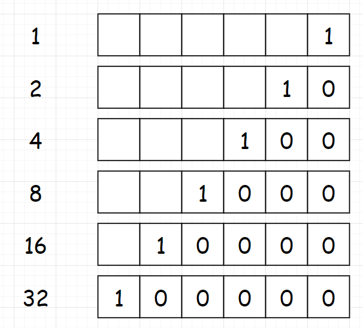


**可以发现这些数，都是最高位为1，其他位为0**。所以我们把问题转化为“判断一个数的二进制，除了最高位为1，是否还有别的1存在”。然后我们再观察下面这样的一组数，对应着上面的数减去1：


我们对两组数求“&”运算：


可以看到，对于N为2的幂的数，**都有 N&(N-1)=0 ，**所以这就是我们的判断条件。（这个技巧可以记忆下来，在一些别的位运算的题目中也是会用到的）

根据分析，完成代码：

```
//go
func isPowerOfTwo(n int) bool {
    return n > 0 && n&(n-1) == 0
}
```

本题还是很简单。直接使用 x & (x - 1) 的技巧即可。


## 05 一的个数

略微增大一点难度，讲这道题目意义是引入一个概念“掩码”。掩码是指使用一串二进制代码对目标字段进行位与运算，屏蔽当前的输入位。

```
第191题：编写一个函数，输入是一个无符号整数，返回其二进制表达式中数字位数为 ‘1’ 的个数（也被称为汉明重量）。

示例 1：
输入：00000000000000000000000000001011

输出：3
解释：输入的二进制串 00000000000000000000000000001011 中，共有三位为 '1'。

示例 2：
输入：00000000000000000000000010000000
输出：1
解释：输入的二进制串 00000000000000000000000010000000 中，共有一位为 '1'。

示例 3：
输入：11111111111111111111111111111101
输出：31
解释：输入的二进制串 11111111111111111111111111111101 中，共有 31 位为 '1'。

提示：
请注意，在某些语言（如 Java）中，没有无符号整数类型。在这种情况下，输入和输出都将被指定为有符号整数类型，并且不应影响您的实现，因为无论整数是有符号的还是无符号的，其内部的二进制表示形式都是相同的。

在 Java 中，编译器使用二进制补码记法来表示有符号整数。因此，在上面的 示例 3 中，输入表示有符号整数 -3。
```

题目稍微长了点，但是我之前说过。对于大部分的题而言，题目越长，越简单。

首先最容易想到的方法是：**我们直接把目标数转化成二进制数，然后遍历每一位看看是不是1，如果是1就记录下来**。通过这种比较暴力的方式，来进行求解。比如Java中，int类型是32位，我们只要能计算出当前是第几位，就可以顺利进行求解。

那如何计算当前是第几位呢，我们可以构造一个掩码来进行，说掩码可能大家听着有点懵逼，其实就是弄个1出来，1的二进制是这样：

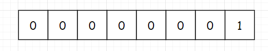


我们只需要让这个掩码每次向左移动一位，然后与目标值求“&”，就可以判断目标值的当前位是不是1。比如目标值为21，21的二进制是这样：


然后每次移动掩码，来和当前位进行计算：


根据分析，完成代码：

```
 //java
 public class Solution {
     public int hammingWeight(int n) {
         int result = 0;
         //初始化掩码为1
         int mask = 1;
         for (int i = 0; i < 32; i++) {
             if ((n & mask) != 0) {
                 result++;
            }
            mask = mask << 1;
        }
        return result;
    }
}
```

唯一需要提醒的地方是：判断 n&mask 的时候，不要错写成 (n&mask) == 1，因为这里你对比的是十进制数。新人很容易犯这样的错误。

## 06 只出现一次的数字

我们再稍微提高一点难度。大家想想用什么思路进行求解？

第136题：给定一个**非空**整数数组，除了某个元素只出现一次以外，其余每个元素均出现两次。找出那个只出现了一次的元素。

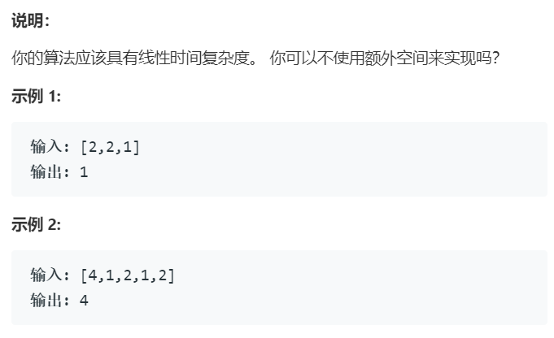


直接分析，**我们要找只出现一次的数字，并且已知了其他的数字都只出现了两次。**那么这种一听其实就应该想到需使用**位运算**来进行求解。最好的，就是在读完题目的瞬间，直接条件反射！（当然，如果你现在第一反应是想到 通过遍历统计，或者其他如使用hashmap 等方式来进行求解，那我觉得你的位运算这块，是有必要加强练习力度的。如果你第一反应，连思路都没有，那我觉得对于整个算法的能力这块，都是比较欠缺的，需要下苦功！）

回到题目，如何使用位运算进行求解呢？对于任意两个数a和b，我们对其使用 “**异或**”操作，应该有以下性质：

- 任意一个数和0异或仍然为自己：

   *a*⊕0=*a*

- 任意一个数和自己异或是0：

   a⊕a=0

- 异或操作满足交换律和结合律：

a⊕b⊕a=(a⊕a)⊕b=0⊕b=*b*

可能有人直接都不知道异或是什么，所以还是举个例子，比如5异或3，也就是5⊕3，也就是5^3，是下面这样：

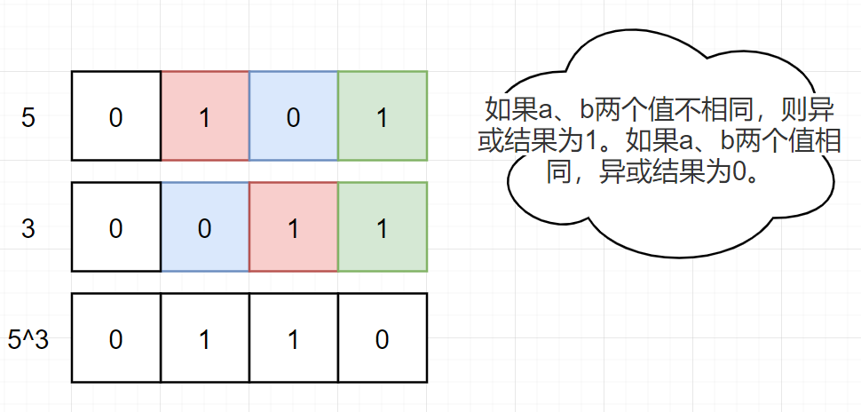

因为这道题目比较典型，所以我多给几个版本的代码：

（西PP）

```
 //CPP
 class Solution {
 public:
     int singleNumber(vector<int>& nums) {
         int ans = 0;
         for (int num : nums) {
             ans ^= num;
         }
         return ans;
    }
};
```

（java版本）

```
 //JAVA
 class Solution {
     public int singleNumber(int[] nums) {
         int ans = nums[0];
         for (int i = 1; i < nums.length; i++) {
             ans = ans ^ nums[i];
         }
         return ans;
    }
}
```

(python版本)

```
//py
class Solution:
    def singleNumber(self, nums: List[int]) -> int:
        ans = 0
        for i in range(len(nums)):
            ans ^= nums[i]
        return ans
```

## 07 只出现一次的数字 Ⅱ

你大爷还是你大爷，但你大妈已经不是你大妈了！

第137题：给定一个非空整数数组，除了某个元素只出现一次以外，其余每个元素均出现了三次。找出那个只出现了一次的元素。说明：你的算法应该具有线性时间复杂度。你可以不使用额外空间来实现吗？ 

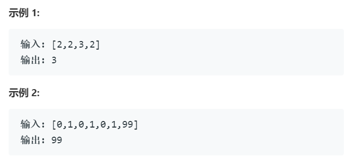


使用hashmap来求解的方式，实在是没什么可说的。

```java
 func singleNumber(nums []int) int {
     m := make(map[int]int)
     for _, k := range nums {
         //如果是其他语言，请注意对应的判空操作！
         m[k]++
     }
     for k, v := range m {
         if v == 1 {
             return k
        }
    }
    return 0
}
```

当然，这里还有一种数学解法：

原理：[A,A,A,B,B,B,C,C,C] 和 [A,A,A,B,B,B,C]，差了两个C。即：

**3×(\*a\*+\*b\*+\*c\*)−(\*a\*+\*a\*+\*a\*+\*b\*+\*b\*+\*b\*+\*c\*)=2\*c\***

也就是说，如果把**原数组去重、再乘以3得到的值，刚好就是要找的元素的2倍**。举个例子：

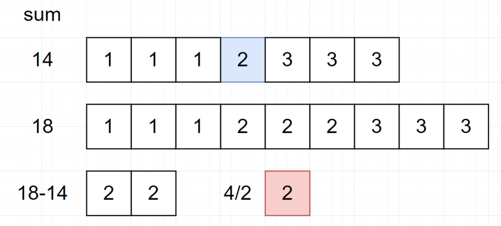


利用这个性质，进行求解：（python代码如下，这里要注意的是，使用int可能会因为超出界限报错）

```
1class Solution:2    def singleNumber(self, nums: List[int]) -> int:3        return int((sum(set(nums)) * 3 - sum(nums)) / 2)
```

效果不错，但是仍然使用了额外空间。所以我们还是得使用位运算。对于“每个其余元素，均出现了二次”之所以可以使用“**异或**”进行求解，原因是因为“异或”操作可以让两数相同归 0。那对于其余元素出现三次的，是不是只要可以让其三者相同归 0，就能达到我们的目的呢？

这个思想可能比较简单，但是要让大家理解，还是有一定难度。如果大家准备好了，可以开始往下看。我看过leetcode上的题解，很多都是直接扔出来一个公式，其实讲的我认为并不是特别的清楚。所以我打算先把本题退化到“每个其余元素，均出现二次”的case来进行分析一下。

假如我们有 [21,21,26] 三个数，是下面这样：

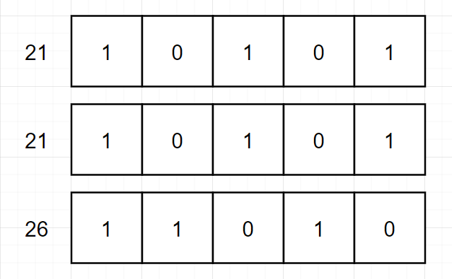

回想一下，之所以能用“**异或**”，其实我们是完成了一个 **同一位上有2个1清零** 的过程。上面的图看起来可能容易，如果是这样：

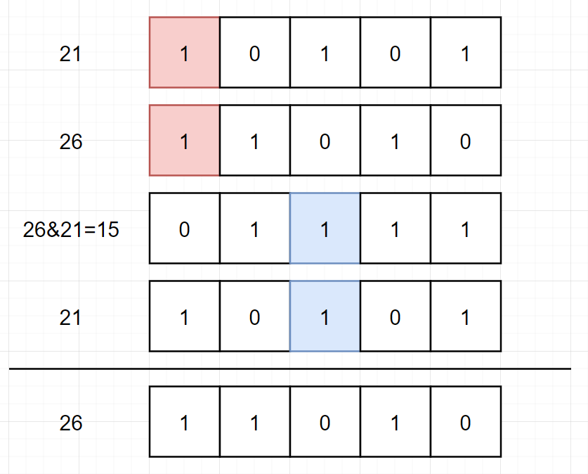

那对于“每个其余元素，均出现了三次”也是一样，如果我们可以完成 **一个同一位上的三个1清零的过程，**也就是 a ？a ？a = 0，问题则迎刃冰解。那因为各语言中都没有这样一个现成的方法可以使用，所以我们需要构造一个。（想象一下，位运算也是造出来的对不对？）


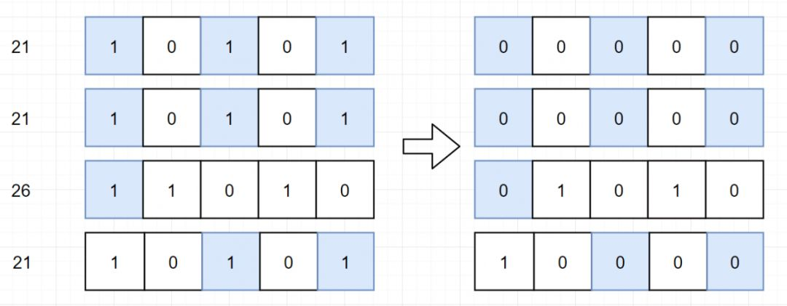

如何构造，这里先说第一种方法（注意，到这里我们的问题已经转化成了定义一种 a ? a ? a = 0 的运算），观察一下“异或”运算：

1^1=0

1^0=1

0^1=1

是不是可以理解为，其实就是二进制的加法，然后砍掉进位呢？

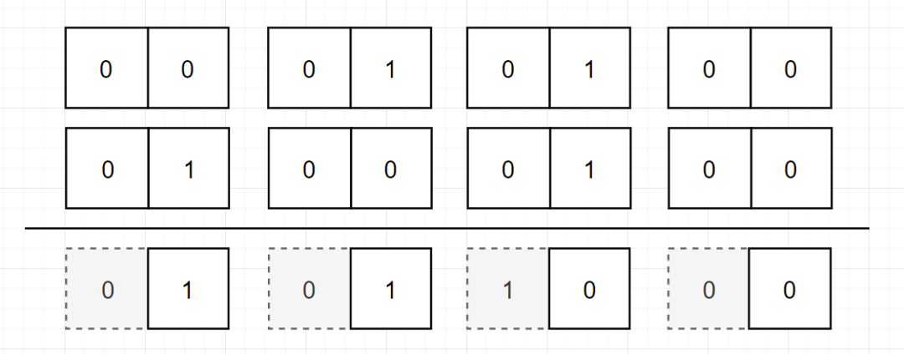


**砍掉进位的过程，是不是又可以理解为对 2 进行取模**，也就是取余。到了这里，问题已经非常非常明确了。那我们要完成一个 a ? a ? a = 0 的运算，是不是其实就是让其二进制的每一位数都相加，最后再对 3 进行一个取模的过程呢？（一样，如果要定义一个 a ? a ? a ? a = 0 的运算，那就最后对 4 进行取模就可以了）


```java
 //go
 func singleNumber(nums []int) int {
     number, res := 0, 0
     for i := 0; i < 64; i++ {
         //初始化每一位1的个数为0
         number = 0
         for _, k := range nums {
             //通过右移i位的方式，计算每一位1的个数
             number += (k >> i) & 1
        }
        //最终将抵消后剩余的1放到对应的位数上
        res |= (number) % 3 << i
    }
    return res
}
```


如果对上面的代码不能理解，可以看看这个图，假设只有一个数 [21]，我们通过不断右移的方式，获取其每一位上的1。当然，这里因为余数都是1，所以肯定都保留了下来，然后与 1 进行 “与”运算，最终再将其放入到对应的位数上。


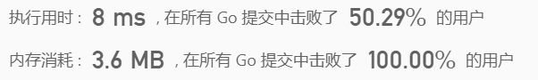

（还不错）

在上面的代码中，**我们通过一个number，来记录每一位数出现的次数**。但是缺点是，我们记录了64位（Go语言中，int为32位以上）

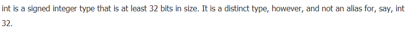

（官方文档）

那如果我们可以同时对所有位进行计数，是不是就可以简化过程。因为我们的目的是把每一位与3取模进行运算，是不是就可以理解为其实是一个**三进制**。如果大家听不懂三进制的话，可以简单理解为3次一循环，也就是 00 - 01 - 10 - 11。但是又因为对于 11 这种情况，我们需要砍掉（上面已经说过了，相当于 11 - 00 的转化），所以我们就只有3个状态，00 - 01 - 10，所以我们采用 a 和 b 来记录状态。其中的状态转移过程如下：

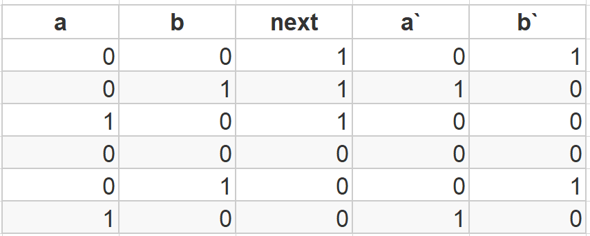

这里 a` 和 b` 的意思代表着 a 和 b 下一次的状态。next 代表着下一个 bit 位对应的值。然后这是什么，不就是状态机嘛。。。我们通过 a 和 b 的状态变化，来完成次数统计。

然后因为此图复杂，将其分别简化成 a 和 b 的卡诺图（卡诺图是逻辑函数的一种图形表示。两逻辑相邻项，合并为一项，保留相同变量，消去不同变量。）

| next\a，b | 00   | 01   | 11   | 10   |
| --------- | ---- | ---- | ---- | ---- |
| 1         | 1    | 0    | X    | 0    |
| 0         | 0    | 1    | X    | 0    |


| next\a，b | 00   | 01   | 11   | 10   |
| --------- | ---- | ---- | ---- | ---- |
| 1         | 0    | 1    | X    | 0    |
| 0         | 0    | 0    | X    | 1    |

然后我们根据卡诺图（这个卡诺图其实并不难看。。如果学习一下话，还是挺简单的。。）写出关系式：

```
a` = (a &~ next) | (b & next)
b` = (~a & ~b & next) | (b & ~next)
```

然后就是套公式：（Java代码，注意Go语言中是不天然支持 ~ 这种运算的）

```java
 class Solution {
     public int singleNumber(int[] nums) {
         int a = 0, b = 0, tmp = 0;
         for (int next : nums) {
             tmp = (a & ~next) | (b & next);
             b = (~a & ~b & next) | (b & ~next);
             a = tmp;
         }
         return b;
    }
}
```

当然，其实题解还可以再近一步优化，其实就是化简上一步中的公式：

```java
 class Solution {
     public int singleNumber(int[] nums) {
         int a = 0, b = 0;
         for (int next : nums) {
             b = (b ^ next) & ~a;
             a = (a ^ next) & ~b;
         }
         return b;
     }
}
```

当然，这个解法就相当牛皮了。如果实在看不懂也没关系，请把上面的两种解法掌握。

## 来源

https://mp.weixin.qq.com/s/ONSNNTBhwuGrrVYYssrAiw