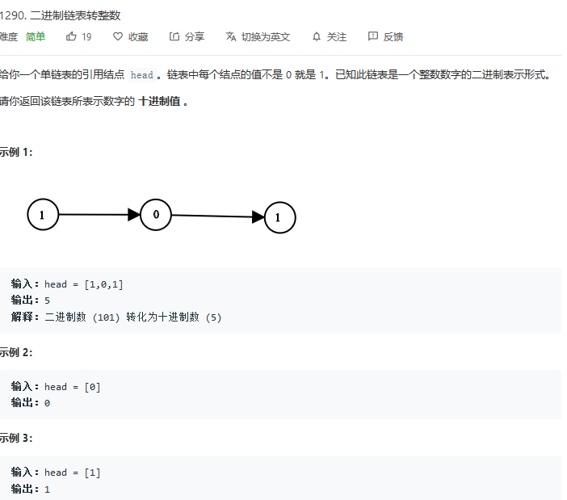
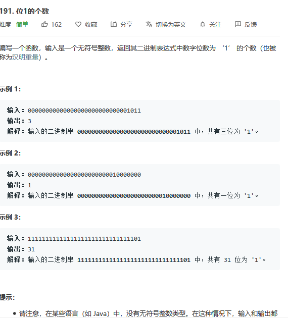
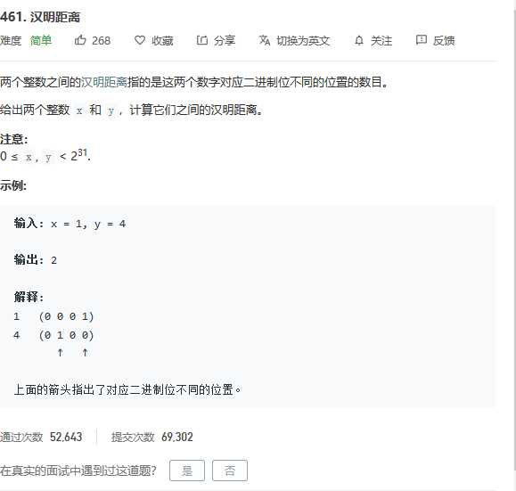
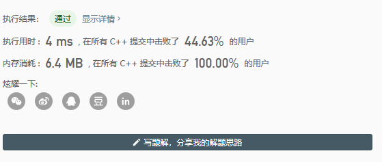
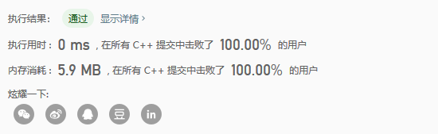
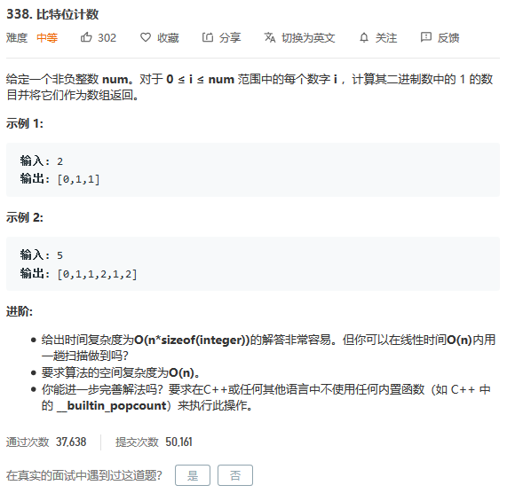
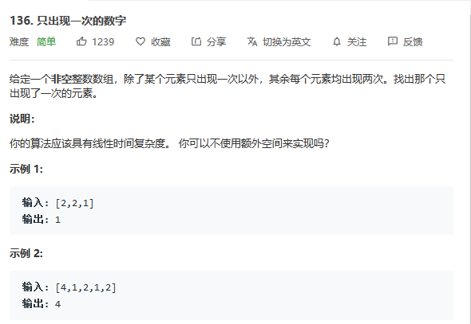
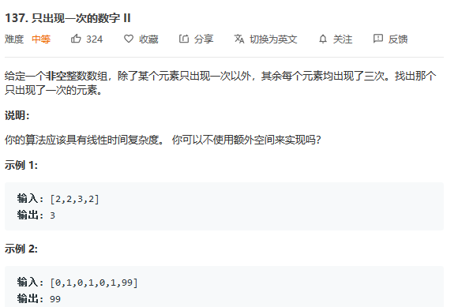

<h1 align="center">位运算——从LeetCode题海中总结常见套路</h1>

[toc]

## 位运算常用技巧

| 去掉最后一位          | 101101->10110        | x>>1             |
| --------------------- | -------------------- | ---------------- |
| 在最后加一个0         | 101101->1011010      | x<<1             |
| 在最后加一个1         | 101101->1011011      | (x<<1)+1         |
| 把最后一位变成1       | 101100->101101       | x \| 1           |
| 把最后一位变成0       | 101101->101100       | (x \|1) - 1      |
| 最后一位取反          | 101101->101100       | x ^ 1            |
| 把右数第K位变成1      | 101001->101101,k=3   | x  \| (1<<(k-1)) |
| 把右数第K位变成0      | 101101->101101,k=3   | x & ~(1<<(k-1))  |
| 右数第k位取反         | 101001->101101,k=3   | x ^ (1<<(k-1))   |
| 取末三位              | 1101101->101         | x &7             |
| 取末k位               | 1101101->1101,k=5    | x & (1<<k-1)     |
| 取右数第k位           | 1101101->1,k=4       | x >> (k-1)&1     |
| 把末k位变成1          | 101001->101111,k=4   | x\|(1<<k-1)      |
| 末k位取反             | 101001->100110,k=4   | x^(1<<k-1)       |
| 把右边连续的1变成0    | 100101111->100100000 | x&(x+1)          |
| 把右起第一个0变成1    | 100101111->100111111 | x\|(x+1)         |
| 把右边连续的0变成1    | 11011000->11011111   | x\|(x-1)         |
| 取右边连续的1         | 100101111->1111      | (x^(x+1))>>1     |
| 去掉右起第一个1的左边 | 100101000->1000      | x&(x^(x-1))      |

## 左移运算

**a<<b的值实际上就是a乘以2的b次方，a<<b 表示把a转为二进制后左移b位（在后面添加 b个0）；**

## 右移运算

**a>>b表示二进制右移b位（去掉末b位），相当于a除以2的b次方（取整）；**

## LeetCode1290.二进制链表转整数

很简单，熟悉LeetCode中链表的表示方法，属于开胃菜




### 常规递归法：

```
/**
 * Definition for singly-linked list.
 * struct ListNode {
 *     int val;
 *     ListNode *next;
 *     ListNode(int x) : val(x), next(NULL) {}
 * };
 */
class Solution {
private:
    vector<int> v;
public:
    int getDecimalValue(ListNode* head) {
        getValue(head);
        int num = 0;
        for(int i=v.size()-1;i>=0;i--){
            num+=(v[i]*pow(2,v.size()-i-1));
        }
        return num;
    }
    void getValue(ListNode* head){
        if(head==NULL)
            return;
        v.push_back(head->val);
        getValue(head->next);
    }
};
```

### 使用位移运算

反而变慢了点，尴尬

```
class Solution {
public:
    int getDecimalValue(ListNode* head) {
        int num = 0;
        while(head!=NULL){
            num = (num<<1) | (head->val);
            head = head->next;
        }
        return num;
    }
};
```

## LeetCode191.位1的个数：“与”运算后右移

这题是下面汉明距离那道题的基础，统计二进制数中1的个数也是位运算中基本的套路！



```
class Solution {
public:
    int hammingWeight(uint32_t n) {
        int ans = 0;
        while(n){
            ans += n&1;
            n = n>>1;
        }
        return ans;
    }
};
```

## 异或运算：LeetCode461.汉明距离




### 常规方法：记得末尾补0



```
class Solution {
public:
    int hammingDistance(int x, int y) {
        vector<int> vx,vy;
        while(x>0){
            vx.push_back(x%2);
            x/=2;
        }
        while(y>0){
            vy.push_back(y%2);
            y/=2;
        }
        int len = vx.size()>vy.size()?vx.size():vy.size();
        for(int i=vx.size()-1;i<=len;i++){
            vx.push_back(0);
        }
        for(int i=vy.size()-1;i<=len;i++){
            vy.push_back(0);
        }
        int ans=0;
        for(int i=0;i<len;i++){
            if(vx[i]!=vy[i])
                ans++;
        }
        return ans;
    }
};
```

### 位运算：异或运算后统计1的个数

看这个解释，很容易想到要异或运算


比如上面这两个进行异或运算之后就变成了5，正好是101，这个时候统计1的个数就可以！



```
class Solution {
public:
    int hammingDistance(int x, int y) {
        int z = x^y;
        int sum = 0;
        //统计1的个数
        while(z){
            sum += z&1;
            z = z>>1;
        }
        return sum;
    }
};
```

换一种自己更能理解的写法：

```
class Solution {
public:
    int hammingDistance(int x, int y) {
        int z = x^y;
        int ans = 0;
        //统计二进制z中“1”的个数
        while(z>0){
            ans += z%2;
            z/=2;
        }
        return ans;
    }
};
```

补充一句：在信号处理中汉明距离是一个很重要的概念，参见：[https://baike.baidu.com/item/%E6%B1%89%E6%98%8E%E8%B7%9D%E7%A6%BB/475174?fr=aladdin](https://icode.best/go?go=aHR0cHM6Ly9iYWlrZS5iYWlkdS5jb20vaXRlbS8lRTYlQjElODklRTYlOTglOEUlRTglQjclOUQlRTclQTYlQkIvNDc1MTc0P2ZyPWFsYWRkaW4=)

## 位运算+DP: LeetCode338.比特位计数

这题其实是DP，但是我没想起来，先用最拙劣的位运算AC吧……




```
class Solution {
public:
    vector<int> countBits(int num) {
        vector<int> ans;
        for(int i=0;i<=num;i++){
            ans.push_back(func(i));
        }
        return ans;
    }
    int func(int num){//返回1的个数
        int ans = 0;
        while(num){
            ans += num & 1;
            num = num>>1;
        }
        return ans;
    }
};
```

## LeetCode190.颠倒二进制位

（这题我还没有搞的太明白，先mark一下）


```
class Solution {
public:
    uint32_t reverseBits(uint32_t n) {
        uint32_t ans = 0;
        int i = 32;
        while(i--){
            ans <<= 1;
            ans+=n&1;
            n>>=1;
        }
        return ans;
    }
};
```

## 经典异或运算：LeetCode136.只出现一次的数字

把握住异或运算的三个重要性质：

- 0异或任何数等于这个数本身
- n异或n等于0
- 异或交换律：a^b^c 等价于 a^c^b



```
class Solution {
public:
    int singleNumber(vector<int>& nums) {
        int a = 0;
        for(int i = 0; i<nums.size(); i++){
            a ^= nums[i];
        }
        return a;
    }
};
```

## 有限状态自动机+异或永远滴神：LeetCode137.只出现一次的数字II



```
class Solution {
public:
    int singleNumber(vector<int>& nums) {
        int one=0,two=0;
        for(int i = 0; i<nums.size(); i++){
            one = (one^nums[i]) & ~ two;
            two = (two^nums[i]) & ~ one;
        }
        return one;
    }
};
```


## 异或 `^` 运算的小技巧

> Use ^ to remove even exactly same numbers and save the odd, or save the distinct bits and remove the same.
>  去除出现偶数次的数字，保留出现奇数次的数字。

### **LeetCode 题目：**[371. Sum of Two Integers](https://leetcode.com/problems/sum-of-two-integers/description/)

 Calculate the sum of two integers a and b, but you are not allowed to use the operator + and -.

```cpp
// Recursive
public int getSum(int a, int b) {
    return b == 0 ? a : getSum(a^b, (a&b)<<1);
}

// Iterative
public int getSum(int a, int b) {
    if (a == 0) return b;
    if (b == 0) return a;

    while (b != 0) {
        int carry = a & b;
        a = a ^ b;
        b = carry << 1;
    }
    
    return a;
}
```

### **LeetCode 题目：**[122. Missing Number](https://leetcode.com/problems/missing-number/description/)

 Given an array containing n distinct numbers taken from 0, 1, 2, ..., n, find the one that is missing from the array.

```cpp
public int missingNumber(int[] nums) {
    int n = nums.length;
    
    int missing = 0;
    for(int i = 0; i <= n; i++) {
        missing = missing ^ i;
    }
    
    for(int i = 0; i < n; i++) {
        missing = missing ^ nums[i];
    }
    
    return missing;
}
```

## 或 `|` 运算的小技巧

> Keep as many 1-bits as possible
>  尽可能多地保留 1

**题目：**
 Find the largest power of 2 (most significant bit in binary form), which is less than or equal to the given number N.

```cpp
long largest_power(long N) {
    //changing all right side bits to 1.
    N = N | (N>>1);
    N = N | (N>>2);
    N = N | (N>>4);
    N = N | (N>>8);
    N = N | (N>>16);
    return (N+1)>>1;
}
```

### **LeetCode 题目：**[190. Reverse Bits](https://leetcode.com/problems/reverse-bits/submissions/1)

 Reverse bits of a given 32 bits unsigned integer.
 For example, given input 43261596 (represented in binary as 00000010100101000001111010011100), return 964176192 (represented in binary as 00111001011110000010100101000000).

```cpp
public int reverseBits(int n) {
    int result = 0;
    
    for(int i = 0; i < 32; i++) {
        result = result + (n & 1);
        
        n >>>= 1;   // CATCH: must do unsigned shift
        if (i < 31) // CATCH: for last digit, don't shift!
            result <<= 1;
        }
    
    return result;
}
```

## 与 `&` 运算的小技巧

> Just selecting certain bits
>  选择特定的位

### **LeetCode 题目：**[191. Number of 1 Bits](https://leetcode.com/problems/number-of-1-bits/description/)

 Write a function that takes an unsigned integer and returns the number of ’1' bits it has (also known as the Hamming weight).
 For example, the 32-bit integer ’11' has binary representation 00000000000000000000000000001011, so the function should return 3.

```cpp
public int hammingWeight(int n) {
    int count = 0;
    int mask = 1;
    
    for (int i = 0; i < 32; i++) {
        
        if((n & mask) != 0) {
            count++;
        }
        
        mask = mask << 1;
    }
    
    return count;
}
```

### **LeetCode 题目：**[477. Hamming Distance](https://leetcode.com/problems/hamming-distance/description/)

 The Hamming distance between two integers is the number of positions at which the corresponding bits are different.
 Given two integers x and y, calculate the Hamming distance.

```cpp
public int hammingDistance(int x, int y) {
    
    int xor = x ^ y;
    
    return hammingWeight(xor);
}

// you need to treat n as an unsigned value
public int hammingWeight(int n) {
    int count = 0;
    int mask = 1;
    
    for (int i = 0; i < 32; i++) {
        
        if((n & mask) != 0) {
            count++;
        }
        
        mask = mask << 1;
    }
    
    return count;
}
```

## 其他位运算算法题

### **LeetCode 题目：**[169. Majority Element](https://leetcode.com/problems/majority-element/description/)

 Given an array of size n, find the majority element. The majority element is the element that appears more than ⌊ n/2 ⌋ times.

```dart
// Hashtable 
public int majorityElement2(int[] nums) {
    Map<Integer, Integer> myMap = new HashMap<Integer, Integer>();
    //Hashtable<Integer, Integer> myMap = new Hashtable<Integer, Integer>();
    int ret=0;
    for (int num: nums) {
        if (!myMap.containsKey(num))
            myMap.put(num, 1);
        else
            myMap.put(num, myMap.get(num)+1);
        if (myMap.get(num)>nums.length/2) {
            ret = num;
            break;
        }
    }
    return ret;
}

// Moore voting algorithm
public int majorityElement3(int[] nums) {
    int count=0, ret = 0;
    for (int num: nums) {
        if (count==0)
            ret = num;
        if (num!=ret)
            count--;
        else
            count++;
    }
    return ret;
}

// Bit manipulation 
public int majorityElement(int[] nums) {
    int[] bit = new int[32];
    for (int num: nums)
        for (int i=0; i<32; i++) 
            if ((num>>(31-i) & 1) == 1)
                bit[i]++;
    int ret=0;
    for (int i=0; i<32; i++) {
        bit[i]=bit[i]>nums.length/2?1:0;
        ret += bit[i]*(1<<(31-i));
    }
    return ret;
}
```

### **LeetCode 题目：**[187. Repeated DNA Sequences](https://leetcode.com/problems/repeated-dna-sequences/description/)

 All DNA is composed of a series of nucleotides abbreviated as A, C, G, and T, for example: "ACGAATTCCG". When studying DNA, it is sometimes useful to identify repeated sequences within the DNA.
 Write a function to find all the 10-letter-long sequences (substrings) that occur more than once in a DNA molecule.
 For example, Given s = "AAAAACCCCCAAAAACCCCCCAAAAAGGGTTT",
 Return: ["AAAAACCCCC", "CCCCCAAAAA"].

```cpp
public List<String> findRepeatedDnaSequences(String s) {
    Set<Integer> words = new HashSet<>();
    Set<Integer> doubleWords = new HashSet<>();
    
    List<String> rv = new ArrayList<>();
    
    char[] map = new char[26];
    //map['A' - 'A'] = 0;
    map['C' - 'A'] = 1;
    map['G' - 'A'] = 2;
    map['T' - 'A'] = 3;

    for(int i = 0; i < s.length() - 9; i++) {
        int v = 0;
        
        for(int j = i; j < i + 10; j++) {
            v <<= 2;
            v |= map[s.charAt(j) - 'A'];
        }
        
        if(!words.add(v) && doubleWords.add(v)) {
            rv.add(s.substring(i, i + 10));
        }
    }
    
    return rv;
}
```

### **LeetCode 题目：**[136. Single Number](https://leetcode.com/problems/single-number/description/)

 Given an array of integers, every element appears **twice except for one**. Find that single one.

```csharp
public int singleNumber(int[] nums) {
    // null pointer check
    if(nums == null) {
        return 0;
    }
    
    int result = 0;
    for(int i : nums) {
        result = result ^ i;
    }
    
    return result;
}
```

### **LeetCode 题目：**[137. Single Number II](https://leetcode.com/problems/single-number-ii/description/)

 Given an array of integers, every element appears **three times except for one**, which appears exactly once. Find that single one.

```csharp
public int singleNumber(int[] nums) {
    // null pointer check
    if(nums == null) {
        return 0;
    }

    /*
    每一个int都是32位（4 bytes），遍历每一个int的每一位。
    如果某一位上是1，则count++，对于出现了三次的int，则该位上count = 3。
    因此 count = count % 3可以清除出现了三次的int，保留至出现了一次的int。
    */
    
    int result = 0;
    for(int i = 0; i < 32; i++) {
        int count = 0;
        
        for(int j = 0; j < nums.length; j++) {
            if((nums[j] & 1) == 1) {
                count++;
            }
            nums[j] = nums[j]>>>1;
        }
        
        count = count % 3;
        
        if(count != 0) {
            result = (count << i) + result;
        }
    }

    return result;
}
```

### **LeetCode 题目：**[260. Single Number III](https://leetcode.com/problems/single-number-iii/description/)

 Given an array of numbers nums, in which exactly **two elements appear only once and all the other elements appear exactly twice**. Find the two elements that appear only once.
 For example:
 Given nums = [1, 2, 1, 3, 2, 5], return [3, 5].

```dart
public int[] singleNumber(int[] nums) {
    // 假设只出现一次的数字为 A，B
    
    /*
    第一步，得到所有数字的异或结果，即 A ^ B，因为其他数字都出现两次
    这个结果不能为0，因为 A != B，其实这个结果表示的是 A 和 B 之间的差别。
    假设这个结果的第 i 位为1，则说明A和B在第 i 位不同，可能一个是 1（假设是 A），另外一个是 0（假设是 B）。
    */
    int diff = 0;
    for(int num : nums) {
        diff = diff ^ num;
    }
    
    // Extract the lowest set bit 获取数字 A 的最低位
    // or diff = diff & ~(diff - 1);
    diff = diff & -diff;
    
    /*
    结合上面的理论，所有的数字可以分为两组：
        第一组包括A和其他一些数字，他们的第 i 位为1
            因此在第一组内部求异或结果，即为 A
            
        第二组包括B和其他一些数字，他们的第 i 位为0
            因此在第二组内部求异或结果，即为 B
    */
    int a = 0;
    int b = 0;
    
    for(int num : nums) {
        // 第一组
        if ((num & diff) == 0) {
            a = a ^ num;
        }
        
        // 第二组
        else {
            b = b ^ num;
        }
    }
    
    return new int[]{a, b};
}
```

### **LeetCode 题目：**[239. Power of Two](https://leetcode.com/problems/power-of-two/description/)

 Given an integer, write a function to determine if it is a power of two.

```kotlin
public boolean isPowerOfTwo(int n) {
    /*
    2的幂都遵循如下格式：
    1
    10
    100
    1000
    ...
    */
    
    if(n < 0) return false;
    
    // 最简单的 return !(n&(n-1));

    while(n != 0) {
        if(n == 1) {
            return true;
        }
        
        if((n & 1) == 1) {
            return false;
        }
        
        n = n >>> 1;
    }
    
    return false;
}
```

### **LeetCode 题目：**[342. Power of Four](https://leetcode.com/problems/power-of-four/description/)

 Given an integer (signed 32 bits), write a function to check whether it is a power of 4.

```dart
public boolean isPowerOfFour(int num) {
    /*
    4的幂都遵循如下格式：
    1
    4: 100 (2个0)
    16: 10000 (4个0)
    64: 1000000 (6个0)
    256: 100000000 (8个0)
    ...
    */
    
    if(num < 0) return false;
    
    // 0x55555555 is to get rid of those power of 2 but not power of 4
    // 最简单 return (num&(num-1)) == 0 && (num & 0x55555555) != 0;
    
    if(num == 1) return true;
    
    for(int i = 1; i * 2 < 32; i++) {
        int t = (1 << (i * 2));
        if((num ^ t) == 0) {
            return true;
        }
    }
    
    return false;
}
```

### **LeetCode 题目：**[338. Counting Bits](https://leetcode.com/problems/counting-bits/description/)

 Given a non negative integer number num. For every numbers i in the range 0 ≤ i ≤ num calculate the number of 1's in their binary representation and return them as an array.

Example:
 For num = 5 you should return [0,1,1,2,1,2].

```dart
class Solution {
    public int[] countBits(int num) {
        if(num < 0) return null;
        
        int[] result = new int[num + 1];
        
        result[0] = 0; // 00
        
        for(int i = 1; i <= num; i++) {
            // 对于偶数，例如6 = 2 * 3; 因此 result[6] = result[3]，乘以二相当于左移，不增加1的个数
            if(i % 2 == 0) {
                result[i] = result[i / 2];
            }
            // 对于奇数，例如5 = 2 * 2 + 1; 因此 result[5] = result[2] + 1，乘以二相当于左移，不增加1的个数
            else {
                result[i] = result[i / 2] + 1;
            }
        }
        
        return result;
    }
}
```

更多位运算相关算法题，参见 [LeetCode Bit Manipulation](https://leetcode.com/tag/bit-manipulation/)


## 参考

[位运算——从LeetCode题海中总结常见套路 - 爱代码 (icode.best)](https://icode.best/i/83532731603791)

[Bit Manipulation 位运算常见套路及相应LeetCode算法题 - 简书 (jianshu.com)](https://www.jianshu.com/p/b93ba9e24f97)