<h1 align="center">清晰理解红黑树的演变</h1>

[toc]

## 清晰理解红黑树的演变---红黑的含义

### 前言

红黑树，对不少人来说是个比较头疼的名字，在网上搜资料也很少有讲清楚其演变来源的，多数一上来就给你来五条定义，红啊黑啊与根节点距离相等之类的，然后就开始进行旋转、插入、删除这些操作。一通操作下来，连红色和黑色怎么来的，是什么含义，有什么作用都云里雾里的，能搞清楚就怪了。

本文介绍红黑树，暂时不涉及任何代码，只是帮助你理解红黑树的演变来源，树结构中红黑色具体含义，保证你理解了过后，再去看什么旋转插入的东西，要清晰得多。换句话说，理解本文要描述的内容是从代码级理解红黑树的基础。

开始之前，我还是恳请你保持耐心，一步一步仔细看完，浮躁的话真的做不好任何事情。

### 正文

红黑树的起源，自然是二叉查找树了，这种树结构从根节点开始，左子节点小于它，右子节点大于它。每个节点都符合这个特性，所以易于查找，是一种很好的数据结构。但是它有一个问题，就是容易偏向某一侧，这样就像一个链表结构了，失去了树结构的优点，查找时间会变坏。

所以我们都希望树结构都是矮矮胖胖的，像这样：

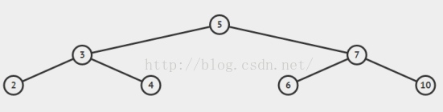

而不是像这样：

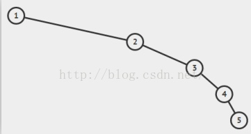


在这种需求下，平衡树的概念就应运而生了。

红黑树就是一种平衡树，它可以保证二叉树基本符合矮矮胖胖的结构，但是理解红黑树之前，必须先了解另一种树，叫2-3树，红黑树背后的逻辑就是它。

好吧来看2-3树吧。

2-3树是二叉查找树的变种，树中的2和3代表两种节点，以下表示为2-节点和3-节点。

2-节点即普通节点：包含一个元素，两条子链接。

3-节点则是扩充版，包含2个元素和三条链接：两个元素A、B，左边的链接指向小于A的节点，中间的链接指向介于A、B值之间的节点，右边的链接指向大于B的节点。

​					        2-节点：               3-节点： 

<div align=center>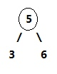  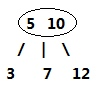</div>


在这两种节点的配合下，2-3树 可以保证在插入值过程中，任意叶子节点到根节点的距离都是相同的。完全实现了矮胖矮胖的目标。怎么配合的呢，下面来看2-3树的构造过程。

所谓构造，就是从零开始一个节点一个节点的插入。

在二叉查找树中，插入过程从根节点开始比较，小于节点值往右继续与左子节点比，大于则继续与右子节点比，直到某节点左或右子节点为空，把值插入进去。这样无法避免偏向问题。在2-3树中，插入的过程是这样的。

如果将值插入一个2-节点，则将2-节点扩充为一个3-节点。

如果将值插入一个3-节点，分为以下几种情况。

(1) 3-节点没有父节点，即整棵树就只有它一个三节点。此时，将3-节点扩充为一个4-节点，即包含三个元素的节点，然后将其分解，变成一棵二叉树。

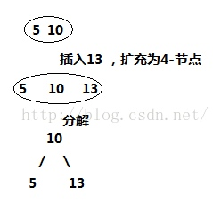


此时二叉树依然保持平衡。

(2) 3-节点有一个2-节点的父节点，此时的操作是，3-节点扩充为4-节点，然后分解4-节点，然后将分解后的新树的父节点融入到2-节点的父节点中去。

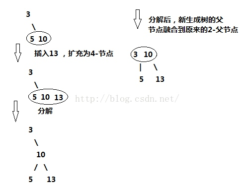


(3) 3-节点有一个3-节点的父节点，此时操作是：3-节点扩充为4-节点，然后分解4-节点，新树父节点向上融合，上面的3-节点继续扩充，融合，分解，新树继续向上融合，直到父节点为2-节点为止，如果向上到根节点都是3-节点，将根节点扩充为4-节点，然后分解为新树，至此，整个树增加一层，仍然保持平衡。

第三种情况稍微复杂点，为了便于直观理解，现在我们从零开始构建2-3树，囊括上面所有的情况，看完所以步骤后，你也可以自己画一画。

我们将{7,8,9,10,11,12}中的数值依次插入2-3树，画出它的过程：

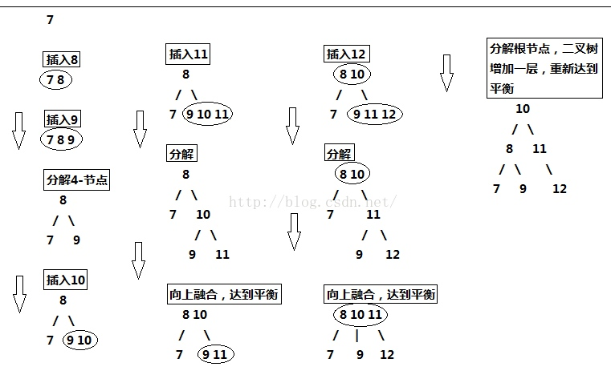


所以，2-3树的设计完全可以保证二叉树保持矮矮胖胖的状态，保持其性能良好。但是，将这种直白的表述写成代码实现起来并不方便，因为要处理的情况太多。这样需要维护两种不同类型的节点，将链接和其他信息从一个节点复制到另一个节点，将节点从一种类型转换为另一种类型等等。

因此，红黑树出现了，红黑树的背后逻辑就是2-3树的逻辑，但是由于用红黑作为标记这个小技巧，最后实现的代码量并不大。(但是，要直接理解这些代码是如何工作的以及背后的道理，就比较困难了。所以你一定要理解它的演化过程，才能真正的理解红黑树)

我们来看看红黑树和2-3树的关联，首先，最台面上的问题，红和黑的含义。红黑树中，所有的节点都是标准的2-节点，为了体现出3-节点，这里将3-节点的两个元素用左斜红色的链接连接起来，即连接了两个2-节点来表示一个3-节点。这里红色节点标记就代表指向其的链接是红链接，黑色标记的节点就是普通的节点。所以才会有那样一条定义，叫“从任一节点到其每个叶子的所有简单路径都包含相同数目的黑色节点”，因为红色节点是可以与其父节点合并为一个3-节点的，红黑树实现的其实是一个**完美的黑色平衡，**如果你将红黑树中所有的红色链接放平，那么它所有的叶子节点到根节点的距离都是相同的。所以它并不是一个严格的平衡二叉树，但是它的综合性能已经很优秀了。

借一张别人的图来看：

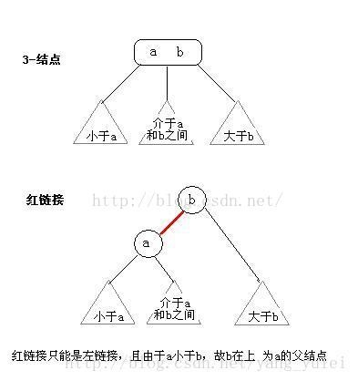


红链接放平：

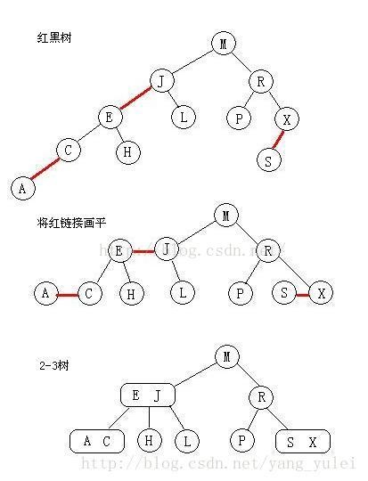

所以，红黑树的另一种定义是满足下列条件的二叉查找树：

* 红链接均为左链接。
* 没有任何一个结点同时和两条红链接相连。(这样会出现4-节点)

* 该树是完美黑色平衡的，即任意空链接到根结点的路径上的黑链接数量相同。

理解了这个过程以后，再去看红黑树的各种严格定义，以及其插入，删除还有旋转等操作，相信你脑子里的思路会清晰得多的。

## 红黑树2---从-2-3-4树到红黑树的演变过程以及插入算法实现原理

基本二叉排序树BST，当输入序列有序时，树的高度会急剧增加，最坏情况下时间复杂度为O(N)。

因此进一步演变为2-3-4树，2-3-4树节点类型有3种，2节点，3节点以及4节点，最重要的性质是每个叶子结点到根节点的路径长度一致，其最坏情况下为O(logN)。由于2-3-4树节点类型过大，进行插入以及查找时，需要进行节点类型判断，过于繁琐。

因此利用红连接的概念将2-3-4树转化为红黑树，即红黑树节点均为2节点，每个节点有颜色属性，通过红连接可以将红黑树对应为2-3-4树。

### 2-3-4树与红黑树的对应关系
2-3-4树中的3节点以及4节点转换为2节点对应关系如下：

其中3节点对应关系有两种，左倾**left-leaning**以及右倾

  

如下图所示，由于3节点对应关系不确定，因此同一颗2-3-4树转换为BST，由多种对应关系

  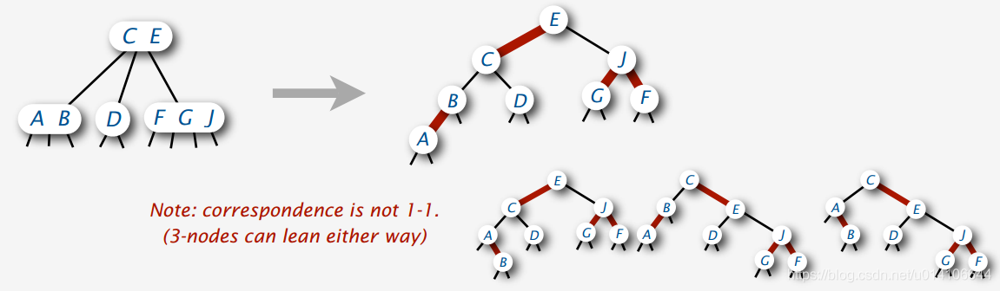

但是如果对于3节点采取右倾策略，易得转换后的二叉树不符合BST有序性。

因此这里定义**LLRB，左倾二叉树，3节点都采用左倾映射关系**


此时2-3-4树与红黑树的对应关系时确定的，并且转化而来的红黑树保持BST有序性

​       

### LLRB基本变换

红黑树重要性质，每个叶子节点空连接到根节点路径上黑连接数目相同，即完美黑色平衡。当传入新节点时，新节点为红色，此时会破坏红黑树完美黑色平衡性质，因此需要对于红黑树中的红连接进行变换

**左旋  将某个节点右节点左旋，将红连接左旋，即将该节点以及右节点最大值提升为父节点**

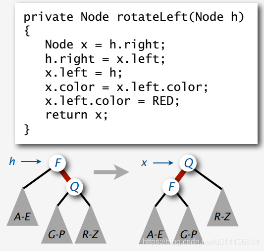

**右旋  将某个节点左节点右旋，将红连接右旋，将该节点以及左节点最小值提升为父节点**

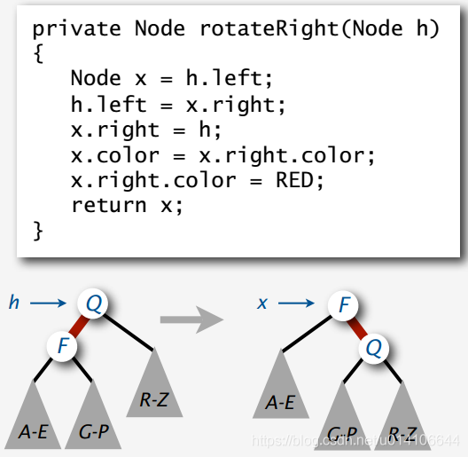

**颜色变换  将一个4节点分解为3个2节点  将红连接向上传递 保持红黑树的性质之一，任意一个节点均不能同时与两个红连接相连。**

   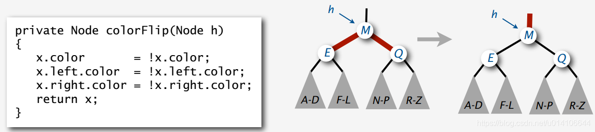

### LLRB插入算法

在LLRB插入时，一种思想是在搜索插入节点合适位置时，参考2-3-4树插入思想，将沿途节点进行变换，使得最终待插入节点为非4节点，即出入位置出现2,3节点，则都可以轻松插入。

当插入新节点时，将新节点设置为红色，可能出现的情况如下所示：

1.在一个2节点左右子节点位置插入，当在右节点位置插入时，出现右倾红连接，进行左旋变换，使其满足LLRB定义

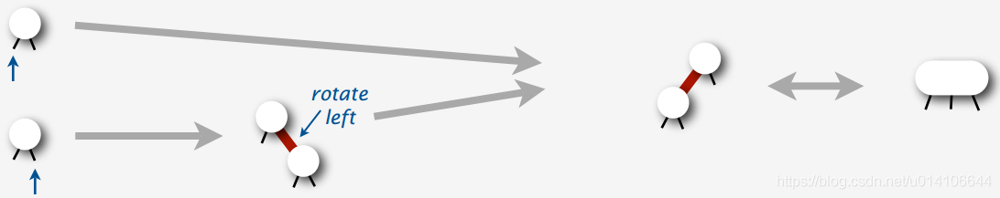

2.在一个3节点的左、中、右节点位置插入，如果出现右倾红连接则左旋，如果出现连续的左倾红连接，则将底部红连接右旋，构造为一个4节点。

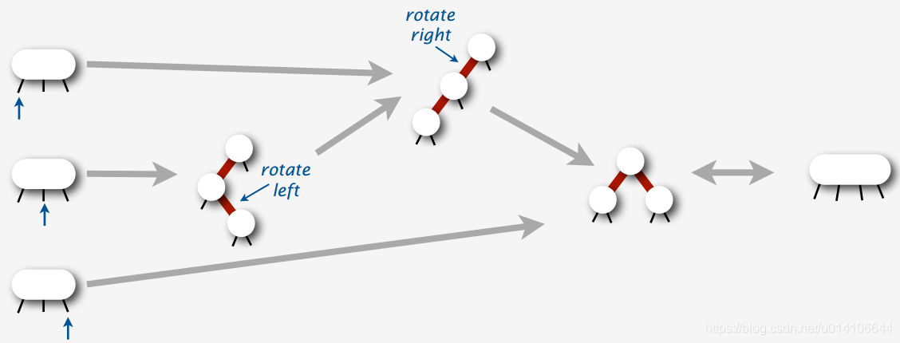

4.在一个4节点插入，且其父节点为2节点，将4节点进行分解

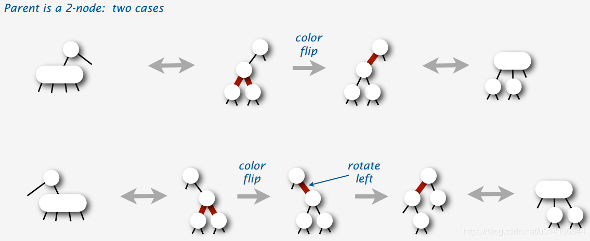

5.在一个4节点插入，且其父节点为3节点，使其分解

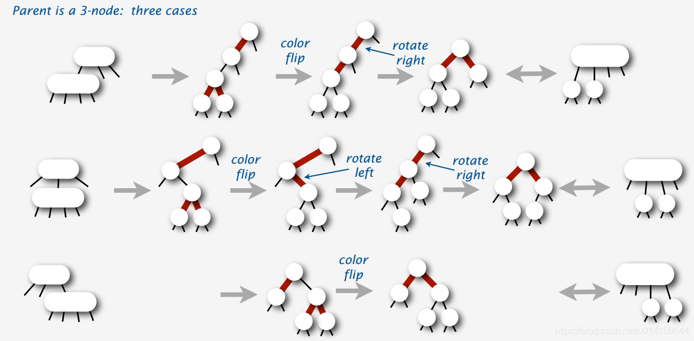  

由以上可知，变换的基本思想是依次检查是否需要进行颜色变换，左旋变换，右旋变换，变换完成后，此时待插入位置处必为非4节点，此时可以直接插入新节点。

2-3-4树，LLRB插入算法如下所示：

```java
    private Node insert(Node h, Key key, Value val){
	if(h == null)
		return new Node(key, val, 1, RED);
	if(isRed(h.left)&&isRed(h.right))
		flipColors(h);
	int cmp = key.compareTo(h.key);
	if(cmp==0) 
		h.val = val;
	else if(cmp<0) 
		h.left = insert(h.left, key, val);
	else 
		h.right = insert(h.right, key, val);
	if(isRed(h.right)) 
		rotateLeft(h);
	if(isRed(h.left)&&isRed(h.left.left))
		rotateRight(h);
	h.N = size(h.left) + size(h.right) + 1;
	return h;
}
```
**在进行插入时，如果出现4节点则通过颜色变换对应分解，插入新节点，然后进行调整，检查是否需要左旋，是否需要右旋等。**

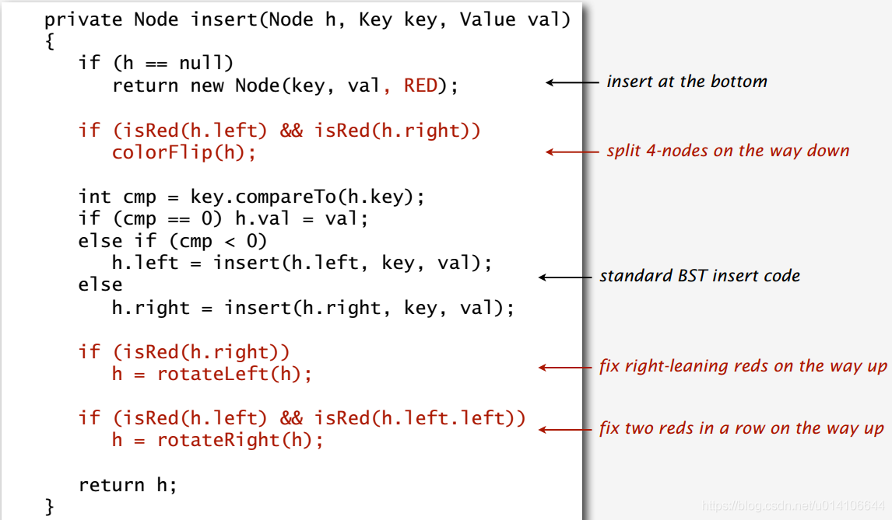                            

将颜色变换放置于左旋，右旋之后有：

```java
    private Node put(Node h, Key key, Value val) {
	if(h == null)
		return new Node(key, val, 1, RED);		
	int cmp = key.compareTo(h.key);
	if(cmp>0)
		h.right = put(h.right, key, val);
	else if(cmp<0)
		h.left = put(h.left, key, val);
	else
		h.val = val;
	if(!isRed(h.left)&&isRed(h.right))
		h = rotateLeft(h);
	if(isRed(h.left)&&isRed(h.left.left))
		h = rotateRight(h);
	if(isRed(h.left)&&isRed(h.right))
		flipColors(h);
	h.N = size(h.left) + size(h.right) + 1;
	return h;		
}
```
此时相当于在一颗2-3树中执行插入操作，每插入一个节点时，通过左旋，右旋以及颜色变换，来最终保证树中没有4节点

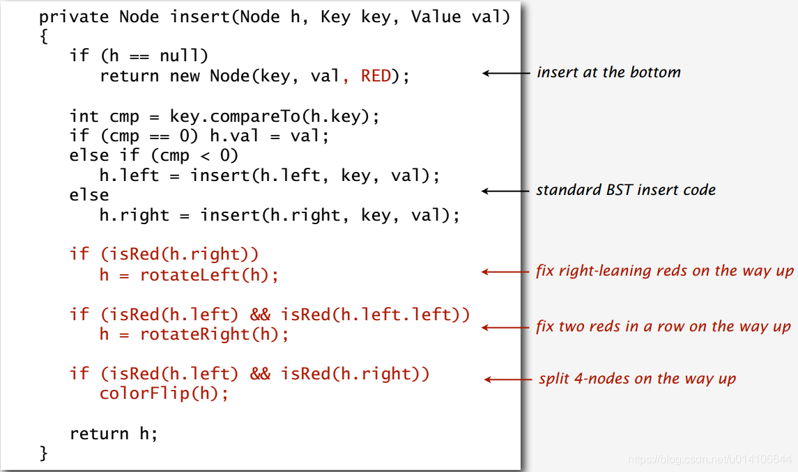

对于两种插入算法，其实对应于2-3-4树中的插入算法思想

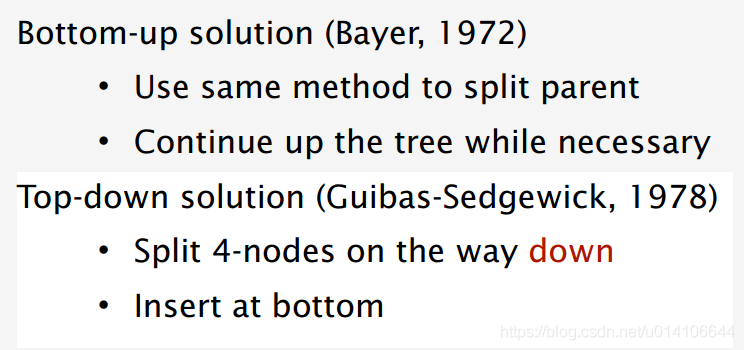

一种是由上到下，在进行搜索过程中，将遇到的4节点进行变换，使得带插入位置为非4节点，这样可以直接插入新节点，然后利用左旋，右旋来调整红黑树保持平衡性；

一种是由下到上，当插入一个新节点时，利用左旋，右旋以及颜色变换，使得树中全部为非4节点；

因此可以通过由下到上的思想来理解红黑树的插入算法：

**红黑树是一颗满足以下条件的BST：**

**每个节点颜色由指向该节点连接颜色决定，红连接以及黑连接**

**任何节点不能同时与两个红连接相连**

**完美黑色平衡，任何空连接到根节点具有相同的路径长度**

当插入一个新节点时，令该节点为红色，使用红连接与其父节点进行相连，由于新节点的插入，可能破坏平衡性，因此通过左旋，右旋，颜色变换来调整，使得新树满足红黑树性质。

具体的变换如下：

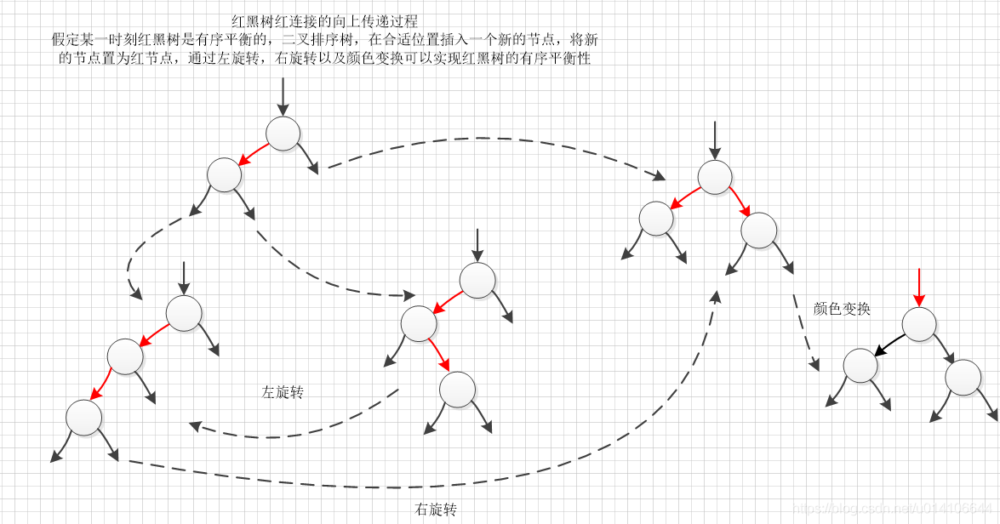

最终的插入算法：

```java
    public void put(Key key, Value val){
	root = put(root, key, val);
	root.color = BLACK;
} 

private Node put(Node h, Key key, Value val) {
	if(h == null)
		return new Node(key, val, 1, RED);		
	int cmp = key.compareTo(h.key);
	if(cmp>0)
		h.right = put(h.right, key, val);
	else if(cmp<0)
		h.left = put(h.left, key, val);
	else
		h.val = val;
	if(!isRed(h.left)&&isRed(h.right))
		h = rotateLeft(h);
	if(isRed(h.left)&&isRed(h.left.left))
		h = rotateRight(h);
	if(isRed(h.left)&&isRed(h.right))
		flipColors(h);
	h.N = size(h.left) + size(h.right) + 1;
	return h;		
}
```

## [从二叉树、2-3树到红黑树，一步步讲解红黑树的来源](https://www.cnblogs.com/JoZSM/p/11784163.html)

### １ 引言

RB-Tree，即红黑树，它的定义如下：

1. 这是一颗二叉树，且每个节点要么是红色、要么是黑色
2. 根节点是黑色
3. 叶子节点也是黑色的，且叶子节点不存储数据，即叶子节点是nil空节点
4. 不能出现连续的红色节点，即相邻的红色节点必须被黑色节点隔开
5. 任何一个节点到达其任意一个叶子节点均包含相同数目的黑色节点

单看上面的定义，大家肯定跟我一样一头雾水，别急，下面我们从最简单的二叉查找树说起，慢慢撕开这个高级数据结构的神秘面纱。

### 2 从二叉查找树到红黑树的演变

#### 2.1 二叉查找树

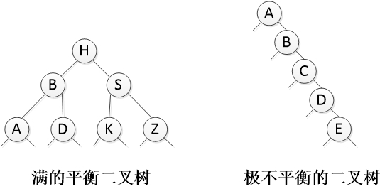

一棵二叉查找树，每个节点的左节点均比当前节点小，且右节点均比当前节点大。上图的两棵树，均属于二叉查找树。于是，查找的过程如下：

- 当前节点等于目标值时，查找成功
- 当查找到空节点时，查找结束，返回不成功
- 小于时，继续在左子树中查找
- 大于时，继续在右子树中查找

最好的情况下，上图左侧示例，当所有节点的左右子树的高度都相同时，无论查找值是什么，每遍历一个节点都能排除一半的可能，这种情况的时间复杂度是O(logN)
最坏的情况下，上图右侧示例，当所有节点都集中在一条路径上，此时二叉查找树已经退化为一个链表，时间复杂度增大到O(N)
随着不断的增删操作，二叉查找树的时间复杂度变得不可控，介于O(logN)和O(N)之间。

有没有可能一直控制在最好的情况下呢，请看下一节：平衡二叉查找树

#### 2.2 平衡二叉查找树

上一节讲到二叉查找树在最坏情况下会退化为链表，如果能保证每个节点的左右子树都是平衡的，即任意节点的左右子树的高度差均不大于1，那么查找的时间复杂度可以稳定在O(logN)。这就是平衡二叉查找树。
平衡二叉查找树的时间复杂度稳定在O(logN)。
但它同时给插入和删除操作带来了麻烦，每次插入或删除后，我们均需要确认这次操作是否影响了整棵树的平衡性，并在全局范围内作出适当调整。这种全局性对编码要求很高，难以实现且不说，额外的维持平衡的逻辑也大大增加了每次插入或删除的消耗，时间复杂度并不比普通二叉查找树优秀。

所以接下来大家不难想到，能否设计一种数据结构能够把全局的平衡性调整简化为局部的调整，从而简化代码实现难度，进而也降低时间复杂度？我们继续看下一节：2-3树

#### 2.3 2-3树

2-3树是由2节点或3节点组成的树结构。这里的2或3指的是每个节点的子树数量：

- 2节点：保存1个key，左子树均小于key，右子树均大于key
- 3节点：保存2个key，左子树均小于最小key，中子树介于两个key之间，右子树均大于key
- 相应的，我们可以得出4节点的定义，即保存3个key，同时划分出4个区间对应于4棵子树

一棵完整的2-3树，高度平衡，即任意节点到达其任意叶子节点的路径长度均相同，也即任意叶子节点的深度是相同的。所以一棵完整的2-3树，就是一棵满的2叉和3叉树，复杂度：

- 最好情况：整棵树均由3节点组成，每遍历一个节点能排除2/3的数据，时间复杂度是 2/3 O(logN)
- 最坏情况：整棵树均由2节点组成，就是一棵满的平衡二叉树，时间复杂度是O(logN)

完整的2-3树的查找时间复杂度：O(logN)

接下来我们以插入操作为例，来看看2-3树是怎么把平衡二叉树要求的全局平衡性调整简化为局部的调整：
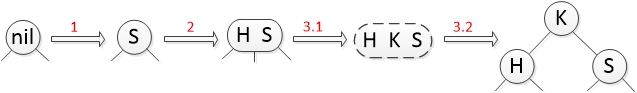

**对单个节点的插入处理**(如上图)

1. 插入S到空节点：直接生成S节点（这一步只可能发生在整棵树为空时。**二叉树的插入是在叶子节点后插入一个新节点，树是自顶向下生长的；而2-3树则要求**）
2. 插入H到2节点：得到一个3节点(H S)
3. 插入K到3节点：
   3.1 得到一个临时4节点(H K S)
   3.2 临时4节点裂变成3个2节点：将中间key拿出来得到K节点，最小/最大key分别为K节点的左右子节点

**注意**：*第1步只可能发生在整棵树为空时。*

- **二叉树是自顶向下生长**：插入操作是在叶子节点后新建一个子节点
- **2-3树是自底向上生长**：数据插入有值的叶子节点中，随着插入不断进行，底层节点不断往上裂变，直到根节点由4节点裂变成3个2节点时，树高才会+1

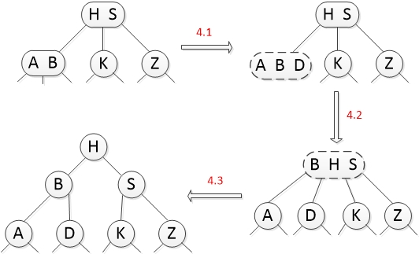

**插入操作在一棵树内的处理**(如上图)

4.将D节点插入一棵现有的树时，会触发自底向上的递归式调整：
4.1 得到一个临时4节点node1(A B D)
4.2 node1裂变，由于父节点(H S)已存在，所以中间key插入到父节点，又得到一个临时节点node2(B H S)
4.3 node2裂变，由于Node2就是根节点，所以整棵树的高度+1，新的根节点是node2的中间key(H)

上面的1/2/3/4这4个步骤，即是对一棵2-3树的插入操作可能涉及的情况，不难发现，对2-3树的插入可以是一个递归过程，每次只处理单个节点即局部的逻辑，整棵树是自平衡的。递归逻辑如下：

- 根节点为空时，在根节点中插入key
- 根节点非空时：
- 先执行搜索，找到相同的key则替换；
- 未找到key时，将key插入当前节点，即查找的最后一个节点：
  A. 当前节点为2节点，则插入后得到一个3节点，结束递归
  B. 当前节点为3节点，则插入后得到一个4节点，裂变：
  a. 当前节点为根节点，则裂变后结束递归
  b. 否则，将中间key拿出插入到当前节点的父节点，以父节点作为当前节点继续第A步

2-3树的删除操作在此省略。

现在我们知道2-3树在平衡二叉树的基础上进行了优化，保持平衡即查找复杂度O(logN)的同时能够将每次的调整都控制在局部范围内。但2-3树的实现需要处理两种类型的节点，即2节点和3节点，这就增加了代码实现的复杂度，同时这个复杂的代码引起的消耗也不小，所以2-3树的插入或删除时的时间复杂度还不够理想。

所以接下来就是重头戏了，能否用一种节点来实现2-3树，即用二叉树来实现2-3树，将查找、插入、删除、修改的时间复杂度都控制在一个合理的O(logN)？

#### 2.4 红黑树

上一节的2-3树，其中的3节点如果我们用一个红黑的链接来表示，那么一棵2-3树可以转换成这样：
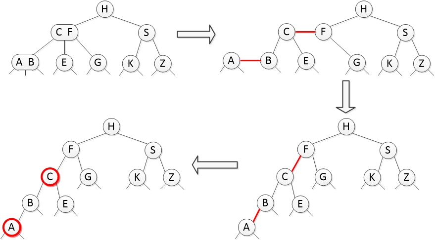

上图中我们对一棵2-3树作了处理，2节点固定为黑色，而3节点可以分解为2个用红色链接连接的2节点，然后将红色链接指向的孩子节点标记为红色，其他节点默认为黑色。
**2-3-4树**，按2-3树的思路，再增加一种4节点，1个4节点可以存储3个key，分裂时取中间元素向上冒，即是2-3-4树。4节点按二叉树的画法时，左右key都转换成红色节点。

**红黑树既是二叉搜索树，又是特殊的2-3-4树**，现在我们再以2-3-4树的性质来分析红黑树的定义，就容易理解了：

1. 这是一颗二叉树，且每个节点要么是红色、要么是黑色
2. 根节点是黑色
3. 叶子节点也是黑色的，且叶子节点不存储数据，即叶子节点是nil空节点
4. 不能出现连续的红色节点，即相邻的红色节点必须被黑色节点隔开
5. 任何一个节点到达其任意一个叶子节点均包含相同数目的黑色节点

第1条略过。
第3条是为了后续代码实现的便利性而设定的要求
第2/4条，其实是因为根据上面的转换方式，一个3/4节点分解成一个黑色的父节点和1/2个红色的孩子节点，那么红色节点一定会存在一个黑色的父节点。于是根节点没有父节点所以只能是黑色；红色节点的父节点一定是黑色的所以不可能存在相邻的红色节点。
第5条也好理解，正是将红色节点去除，即复原3/4节点后，能够得到一棵完整的2-3-4树，树的每个节点的左右子树的高度相等。

红黑树以二叉树的结构实现了一棵特殊的2-3-4树，由于拆分了3/4节点，所以树高增加了，那么查找的时间复杂度还有保证吗？

- 最好的情况：所有节点的左右子树的高度一致时，就是一棵满的平衡二叉树，时间复杂度是O(logN)
- 最坏的情况：红黑树最不平衡的状态就是本节开头画的那棵，红色节点全部集中在一条链路上。这时查找只有黑色节点的分支时，需要遍历的节点数小于O(logN)，时间复杂度就是O(logN)。查找红色节点所在的分支时，由于红色节点总是被黑色节点隔开，所以查找路径需要经历的红色节点数最大等于黑色节点数，而根据红黑树定义第5条，从根节点到叶子节点的任意路径的黑色节点固定，同样也小于O(logN)，所以最坏的时间复杂度是小于O(logN)乘以2的。可以认为最坏的时间复杂度近似于O(logN)

所以红黑树的查找时间复杂度稳定在O(logN)。

## 来源

[清晰理解红黑树的演变---红黑的含义](https://www.cnblogs.com/tiancai/p/9072813.html)

[红黑树2---从-2-3-4树到红黑树的演变过程以及插入算法实现原理](https://blog.csdn.net/u014106644/article/details/89742389)

[从二叉树、2-3树到红黑树，一步步讲解红黑树的来源](https://www.cnblogs.com/JoZSM/p/11784163.html)