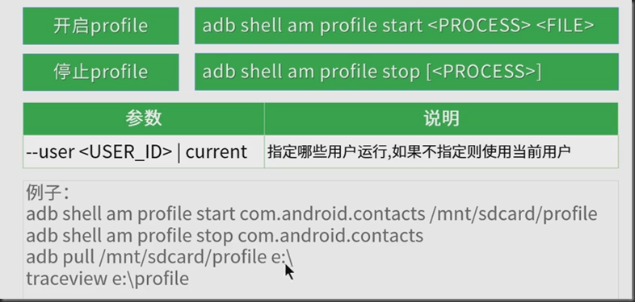

### 一、开启Activity、服务、广播

#### 1.开启Activity、服务、广播基础知识：

通过adb shell，可以使用activity manager（arm）工具来执行不同的系统操作，如开启一个action，开启一个activity、强制停止一个线程、修改设备屏幕属性等等，adb shell命令格式如下：

```
am <command>
```

##### 1)intent

        intent可以理解为不同组件通信的媒介或者信使；
    
        intent可以启动一个Activity，也可以启动一个Service，好可以发起一个广播Broadcast
    
        通过intent，你的程序可以像Android表达某种请求或者意愿，Android会根据意愿的内容选择适当的组件来完成请求

| Intent    | 说明                                                         | Am参数 |
| --------- | :----------------------------------------------------------- | :----- |
| component | 组件名称  格式为：包名/类名                                  | -n     |
| action    | 指定Intent的执行动作，比如调用拨打电话组件                   | -a     |
| data_url  | 表示与动作要操纵的数据                                       | -d     |
| category  | categary是一个字符串，提供了额外的信息，有关于能够处理这个Intent对象的组件种 | -c     |
| extra     | 传递给Intent的额外数据，以Bundle的形式定义，就是一些键值对   | -e     |
| mime_type | MIME类型                                                     | -t     |
| flags     | 各种类型的flag，很多是用来指定Android系统如何启动activity，还有启动了activity后如何对待他 | -f     |
| package   | 包名                                                         | -p     |

##### 2）启动Activity

```
 #启动界面

adb shell am start [参数] <INTENT>
```

| 参数                             | 说明                                                        |
| -------------------------------- | :---------------------------------------------------------- |
| -D                               | 开启调试模式                                                |
| -W                               | 等待启动完成                                                |
| --start-profile <file>           | 开始分析器和发送结果（文件）                                |
| --sampling INTERVAL              | 使用样本分析 间隔：微秒 <br>样品（使用—start-profiler）之间 |
| -P <FILE>                        | 应用空闲下来后，停止profile                                 |
| -R COUNT                         | 重复活动推出<统计>次。每个重复之前，活动将会结束            |
| -S                               | 组织目标应用开始前的活动                                    |
| --opengl-trace                   | 启用跟踪OpenGL函数                                          |
| [—user <USER_ID> &#124; current] | 指定哪些用户运行，如果不指定则使用当前用户                  |

##### 3）启动和停止服务

```
 #启动服务

adb shell am startservice [参数] <INTENT>

 #停止服务

adb shell am stopservice [参数] <INTENT>
```

| 参数                            | 说明                                       |
| ------------------------------- | :----------------------------------------- |
| --user <USER_ID> &#124; current | 指定哪些用户运行，如果不指定则使用当前用户 |

##### 4）启动广播

```
 #启动广播

adb shell am broadcast [参数] <INTENT>
```

| 参数                            | 说明                                       |
| ------------------------------- | :----------------------------------------- |
| --user <USER_ID> &#124; current | 指定哪些用户运行，如果不指定则使用当前用户 |

 

### 二、内存与进程操作

#### 1.内存操作：

获取heap文件：adb shell am dumpheap [参数] <process>

| 参数                            | 说明                                       |
| ------------------------------- | :----------------------------------------- |
| --user <USER_ID> &#124; current | 指定哪些用户运行，如果不指定则使用当前用户 |
| -n                              | 获取native heap而不是managed heap          |

例如：

adb shell am dumpheap com.android.browser /data/local/tmp/test.hprof

 #获取内存快照（后缀名必需为.hprof）

使用adb pull /data/local/tmp/test.hprof e:\命令将testr.hprof文件保存到电脑本地

使用命令：hprof-conv e:\test.hprof e:\test1.hprof进行文件转化

然后就可以使用mat工具对内存进行查看分析

#### 2.进程操作：

adb shell am force-stop [参数] <process>

 #强制停止应用（process=包名）

adb shell am kill [参数] <process>

 #停止后台单个进程

adb shell am kill-all

 #停止后台所进程

 

### 三、调试相关操作

#### 1.性能相关：

截图来自极客学院




Traceview是android平台配备一个很好的性能分析的工具。它可以通过图形化的方式让我们了解我们要跟踪的程序的性能，并且能具体到method。

#### 2.监听异常：

监听crash和ANR：adb shell monitor [options]


原文：[https://www.cnblogs.com/JianXu/category/782865.html](https://www.cnblogs.com/JianXu/category/782865.html)