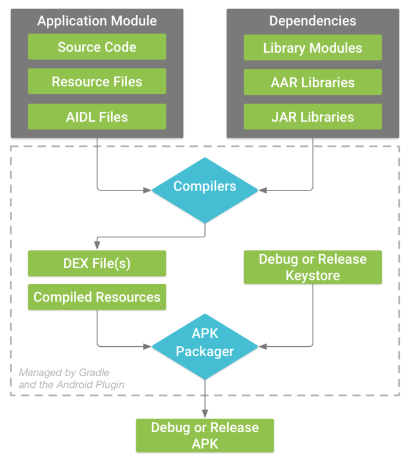
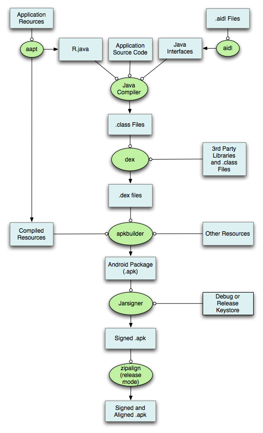
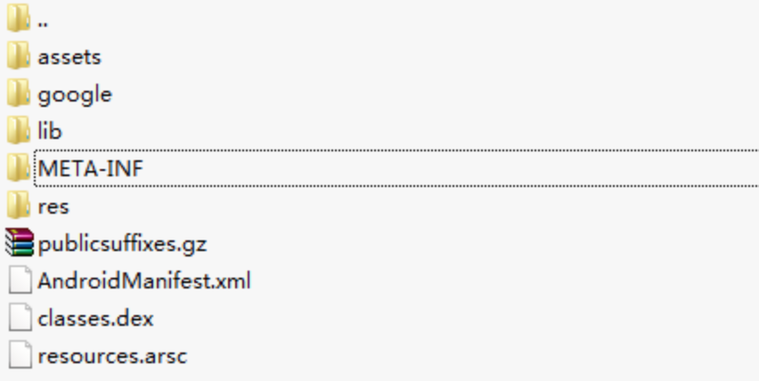

<h1 align="center">Android Studio build过程</h1>

[toc]

## 1. APK构建概述

下图是谷歌官网给出的一个典型的APK构建过程。

主要有两个过程：

- 编译过程

  - 输入本工程的文件以及依赖的各种库文件。
  - 输出dex文件和编译后的资源文件。

- 打包过程

  - 配合Keystore对上述的输出进行签名对齐，生成最终的apk文件。



## 2. APK构建步骤详解

Android APK构建的详细步骤如下图所示。



步骤中提到的工具如下表：

名称 功能介绍 在操作系统中的路径

| 工具名称   | 介绍                                     | 路径                                      |
| ---------- | ---------------------------------------- | ----------------------------------------- |
| aapt       | Android资源打包工具                      | ${ANDROID_SDK_HOME}/platform-tools/appt   |
| aidl       | Android接口描述语言转化为.java文件的工具 | ${ANDROID_SDK_HOME}/platform-tools/aidl   |
| javac      | Java Compiler                            | ${JDK_HOME}/javac或/usr/bin/javac         |
| dex        | 转化.class文件为Davik VM能识别的.dex文件 | ${ANDROID_SDK_HOME}/platform-tools/dx     |
| apkbuilder | 生成apk包                                | ${ANDROID_SDK_HOME}/tools/opkbuilder      |
| jarsigner  | .jar文件的签名工具                       | ${JDK_HOME}/jarsigner或/usr/bin/jarsigner |
| zipalign   | 字节码对齐工具                           | ${ANDROID_SDK_HOME}/tools/zipalign        |


**第一、打包资源文件，生成R.java文件**

- 输入：

   （1）Resource文件（即工程res中的文件）

   （2）Assets文件（即工程assets中的文件）

   （3）AndroidMainfest.xml文件

   （4）Android基础类库（Android.jar文件）

- 输出：

   （1）R.java文件（在model工程的build/generated目录）

   （2）打包好的资源

- 工具：appt工具

**第二、处理AIDL文件（没有可以省略），生成对应的.java文件**

- 输入：源码文件、aidl文件、framework.aidl文件
- 输出：对应的.java文件
- 工具：aidl工具

**第三、编译Java文件，生成对应的.class文件**

- 输入：

   （1）源码文件（包括第1步的R.java和第2步AIDL生成的.java文件）

   （2）库文件（.jar文件）

- 输出：对应的.class文件
- 工具：javac工具

**第四、把.class文件转化成Davik VM支持的.dex文件**

- 输入：

   （1）第3步生成的.class文件（包括AIDL、R.java、源代码生成的.class文件）

   （2）库文件（.jar文件）

- 输出：对应的.dex文件
- 工具：javac工具

**第五、打包生成未签名的.apk文件**

- 输入：

   （1）打包后的资源文件（包括本地和第三方库里的）

   （2）打包后的.dex文件

   （3）libs文件（包括.so文件，如果涉及C/C++开发的话）

- 输出：未签名的.apk文件
- 工具：apkbuilder工具

**第六、对未签名.apk文件进行签名**

- 输入：未签名的.apk文件
- 输出：签名的.apk文件
- 工具：jarsigner工具

**第七、对签名后.apk文件进行对齐处理**

- 输入：签名的.apk文件
- 输出：对齐后的.apk文件
- 工具：zipalign工具

## 3. Gradle Console日志

1、整个过程可以通过命令行`./gradlew assembleRelease --info`(Mac系统)执行的Task看到。

```bash
16:49:13: Executing task 'assembleRelease'...
Executing tasks: [assembleRelease]

:ZDB:preBuild UP-TO-DATE
:ZDB:preReleaseBuild UP-TO-DATE
:ZDB:compileReleaseAidl UP-TO-DATE
:ZDB:compileReleaseRenderscript UP-TO-DATE
:ZDB:checkReleaseManifest UP-TO-DATE
:ZDB:generateReleaseBuildConfig UP-TO-DATE
:ZDB:prepareLintJar UP-TO-DATE
:ZDB:mainApkListPersistenceRelease UP-TO-DATE
:ZDB:generateReleaseResValues UP-TO-DATE
:ZDB:generateReleaseResources UP-TO-DATE
:ZDB:mergeReleaseResources UP-TO-DATE
:ZDB:createReleaseCompatibleScreenManifests UP-TO-DATE
:ZDB:processReleaseManifest UP-TO-DATE
:ZDB:splitsDiscoveryTaskRelease UP-TO-DATE
:ZDB:processReleaseResources UP-TO-DATE
:ZDB:generateReleaseSources UP-TO-DATE
:ZDB:javaPreCompileRelease UP-TO-DATE
:ZDB:compileReleaseJavaWithJavac UP-TO-DATE
:ZDB:compileReleaseNdk NO-SOURCE
:ZDB:compileReleaseSources UP-TO-DATE
:ZDB:lintVitalRelease
:ZDB:mergeReleaseShaders UP-TO-DATE
:ZDB:compileReleaseShaders UP-TO-DATE
:ZDB:generateReleaseAssets UP-TO-DATE
:ZDB:mergeReleaseAssets UP-TO-DATE
:ZDB:transformClassesWithDexBuilderForRelease UP-TO-DATE
:ZDB:transformClassesWithMultidexlistForRelease UP-TO-DATE
:ZDB:transformDexArchiveWithDexMergerForRelease UP-TO-DATE
:ZDB:mergeReleaseJniLibFolders UP-TO-DATE
:ZDB:transformNativeLibsWithMergeJniLibsForRelease UP-TO-DATE
:ZDB:processReleaseJavaRes NO-SOURCE
:ZDB:transformResourcesWithMergeJavaResForRelease UP-TO-DATE
:ZDB:packageRelease UP-TO-DATE
:ZDB:assembleRelease

BUILD SUCCESSFUL in 4s
26 actionable tasks: 1 executed, 25 up-to-date
16:49:18: Task execution finished 'assembleRelease'.
```

2、通过[反编译APK文件](https://blog.csdn.net/guolin_blog/article/details/49738023)，可以间接看到打包流程和APK的组成文件

- 反编译主要过程

   （1）将apk解压（可以变成zip压缩文件再解压）

   （2）找到classes.dex文件，用 dex2jar工具 ，将dex文件转换成jar文件，命令 d2j-dex2jar classes.dex

   （3）用 jd-gui 工具，将jar文件转换成java代码

   （4）用 apktool 这个工具用于最大幅度地还原APK文件中的9-patch图片、布局、字符串等等一系列的资源。命令 apktool d Demo.apk

- 解压APK文件





## 参考

[AndroidStudio Build过程解析](https://www.jianshu.com/p/e86aadcb19e0)

[android build apk过程详解](https://blog.csdn.net/o279642707/article/details/78189938)

[Android编译流程和Gradle使用](https://www.jianshu.com/p/eaaddfe34d11)