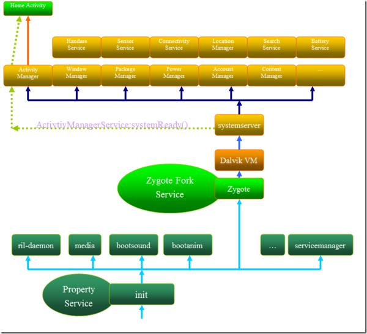

<h1 align="center">Android Framework 启动流程</h1>

   > Android手机系统本质上是一个基于Linux的应用程序，它以Linux系统为内核。系统的启动过程包括Linux内核启动和Android框架启动两个阶段，本文主要介绍Android 框架（Framework）启动阶段。

## 一、Linux内核启动

1.装载引导程序bootloader
    Linux内核启动时首先装载执行bootloader引导程序，装载完成后进入内核程序。

2.加载Linux内核
    Linux内核加载主要包括初始化kernel核心（内存初始化，打开中断，初始化进程表等）、初始化驱动、启动内核后台（daemons)线程、安装根（root)文件系统等。
    Linux加载的最后阶段启动执行第一个用户级进程init（内核引导参数上一般都会设置“init=/init”，由kernel自动执行，PID为1，是所有进程的父进程）。由此进入Android框架的启动阶段。
      

## 二、Android框架启动

Android框架的启动始于init进程，这个阶段也是本文要重点讲解的。启动过程可以分为以下几个主要的阶段：
   1、init进程启动
   2、init.rc脚本启动
   3、zygote服务启动
   4、System Server进程启动
   5、Home应用启动
   下图示出了Android Framework框架的启动流程：
    
    

​	 注：图片来源：http://yelinsen.iteye.com/blog/1017352

1、init进程启动
    init进程是Android系统的入口，它会以后台进程（daemon）的形式一直存在。该进程的程序源码在目录system/core/init中，入口函数是init.c:main()。主要有如下功能：
     
　　1）创建/安装设备文件/进程文件/系统文件节点；
　　2）解析init.rc和init.hardware.rc；
　　3）启动脚本中指定的服务，执行指定的命令或动作；
　　4）作为守护进程循环检查是否有action需要执行、是否需要重启某服务等。
     详细代码可以参考init.c中入口函数main的实现。
     
2、init.rc脚本启动
     init.rc文件是Android系统的重要配置文件，位于/system/core/rootdir/目录中。主要功能是定义了系统启动时需要执行的一系列action及service：执行特定动作、设置环境变量和属性和执行特定的service。该脚本在init进程的init.c:main函数中解析并启动。代码如下：

```c
    init_parse_config_file("/init.rc");  
    ......  
    get_hardware_name(hardware, &revision);  
    snprintf(tmp, sizeof(tmp), "/init.%s.rc", hardware);  
    init_parse_config_file(tmp);  
    ......  
    for(;;) {  
        int nr, i, timeout = -1;  
  
        execute_one_command();  
        restart_processes();  
  
        if (!property_set_fd_init && get_property_set_fd() > 0) {  
            ufds[fd_count].fd = get_property_set_fd();  
            ufds[fd_count].events = POLLIN;  
            ufds[fd_count].revents = 0;  
            fd_count++;  
            property_set_fd_init = 1;  
        }  
        if (!signal_fd_init && get_signal_fd() > 0) {  
            ufds[fd_count].fd = get_signal_fd();  
            ufds[fd_count].events = POLLIN;  
            ufds[fd_count].revents = 0;  
            fd_count++;  
            signal_fd_init = 1;  
        }  
        if (!keychord_fd_init && get_keychord_fd() > 0) {  
            ufds[fd_count].fd = get_keychord_fd();  
            ufds[fd_count].events = POLLIN;  
            ufds[fd_count].revents = 0;  
            fd_count++;  
            keychord_fd_init = 1;  
        }  
  
        if (process_needs_restart) {  
            timeout = (process_needs_restart - gettime()) * 1000;  
            if (timeout < 0)  
                timeout = 0;  
        }  
  
        if (!action_queue_empty() || cur_action)  
            timeout = 0;  
  
#if BOOTCHART  
        if (bootchart_count > 0) {  
            if (timeout < 0 || timeout > BOOTCHART_POLLING_MS)  
                timeout = BOOTCHART_POLLING_MS;  
            if (bootchart_step() < 0 || --bootchart_count == 0) {  
                bootchart_finish();  
                bootchart_count = 0;  
            }  
        }  
#endif  
  
        nr = poll(ufds, fd_count, timeout);  
        if (nr <= 0)  
            continue;  
  
        for (i = 0; i < fd_count; i++) {  
            if (ufds[i].revents == POLLIN) {  
                if (ufds[i].fd == get_property_set_fd())  
                    handle_property_set_fd();  
                else if (ufds[i].fd == get_keychord_fd())  
                    handle_keychord();  
                else if (ufds[i].fd == get_signal_fd())  
                    handle_signal();  
            }  
        }  
    }  
```
需要重点说明的是init.rc脚本文件配置了一些重要的服务，init进程通过创建子进程启动这些服务，这里创建的service都属于native服务，运行在Linux空间，通过socket向上层提供特定的服务，并以守护进程的方式运行在后台。脚本中服务的定义示例如下：

```c
service servicemanager /system/bin/servicemanager    
    class core    
    user system    
    group system    
    critical    
    onrestart restart zygote    
    onrestart restart media    
    
service ril-daemon /system/bin/rild    
    class main    
    socket rild stream 660 root radio    
    socket rild-debug stream 660 radio system    
    user root    
    group radio cache inet misc audio sdcard_rw log    
    
service surfaceflinger /system/bin/surfaceflinger    
    class main    
    user system    
    group graphics    
    onrestart restart zygote    
    
service zygote /system/bin/app_process -Xzygote /system/bin --zygote --start-system-server    
    class main    
    socket zygote stream 666    
    onrestart write /sys/android_power/request_state wake    
    onrestart write /sys/power/state on    
    onrestart restart media    
    onrestart restart netd    
    
service media /system/bin/mediaserver    
    class main    
    user media    
    group audio camera inet net_bt net_bt_admin net_bw_acct drmrpc    
    ioprio rt 4 
```

通过init.rc脚本系统启动了以下几个重要的服务：

​	  1）servicemanager:启动binder IPC，管理所有的Android系统服务
​	  2）mountd:设备安装Daemon，负责设备安装及状态通知
​	  3）debuggerd:启动debug system，处理调试进程的请求
​	  4）rild:启动radio interface layer daemon服务，处理电话相关的事件和请求
​	  5）mediaserver:启动AudioFlinger,MediaPlayerService and CameraService，负责多媒体播放相关的功能，包括音视频解码、显示输出
​	  6）zygote:进程孵化器，启动Android Java VMRuntime和启动systemserver，负责Android应用进程的孵化工作

3.zygote服务启动

zygote进程孵化了所有的Android应用进程，是Android Framework的基础，该进程的启动也标志着Framework框架初始化启动的开始。zygote服务进程的主要功能：

​		1）注册底层功能的JNI函数到虚拟机
​		2）预加载Java类和资源
​		3）fork并启动System Server核心进程
​		4）作为守护进程监听处理“孵化新进程”的请求
如上面所述，zygote是通过init脚本启动的：

```java
service zygote /system/bin/app_process -Xzygote /system/bin --zygote --start-system-server    
    class main    
    socket zygote stream 666    
    onrestart write /sys/android_power/request_state wake    
    onrestart write /sys/power/state on    
    onrestart restart media    
    onrestart restart netd 
```

上面脚本的含义为作为孵化进程（-Xzygote参数)，通过system/bin/app_process启动zygote服务，同时启动SystemServer(--start-system-server参数）进程。该服务对应的可执行文件app_process的源码位于frameworks/base/cmds/app_process。

zygote服务在函数app_main.cpp:main()中启动。该函数的关键代码有两处：

​	1）创建AndroidRuntime对象：

​		AppRuntime runtime; // android运行空间  

​	2）启动zygote和systemserver：****

```java
runtime.start("com.android.internal.os.ZygoteInit", startSystemServer ? "start-system-server" : ""); 
```

方法start()代码位于frameworks/base/core/jni/AndroidRuntime.cpp中，主要逻辑如下：
　　  ---调用startVM创建虚拟机：内部使用以下代码创建vm对象：

```java
if (JNI_CreateJavaVM(pJavaVM, pEnv, &initArgs) < 0) {  
   LOGE("JNI_CreateJavaVM failed\n");  
   goto bail;  
}
```

---注册底层功能的JNI函数到JNIEnv: startReg()
---调用env->GetStaticMethodID和env->CallStaticVoidMethod()函数运行Java类ZygoteInit的main()
      由此可见虚拟机启动后执行的第一个Java类是ZygoteInit.java，并进入ZygoteInit.java:main()函数中。在main函数中实现了以下逻辑：
      1）启动服务端Socket端口：
    调用registerZygoteSocket()实现，主要用于接受处理创建新进程的请求。
	  2）预加载指定的java类和资源：
    调用preloadClasses()预加载指定的java类，调用preloadResources()预加载指定的Resources。特别说明的是孵化器进程会把这些预先加载的类和资源共享给所有APK应用进程，这样有效的解决了Framework类和资源共享的问题。
	  3）启动System Server进程：
    调用startSystemServer()创建（fork)SystemServer进程。该函数的关键代码有三处：
---设定启动进程的相关信息：比如进程名称、启动后装载的第一个java类
---调用forkSystemServer()从当前的zygote进程孵化出新的进程
---调用函数hanldeSystemServerProcess()关闭从Zygote进程继承过来的Socket，调用RuntimeInit.zygoteInit()启动SystemServer.java:main()函数
	 4）循环监听孵化新Dalvik进程的请求：
调用runSelectLoopMode()进入无限循环：监听客户端socket连接，根据请求孵化新的应用进程。Process类中保存了客户端socket，并由ActivityManagerService管理该客户端。每当需要启动新的Dalvik应用进程时，ActivityManagerService都会通过该socket客户端与Zygote进程的socket服务端进行通信，请求Zygote孵化出新的进程。

　 至此,启动zygote服务工作完成，需要说明的是zygote进程即为app_process可执行程序所在进程。
　 
4、System Server进程启动       

SystemServer进程在Android的运行环境中扮演了“神经中枢”的作用，Android应用能够直接交互的大部分系统服务都在该进程中运行，如WindowManagerServer、ActivityManagerSystemService、PackageManagerServer等，这些系统服务都是以独立线程的方式存在于SystemServer进程中。System Server进程的主要功能：

​	1）加载android servers底层函数库
​	2）启动android系统中的native服务
​	3）创建、注册并启动Android的系统服务，在独立线程中运行
​	4）创建Looper消息循环，处理System Server进程中的事件消息

在zygote进程中调用函数startSystemServer()创建和启动Server进程，进程首先执行的函数是SystemServer.java:main()。该函数函数实现的主要逻辑为：

​    1）加载android_servers函数库
​	2）启动native服务：
​    调用本地函数init1()实现，该函数的源码位于文件frameworks/base/services/jni/com_android_server_systemService.cpp中，涉及的函数system_init()实现在文件frameworks/base/cmds/system_server/library/system_init.cpp中。
​	3）启动Android系统的各种系统服务：
 调用函数init2()实现，该函数首先创建了一个ServerThread对象，该对象是一个线程，然后直接运行该线程，如以下代码所示：     

```java
public static final void init2() {  
     Slog.i(TAG, "Entered the Android system server!");  
     Thread thr = new ServerThread();  
     thr.setName("android.server.ServerThread");  
     thr.start();  
 }  
```

从ServerThread的run()方法内部开始真正启动各种服务线程。
    ---创建Android系统服务对象,并注册到ServiceManager
    ---在SystemServer进程中建立Looper消息循环：通过Looper.prepare和Looper.loop来实现
    ---系统就绪通知：调用systemReady()通知各个服务
      System Server进程启动过程中最核心的一步是“启动Android系统的各种系统服务”，这些系统服务构成了整个Android框架的基础（如图所示），通过Binder IPC为上层应用提供各种功能。介绍下几个重要系统服务的功能。

1）ActivityManagerService
Activity管理服务，主要功能包括：
            ---统一管理和调度各应用程序的Activity，维护系统中运行的所有应用Task和Activity
            ---内存管理：应用程序关闭时对应进程还在运行，当系统内存不足时根据策略kill掉优先级较低进程
            ---进程管理：维护和管理系统中运行的所有进程，并提供了查询进程信息的API
            ---Provider、Service和Broadcast管理和调度
            
2）WindowManagerService
    窗口管理服务，主要功能包括为应用程序分配窗口，并管理这些窗口。包括分配窗口的大小、调节各窗口的叠放次序、隐藏或者显示窗口，程序退出时删除窗口。

3）PackageManagerService
    程序包管理服务，主要功能为：
        ---根据intent查找匹配的Activity、Provider以及Service
        ---进行权限检查，即当应用程序调用某个需要一定权限的函数时，系统能够判断调用者是否具备该权限
        ---提供安装、删除应用程序的API
4）NotificationManagerService
    通知管理服务，负责管理和通知后台事件的发生等，这个和statusbar服务结合在一起，一般会在statusbar上添加响应图标。用户可以通过这知道系统后台发生了什么事情。

5）AudioService
    音频管理服务，AudioFlinger的上层管理封装，主要是音量、音效、声道及铃声等的管理。

6）TelephonyRegistry
    电话服务管理，用于监听和上报电话状态，包括来电、通话、信号变化等。
    到这里，Android Framework的启动已经完成，框架中提供的各种服务也已经就绪，可以正常运行并响应处理应用的各种操作请求。
    启动完成后需要启动home应用进入手机主界面，这是下面第5节讲解的。

5、Home应用启动
     在ServerThread:run()函数的最后调用了ActivityManagerService.self().systemReady方法，该方法实现了如下代码用于启动第一个Activity：
     
```java
mMainStack.resumeTopActivityLocked(null);
```

由于系统刚启动时没有任何Activity对象，代码会调用ActivityManagerService:startHomeActivityLocked函数启动Home应用：

```java
Intent intent = new Intent(mTopAction, mTopData != null ? Uri.parse(mTopData) : null);  
intent.setComponent(mTopComponent);  
if (mFactoryTest != SystemServer.FACTORY_TEST_LOW_LEVEL) {  
    intent.addCategory(Intent.CATEGORY_HOME);  
}  
```