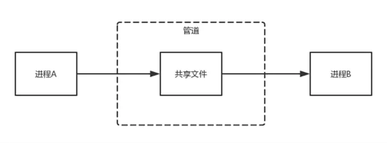
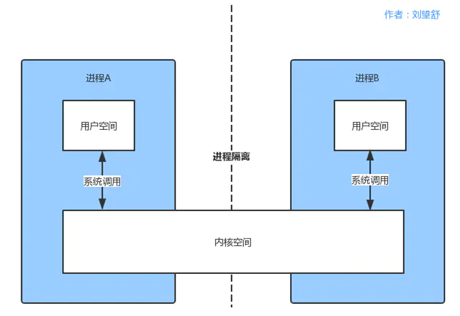
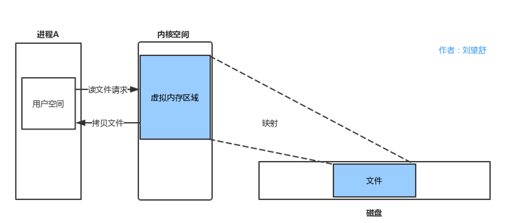
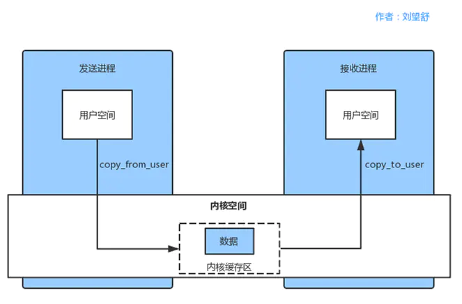
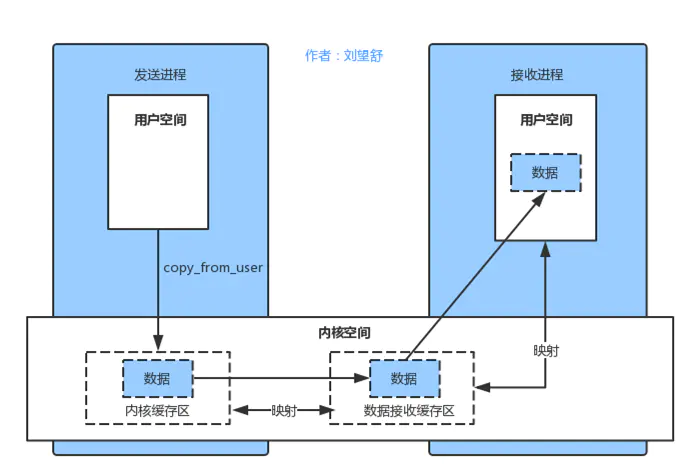
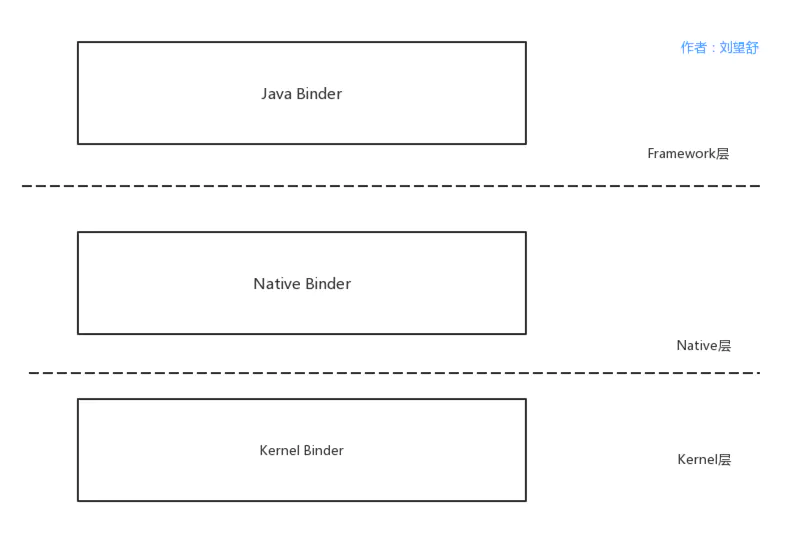

<h1 align="center">Android Binder原理（一）学习Binder前必须要了解的知识点</h1>

### **前言**

Binder原理是掌握系统底层原理的基石，也是进阶高级工程师的必备知识点，这篇文章不会过多介绍Binder原理，而是讲解学习Binder前需要的掌握的知识点。

### **1.Linux和Android的IPC机制种类**

IPC全名为inter-Process Communication，含义为进程间通信，是指两个进程之间进行数据交换的过程。在Android和Linux中都有各自的IPC机制，这里分别来介绍下。

#### **1.1 Linux中的IPC机制种类**

Linux中提供了很多进程间通信机制，主要有管道（pipe）、信号（sinal）、信号量（semophore）、消息队列（Message）、共享内存（Share Memory)、套接字（Socket）等。

**管道** 管道是Linux由Unix那里继承过来的进程间的通信机制，它是Unix早期的一个重要通信机制。管道的主要思想是，在内存中创建一个共享文件，从而使通信双方利用这个共享文件来传递信息。这个共享文件比较特殊，它不属于文件系统并且只存在于内存中。另外还有一点，管道采用的是半双工通信方式的，数据只能在一个方向上流动。 简单的模型如下所示。

**信号** 信号是软件层次上对中断机制的一种模拟，是一种异步通信方式，进程不必通过任何操作来等待信号的到达。信号可以在用户空间进程和内核之间直接交互，内核可以利用信号来通知用户空间的进程发生了哪些系统事件。信号不适用于信息交换，比较适用于进程中断控制。 **信号量** 信号量是一个计数器，用来控制多个进程对共享资源的访问。它常作为一种锁机制，防止某进程正在访问共享资源时，其他进程也访问该资源。主要作为进程间以及同一进程内不同线程之间的同步手段。 **消息队列** 消息队列是消息的链表，具有特定的格式，存放在内存中并由消息队列标识符标识，并且允许一个或多个进程向它写入与读取消息。信息会复制两次，因此对于频繁或者信息量大的通信不宜使用消息队列。

**共享内存** 多个进程可以直接读写的一块内存空间，是针对其他通信机制运行效率较低而设计的。 为了在多个进程间交换信息，内核专门留出了一块内存区，可以由需要访问的进程将其映射到自己的私有地址空间。进程就可以直接读写这一块内存而不需要进行数据的拷贝，从而大大的提高效率。

**套接字** 套接字是更为基础的进程间通信机制，与其他方式不同的是，套接字可用于不同机器之间的进程间通信。

#### **1.2 Android中的IPC机制**

Android系统是基于Linux内核的，在Linux内核基础上，又拓展出了一些IPC机制。Android系统除了支持套接字，还支持序列化、Messenger、AIDL、Bundle、文件共享、ContentProvider、Binder等。Binder会在后面介绍，先来了解前面的IPC机制。
 **序列化** 序列化指的是Serializable/Parcelable，Serializable是Java提供的一个序列化接口，是一个空接口，为对象提供标准的序列化和反序列化操作。Parcelable接口是Android中的序列化方式，更适合在Android平台上使用，用起来比较麻烦，效率很高。 **Messenger** Messenger在Android应用开发中的使用频率不高，可以在不同进程中传递Message对象，在Message中加入我们想要传的数据就可以在进程间的进行数据传递了。Messenger是一种轻量级的IPC方案并对AIDL进行了封装。

**AIDL** AIDL全名为Android interface definition Language，即Android接口定义语言。Messenger是以串行的方式来处理客户端发来的信息，如果有大量的消息发到服务端，服务端仍然一个一个的处理再响应客户端显然是不合适的。另外还有一点，Messenger用来进程间进行数据传递但是却不能满足跨进程的方法调用，这个时候就需要使用AIDL了。

**Bundle** Bundle实现了Parcelable接口，所以它可以方便的在不同的进程间传输。Acitivity、Service、Receiver都是在Intent中通过Bundle来进行数据传递。

**文件共享** 两个进程通过读写同一个文件来进行数据共享，共享的文件可以是文本、XML、JOSN。文件共享适用于对数据同步要求不高的进程间通信。

**ContentProvider** ContentProvider为存储和获取数据了提供统一的接口，它可以在不同的应用程序之间共享数据，本身就是适合进程间通信的。ContentProvider底层实现也是Binder，但是使用起来比AIDL要容易许多。系统中很多操作都采用了ContentProvider，例如通讯录，音视频等，这些操作本身就是跨进程进行通信。

### **2.Linux和Binder的IPC通信原理**

在讲到Linux的进程通信原理之前，我们需要先了解Liunx中的几个概念。

**内核空间和用户空间** 当我们接触到Liunx时，免不了听到两个词，User space（用户空间）和 Kernel space（内核空间），那么它们的含义是什么呢？ 为了保护用户进程不能直接操作内核，保证内核的安全，操作系统从逻辑上将虚拟空间划分为用户空间和内核空间。Linux 操作系统将最高的1GB字节供内核使用，称为内核空间，较低的3GB 字节供各进程使用，称为用户空间。

内核空间是Linux内核的运行空间，用户空间是用户程序的运行空间。为了安全，它们是隔离的，即使用户的程序崩溃了，内核也不会受到影响。内核空间的数据是可以进程间共享的，而用户空间则不可以。比如在上图进程A的用户空间是不能和进程B的用户空间共享的。

**进程隔离** 进程隔离指的是，一个进程不能直接操作或者访问另一个进程。也就是进程A不可以直接访问进程B的数据。

**系统调用** 用户空间需要访问内核空间，就需要借助系统调用来实现。系统调用是用户空间访问内核空间的唯一方式，保证了所有的资源访问都是在内核的控制下进行的，避免了用户程序对系统资源的越权访问，提升了系统安全性和稳定性。

进程A和进程B的用户空间可以通过如下系统函数和内核空间进行交互。

- copy_from_user：将用户空间的数据拷贝到内核空间。
- copy_to_user：将内核空间的数据拷贝到用户空间。

**内存映射** 由于应用程序不能直接操作设备硬件地址，所以操作系统提供了一种机制：内存映射，把设备地址映射到进程虚拟内存区。 举个例子，如果用户空间需要读取磁盘的文件，如果不采用内存映射，那么就需要在内核空间建立一个页缓存，页缓存去拷贝磁盘上的文件，然后用户空间拷贝页缓存的文件，这就需要两次拷贝。 采用内存映射，如下图所示。

由于新建了虚拟内存区域，那么磁盘文件和虚拟内存区域就可以直接映射，少了一次拷贝。

内存映射全名为Memory Map，在Linux中通过系统调用函数mmap来实现内存映射。将用户空间的一块内存区域映射到内核空间。映射关系建立后，用户对这块内存区域的修改可以直接反应到内核空间，反之亦然。内存映射能减少数据拷贝次数，实现用户空间和内核空间的高效互动。

#### **2.1 Linux的IPC通信原理**

了解Liunx中的几个概念后，就可以学习Linux的IPC通信原理了，如下图所示。

内核程序在内核空间分配内存并开辟一块内核缓存区，发送进程通过copy_from_user函数将数据拷贝到到内核空间的缓冲区中。同样的，接收进程在接收数据时在自己的用户空间开辟一块内存缓存区，然后内核程序调用 copy_to_user() 函数将数据从内核缓存区拷贝到接收进程。这样数据发送进程和数据接收进程完成了一次数据传输，也就是一次进程间通信。

Linux的IPC通信原理有两个问题：

1. 一次数据传递需要经历：用户空间 --> 内核缓存区 --> 用户空间，需要2次数据拷贝，这样效率不高。
2. 接收数据的缓存区由数据接收进程提供，但是接收进程并不知道需要多大的空间来存放将要传递过来的数据，因此只能开辟尽可能大的内存空间或者先调用API接收消息头来获取消息体的大小，浪费了空间或者时间。

#### **2.2 Binder的通信原理**

Binder是基于开源的OpenBinder实现的，OpenBinder最早并不是由Google公司开发的，而是Be Inc公司开发的，接着由Palm, Inc.公司负责开发。后来OpenBinder的作者Dianne Hackborn加入了Google公司，并负责Android平台的开发工作，顺便把这项技术也带进了Android。

Binder是基于内存映射来实现的，在前面我们知道内存映射通常是用在有物理介质的文件系统上的，Binder没有物理介质，它使用内存映射是为了跨进程传递数据。

Binder通信的步骤如下所示。 1.Binder驱动在内核空间创建一个数据接收缓存区。 2.在内核空间开辟一块内核缓存区，建立内核缓存区和数据接收缓存区之间的映射关系，以及数据接收缓存区和接收进程用户空间地址的映射关系。 3.发送方进程通过copy_from_user()函数将数据拷贝 到内核中的内核缓存区，由于内核缓存区和接收进程的用户空间存在内存映射，因此也就相当于把数据发送到了接收进程的用户空间，这样便完成了一次进程间的通信。

整个过程只使用了1次拷贝，不会因为不知道数据的大小而浪费空间或者时间，效率更高。

### **3.为什么要使用Binder**

Android是基于Linux内核的 ，Linux提供了很多IPC机制，而Android却自己设计了Binder来进行通信，主要是因为以下几点。 **性能方面** 性能方面主要影响的因素是拷贝次数，管道、消息队列、Socket的拷贝次书都是两次，性能不是很好，共享内存不需要拷贝，性能最好，Binder的拷贝次书为1次，性能仅次于内存拷贝。 **稳定性方面** Binder是基于C/S架构的，这个架构通常采用两层结构，在技术上已经很成熟了，稳定性是没有问题的。共享内存没有分层，难以控制，并发同步访问临界资源时，可能还会产生死锁。从稳定性的角度讲，Binder是优于共享内存的。 **安全方面** Android是一个开源的系统，并且拥有开放性的平台，市场上应用来源很广，因此安全性对于Android 平台而言极其重要。 传统的IPC接收方无法获得对方可靠的进程用户ID/进程ID（UID/PID），无法鉴别对方身份。Android 为每个安装好的APP分配了自己的UID，通过进程的UID来鉴别进程身份。另外，Android系统中的Server端会判断UID/PID是否满足访问权限，而对外只暴露Client端，加强了系统的安全性。 **语言方面** Linux是基于C语言，C语言是面向过程的，Android应用层和Java Framework是基于Java语言，Java语言是面向对象的。Binder本身符合面向对象的思想，因此作为Android的通信机制更合适不过。

从这四方面来看，Linux提供的大部分IPC机制根本无法和Binder相比较，而共享内存只在性能方面优于Binder，其他方面都劣于Binder，这些就是为什么Android要使用Binder来进行进程间通信，当然系统中并不是所有的进程通信都是采用了Binder，而是根据场景选择最合适的，比如Zygote进程与AMS通信使用的是Socket，Kill Process采用的是信号。

### **4.为什么要学习Binder?**

Binder机制在Android中的地位举足轻重，我们需要掌握的很多原理都和Binder有关：

1. 系统中的各个进程是如何通信的？
2. Android系统启动过程
3. AMS、PMS的原理
4. 四大组件的原理，比如Activity是如何启动的？
5. 插件化原理
6. 系统服务的Client端和Server端是如何通信的？（比如MediaPlayer和MeidaPlayerService)

上面只是列了一小部分，简单来说说，比如系统在启动时，SystemServer进程启动后会创建Binder线程池，目的是通过Binder，使得在SystemServer进程中的服务可以和其他进程进行通信了。再比如我们常说的AMS、PMS都是基于Binder来实现的，拿PMS来说，PMS运行在SystemServer进程，如果它想要和DefaultContainerService通信（是用于检查和复制可移动文件的系统服务），就需要通过Binder，因为DefaultContainerService运行在com.android.defcontainer进程。 还有一个比较常见的C/S架构间通信的问题，Client端的MediaPlayer和Server端的MeidaPlayerService不是运行在一个进程中的，同样需要Binder来实现通信。

可以说Binder机制是掌握系统底层原理的基石。根据Android系统的分层，Binder机制主要分为以下几个部分。

上图并没有给出Binder机制的具体的细节，而是先给出了一个概念，根据系统的Android系统的分层，我将Binder机制分为了Java Binder、Native Binder、Kernel Binder，实际上Binder的内容非常多，完全可以写一本来介绍，但是对于应用开发来说，并不需要掌握那么多的知识点，因此本系列主要会讲解Java Binder和Native Binder。

链接：https://juejin.cn/post/6844903976819752968

