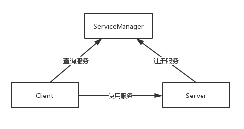

<h1 align="center">Android Binder原理（二）ServiceManager中的Binder机制</h1>

### **前言**

在上一篇文章中，我们了解了学习Binder前必须要了解的知识点，其中有一点就是Binder机制的三个部分：Java Binder、Native Binder、Kernel Binder，其中Java Binder和Native Binder都是应用开发需要掌握的。Java Binder是需要借助Native Binder来工作的，因此需要先了解Native Binder，Native Binder架构的原型就是基于Binder通信的C/S架构，因此我们先从它开始入手。源码是基于Android 9.0。

### **1.基于Binder通信的C/S架构**

在Android系统中，Binder进程间的通信的使用是很普遍的，在Android进阶三部曲第一部的最后一章，我讲解了MediaPlayer框架，这个框架基于C/S架构，并采用Binder来进行进程间通信，如下图所示。




从图中可以看出，除了常规C/S架构的Client端和Server端，还包括了ServiceManager，它用于管理系统中的服务。 首先Server进程会注册一些Service到ServiceManager中，Client要使用某个Service，则需要先到ServiceManager查询Service的相关信息，然后根据Service的相关信息与Service所在的Server进程建立通信通路，这样Client就可以使用Service了。

### **2.MediaServer的main函数**

Client、Server、ServiceManager三者的交互都是基于Binder通信的，那么任意两者的交互都可以说明Binder的通信的原理，可以说Native Binder的原理的核心就是ServiceManager的原理，为了更好的了解ServiceManager，这里拿MediaPlayer框架来举例，它也是学习多媒体时必须要掌握的知识点。

MediaPlayer框架的简单框架图如下所示。


可以看到，MediaPlayer和MediaPlayerService是通过Binder来进行通信的，MediaPlayer是Client端，MediaPlayerService是Server端，MediaPlayerService是系统多媒体服务的一种，系统多媒体服务是由一个叫做MediaServer的服务进程提供的，它是一个可执行程序，在Android系统启动时，MediaServer也被启动，它的入口函数如下所示。 **frameworks/av/media/mediaserver/main_mediaserver.cpp**


```
int main(int argc __unused, char **argv __unused)
{
    signal(SIGPIPE, SIG_IGN);
    //获取ProcessState实例
    sp<ProcessState> proc(ProcessState::self());//1
    sp<IServiceManager> sm(defaultServiceManager());//2
    ALOGI("ServiceManager: %p", sm.get());
    InitializeIcuOrDie();
    //注册MediaPlayerService
    MediaPlayerService::instantiate();//3
    ResourceManagerService::instantiate();
    registerExtensions();
    //启动Binder线程池
    ProcessState::self()->startThreadPool();
    //当前线程加入到线程池
    IPCThreadState::self()->joinThreadPool();
}
```

注释1处用于获取ProcessState实例，在这一过程中会打开/dev/binder设备，并使用mmap为Binder驱动分配一个虚拟地址空间用来接收数据。 注释2处用来得到一个IServiceManager，通过这个IServiceManager，其他进程就可以和当前的ServiceManager进行交互，这里就用到了Binder通信。 注释3处用来注册MediaPlayerService。 除了注释3处的知识点在下一篇文章进行介绍，注释1和注释2处的内容，本篇文章会分别来进行介绍，先看ProcessState实例。

### **3.每个进程唯一的ProcessState**

ProcessState从名称就可以看出来，用于代表进程的状态，先来查看上一小节的ProcessState的self函数。 **frameworks/native/libs/binder/ProcessState.cpp**

```
sp<ProcessState> ProcessState::self()
{
    Mutex::Autolock _l(gProcessMutex);
    if (gProcess != NULL) {
        return gProcess;
    }
    gProcess = new ProcessState("/dev/binder");//1
    return gProcess;
}
```

这里采用了单例模式，确保每个进程只有一个ProcessState实例。注释1处用于创建一个ProcessState实例，参数为/dev/binder。接着来查看ProcessState的构造函数，代码如下所示。 **frameworks/native/libs/binder/ProcessState.cpp**

```
ProcessState::ProcessState(const char *driver)
    : mDriverName(String8(driver))
    , mDriverFD(open_driver(driver))//1
    , mVMStart(MAP_FAILED)
    , mThreadCountLock(PTHREAD_MUTEX_INITIALIZER)
    , mThreadCountDecrement(PTHREAD_COND_INITIALIZER)
    , mExecutingThreadsCount(0)
    , mMaxThreads(DEFAULT_MAX_BINDER_THREADS)
    , mStarvationStartTimeMs(0)
    , mManagesContexts(false)
    , mBinderContextCheckFunc(NULL)
    , mBinderContextUserData(NULL)
    , mThreadPoolStarted(false)
    , mThreadPoolSeq(1)
{
    if (mDriverFD >= 0) {
        mVMStart = mmap(0, BINDER_VM_SIZE, PROT_READ, MAP_PRIVATE | MAP_NORESERVE, mDriverFD, 0);//2
        if (mVMStart == MAP_FAILED) {
            // *sigh*
            ALOGE("Using %s failed: unable to mmap transaction memory.\n", mDriverName.c_str());
            close(mDriverFD);
            mDriverFD = -1;
            mDriverName.clear();
        }
    }
    LOG_ALWAYS_FATAL_IF(mDriverFD < 0, "Binder driver could not be opened.  Terminating.");
}
```

ProcessState的构造函数中调用了很多函数，需要注意的是注释1处，它用来打开/dev/binder设备。 注释2处的mmap函数，它会在内核虚拟地址空间中申请一块与用户虚拟内存相同大小的内存，然后再申请物理内存，将同一块物理内存分别映射到内核虚拟地址空间和用户虚拟内存空间，实现了内核虚拟地址空间和用户虚拟内存空间的数据同步操作，也就是内存映射。 mmap函数用于对Binder设备进行内存映射，除了它还有open、ioctl函数，来看看它们做了什么。 注释1处的open_driver函数的代码如下所示。 **frameworks/native/libs/binder/ProcessState.cpp**

```
static int open_driver(const char *driver)
{
    int fd = open(driver, O_RDWR | O_CLOEXEC);//1
    if (fd >= 0) {
        ...
        size_t maxThreads = DEFAULT_MAX_BINDER_THREADS;
        result = ioctl(fd, BINDER_SET_MAX_THREADS, &maxThreads);//2
        if (result == -1) {
            ALOGE("Binder ioctl to set max threads failed: %s", strerror(errno));
        }
    } else {
        ALOGW("Opening '%s' failed: %s\n", driver, strerror(errno));
    }
    return fd;
}
```

注释1处用于打开/dev/binder设备并返回文件操作符fd，这样就可以操作内核的Binder驱动了。注释2处的ioctl函数的作用就是和Binder设备进行参数的传递，这里的ioctl函数用于设定binder支持的最大线程数为15（maxThreads的值为15）。最终open_driver函数返回文件操作符fd。

ProcessState就分析倒这里，总的来说它做了以下几个重要的事： 1.打开/dev/binder设备并设定Binder最大的支持线程数。 2.通过mmap为binder分配一块虚拟地址空间，达到内存映射的目的。

### **4.ServiceManager中的Binder机制**

回到第一小节的MediaServer的入口函数，在注释2处调用了defaultServiceManager函数。 **frameworks/native/libs/binder/IServiceManager.cpp**

```
sp<IServiceManager> defaultServiceManager()
{
    if (gDefaultServiceManager != NULL) return gDefaultServiceManager;

    {
        AutoMutex _l(gDefaultServiceManagerLock);
        while (gDefaultServiceManager == NULL) {
            gDefaultServiceManager = interface_cast<IServiceManager>(
                ProcessState::self()->getContextObject(NULL));//1
            if (gDefaultServiceManager == NULL)
                sleep(1);
        }
    }

    return gDefaultServiceManager;
}
```

从IServiceManager所在的文件路径就可以知道，ServiceManager中不仅仅使用了Binder通信，它自身也是属于Binder体系的。defaultServiceManager中同样使用了单例，注释1处的interface_cast函数生成了gDefaultServiceManager，其内部调用了ProcessState的getContextObject函数，代码如下所示。 **frameworks/native/libs/binder/ProcessState.cpp**

```
sp<IBinder> ProcessState::getContextObject(const sp<IBinder>& /*caller*/)
{
    return getStrongProxyForHandle(0);
}

sp<IBinder> ProcessState::getStrongProxyForHandle(int32_t handle)
{
    sp<IBinder> result;
    AutoMutex _l(mLock);
    handle_entry* e = lookupHandleLocked(handle);//1
    if (e != NULL) {
        IBinder* b = e->binder;
        if (b == NULL || !e->refs->attemptIncWeak(this)) {
            if (handle == 0) {
                Parcel data;
                status_t status = IPCThreadState::self()->transact(
                        0, IBinder::PING_TRANSACTION, data, NULL, 0);
                if (status == DEAD_OBJECT)
                   return NULL;
            }
            b = BpBinder::create(handle);//2
            e->binder = b;
            if (b) e->refs = b->getWeakRefs();
            result = b;
        } else {
            result.force_set(b);
            e->refs->decWeak(this);
        }
    }

    return result;
}
```

getContextObject函数中直接调用了getStrongProxyForHandle函数，注意它的参数的值为0，那么handle的值就为0，handle是一个资源标识。注释1处查询这个资源标识对应的资源（handle_entry）是否存在，如果不存在就会在注释2处新建BpBinder，并在注释3处赋值给 handle_entry的binder。最终返回的result的值为BpBinder。

#### **4.1 BpBinder和BBinder**

说到BpBinder，不得不提到BBinder，它们是Binder通信的“双子星”，都继承了IBinder。BpBinder是Client端与Server交互的代理类，而BBinder则代表了Server端。BpBinder和BBinder是一一对应的，BpBinder会通过handle来找到对应的BBinder。 我们知道在ServiceManager中创建了BpBinder，通过handle(值为0)可以找到对应的BBinder。


分析完了ProcessState的getContextObject函数，回到interface_cast函数：

```
 gDefaultServiceManager = interface_cast<IServiceManager>(
                ProcessState::self()->getContextObject(NULL));
```

interface_cast具体实现如下所示。 **frameworks/native/libs/binder/include/binder/IInterface.h**

```
template<typename INTERFACE>
inline sp<INTERFACE> interface_cast(const sp<IBinder>& obj)
{
    return INTERFACE::asInterface(obj);
}
```

当前的场景中，INTERFACE的值为IServiceManager，那么替换后代码如下所示。

```
inline sp<IServiceManager> interface_cast(const sp<IBinder>& obj)
{
    return IServiceManager::asInterface(obj);
}
```

我们接着来分析IServiceManager。

#### **4.2 解密IServiceManager**

BpBinder和BBinder负责Binder的通信，而IServiceManager用于处理ServiceManager的业务，IServiceManager是C++代码，因此它的定义在IServiceManager.h中。 **frameworks/native/libs/binder/include/binder/IServiceManager.h**

```
class IServiceManager : public IInterface
{
public:
    DECLARE_META_INTERFACE(ServiceManager)//1
    ...
    //一些操作Service的函数
    virtual sp<IBinder>         getService( const String16& name) const = 0;
    virtual sp<IBinder>         checkService( const String16& name) const = 0;
    virtual status_t addService(const String16& name, const sp<IBinder>& service,
                                bool allowIsolated = false,
                                int dumpsysFlags = DUMP_FLAG_PRIORITY_DEFAULT) = 0;
    virtual Vector<String16> listServices(int dumpsysFlags = DUMP_FLAG_PRIORITY_ALL) = 0;
    enum {
        GET_SERVICE_TRANSACTION = IBinder::FIRST_CALL_TRANSACTION,
        CHECK_SERVICE_TRANSACTION,
        ADD_SERVICE_TRANSACTION,
        LIST_SERVICES_TRANSACTION,
    };
};
```

可以看到IServiceManager继承了IInterface，其内部定义了一些常量和一些操作Service的函数，在注释1处调用了DECLARE_META_INTERFACE宏，它的定义在IInterface.h中。 **frameworks/native/libs/binder/include/binder/IInterface.h**

```
#define DECLARE_META_INTERFACE(INTERFACE)                               \
    static const ::android::String16 descriptor;                        \
    static ::android::sp<I##INTERFACE> asInterface(                     \
            const ::android::sp<::android::IBinder>& obj);              \
    virtual const ::android::String16& getInterfaceDescriptor() const;  \
    I##INTERFACE();                                                     \
    virtual ~I##INTERFACE();     
```

其中INTERFACE的值为ServiceManager，那么经过替换后的代码如下所示。

```
    static const ::android::String16 descriptor;       
    //定义asInterface函数
    static ::android::sp<IServiceManager> asInterface(                    
            const ::android::sp<::android::IBinder>& obj);            
    virtual const ::android::String16& getInterfaceDescriptor() const;  
    //定义IServiceManager构造函数
    IServiceManager();          
    //定义IServiceManager析构函数
    virtual ~IServiceManager();     
```

从DECLARE_META_INTERFACE宏的名称和上面的代码中，可以发现它主要声明了一些函数和一个变量。那么这些函数和变量的实现在哪呢？答案还是在IInterface.h中，叫做IMPLEMENT_META_INTERFACE宏，代码如下所示/ **frameworks/native/libs/binder/include/binder/IInterface.h**

```
#define IMPLEMENT_META_INTERFACE(INTERFACE, NAME)                       \
    const ::android::String16 I##INTERFACE::descriptor(NAME);           \
    const ::android::String16&                                          \
            I##INTERFACE::getInterfaceDescriptor() const {              \
        return I##INTERFACE::descriptor;                                \
    }                                                                   \
    ::android::sp<I##INTERFACE> I##INTERFACE::asInterface(              \
            const ::android::sp<::android::IBinder>& obj)               \
    {                                                                   \
        ::android::sp<I##INTERFACE> intr;                               \
        if (obj != NULL) {                                              \
            intr = static_cast<I##INTERFACE*>(                          \
                obj->queryLocalInterface(                               \
                        I##INTERFACE::descriptor).get());               \
            if (intr == NULL) {                                         \
                intr = new Bp##INTERFACE(obj);                          \
            }                                                           \
        }                                                               \
        return intr;                                                    \
    }                                                                   \
    I##INTERFACE::I##INTERFACE() { }                                    \
    I##INTERFACE::~I##INTERFACE() { }                                   \
```

DECLARE_META_INTERFACE宏和IMPLEMENT_META_INTERFACE宏是配合使用的，很多系统服务都使用了它们，IServiceManager使用IMPLEMENT_META_INTERFACE宏只有一行代码，如下所示。 **frameworks/native/libs/binder/IServiceManager.cpp**

```
IMPLEMENT_META_INTERFACE(ServiceManager, "android.os.IServiceManager");
```

IMPLEMENT_META_INTERFACE宏的INTERFACE值为ServiceManager，NAME值为"android.os.IServiceManager"，进行替换后的代码如下所示。

```
    const ::android::String16 IServiceManager::descriptor("android.os.IServiceManager");          
    const ::android::String16&                                          
            IServiceManager::getInterfaceDescriptor() const {              
        return IServiceManager::descriptor;                                
    } 
     //实现了asInterface函数
    ::android::sp<IServiceManager> IServiceManager::asInterface(              
            const ::android::sp<::android::IBinder>& obj)               
    {                                                                   
        ::android::sp<IServiceManager> intr;                               
        if (obj != NULL) {                                              
            intr = static_cast<IServiceManager>(                          
                obj->queryLocalInterface(                               
                        IServiceManager::descriptor).get());               
            if (intr == NULL) {                                         
                intr = new BpServiceManager(obj);//1                        
            }                                                           
        }                                                               
        return intr;                                                    
    }                                                                   
    IServiceManager::IServiceManager() { }                                    
    IServiceManager::~IServiceManager() { }                                   
```

关键的点就在于注释1处，新建了一个BpServiceManager，传入的参数obj的值为BpBinder。看到这里，我们也就明白了，asInterface函数就是用BpBinder为参数创建了BpServiceManager，从而推断出interface_cast函数创建了BpServiceManager，再往上推断，IServiceManager的defaultServiceManager函数返回的就是BpServiceManager。 BpServiceManager有什么作用呢，先从BpServiceManager的构造函数看起。 **frameworks/native/libs/binder/IServiceManager.cpp**

```
class BpServiceManager : public BpInterface<IServiceManager>
{
public:
    explicit BpServiceManager(const sp<IBinder>& impl)
        : BpInterface<IServiceManager>(impl)
    {
    }
...
}
```

impl的值其实就是BpBinder，BpServiceManager的构造函数调用了基类BpInterface的构造函数。 **frameworks/native/libs/binder/include/binder/IInterface.h**

```
template<typename INTERFACE>
class BpInterface : public INTERFACE, public BpRefBase
{
...
};
```

BpInterface继承了BpRefBase，BpRefBase的实现如下所示。 **frameworks/native/libs/binder/Binder.cpp**

```
BpRefBase::BpRefBase(const sp<IBinder>& o)
    : mRemote(o.get()), mRefs(NULL), mState(0)
{
    extendObjectLifetime(OBJECT_LIFETIME_WEAK);

    if (mRemote) {
        mRemote->incStrong(this);           
        mRefs = mRemote->createWeak(this);  
    }
}
```

mRemote是一个IBinder* 指针，它最终的指向为BpBinder，也就是说BpServiceManager的mRemote指向了BpBinder。那么BpServiceManager的作用也就知道了，就是它实现了IServiceManager，并且通过BpBinder来实现通信。

#### **4.3 IServiceManager家族**

可能上面讲的会让你有些头晕，这是因为对各个类的关系不大明确，通过下图也许你就会豁然开朗。


1.BpBinder和BBinder都和通信有关，它们都继承自IBinder。 2.BpServiceManager派生自IServiceManager，它们都和业务有关。 3.BpRefBase包含了mRemote，通过不断的派生，BpServiceManager也同样包含mRemote，它指向了BpBinder，通过BpBinder来实现通信。

### **5.小节**

本篇文章我们学到了Binder通信的C/S架构，也知道了Native Binder的原理的核心其实就是ServiceManager的原理，为了讲解ServiceManager的原理，我们需要一个框架来举例，那就是MediaPlayer框架。在讲解MediaServer的入口函数时，我们遇到了三个问题，其中前两个问题相关的知识点ProcessState和IServiceManager都讲解到了，下一篇文章会讲解第三个问题，MediaPlayerService是如何注册的。

链接：https://juejin.cn/post/6844903989830483975