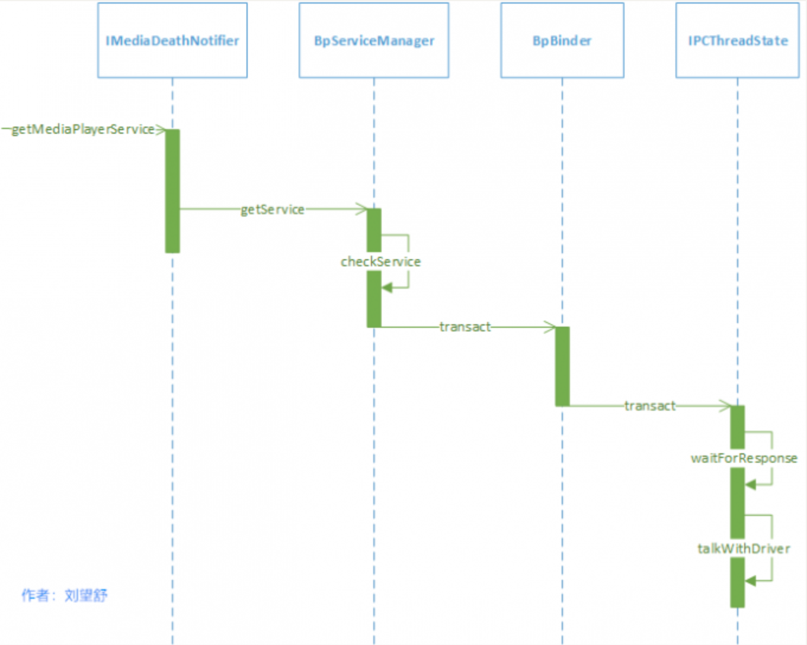
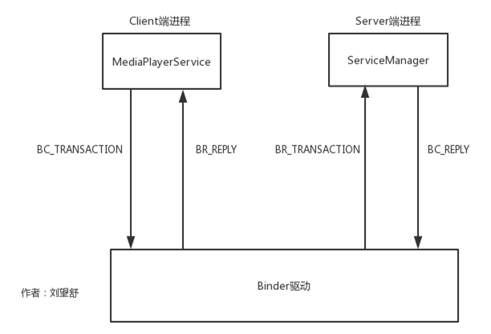

<h1 align="center">Android Binder原理（五）系统服务的获取过程</h1>

### **前言**

在本系列的此前文章中，以MediaPlayerService为例，讲解了系统服务是如何注册的（addService），既然有注册那肯定也要有获取，本篇文章仍旧以MediaPlayerService为例，来讲解系统服务的获取过程（getService）。文章会分为两个部分进行讲解，分别是客户端MediaPlayerService请求获取服务和服务端ServiceManager处理请求，先来学习第一部分。

### **1.客户端MediaPlayerService请求获取服务**

要想获取MediaPlayerService，需要先调用getMediaPlayerService函数，如下所示。
frameworks/av/media/libmedia/IMediaDeathNotifier.cpp

```
CPP
IMediaDeathNotifier::getMediaPlayerService()
{
    ALOGV("getMediaPlayerService");
    Mutex::Autolock _l(sServiceLock);
    if (sMediaPlayerService == 0) {
        sp<IServiceManager> sm = defaultServiceManager();//1
        sp<IBinder> binder;
        do {
            binder = sm->getService(String16("media.player"));//2
            if (binder != 0) {//3
                break;
            }
            ALOGW("Media player service not published, waiting...");
            usleep(500000); //4
        } while (true);

        if (sDeathNotifier == NULL) {
            sDeathNotifier = new DeathNotifier();
        }
        binder->linkToDeath(sDeathNotifier);
        sMediaPlayerService = interface_cast<IMediaPlayerService>(binder);//5
    }
    ALOGE_IF(sMediaPlayerService == 0, "no media player service!?");
    return sMediaPlayerService;
}
```

注释1处的defaultServiceManager返回的是BpServiceManager，注释2处获取名为”media.player”的系统服务（MediaPlayerService），返回的值为BpBinder。由于这个时候MediaPlayerService可能还没有向ServiceManager注册，那么就不能满足注释3的条件，在注释4处休眠0.5s后继续调用getService函数，直到获取服务对应的为止。
注释5处的interface_cast函数用于将BpBinder转换成BpMediaPlayerService，其原理就是通过BpBinder的handle来找到对应的服务，即BpMediaPlayerService。

注释2处的获取服务是本文的重点，BpServiceManager的getService函数如下所示。
**frameworks/native/libs/binder/IServiceManager.cpp::BpServiceManager**

```
CPP
virtual sp<IBinder> getService(const String16& name) const
   {
      ...
       int n = 0;
       while (uptimeMillis() < timeout) {
           n++;
           if (isVendorService) {
               ALOGI("Waiting for vendor service %s...", String8(name).string());
               CallStack stack(LOG_TAG);
           } else if (n%10 == 0) {
               ALOGI("Waiting for service %s...", String8(name).string());
           }
           usleep(1000*sleepTime);

           sp<IBinder> svc = checkService(name);//1
           if (svc != NULL) return svc;
       }
       ALOGW("Service %s didn't start. Returning NULL", String8(name).string());
       return NULL;
   }
```

getService函数中主要做的事就是循环的查询服务是否存在，如果不存在就继续查询，查询服务用到了注释1处的checkService函数，代码如下所示。
**frameworks/native/libs/binder/IServiceManager.cpp::BpServiceManager**

```
CPP
virtual sp<IBinder> checkService( const String16& name) const
{
    Parcel data, reply;//1
    data.writeInterfaceToken(IServiceManager::getInterfaceDescriptor());
    data.writeString16(name);//2
    remote()->transact(CHECK_SERVICE_TRANSACTION, data, &reply);//3
    return reply.readStrongBinder();
}
```

注释1处的data，看过上一篇文章的同学应该很熟悉，它出现在BpServiceManager的addService函数中，data是一个数据包，后面会不断的将数据写入到data中。注释2处将字符串”media.player”写入到data中。
注释3处的remote()指的是mRemote，也就是BpBinder，BpBinder的transact函数如下所示。

**frameworks/native/libs/binder/BpBinder.cpp**

```
CPP
status_t BpBinder::transact(
    uint32_t code, const Parcel& data, Parcel* reply, uint32_t flags)
{
    if (mAlive) {
        status_t status = IPCThreadState::self()->transact(
            mHandle, code, data, reply, flags);
        if (status == DEAD_OBJECT) mAlive = 0;
        return status;
    }

    return DEAD_OBJECT;
}
```

BpBinder将逻辑处理交给IPCThreadState，后面的调用链在=[Android Binder原理（三）系统服务的注册过程](http://liuwangshu.cn/framework/binder/3-addservice.html)中讲过，这里再次简单的过一遍，IPCThreadState::self()会创建创建IPCThreadState，IPCThreadState的transact函数如下所示。
**frameworks/native/libs/binder/IPCThreadState.cpp**

```
CPP
status_t IPCThreadState::transact(int32_t handle,
                                  uint32_t code, const Parcel& data,
                                  Parcel* reply, uint32_t flags)
{
    status_t err;

    flags |= TF_ACCEPT_FDS;
    ...
    err = writeTransactionData(BC_TRANSACTION, flags, handle, code, data, NULL);//1

    if (err != NO_ERROR) {
        if (reply) reply->setError(err);
        return (mLastError = err);
    }

    if ((flags & TF_ONE_WAY) == 0) {
       ...
        if (reply) {
            err = waitForResponse(reply);//2
        } else {
            Parcel fakeReply;
            err = waitForResponse(&fakeReply);
        }
       ...
    } else {
       //不需要等待reply的分支
        err = waitForResponse(NULL, NULL);
    }

    return err;
}
```

调用BpBinder的transact函数实际上就是调用IPCThreadState的transact函数。注释1处的writeTransactionData函数用于传输数据，其中第一个参数BC_TRANSACTION代表向Binder驱动发送命令协议。
注释1处的writeTransactionData用于准备发送的数据，其内部会将BC_TRANSACTION和binder_transaction_data结构体写入到mOut中。
接着查看waitForResponse函数做了什么，代码如下所示。
**frameworks/native/libs/binder/IPCThreadState.cpp**

```
CPP
status_t IPCThreadState::waitForResponse(Parcel *reply, status_t *acquireResult)
{
    uint32_t cmd;
    int32_t err;
    while (1) {
        if ((err=talkWithDriver()) < NO_ERROR) break;//1
        err = mIn.errorCheck();
        if (err < NO_ERROR) break;
        if (mIn.dataAvail() == 0) continue;
        cmd = (uint32_t)mIn.readInt32();
        IF_LOG_COMMANDS() {
            alog << "Processing waitForResponse Command: "
                << getReturnString(cmd) << endl;
        }
        switch (cmd) {
        case BR_TRANSACTION_COMPLETE:
            if (!reply && !acquireResult) goto finish;
            break;
       ...
        default:
            //处理各种命令协议
            err = executeCommand(cmd);
            if (err != NO_ERROR) goto finish;
            break;
        }
}
finish:
    ...
    return err;
}
```

注释1处的talkWithDriver函数的内部通过ioctl与Binder驱动进行通信，代码如下所示。
**frameworks/native/libs/binder/IPCThreadState.cpp**

```
CPP
status_t IPCThreadState::talkWithDriver(bool doReceive)
{
    if (mProcess->mDriverFD <= 0) {
        return -EBADF;
    }
    //和Binder驱动通信的结构体
    binder_write_read bwr; //1
    //mIn是否有可读的数据，接收的数据存储在mIn
    const bool needRead = mIn.dataPosition() >= mIn.dataSize();
    const size_t outAvail = (!doReceive || needRead) ? mOut.dataSize() : 0;
    bwr.write_size = outAvail;
    bwr.write_buffer = (uintptr_t)mOut.data();//2
    //这时doReceive的值为true
    if (doReceive && needRead) {
        bwr.read_size = mIn.dataCapacity();
        bwr.read_buffer = (uintptr_t)mIn.data();//3
    } else {
        bwr.read_size = 0;
        bwr.read_buffer = 0;
    }
   ...
    if ((bwr.write_size == 0) && (bwr.read_size == 0)) return NO_ERROR;
    bwr.write_consumed = 0;
    bwr.read_consumed = 0;
    status_t err;
    do {
        IF_LOG_COMMANDS() {
            alog << "About to read/write, write size = " << mOut.dataSize() << endl;
        }
#if defined(__ANDROID__)
        if (ioctl(mProcess->mDriverFD, BINDER_WRITE_READ, &bwr) >= 0)//4
            err = NO_ERROR;
        else
            err = -errno;
#else
        err = INVALID_OPERATION;
#endif
     ...
    } while (err == -EINTR);
    ...
    return err;
}
```

注释1处的 binder_write_read是和Binder驱动通信的结构体，在注释2和3处将mOut、mIn赋值给binder_write_read的相应字段，最终通过注释4处的ioctl函数和Binder驱动进行通信。这一过程的时序图如下所示。


这时我们需要再次查看[Android Binder原理（三）系统服务的注册过程](http://liuwangshu.cn/framework/binder/3-addservice.html)这篇文章第2小节给出的图。


从这张简化的流程图可以看出，我们当前分析的是客户端进程的流程，当MediaPlayerService向Binder驱动发送BC_TRANSACTION命令后，Binder驱动会向ServiceManager发送BR_TRANSACTION命令，接下来我们来查看服务端ServiceManager是如何处理获取服务这一请求的。

### **2.服务端ServiceManager处理请求**

说到服务端ServiceManager处理请求，不得不说到ServiceManager的启动过程，具体的请看[Android Binder原理（四）ServiceManager的启动过程](http://liuwangshu.cn/framework/binder/4-servicemanager-start.html) 这篇文章。
这里简单回顾servicemanager的入口函数，如下所示。

**frameworks/native/cmds/servicemanager/service_manager.c**

```
CPP
int main(int argc, char** argv)
{
   ...
    bs = binder_open(driver, 128*1024);
    ...
    if (binder_become_context_manager(bs)) {
        ALOGE("cannot become context manager (%s)\n", strerror(errno));
        return -1;
    }
    ...
    if (getcon(&service_manager_context) != 0) {
        ALOGE("SELinux: Failed to acquire service_manager context. Aborting.\n");
        abort();
    }
    binder_loop(bs, svcmgr_handler);//1
    return 0;
}
```

main函数主要做了三件事，其中最后一件事就是调用binder_loop函数，这里需要注意，它的第二个参数为svcmgr_handler，后面会再次提到svcmgr_handler。
binder_loop函数如下所示。
**frameworks/native/cmds/servicemanager/binder.c**

```
CPP
void binder_loop(struct binder_state *bs, binder_handler func)
{
...
    for (;;) {
        bwr.read_size = sizeof(readbuf);
        bwr.read_consumed = 0;
        bwr.read_buffer = (uintptr_t) readbuf;

        res = ioctl(bs->fd, BINDER_WRITE_READ, &bwr);

        if (res < 0) {
            ALOGE("binder_loop: ioctl failed (%s)\n", strerror(errno));
            break;
        }
        res = binder_parse(bs, 0, (uintptr_t) readbuf, bwr.read_consumed, func);
        if (res == 0) {
            ALOGE("binder_loop: unexpected reply?!\n");
            break;
        }
        if (res < 0) {
            ALOGE("binder_loop: io error %d %s\n", res, strerror(errno));
            break;
        }
    }
}
```

在无限循环中不断的调用ioctl函数，它不断的使用BINDER_WRITE_READ指令查询Binder驱动中是否有新的请求，如果有就交给binder_parse函数处理。如果没有，当前线程就会在Binder驱动中睡眠，等待新的进程间通信请求。
binder_parse函数如下所示。
**frameworks/native/cmds/servicemanager/binder.c**

```
CPP
int binder_parse(struct binder_state *bs, struct binder_io *bio,
                 uintptr_t ptr, size_t size, binder_handler func)
{
    int r = 1;
    uintptr_t end = ptr + (uintptr_t) size;

    while (ptr < end) {
        uint32_t cmd = *(uint32_t *) ptr;
        ptr += sizeof(uint32_t);
#if TRACE
        fprintf(stderr,"%s:\n", cmd_name(cmd));
#endif
        switch(cmd) {
        ...
        case BR_TRANSACTION: {
            struct binder_transaction_data *txn = (struct binder_transaction_data *) ptr;
            if ((end - ptr) < sizeof(*txn)) {
                ALOGE("parse: txn too small!\n");
                return -1;
            }
            binder_dump_txn(txn);
            if (func) {
                unsigned rdata[256/4];
                struct binder_io msg;
                struct binder_io reply;
                int res;

                bio_init(&reply, rdata, sizeof(rdata), 4);
                bio_init_from_txn(&msg, txn);
                res = func(bs, txn, &msg, &reply);//1
                if (txn->flags & TF_ONE_WAY) {
                    binder_free_buffer(bs, txn->data.ptr.buffer);
                } else {
                    binder_send_reply(bs, &reply, txn->data.ptr.buffer, res);
                }
            }
            ptr += sizeof(*txn);
            break;
        }
        ...
    }

    return r;
}
```

这里截取了BR_TRANSACTION命令的处理部分，注释1出的func通过一路传递指向的是svcmgr_handler，svcmgr_handler函数如下所示。
**frameworks/native/cmds/servicemanager/service_manager.c**

```
CPP
int svcmgr_handler(struct binder_state *bs,
                   struct binder_transaction_data *txn,
                   struct binder_io *msg,
                   struct binder_io *reply)
{
    ...
    switch(txn->code) {
    case SVC_MGR_GET_SERVICE:
    case SVC_MGR_CHECK_SERVICE:
        s = bio_get_string16(msg, &len);
        if (s == NULL) {
            return -1;
        }
        handle = do_find_service(s, len, txn->sender_euid, txn->sender_pid);
        if (!handle)
            break;
        bio_put_ref(reply, handle);
        return 0;

   ...
    default:
        ALOGE("unknown code %d\n", txn->code);
        return -1;
    }

    bio_put_uint32(reply, 0);
    return 0;
}
```

当要获取服务时，会调用do_find_service函数，代码如下所示。
**frameworks/native/cmds/servicemanager/service_manager.c**

```
CPP
uint32_t do_find_service(const uint16_t *s, size_t len, uid_t uid, pid_t spid)
{
    struct svcinfo *si = find_svc(s, len);//1

    if (!si || !si->handle) {
        return 0;
    }

    if (!si->allow_isolated) {
        uid_t appid = uid % AID_USER;
        if (appid >= AID_ISOLATED_START && appid <= AID_ISOLATED_END) {
            return 0;
        }
    }
    if (!svc_can_find(s, len, spid, uid)) {
        return 0;
    }

    return si->handle;
}
```

注释1处的find_svc函数用于查询服务，返回的svcinfo是一个结构体，其内部包含了服务的handle值，最终会返回服务的handle值。接着来看find_svc函数：
**frameworks/native/cmds/servicemanager/service_manager.c**

```
CPP
struct svcinfo *find_svc(const uint16_t *s16, size_t len)
{
    struct svcinfo *si;

    for (si = svclist; si; si = si->next) {
        if ((len == si->len) &&
            !memcmp(s16, si->name, len * sizeof(uint16_t))) {
            return si;
        }
    }
    return NULL;
}
```

系统服务的注册流程中，在Kernel Binder中会调用do_add_service函数，其内部会将包含服务名和handle值的svcinfo保存到svclist列表中。同样的，在获取服务的流程中，find_svc函数中会遍历svclist列表，根据服务名查找对应服务是否已经注册，如果已经注册就会返回对应的svcinfo，如果没有注册就返回NULL。

### **总结**

这篇文章将系统服务的获取过程分为两个部分，代码涉及到了Native Binder和Kernel Binder。在下一篇文章中会继续学习Java Binder相关的内容。


来源：

http://liuwangshu.cn/framework/binder/5-getservice.html