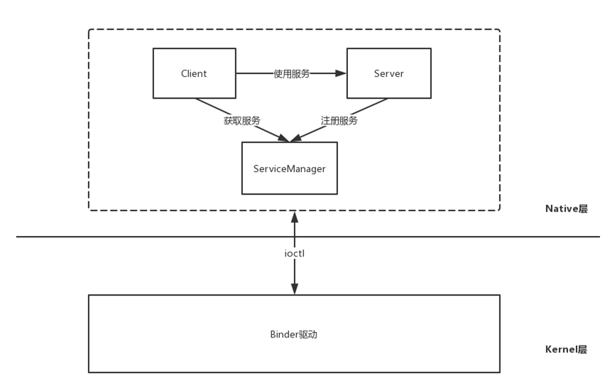
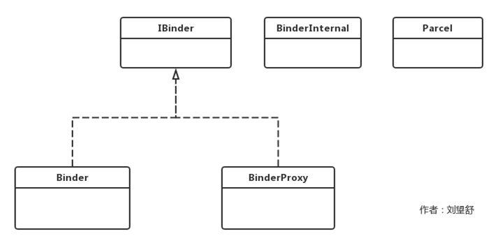

<h1 align="center">Android Binder原理（六）Java Binder的初始化</h1>

### **前言**

在[Android Binder原理（一）学习Binder前必须要了解的知识点](http://liuwangshu.cn/framework/binder/1-intro.html)这篇文章中，我根据Android系统的分层，将Binder机制分为了三层：

1. Java Binder (对应Framework层的Binder)
2. Native Binder(对应Native层的Binder)
3. Kernel Binder(对应Kernel层的Binder)

在此前的文章中，我一直都在介绍Native Binder和Kernel Binder的内容，它们的架构简单总结为下图。



在[Android Binder原理（二）ServiceManager中的Binder机制](http://liuwangshu.cn/framework/binder/2-servicemanager-binder.html)这篇文章中，我讲过BpBinder是Client端与Server交互的代理类，而BBinder则代表了Server端，那么上图就可以改为：

从上图可以看到，Native Binder实际是基于C/S架构，Bpinder是Client端，BBinder是Server端，在[Android Binder原理（四）ServiceManager的启动过程](http://liuwangshu.cn/framework/binder/4-servicemanager-start.html)这篇文章中，我们得知Native Binder通过ioctl函数和Binder驱动进行数据交互。
Java Binder是需要借助Native Binder来进行工作的，因此Java Binder在设计上也是一个C/S架构，可以说Java Binder是Native Binder的一个镜像，所以在学习Java Binder前，最好先要学习此前文章讲解的Native Binder的内容。本篇文章先来讲解Java Binder是如何初始化的，即Java Binder的JNI注册。

### **1.Java Binder的JNI注册**

Java Binder要想和Native Binder进行通信，需要通过JNI，JNI的注册是在Zygote进程启动过程中注册的，代码如下所示。
**frameworks/base/core/jni/AndroidRuntime.cpp**

```
void AndroidRuntime::start(const char* className, const Vector<String8>& options, bool zygote)
{
    ...
    JniInvocation jni_invocation;
    jni_invocation.Init(NULL);
    JNIEnv* env;
    if (startVm(&mJavaVM, &env, zygote) != 0) {//1
        return;
    }
    onVmCreated(env);
    if (startReg(env) < 0) {
        ALOGE("Unable to register all android natives\n");
        return;
    }
   ...
}
```

注释1处用于启动Java虚拟机，注释2处startReg函数用于完成虚拟机的JNI注册，关于AndroidRuntime的start函数的具体分析见[Android系统启动流程（二）解析Zygote进程启动过程](http://liuwangshu.cn/framework/booting/2-zygote.html)这篇文章。
startReg函数如下所示。
**frameworks/base/core/jni/AndroidRuntime.cpp**

```
/*static*/ int AndroidRuntime::startReg(JNIEnv* env)
{
    ATRACE_NAME("RegisterAndroidNatives");
    androidSetCreateThreadFunc((android_create_thread_fn) javaCreateThreadEtc);

    ALOGV("--- registering native functions ---\n");
    env->PushLocalFrame(200);

    if (register_jni_procs(gRegJNI, NELEM(gRegJNI), env) < 0) {//1
        env->PopLocalFrame(NULL);
        return -1;
    }
    env->PopLocalFrame(NULL);
    return 0;
}
```

注释1处的register_jni_procs函数的作用就是循环调用gRegJNI数组的成员所对应的方法，如下所示。

```
static int register_jni_procs(const RegJNIRec array[], size_t count, JNIEnv* env)
{
    for (size_t i = 0; i < count; i++) {
        if (array[i].mProc(env) < 0) {
#ifndef NDEBUG
            ALOGD("----------!!! %s failed to load\n", array[i].mName);
#endif
            return -1;
        }
    }
    return 0;
}
```

gRegJNI数组中有100多个成员变量：

```
static const RegJNIRec gRegJNI[] = {
    REG_JNI(register_com_android_internal_os_RuntimeInit),
    REG_JNI(register_com_android_internal_os_ZygoteInit_nativeZygoteInit),
    REG_JNI(register_android_os_SystemClock),
    ...
    REG_JNI(register_android_os_Binder),//1
   ...
};    
```

其中REG_JNI是一个宏定义：

```
#define REG_JNI(name)      { name }
struct RegJNIRec {
    int (*mProc)(JNIEnv*);
};
```

实际上就是调用参数名所对应的函数。负责Java Binder和Native Binder通信的函数为注释1处的register_android_os_Binder，代码如下所示。
**frameworks/base/core/jni/android_util_Binder.cpp**

```
int register_android_os_Binder(JNIEnv* env)
{   
    //注册Binder类
    if (int_register_android_os_Binder(env) < 0)
        return -1;
    //注册BinderInternal类        
    if (int_register_android_os_BinderInternal(env) < 0)
        return -1;
    //注册BinderProxy类          
    if (int_register_android_os_BinderProxy(env) < 0)
        return -1;
    ...
    return 0;
}
```

register_android_os_Binder函数做了三件事，分别是:
1.注册Binder类
2.注册BinderInternal类
3.注册BinderProxy类

它们是Java Binder关联类的一小部分，它们的关系如下图所示。



- IBinder接口中定义了很多整型的变量，其中定义一个叫做`FLAG_ONEWAY`的整形变量。客户端发起调用时，客户端一般会阻塞，直到服务端返回结果。设置`FLAG_ONEWAY`后，客户端只需要把请求发送到服务端就可以立即返回，而不需要等待服务端的结果，这是一种非阻塞方式。
- Binder和BinderProxy实现了IBinder接口，Binder是服务端的代表，而BinderProxy是客户端的代表。
- BinderInternal只是在Binder框架中被使用，其内部类GcWatcher用于处理和Binder的垃圾回收。
- Parcel是一个数据包装器，它可以在进程间进行传递，Parcel既可以传递基本数据类型也可以传递Binder对象，Binder通信就是通过Parcel来进行客户端与服务端数据交互。Parcel的实现既有Java部分，也有Native部分，具体实现在Native部分中。

下面分别对Binder、BinderInternal这两个类的注册进行分析。

### **1.1 Binder类的注册**

调用int_register_android_os_Binder函数来完成Binder类的注册，代码如下所示。
**frameworks/base/core/jni/android_util_Binder.cpp**

```
static const JNINativeMethod gBinderMethods[] = {
     /* name, signature, funcPtr */
    { "getCallingPid", "()I", (void*)android_os_Binder_getCallingPid },
    { "getCallingUid", "()I", (void*)android_os_Binder_getCallingUid },
    { "clearCallingIdentity", "()J", (void*)android_os_Binder_clearCallingIdentity },
    { "restoreCallingIdentity", "(J)V", (void*)android_os_Binder_restoreCallingIdentity },
    { "setThreadStrictModePolicy", "(I)V", (void*)android_os_Binder_setThreadStrictModePolicy },
    { "getThreadStrictModePolicy", "()I", (void*)android_os_Binder_getThreadStrictModePolicy },
    { "flushPendingCommands", "()V", (void*)android_os_Binder_flushPendingCommands },
    { "getNativeBBinderHolder", "()J", (void*)android_os_Binder_getNativeBBinderHolder },
    { "getNativeFinalizer", "()J", (void*)android_os_Binder_getNativeFinalizer },
    { "blockUntilThreadAvailable", "()V", (void*)android_os_Binder_blockUntilThreadAvailable }
};
const char* const kBinderPathName = "android/os/Binder";//1
static int int_register_android_os_Binder(JNIEnv* env)
{
    jclass clazz = FindClassOrDie(env, kBinderPathName);//2

    gBinderOffsets.mClass = MakeGlobalRefOrDie(env, clazz);//3
    gBinderOffsets.mExecTransact = GetMethodIDOrDie(env, clazz, "execTransact", "(IJJI)Z");//4
    gBinderOffsets.mObject = GetFieldIDOrDie(env, clazz, "mObject", "J");

    return RegisterMethodsOrDie(
        env, kBinderPathName,
        gBinderMethods, NELEM(gBinderMethods));
}
```

注释1处的kBinderPathName的值为”android/os/Binder”，这是Binder在Java Binder中的全路径名。
注释2处根据这个路径名获取Binder的Class对象，并赋值给jclass类型的变量clazz，clazz是Java层Binder在JNI层的代表。
注释3处通过MakeGlobalRefOrDie函数将本地引用clazz转变为全局引用并赋值给gBinderOffsets.mClass。
注释4处用于找到Java层的Binder的成员方法execTransact并赋值给gBinderOffsets.mExecTransact。
注释5处用于找到Java层的Binder的成员变量mObject并赋值给gBinderOffsets.mObject。
最后一行通过RegisterMethodsOrDie函数注册gBinderMethods中定义的函数，其中gBinderMethods是JNINativeMethod类型的数组，里面存储的是Binder的Native方法（Java层）与JNI层函数的对应关系。

gBinderMethods的定义如下所示。

```
static struct bindernative_offsets_t
{
    jclass mClass;
    jmethodID mExecTransact;
    jfieldID mObject;

} gBinderOffsets;
```

使用gBinderMethods来保存变量和方法有两个原因：
1.为了效率考虑，如果每次调用相关的方法时都需要查询方法和变量，显然效率比较低。
2.这些成员变量和方法都是本地引用，在int int_register_android_os_Binder函数返回时，这些本地引用会被自动释放，因此用gBinderOffsets来保存，以便于后续使用。

对于JNI不大熟悉的同学可以看[Android深入理解JNI（二）类型转换、方法签名和JNIEnv](http://liuwangshu.cn/framework/jni/2-signature-jnienv)这篇文章。

### **1.2 BinderInternal类的注册**

调用int_register_android_os_BinderInternal函数来完成BinderInternal类的注册，代码如下所示。
**frameworks/base/core/jni/android_util_Binder.cpp**

```
const char* const kBinderInternalPathName = "com/android/internal/os/BinderInternal";
static int int_register_android_os_BinderInternal(JNIEnv* env)
{
    jclass clazz = FindClassOrDie(env, kBinderInternalPathName);

    gBinderInternalOffsets.mClass = MakeGlobalRefOrDie(env, clazz);
    gBinderInternalOffsets.mForceGc = GetStaticMethodIDOrDie(env, clazz, "forceBinderGc", "()V");
    gBinderInternalOffsets.mProxyLimitCallback = GetStaticMethodIDOrDie(env, clazz, "binderProxyLimitCallbackFromNative", "(I)V");

    jclass SparseIntArrayClass = FindClassOrDie(env, "android/util/SparseIntArray");
    gSparseIntArrayOffsets.classObject = MakeGlobalRefOrDie(env, SparseIntArrayClass);
    gSparseIntArrayOffsets.constructor = GetMethodIDOrDie(env, gSparseIntArrayOffsets.classObject,
                                                           "<init>", "()V");
    gSparseIntArrayOffsets.put = GetMethodIDOrDie(env, gSparseIntArrayOffsets.classObject, "put",
                                                   "(II)V");

    BpBinder::setLimitCallback(android_os_BinderInternal_proxyLimitcallback);

    return RegisterMethodsOrDie(
        env, kBinderInternalPathName,
        gBinderInternalMethods, NELEM(gBinderInternalMethods));
}
```

和int_register_android_os_Binder函数的实现类似，主要做了三件事：
1.获取BinderInternal在JNI层的代表clazz。
2.将BinderInternal类中有用的成员变量和方法存储到gBinderInternalOffsets中。
3.注册BinderInternal类的Native方法对应的JNI函数。

还有一个BinderProxy类的注册，它和Binder、BinderInternal的注册过程差不多，这里就不再赘述了，有兴趣的读者可以自行去看源码。

来源：

http://liuwangshu.cn/framework/binder/6-java-binder-initialize.html