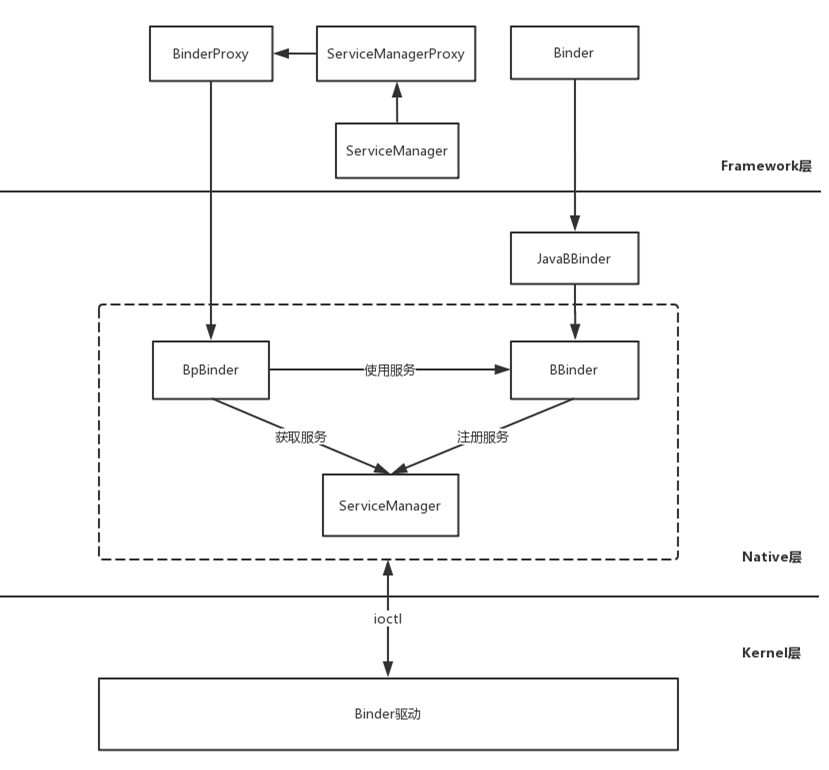

<h1 align="center">Android Binder原理（七）Java Binder中系统服务的注册过程</h1>

### **前言**

在[Android Binder原理（三）系统服务的注册过程](http://liuwangshu.cn/framework/binder/3-addservice.html)这篇文章中，我介绍的是Native Binder中的系统服务的注册过程，这一过程的核心是ServiceManager，而在Java Binder中，也有一个ServiceManager，只不过这个ServiceManager是Java文件。
既然要将系统服务注册到ServiceManager，那么需要选择一个系统服务为例，这里以常见的AMS为例。

### **1.将AMS注册到ServiceManager**

在AMS的setSystemProcess方法中，会调用ServiceManager的addService方法，如下所示。
**frameworks/base/services/core/java/com/android/server/am/ActivityManagerService.java**

```
CPP
public void setSystemProcess() {
    try {
        ServiceManager.addService(Context.ACTIVITY_SERVICE, this, /* allowIsolated= */ true,
                DUMP_FLAG_PRIORITY_CRITICAL | DUMP_FLAG_PRIORITY_NORMAL | DUMP_FLAG_PROTO);//1
       ....
    } catch (PackageManager.NameNotFoundException e) {
        throw new RuntimeException(
                "Unable to find android system package", e);
    }
 ...
}
```

注释1处的`Context.ACTIVITY_SERVICE`的值为”activity”，作用就是将AMS注册到ServiceManager中。接着来看
ServiceManager的addService方法。
**frameworks/base/core/java/android/os/ServiceManager.java**

```
CPP
public static void addService(String name, IBinder service, boolean allowIsolated,
        int dumpPriority) {
    try {
        getIServiceManager().addService(name, service, allowIsolated, dumpPriority);
    } catch (RemoteException e) {
        Log.e(TAG, "error in addService", e);
    }
}
```

主要分析getIServiceManager方法返回的是什么，代码如下所示。
**frameworks/base/core/java/android/os/ServiceManager.java**

```
CPP
private static IServiceManager getIServiceManager() {
     if (sServiceManager != null) {
         return sServiceManager;
     }
     sServiceManager = ServiceManagerNative
             .asInterface(Binder.allowBlocking(BinderInternal.getContextObject()));
     return sServiceManager;
 }
```

讲到这里，已经积累了几个点需要分析，分别是：

- BinderInternal.getContextObject()
- ServiceManagerNative.asInterface()
- getIServiceManager().addService()

现在我们来各个击破它们。

### **1.1 BinderInternal.getContextObject()**

Binder.allowBlocking的作用是将BinderProxy的sWarnOnBlocking值置为false。主要来分析BinderInternal.getContextObject()做了什么，这个方法是一个Native方法，找到它对应的函数：
**frameworks/base/core/jni/android_util_Binder.cpp**

```
CPP
static const JNINativeMethod gBinderInternalMethods[] = {
    { "getContextObject", "()Landroid/os/IBinder;", (void*)android_os_BinderInternal_getContextObject },
   ...
};
```

对应的函数为android_os_BinderInternal_getContextObject：
**frameworks/base/core/jni/android_util_Binder.cpp**

```
CPP
static jobject android_os_BinderInternal_getContextObject(JNIEnv* env, jobject clazz)
{
    sp<IBinder> b = ProcessState::self()->getContextObject(NULL);//1
    return javaObjectForIBinder(env, b);
}
```

ProcessState::self()的作用是创建ProcessState，注释1处最终返回的是BpBinder，不理解的可以查看[Android Binder原理（二）ServiceManager中的Binder机制](https://liuwangshu.cn/framework/binder/2-servicemanager-binder.html)这篇文章。

BpBinder是Native Binder中的Client端，这说明Java层的ServiceManager需要Native层的BpBinder，但是这个BpBinder在Java层是无法直接使用，那么就需要传入javaObjectForIBinder函数来做处理，其内部会创建一个BinderProxy对象，这样我们得知 BinderInternal.getContextObject()最终得到的是BinderProxy。
在[Android Binder原理（六）Java Binder的初始化](https://liuwangshu.cn/framework/binder/6-java-binder-initialize.html)这篇文章我们讲过，BinderProxy是Java Binder的客户端的代表。
需要注意的一点是，这个传入的BpBinder会保存到BinderProxy的成员变量mObject中，后续会再次提到这个点。

### **1.2 ServiceManagerNative.asInterface()**

说到asInterface方法，在Native Binder中也有一个asInterface函数。在[Android Binder原理（二）ServiceManager中的Binder机制](https://liuwangshu.cn/framework/binder/2-servicemanager-binder.html)这篇文章中讲过IServiceManager的asInterface函数，它的作用是用BpBinder做为参数创建BpServiceManager。那么在Java Binder中的asInterface方法的作用又是什么？
**frameworks/base/core/java/android/os/ServiceManagerNative.java**

```
CPP
static public IServiceManager asInterface(IBinder obj)
 {
     if (obj == null) {
         return null;
     }
     IServiceManager in =
         (IServiceManager)obj.queryLocalInterface(descriptor);
     if (in != null) {
         return in;
     }

     return new ServiceManagerProxy(obj);
 }
```

根据1.1小节，我们得知obj的值为BinderProxy，那么asInterface方法的作用就是用BinderProxy作为参数创建ServiceManagerProxy。
BinderProxy和BpBinder分别在Jave Binder和Native Binder作为客户端的代表，BpServiceManager通过BpBinder来实现通信，同样的，ServiceManagerProxy也会将业务的请求交给BinderProxy来处理。
分析到这里，那么：

```
CPP
sServiceManager = ServiceManagerNative
        .asInterface(Binder.allowBlocking(BinderInternal.getContextObject()));
```

可以理解为：

```
CPP
    sServiceManager = new ServiceManagerProxy（BinderProxy);
}
```

### **1.3 getIServiceManager().addService()**

根据1.2节的讲解，getIServiceManager()返回的是ServiceManagerProxy，ServiceManagerProxy是ServiceManagerNative的内部类，它实现了IServiceManager接口。

来查看ServiceManagerProxy的addService方法，
**frameworks/base/core/java/android/os/ServiceManagerNative.java::ServiceManagerProxy**

```
CPP
public void addService(String name, IBinder service, boolean allowIsolated, int dumpPriority)
        throws RemoteException {
    Parcel data = Parcel.obtain();
    Parcel reply = Parcel.obtain();
    data.writeInterfaceToken(IServiceManager.descriptor);
    data.writeString(name);
    data.writeStrongBinder(service);//1
    data.writeInt(allowIsolated ? 1 : 0);
    data.writeInt(dumpPriority);
    mRemote.transact(ADD_SERVICE_TRANSACTION, data, reply, 0);//2
    reply.recycle();
    data.recycle();
}
```

注释1处的data.writeStrongBinder很关键，后续会进行分析。这里又看到了Parcel，它是一个数据包装器，将请求数据写入到Parcel类型的对象data中，通过注释1处的mRemote.transact发送出去，mRemote实际上是BinderProxy，BinderProxy.transact是native函数，实现的函数如下所示。
**frameworks/base/core/jni/android_util_Binder.cpp**

```
CPP
static jboolean android_os_BinderProxy_transact(JNIEnv* env, jobject obj,
        jint code, jobject dataObj, jobject replyObj, jint flags) // throws RemoteException
{
    if (dataObj == NULL) {
        jniThrowNullPointerException(env, NULL);
        return JNI_FALSE;
    }
    Parcel* data = parcelForJavaObject(env, dataObj);//1
    if (data == NULL) {
        return JNI_FALSE;
    }
    Parcel* reply = parcelForJavaObject(env, replyObj);//2
    if (reply == NULL && replyObj != NULL) {
        return JNI_FALSE;
    }
    IBinder* target = getBPNativeData(env, obj)->mObject.get();//3
    if (target == NULL) {
        jniThrowException(env, "java/lang/IllegalStateException", "Binder has been finalized!");
        return JNI_FALSE;
    }
   ...
    status_t err = target->transact(code, *data, reply, flags);//4
    return JNI_FALSE;
}
```

注释1和注释2处，将Java层的Parcel对象转化成为Native层的Parcel对象。在1.1小节中，我们得知BpBinder会保存到BinderProxy的成员变量mObject中，因此在注释3处，从BinderProxy的成员变量mObject中获取BpBinder。最终会在注释4处调用BpBinder的transact函数，向Binder驱动发送数据，可以看出Java Binder是需要Native Binder支持的，最终的目的就是向Binder驱动发送和接收数据。

### **2.引出JavaBBinder**

接着回过头来分析1.3小节遗留下来的data.writeStrongBinder(service)，代码如下所示。
**frameworks/base/core/java/android/os/Parcel.java**

```
CPP
public final void writeStrongBinder(IBinder ll) {
      nativeWriteStrongBinder(mNativePtr, val);
  }
```

nativeWriteStrongBinder是Native方法，实现的函数为android_os_Parcel_writeStrongBinder：
**frameworks/base/core/jni/android_os_Parcel.cpp**

```
CPP
static void android_os_Parcel_writeStrongBinder(JNIEnv* env, jclass clazz, jlong nativePtr, jobject object)
{
    Parcel* parcel = reinterpret_cast<Parcel*>(nativePtr);
    if (parcel != NULL) {
        const status_t err = parcel->writeStrongBinder(ibinderForJavaObject(env, object));//1
        if (err != NO_ERROR) {
            signalExceptionForError(env, clazz, err);
        }
    }
}
```

接着查看注释1处ibinderForJavaObject函数：
**frameworks/base/core/jni/android_util_Binder.cpp**

```
CPP
sp<IBinder> ibinderForJavaObject(JNIEnv* env, jobject obj)
{
    if (obj == NULL) return NULL;
    if (env->IsInstanceOf(obj, gBinderOffsets.mClass)) {//1
        JavaBBinderHolder* jbh = (JavaBBinderHolder*)
            env->GetLongField(obj, gBinderOffsets.mObject);
        return jbh->get(env, obj);//2
    }
    if (env->IsInstanceOf(obj, gBinderProxyOffsets.mClass)) {
        return getBPNativeData(env, obj)->mObject;
    }

    ALOGW("ibinderForJavaObject: %p is not a Binder object", obj);
    return NULL;
}
```

注释2处，如果obj是Java层的BinderProxy类，则返回BpBinder。
注释1处，如果obj是Java层的Binder类，那么先获取JavaBBinderHolder对象，然后在注释2处调用JavaBBinderHolder的get函数，代码如下所示。
**frameworks/base/core/jni/android_util_Binder.cpp::JavaBBinderHolder**

```
CPP
class JavaBBinderHolder
{
public:
    sp<JavaBBinder> get(JNIEnv* env, jobject obj)
    {
        AutoMutex _l(mLock);
        sp<JavaBBinder> b = mBinder.promote();//1
        if (b == NULL) {
            //obj是一个Java层Binder对象
            b = new JavaBBinder(env, obj);//2
            mBinder = b;
            ALOGV("Creating JavaBinder %p (refs %p) for Object %p, weakCount=%" PRId32 "\n",
                 b.get(), b->getWeakRefs(), obj, b->getWeakRefs()->getWeakCount());
        }
        return b;
    }
    sp<JavaBBinder> getExisting()
    {
        AutoMutex _l(mLock);
        return mBinder.promote();
    }
private:
    Mutex           mLock;
    wp<JavaBBinder> mBinder;
};
```

成员变量mBinder是`wp<JavaBBinder>`类型的弱引用，在注释1处得到`sp<JavaBBinder>`类型的强引用b，在注释2处创建JavaBBinder并赋值给b。那么，JavaBBinderHolder的get函数返回的是JavaBBinder。

data.writeStrongBinder(service)在本文中等价于：

```
CODE
data.writeStrongBinder(new JavaBBinder(env，Binder))。
```

讲到这里可以得知ServiceManager.addService()传入的并不是AMS本身，而是JavaBBinder。

### **3.解析JavaBBinder**

接着来分析JavaBBinder，查看它的构造函数：
**frameworks/base/core/jni/android_util_Binder.cpp::JavaBBinderHolder::JavaBBinder**

```
CPP
class JavaBBinder : public BBinder
{
public:
    JavaBBinder(JNIEnv* env, jobject /* Java Binder */ c)
        : mVM(jnienv_to_javavm(env)), mObject(env->NewGlobalRef(object))
    {
        ALOGV("Creating JavaBBinder %p\n", this);
        gNumLocalRefsCreated.fetch_add(1, std::memory_order_relaxed);
        gcIfManyNewRefs(env);
    }
...
```

可以发现JavaBBinder继承了BBinder，那么JavaBBinder的作用是什么呢？当Binder驱动得到客户端的请求，紧接着会将响应发送给JavaBBinder，这时会调用JavaBBinder的onTransact函数，代码如下所示。
**frameworks/base/core/jni/android_util_Binder.cpp::JavaBBinderHolder::JavaBBinder**

```
CPP
virtual status_t onTransact(
       uint32_t code, const Parcel& data, Parcel* reply, uint32_t flags = 0)
   {                            
       JNIEnv* env = javavm_to_jnienv(mVM);
       ALOGV("onTransact() on %p calling object %p in env %p vm %p\n", this, mObject, env, mVM);
       IPCThreadState* thread_state = IPCThreadState::self();
       const int32_t strict_policy_before = thread_state->getStrictModePolicy();
       jboolean res = env->CallBooleanMethod(mObject, gBinderOffsets.mExecTransact,
           code, reinterpret_cast<jlong>(&data), reinterpret_cast<jlong>(reply), flags);//1

       ...
       return res != JNI_FALSE ? NO_ERROR : UNKNOWN_TRANSACTION;
   }
```

在注释1处会调用Java层Binder的execTransact函数：
**frameworks/base/core/java/android/os/Binder.java**

```
CPP
    private boolean execTransact(int code, long dataObj, long replyObj,
            int flags) {
...
        try {
            if (tracingEnabled) {
                Trace.traceBegin(Trace.TRACE_TAG_ALWAYS, getClass().getName() + ":" + code);
            }
            res = onTransact(code, data, reply, flags);//1
        } catch (RemoteException|RuntimeException e) {
           ...
        }
       ...
        return res;
    }
```

关键点是注释1处的onTransact函数，AMS实现了onTransact函数，从而完成业务实现。
从这里可有看出，JavaBBinder并没有实现什么业务，当它接收到请求时，会调用Binder类的execTransact函数，execTransact函数内部又调用了onTransact函数，系统服务会重写onTransact函数来实现自身的业务功能。

### **4.Java Binder架构**

Binder架构如下图所示。
[](https://s2.ax1x.com/2019/12/02/Qud4yt.png)

Native Binder的部分在此前的文章已经讲过，这里主要来说说Java Binder部分，从图中可以看到：
1.Binder是服务端的代表，JavaBBinder继承BBinder，JavaBBinder通过mObject变量指向Binder。
2.BinderProxy是客户端的代表，ServiceManager的addService等方法会交由ServiceManagerProxy处理。
3.ServiceManagerProxy的成员变量mRemote指向BinderProxy对象，所以ServiceManagerProxy的addService等方法会交由BinderProxy来处理。
4.BinderProxy的成员变量mObject指向BpBinder对象，因此BinderProxy可以通过BpBinder和Binder驱动发送数据。

感谢
《深入理解Android卷二》
《深入理解Android卷三》
http://gityuan.com/2015/11/21/binder-framework/


来源：

http://liuwangshu.cn/framework/binder/7-javabinder-addservice.html