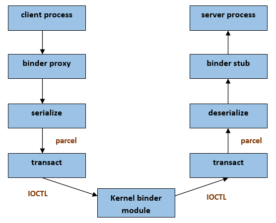
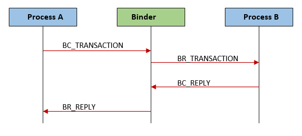
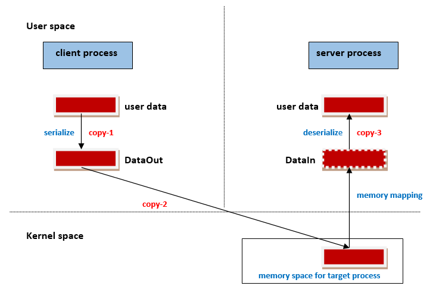
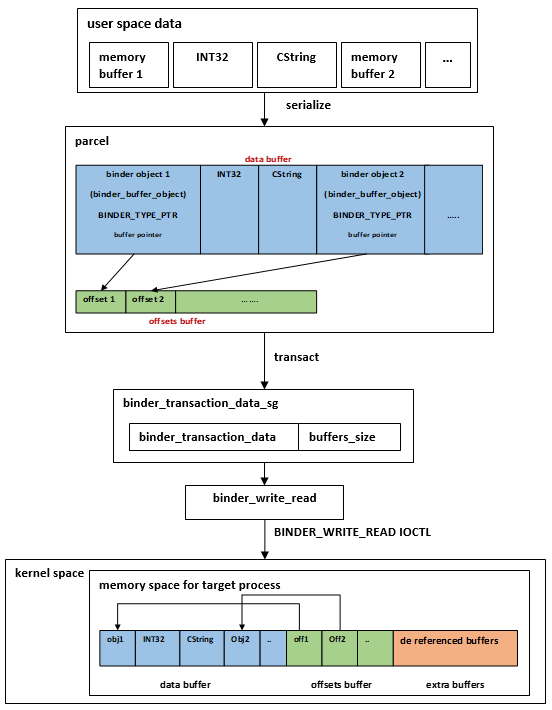
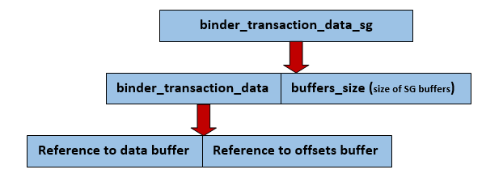
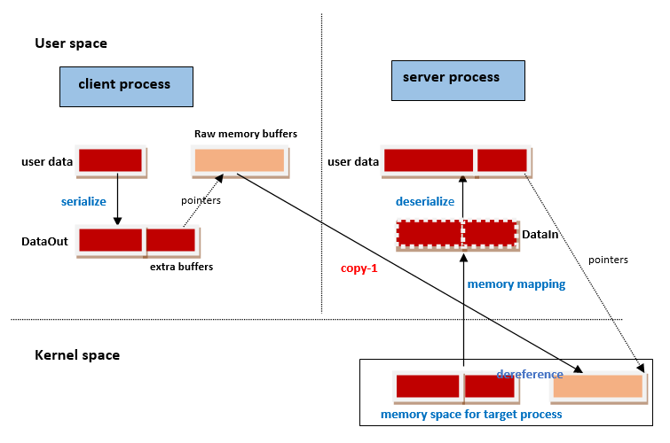

<h1 align="center">Android Binder IPC Framework | Scatter-Gather Optimization</h1>

[toc]

Date: August 28, 2020

Author: Aneeshya Rose K M

Android implementation is using a framework-binder IPC for inter process communication. It is evolved from the IPC system – OpenBinder. Using the framework, different data types can be shared between the processes. Android 8 has introduced a new scatter-gather (SG) optimization mechanism with binder IPC. The mechanism provides an efficient way to scatter-gather raw memory buffers into binder transactions. The scatter-gather mechanism can be a read procedure from multiple data streams and write to a single data stream or a read procedure from a single stream and write into multiple streams. It has been implemented in various frameworks in different ways based on basic scatter-gather concept. If we consider it with large chunk of data, instead of using reference to large data, we can use multiple references of its small streams to carry the data. Generally scatter gather mechanism is described with non-contiguous memory locations. The mechanism emerges as an efficient way to carry large sized data streams.

## Binder IPC Framework in Android

Using binder IPC framework, two processes can communicate each other and send or receive data between the processes. Framework enables a remote invocation of the methods in other processes. A client process communicate to  another server process and can run the methods in other process as it is done locally and can get the required data from the server process. Binder mechanism achieves inter process communication using IOCTL (input/output control) messages with Linux kernel binder driver.

​										Figure 1 : Binder IPC

## How Binder IPC Works in Android

If we consider from user space, binder framework works based on a proxy - stub class implementation. Proxy class will be helping client process to request the server process methods and stub class will be helping to receive and process these requests. Requests and data to be communicated over processes will be serialized as parcels and will be communicated to kernel binder driver using transact messages which uses IOCTL calls underneath. Binder messages are called Transactions.

​									Figure 2 : Binder IPC Work Flow

## Data Serialization and Transaction

Data to be passed through the binder driver to server process will be encapsulated in parcel data structure. Parcelling is the serialization procedure of user data into a continuous buffer memory. Using IPCThreadState class, details from Parcel will be mapped to binder_transaction_data – a data structure used in transact communications. At the server process also, a parcel will be received from the binder driver through transact messages. There, these parcels will be de serialized to retrieve the data. Parcel is used to carry several types of data which will be included in binder transaction payload.

Transactions will be carrying a transact command, information of remote method to be called, and details of data need to be communicated. There are different transact commands:

- BC_TRANSACTION
- BC_REPLY
- BR_TRANSACTION
- BC_FREE_BUFFER
- ..

Prefix BC indicates binder command and BR indicates binder return. BC commands will be sent to binder driver and the commands sent by driver will be BR commands.

​										Figure 3 : Binder Transactions

The structure, binder transaction data will contain the details of data to be communicated with other process. This can be actual data, or reference to actual data-like file descriptor. After mapping data from parcel to the binder_transaction_data structure, BINDER_WRITE_READ IOCTL will be called to pass data to kernel binder driver. For the IOCTL operation, a binder_write_read data structure will be used to carry transact data.

## Data Types in Transaction Payload Can Be

**Basic types:** basic data types like strings, integer, long.

**Binder objects:** These object types need a kernel level transformation to provide data at the receiver process. There are different binder object structures defined. Binder object structures will be having a type value which indicates the type of the binder object. Eg: BINDER_TYPE_FD (binder object which carries a file descriptor)

There are different types of binder objects defined:

- BINDER_TYPE_BINDER
- BINDER_TYPE_WEAK_BINDER
- BINDER_TYPE_HANDLE
- BINDER_TYPE_WEAK_HANDLE
- BINDER_TYPE_FD
- ..

## Binder Transaction before SG

Before android 8 versions, the data to be transferred over IPC were needed to be copied three times.

- During serialization to parcel
- During copying of data by kernel driver to target process
- During de serialization of parcel at the target process

User data will be copied once at the client process to parcel. Then this data will be copied by kernel driver to a memory area corresponding to target process which is memory mapped with target device. After that, at the target process, during de serialization this data will be copied once again to the target process user space. Exception case is there for binder objects and file descriptors. Thus, in case of raw memory buffers there needed three copy operations.

​								Figure 4 : Binder Transaction before SG

## Why SG Optimization2

With android 8, new scatter-gather optimization is introduced with binder framework. Using this method, the number of copying of data can be reduced from three to one. Copying during serialization and de serialization can be avoided using this newly introduced optimization mechanism. Original data structure and memory layout of the data will be kept and kernel driver will be copying this to the target process. As the structure and memory layout is the same even in target process memory, the data can be read without another copy. So at the target process also, no de serialization copying will be needed.

## Binder Transaction after SG

SG mechanism is introduced to avoid serialization and de serialization copying of raw memory buffers which are intended to be communicated over processes. Two new transaction commands are introduced to support scatter-gather mechanism with the binder IPC. This helps in achieving the backward compatibility as well.

- **BC_TRANSACTION_SG** : scatter gather transaction command by client
- **BC_REPLY_SG** : scatter gather reply transaction command from server

To patch a raw memory buffer in parcel, a new binder object **binder_buffer_object** is introduced along with a type **BINDER_TYPE_PTR**. This type of binder object has two fields: **parent** and **parent_offset** which allows patching a pointer inside the parent buffer. This is very useful if parent memory buffer contains pointers to other child buffers. Using parent address and offset positions these child buffers can be retrieved at the receiving end. Multiple binder_buffer_object s can be serialized with parcel. A binder_buffer_object can either be used as a standalone binder object or can be used with child binder_buffer_object s which will be having reference to the corresponding parent binder_buffer_object.

​								Figure 5 : Parent Child Implementation

## Parcelling and Transaction with Binder Objects

Figure shows an example flow of SG buffers parcelling and transaction with kernel space.

​						Figure 6 : Parcelling and Transaction with binder_buffer_objects

Type value BINDER_TYPE_PTR of a binder object indicates that there will be a memory address of a buffer and its size. When parcel class serializes binder objects, if the object gives address and size, it will write binder object in the data buffer and keeps its relative position in offset buffer. Thus after parcelling along with other supporting details, there will be two buffers-**data buffer** and o**ffsets buffer**. Binder objects and simple objects will be kept mixed in data buffer while parcelling.

After filling up data buffer and offsets buffer in parcel, these details will be mapped to binder_transaction_data structure using writeTransactionData of the binder IPCthreadstate implementation. This will happen when transact method is called. binder_transaction_data structure will be keeping references to the data buffer and offsets buffer.

The newly introduced transact command BC_TRANSACT_SG and BC_REPLY_SG uses a modified binder_transaction_data structure called **binder_transaction_data_sg**. It contains a binder_transaction_data as well as a buffer_size. This buffer_size will be giving the total size of the all the SG buffers (scatter gather buffers). So here, instead of copying the whole data, we are passing the pointers to the data along with the size (buffer_size).

​							Figure 7 : SG Transact Data Structure

Followed with binder_transaction_data_sg population, new binder_write_read structure will be created with the details of binder_transaction_data_sg. binder_write_read structure will be used with BINDER_WRITE_READ IOCTL to carry data to binder driver.

## SG Handling in Binder Driver

When the BINDER_WRITE_READ IOCTL call reaches the kernel driver, The kernel reserves necessary memory for the targeted process (size: size of data buffer + size of offsets buffer + extra size of the patched buffers) and copies the transaction data. This is the only copying process of SG buffers throughout the data flow. That is, once the transaction data is received, binder driver will do following:

- Convert all the references
- Install file descriptors if any
- Copies BINDER_TYPE_PTR buffers in the target process to extra size part

The memory allocation will be as follows:

​								Figure 8 : Memory Allocation at Kernel Space

Target process will be reading these copied buffers for processing the local methods. Since buffer references are being used for serialization and de serialization, the number of copying process is reduced which emerges as a more optimal way.

​								Figure 9 : Binder Transaction after SG

## Conclusion

Before introduction of SG in binder IPC framework, data in memory buffers were needed to be serialized/de serialized and it was causing two extra copy actions overhead during transactions. After the introduction of SG mechanism, no actual buffer data will get serialized, only buffer pointers will get serialized. Scatter-gather mechanism gives a more optimized way to carry multiple memory buffers with less number of copy operations. Also, the parent and parent_offset field of the binder_buffer_object will allow patching pointers with the parent buffer. So instead of serializing the large chunks of data, we can send the multiple scattered buffer pointers and corresponding sizes of the binder_buffer_object. At the kernel space these buffer pointers will be de referenced and actual data will be copied to memory space mapped for target. Since actual user data is not getting serialised or de serialised, we could avoid the two copy actions and thus scatter-gather mechanism helps in reducing the copy processes from three to one.

## References

1. https://lore.kernel.org/patchwork/patch/757477/
2. https://source.android.com/devices/architecture/hidl/binder-ipc
3. https://www.synacktiv.com/en/publications/binder-transactions-in-the-bowels-of-the-linux-kernel.html

## From

[Android Binder IPC Framework | Scatter-Gather Optimization - PathPartnerTech](https://www.pathpartnertech.com/android-binder-ipc-framework-scatter-gather-optimization/)

