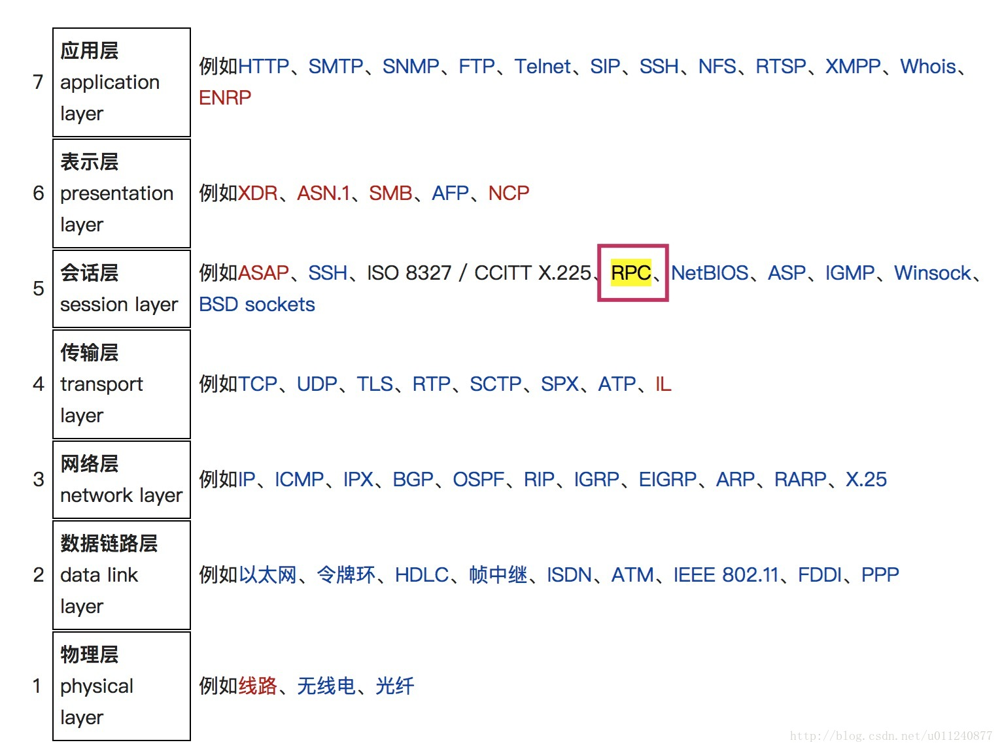
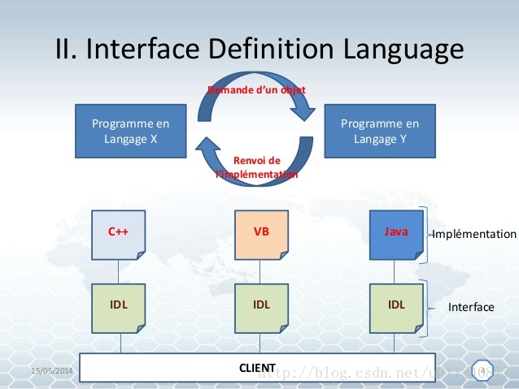
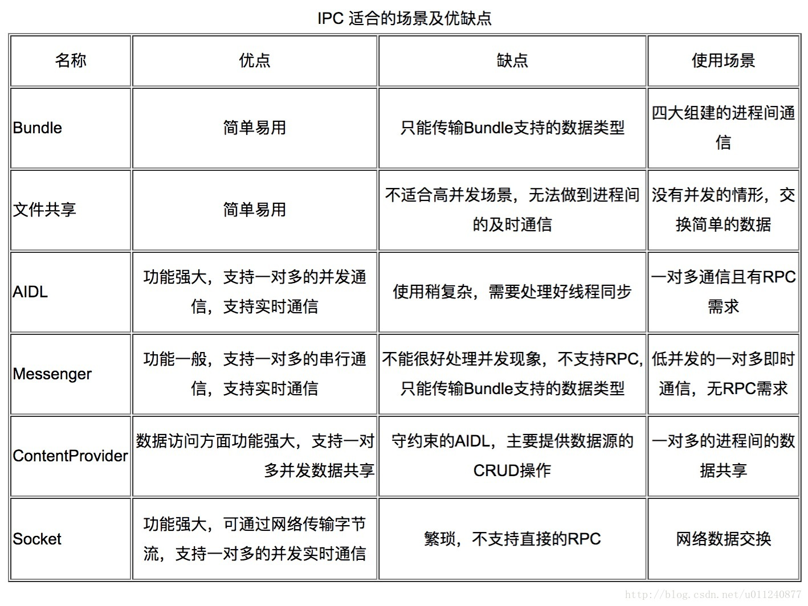

<h1 align="center">Android 进阶：几种进程通信方式的对比总结</h1>

[toc]

## RPC 是什么

RPC 即 Remote Procedure Call (远程过程调用) 是一种计算机通讯协议，它为我们定义了计算机 C 中的程序如何调用另外一台计算机 S 的程序，让程序员不需要操心底层网络协议，使得开发包括网络分布式多程序在内的应用程序更加容易。
RPC 是典型的 Client/Server 模式，由客户端对服务器发出若干请求，服务器收到后根据客户端提供的参数进行操作，然后将执行结果返回给客户端。
RPC 位于 OSI 模型中的会话层： 

在面向对象编程中，它也被叫做 “远程方法调用”。
## IDL 是什么
RPC 只是一种协议，规定了通信的规则。
在实际工作中客户端与服务端会有各种各样的平台，就好像日常开发一样，为了统一处理不同的实现，需要定义一个共同的接口，于是有了 IDL。
IDL 即 Interface Description Language (接口定义语言)。
它通过一种中立的方式来描述接口，使得在不同平台上运行的对象和用不同语言编写的程序可以相互通信交流。比如，一个组件用 C++ 写成，另一个组件用 Java 写，仍然可以通信。

## IPC 是什么
IPC 即 Inter-Process Communication (进程间通信)。
Android 基于 Linux，而 Linux 出于安全考虑，不同进程间不能之间操作对方的数据，这叫做“进程隔离”。
“进程隔离”更详细的介绍（节选自：http://blog.csdn.net/u010132993/article/details/72582655）：
在 Linux 系统中，虚拟内存机制为每个进程分配了线性连续的内存空间，操作系统将这种虚拟内存空间映射到物理内存空间，每个进程有自己的虚拟内存空间，进而不能操作其他进程的内存空间，只有操作系统才有权限操作物理内存空间。 
进程隔离保证了每个进程的内存安全。
但是在大多数情形下，不同进程间的数据通讯是不可避免的，因此操作系统必须提供跨进程通信机制。
## Android 几种进程通信方式

跨进程通信要求把方法调用及其数据分解至操作系统可以识别的程度，并将其从本地进程和地址空间传输至远程进程和地址空间，然后在远程进程中重新组装并执行该调用。
然后，返回值将沿相反方向传输回来。 
Android 为我们提供了以下几种进程通信机制（供开发者使用的进程通信 API）对应的文章链接如下：

* 文件
* AIDL （基于 Binder） 
    * [Android 进阶：进程通信之 AIDL 的使用](http://blog.csdn.net/u011240877/article/details/72765136)
    * [Android 进阶：进程通信之 AIDL 解析](http://blog.csdn.net/u011240877/article/details/72825706)
* Binder 
  
    * [Android 进阶：进程通信之 Binder 机制浅析](http://blog.csdn.net/u011240877/article/details/72801425)
* Messenger （基于 Binder） 
  
    * [Android 进阶：进程通信之 Messenger 使用与解析](http://blog.csdn.net/u011240877/article/details/72836178)
* ContentProvider （基于 Binder） 
  
    * [Android 进阶：进程通信之 ContentProvider 内容提供者](http://blog.csdn.net/u011240877/article/details/72848608)
* Socket 
    * [Android 进阶：进程通信之 Socket （顺便回顾 TCP UDP）](http://blog.csdn.net/u011240877/article/details/72860483)

在上述通信机制的基础上，我们只需集中精力定义和实现 RPC 编程接口即可。

## 如何选择这几种通信方式
《Android 开发艺术探索》中总结的已经比较全面了：

这里再对比总结一下：

* 只有允许不同应用的客户端用 IPC 方式调用远程方法，并且想要在服务中处理多线程时，才有必要使用 `AIDL`
* 如果需要调用远程方法，但不需要处理并发 IPC，就应该通过实现一个 `Binder` 创建接口
* 如果您想执行 IPC，但只是传递数据，不涉及方法调用，也不需要高并发，就使用 `Messenger` 来实现接口
* 如果需要处理一对多的进程间数据共享（主要是数据的 CRUD），就使用 `ContentProvider`
* 如果要实现一对多的并发实时通信，就使用 `Socket`

## Thanks
《Android 开发艺术探索》 
https://zh.wikipedia.org/wiki/%E9%81%A0%E7%A8%8B%E9%81%8E%E7%A8%8B%E8%AA%BF%E7%94%A8 
https://zh.wikipedia.org/wiki/%E6%8E%A5%E5%8F%A3%E6%8F%8F%E8%BF%B0%E8%AF%AD%E8%A8%80 
http://blog.csdn.net/u010132993/article/details/72582655 
https://developer.android.com/guide/components/processes-and-threads.html