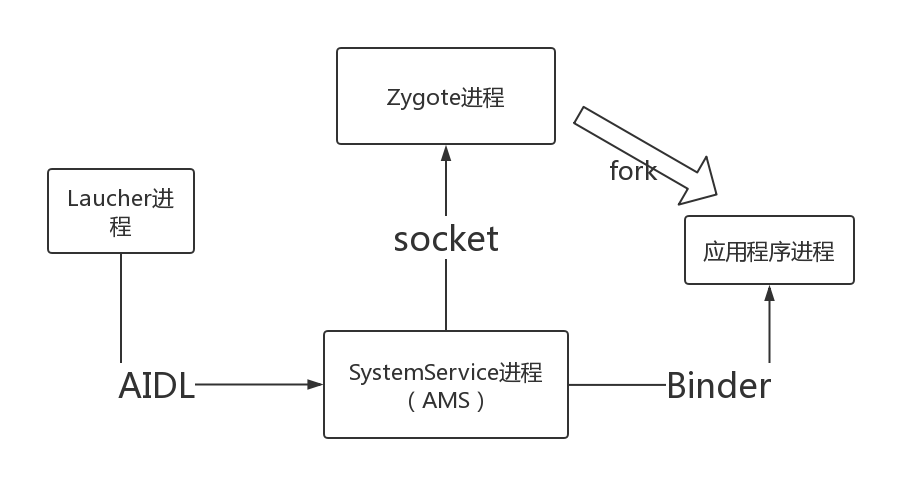

<h1 align="center">为什么SystemServer进程与Zygote进程通讯采用Socket而不是Binder</h1>

[toc]

> 前言：最近在学习activity启动流程的过程中，发现一个有趣的问题。SystemServer进程与Zygote进程通讯采用Socket而不是Binder，而其他进程之间的通讯采用的都是Binder通讯。作为为android系统专门定制的IPC方式，Binder在android本地的通讯中有着其他IPC无可比拟的优势，不仅体现在系统的调用上，作为开发者在本地进程间的通讯，我们首选也是Binder，那么为什么作为系统进程中咖位如此大的Zygote和SystemService之间采用的却是Socket？
>
> 有点人会说LocalSocket本来就是用来本地进程间通讯的，这没错，但知其然更要知其所以然。
>
> 如果对activity启动流程不太熟悉的可以自己去学习一下，这里只简单地了解一下这个过程涉及的进程。

## 一、Activity的启动流程

初次启动一个app（也就是从我们点击桌面app图标到进入应用程序），要涉及四个进程

* Launcher进程**：手机的桌面进程，这里布置着各种app应用的图标。**
* SystemService进程**：AMS与WMS等都在此进程，负责通知Zygote去生成应用程序进程**
* Zygote进程**：通过fork生成应用程序进程**
* **应用程序进程**：就是我们点击应用图标进入的app所在进程。

由图中我们看出，他们之间的通讯过程大致是：

1. Launcher通过AIDL（Binder的一种）通知SystemService

2. SystemService通过Socket通知Zygote

3. Zygote 收到SystemService请求，fork自身生成应用程序

4. 应用程序进程与SystemService通过Binder与AMS，WMS进行交互

## 二、提出问题

以上就是点击桌面到生成应用程序的过程。那么下面就引出本文的主题。在这个过程中，我们可以看到**这几个进程之间的通讯都是采用Binder，只有Zygote进程与SystemService之间是Socket。这是为什么呢？**

Binder作为android端定制的一套IPC，为何在Zygote和SystemService这两个这么重要的进程的通讯过程被弃用呢？

## 三、提出假设

探究一个问题要通过正反两面。

那么先从正面出发：

**假设1.是不是在这种应用场景下，Socket使用的性能比Binder更佳？**

**传输性能:**

socket作为一款通用接口，其传输效率低，开销大，主要用在跨网络的进程间通信和本机上进程间的低速通信。

消息队列和管道采用**存储-转发**方式，即数据先从发送方缓存区拷贝到内核开辟的缓存区中，然后再从内核缓存区拷贝到接收方缓存区，至少有两次拷贝过程。而Binder只需要一次，开销也更小。

**安全性：**

Android作为一个开放式，拥有众多开发者的平台，应用程序的来源广泛，确保智能终端的安全是非常重要的。终端用户不希望从网上下载的程序在不知情的情况下偷窥隐私数据，连接无线网络，长期操作底层设备导致电池很快耗尽等等。传统IPC没有任何安全措施，完全依赖上层协议来确保。首先传统IPC的接收方无法获得对方进程可靠的UID/PID（用户ID/进程ID），从而无法鉴别对方身份。

Android为每个安装好的应用程序分配了自己的UID，故进程的UID是鉴别进程身份的重要标志。使用传统IPC只能由用户在数据包里填入UID/PID，但这样不可靠，容易被恶意程序利用。可靠的身份标记只有由IPC机制本身在内核中添加。其次传统IPC访问接入点是开放的，无法建立私有通道。比如命名管道的名称、system V的键值、socket的ip地址或文件名都是开放的，只要知道这些接入点的程序都可以和对端建立连接，不管怎样都无法阻止恶意程序通过猜测接收方地址获得连接。

基于以上原因，Android需要建立一套新的IPC机制来满足系统对通信方式，传输性能和安全性的要求，这就是Binder。Binder基于 Client-Server通信模式，传输过程只需一次拷贝，为发送发添加UID/PID身份，既支持实名Binder也支持匿名Binder，安全性高。基于Binder的这些特性，从性能的角度看，无论怎么看都应该选择Binder而不是Socket。所以假设1不成立。

正面行不通，我们从反面出发：

**假设2.是不是由于某种限制，在这个场景下不适合使用Binder？**

在这里，我想到了Zygote是Linux层就有的，而Binder是android 才有的IPC，

**假设2.1：会不会是由于先后顺序问题，Zygote中无法使用Binder？**

首先我知道，ServiceManager是一个守护进程，它维护着系统服务和客户端的binder通信。Binder这套机制是基于ServiceManager的，只要验证ServiceManager是在Zygote进程生成之后才创建的，那就可以验证假设2.1成立。

果不其然。。。

ServiceManager在init进程启动后启动，用来管理系统中的service，Zygote进程在init之后，而且ServiceManager进程的启动，远比zygote要早，因为**在启动zygote进程时需要用到ServiceManager进程的服务。**

所以假设2.1不成立.。。。

既然2.1不成立，而且**在启动zygote进程时需要用到ServiceManager进程的服务，那么显然Zygote是可以使用Binder的。**

那么假设2是不是也不成立？

探究一件事的结果还要从过程出发。整个流程中，Zygote的最终目的，显然就是通过fork去创建一个应用进程，过程就是没有使用到Binder

**假设2.2是不是在这个流程中fork函数出于某些原因不能使用Binder？**

所以，我们要了解fork存在哪些限制。

查阅资料发现，fork确实还真有这么一条限制：

**UNIX上C++程序设计守则3**

**准则3：多线程程序里不准使用fork**

在多线程程序里，在“自身以外的线程存在的状态”下使用fork的话，就可能引起各种各样的问题。比较典型的例子就是，fork出来的子进程可能会死锁。请不要在不能把握问题的原委的情况下就在多线程程序里fork子进程。

以下是说明死锁的理由：
一般的,fork做如下事情

   1. 父进程的内存数据会原封不动的拷贝到子进程中
   2. 子进程在单线程状态下被生成

在内存区域里，静态变量mutex的内存会被拷贝到子进程里。而且，父进程里即使存在多个线程，但它们也不会被继承到子进程里.。fork的这两个特征就是造成死锁的原因。
译者注: 死锁原因的详细解释 ---

      1. 线程里的doit()先执行。
      2. doit执行的时候会给互斥体变量mutex加锁。
      3. mutex变量的内容会原样拷贝到fork出来的子进程中(在此之前,mutex变量的内容已经被线程改写成锁定状态)。
      4. 子进程再次调用doit的时候,在锁定互斥体mutex的时候会发现它已经被加锁,所以就一直等待,直到拥有该互斥体的进程释放它(实际上没有人拥有这个mutex锁)。
      5. 线程的doit执行完成之前会把自己的mutex释放,但这是的mutex和子进程里的mutex已经是两份内存.所以即使释放了mutex锁也不会对子进程里的mutex造成什么影响。

到此，真相终于水落石出了！

是不是看了这么长的通篇大论，有点小伙伴已经晕了。还没反应过来问题怎么就解决了？？？

Binder通讯是需要多线程操作的，代理对象对Binder的调用是在Binder线程，需要再通过Handler调用主线程来操作。

比如AMS与应用进程通讯，AMS的本地代理IApplicationThread通过调用ScheduleLaunchActivity，调用到的应用进程ApplicationThread的ScheduleLaunchActivity是在Binder线程，需要再把参数封装为一个ActivityClientRecord，sendMessage发送给H类（主线程Handler，ActivityThread内部类）

## 四、结论总结

总结起来就是怕父进程binder线程有锁，然后子进程的主线程一直在等其子线程(从父进程拷贝过来的子进程)的资源，但是其实父进程的子进程并没有被拷贝过来，造成死锁，所以**fork不允许存在多线程**。而非常巧的是**Binder通讯偏偏就是多线程，所以干脆父进程（Zgote）这个时候就不使用binder线程**

原文链接：https://blog.csdn.net/qq_39037047/java/article/details/88066589