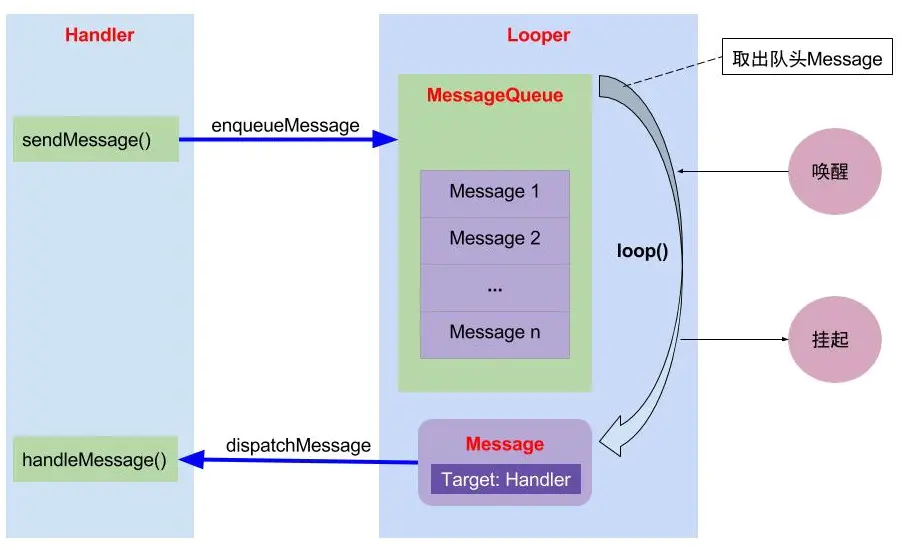
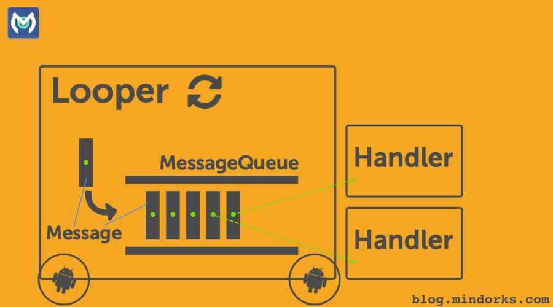

<h1 align="center">Handler面试知识点</h1>

[toc]

## Handler原理

handler 整个流程中，主要有四个对象：`Handler`，`Message`，`MessageQueue`，`Looper`。 

Android 中主线程是不能进行耗时操作的，子线程是不能进行更新 UI 的。所以就有了 handler， 它的作用就是实现线程之间的通信。





### Handler（消息发送、处理器）：

负责 Message 的发送及处理。主要向消息池发送各种消息事件`（Handler.sendMessage()）`和处理相应消息事件`（Handler.handleMessage()）`，按照先进先出执行，内部使用的是单链表的结构。

负责跨线程通信，这是因为在主线程不能做耗时操作，而子线程不能更新 UI，所以当子线程中进行耗时操作后需要更新 UI时，通过 Handler 将有关 UI 的操作切换到主线程中执行。


Android 规定访问 UI 只能在主线程中进行，因为 Android 的 UI 控件不是线程安全的，多线程并发访问会导致 UI 控件处于不可预期的状态。为什么系统不对 UI 控件的访问加上锁机制？缺点有两个：加锁会让 UI 访问的逻辑变得复杂；其次锁机制会降低 UI 访问的效率。如果子线程访问 UI，那么程序就会抛出异常。ViewRootImpl 对UI操作做了验证，这个验证工作是由 ViewRootImpl的 ``checkThread`` 方法完成：

``ViewRootImpl.java``

```java
void checkThread() {
    if (mThread != Thread.currentThread()) {
        throw new CalledFromWrongThreadException(
                "Only the original thread that created a view hierarchy can touch its views.");
    }
}
```

Handler 创建的时候会采用当前线程的 Looper 来构造消息循环系统，需要注意的是，线程默认是没有 Looper 的，直接使用 Handler 会报错，如果需要使用 Handler 就必须为线程创建 Looper，因为默认的 UI 主线程，也就是 ActivityThread，ActivityThread 被创建的时候就会初始化 Looper，这也是在主线程中默认可以使用 Handler 的原因。

### Message（消息）：

需要被传递的消息，消息分为硬件产生的消息（如按钮、触摸）和软件生成的消息。

* target 其实就是发送消息的 Handler 
* 对象callback 是当调用 `handler.post(runnable)` 时传入的 Runnable 类型的任务。post 事件的本质也是创建了一个 Message，将我们传入的这个 runnable 赋值给创建的Message的 callback 这个成员变量。

### ThreadLocal

ThreadLocal 是一个线程内部的数据存储类，通过它可以在指定的线程中存储数据，其他线程则无法获取。Looper、ActivityThread 以及 AMS 中都用到了 ThreadLocal。当不同线程访问同一个ThreadLocal 的 get方法，ThreadLocal 内部会从各自的线程中取出一个数组，然后再从数组中根据当前 ThreadLcoal 的索引去查找对应的value值。

详情见：[ThreadLocal](../../../Java/JavaCoreTech/Thread/ThreadLocal.md)

### MessageQueue（消息队列）：

负责管理由 `Handler` 发送过来的 `Message`消息的插入``enqueueMessage``和读取``next``。读取操作本身会自动删除消息。

MessageQueue 内部实现并不是用的队列，实际上通过一个单链表的数据结构(**Message**)来维护消息队列。next 方法是一个无限循环的方法，如果消息队列中没有消息，那么 next 方法会一直阻塞。当有新消息到来时，next 方法会放回这条消息并将其从单链表中移除。

### Looper（消息池）：

负责关联线程以及消息的分发，在该线程下通过 `MessageQueue` 获取 `Message`，分发给`Handler`，`Looper` 创建的时候会创建一个`MessageQueue`，调用 Looper.loop()方法的时候消息循环开始，不断调用 `messageQueue` 的 `next()`方法来获取消息，当有消息就发送给Handler处理，否则阻塞在 `messageQueue` 的`next()`方法中。当 `Looper` 的 `quit()`被调用的时候会调用`messageQueue` 的 `quit()`，此时 `next()`会返回 null，然后 `loop()`方法也就跟着退出。每个线程只有一个 Looper。

- **prepare()。** 这个方法做了两件事：首先通过`ThreadLocal.get()`获取当前线程中的Looper，如果不为空，则会抛出一个RunTimeException，意思是一个线程不能创建2个Looper。如果为null则执行下一步。第二步是创建了一个Looper，并通过 `ThreadLocal.set(looper)。`将我们创建的Looper与当前线程绑定。这里需要提一下的是消息队列的创建其实就发生在Looper的构造方法中。
- **loop()。** 这个方法开启了整个事件机制的轮询。它的本质是开启了一个死循环，不断的通过 `MessageQueue的next()`方法获取消息。拿到消息后会调用 `msg.target.dispatchMessage()`来做处理。其实我们在说到 Message 的时候提到过，`msg.target` 其实就是发送这个消息的 handler。这句代码的本质就是调用 `handler的dispatchMessage()。`
- **prepareMainLooper** 方法，主要是给 ActivityThread 创建 Looper 使用，本质也是通过 prepare 方法实现的。由于主线程的 Looper 比较特殊，所以 Looper 提供了一个 getMainLooper 方法来获取主线程的 Looper。
- **quit** 和 **quitSafely**：退出一个 Looper，二者的区别是：``quit`` 会直接退出 Looper，而 ``quitSafly`` 只是设定一个退出标记，然后把消息队列中的已有消息处理完毕后才安全地退出。Looper 退出后，通过 Handler 发送的消息会失败，这个时候 Handler 的 send 方法会返回 false。因此在不需要的时候应终止 Looper。

## Handler、Thread 和 HandlerThread 的差别：

**1）** Handler 线程的消息通讯的桥梁，主要用来发送消息及处理消息。

**2）** Thread 普通线程，如果需要有自己的消息队列，需要调用 Looper.prepare()创建 Looper 实例，调用 loop()去循环消息。

**3）** HandlerThread 是一个带有 Looper 的线程，在 HandleThread 的run()方法中调用了 Looper.prepare()创建了 Looper实例，并调用 Looper.loop()开启了 Loop 循环，循环从消息队列中获取消息并交由 Handler 处理。利用该线程的 Looper 创建 Handler 实例，此 Handler 的 handleMessage()方法是运行在子线程中的。即 Handler 利用哪个线程的 Looper 创建的实例， 它就和相应的线程绑定到一起，处理该线程上的消息，它的 handleMessage()方法就是在那 个线程中运行的，无参构造默认是主线程。

HandlerThread 提供了 **quit()/quitSafely()** 方法退出 HandlerThread 的消息循环，它们分别调用 Looper 的 quit 和 quitSafely 方法，quit 会将消息 队列中的所有消息移除，而 quitSafely 会将消息队列所有延迟消息移除，非延迟消息派发出去让 Handler 去处理。

HandlerThread 适合处理本地 IO 读写操作（读写数据库或文件），因为本地 IO 操作耗时不长，对于单线程+异步队列不会产生较大阻塞，而网络操作相对比较耗时，容易阻塞后面的请求，因此 HandlerThread **不适合加入网络操作**

``HandlerThread.java``

```java
@Override
public void run() {
    mTid = Process.myTid();
    Looper.prepare();
    synchronized (this) {
        mLooper = Looper.myLooper();
        notifyAll();
    }
    Process.setThreadPriority(mPriority);
    onLooperPrepared();
    Looper.loop();
    mTid = -1;
}
```

> 使用场景：单线程+异步任务场景

**优点：**

1. 将loop运行在子线程中处理，减轻了主线程的压力，使主线程更流畅
2. 串行执行，开启一个线程起到多个线程的作用
3. 有自己的消息队列，不会干扰UI线程

**缺点：**

1. 由于每一个任务队列逐步执行，一旦队列耗时过长，消息延时
2. 对于IO等操作，线程等待，不能并发

## Handler 引起的内存泄露原因以及最佳解决方案

**泄露原因：**

`Handler` 允许我们发送延时消息，如果在延时期间用户关闭了 `Activity`，那么该 `Activity`会泄露。 这个泄露是因为 `Message`会持有 `Handler`，而又因为 Java 的特性，内部类会持有外部类，使得 Activity 会被`Handler` 持有，这样最终就导致 `Activity` 泄露。

**解决方案：**

将 `Handler` 定义成静态的内部类，在内部持有`Activity` 的弱引用，并在 `Acitivity` 的 `onDestroy()`中调用 `handler.removeCallbacksAndMessages(null)`及时移除所有消息。

## 使用 Handler 的 postDealy 后消息队列会有什么变化？

如果队列中只有这个消息，那么消息不会被发送，而是计算到时唤醒的时间，先将 `Looper` 阻塞，到时间就唤醒它。但如果此时要加入新消息，该消息队列的队头跟 `delay` 时间相比更长，则插入到头部，按照触发时间进行排序，队头的时间最小、队尾的时间最大

## 可以在子线程直接 new 一个 Handler 吗？怎么做？

不可以，因为在主线程中，Activity 内部包含一个 `Looper` 对象，它会自动管理 `Looper`，处理子线程中发送过来的消息。而对于子线程而言，没有任何对象帮助我们维护 `Looper` 对象，所以需要我们自己手动维护。所以要在子线程开启 `Handler` 要先创建 `Looper`，并开启 `Looper` 循环

```java
//示例代码
   new Thread（new Runnable(）{
            @Override
             public void run() {
                 looper.prepare();
                 new Handler() {
                         @Override 
                         piblic void handlerMessage(Message msg) {
                             super,handleMessage(msg);
                         }
                 }
                 looper.loop();
            }
       }).start();
```

## Handler 中有 Loop 死循环，为什么没有阻塞 主线程，原理是什么

该问题很难被考到，但是如果一旦问到，100%会回答 不上来。开发者很难注意到一个主线程的死循环居然没有阻塞住主线程。

应该从主线程的消息循环机制 与 Linux 的循环异步等待作用讲起。

**这里有简单的几个问题抛出来：**

> 1.Looper 死循环为什么不会导致应用卡死，会消耗大量资源吗？
>
> 2.主线程的消息循环机制是什么（死循环如何处理其它事务）？
>
> 3.ActivityThread 的动力是什么？（ActivityThread 执行 Looper 的线程是什么）
>
> 4.Handler 是如何能够线程切换，发送 Message 的？（线程间通讯）
>
> 5.子线程有哪些更新 UI 的方法。
>
> 6.子线程中 Toast，showDialog的方法。（和子线程不能更新 UI 有关吗）
>
> 7.如何处理 Handler 使用不当导致的内存泄露？

### 1 Looper 死循环为什么不会导致应用卡死？

线程默认没有 `Looper` 的，如果需要使用 Handler 就必须为 线程 创建 `Looper`。我们经常提到的主线程，也叫 UI 线程， 它就是 `ActivityThread`，`ActivityThread` 被创建时就会初始化 `Looper`，这也是在主线程中默认可以使用 Handler 的 原因

我们先来看一段代码：

```java
new Thread(new Runnable() {
        @Override
        public void run() {
            Log.e("qdx", "step 0 ");
            Looper.prepare();
            Toast.makeText(MainActivity.this, "run on Thread", Toast.LENGTH_SHORT).show();
            Log.e("qdx", "step 1 ");
            Looper.loop();
            Log.e("qdx", "step 2 ");
        }
    }).start();
```

我们知道`Looper.loop()`;里面维护了一个死循环方法，所以按照理论，上述代码执行的应该是 step0 –>step1 也就是说循环在`Looper.prepare()`;与`Looper.loop()`;之间。

> 在子线程中，如果手动为其创建了`Looper`，那么在所有的事情完成以后应该调用`quit`方法来终止消息循环，否则这个子线程就会一直处于等待（阻塞）状态，而如果退出`Looper`以后，这个线程就会立刻（执行所有方法并）终止，因此建议不需要的时候终止`Looper`

执行结果也正如我们所说，这时候如果了解`ActivityThread`，并且在`main`方法中我们会看到主线程也是通过`Looper`方式来维持一个消息循环。

```java
public static void main(String[] args) {
    Looper.prepareMainLooper();//创建Looper和MessageQueue对象，用于处理主线程的消息
    ActivityThread thread = new ActivityThread();
    thread.attach(false);//建立Binder通道 (创建新线程)
    if (sMainThreadHandler == null) {
        sMainThreadHandler = thread.getHandler();
    }
    Trace.traceEnd(Trace.TRACE_TAG_ACTIVITY_MANAGER);
    Looper.loop();
    //如果能执行下面方法，说明应用崩溃或者是退出了...
    throw new RuntimeException("Main thread loop unexpectedly exited");
}
```

**那么回到我们的问题上，这个死循环会不会导致应用卡死，即使不会的话，它会慢慢的消耗越来越多的资源吗？**

> 对于线程即是一段可执行的代码，当可执行代码执行完成后，线程生命周期便该终止了，线程退出。而对于主线程，我们是绝不希望会被运行一段时间，自己就退出，那么如何保证能一直存活呢？简单做法就是可执行代码是能一直执行下去的，死循环便能保证不会被退出，例如，`binder`线程也是采用死循环的方法，通过循环方式不同与`Binder`驱动进行读写操作，当然并非简单地死循环，无消息时会休眠。但这里可能又引发了另一个问题，既然是死循环又如何去处理其他事务呢？通过创建新线程的方式。真正会卡死主线程的操作是在回调方法`onCreate/onStart/onResume`等操作时间过长，会导致掉帧，甚至发生`ANR`，`looper.loop`本身不会导致应用卡死。
>
> 主线程的死循环一直运行是不是特别消耗CPU资源呢？ 其实不然，这里就涉及到`Linux pipe/epoll`机制，简单说就是在主线程的`MessageQueue`没有消息时，便阻塞在`loop`的`queue.next()`中的`nativePollOnce()`方法里，此时主线程会释放CPU资源进入休眠状态，直到下个消息到达或者有事务发生，通过往pipe管道写端写入数据来唤醒主线程工作。这里采用的`epoll`机制，是一种IO多路复用机制，可以同时监控多个描述符，当某个描述符就绪(读或写就绪)，则立刻通知相应程序进行读或写操作，本质同步I/O，即读写是阻塞的。 所以说，主线程大多数时候都是处于休眠状态，并不会消耗大量CPU资源。

### 2 主线程的消息循环机制是什么？

> 事实上，会在进入死循环之前便创建了新binder线程，在代码`ActivityThread.main()`中：

```java
public static void main(String[] args) {
  //创建Looper和MessageQueue对象，用于处理主线程的消息
  Looper.prepareMainLooper();
   //创建ActivityThread对象
   ActivityThread thread = new ActivityThread(); 
   //建立Binder通道 (创建新线程)
   thread.attach(false);
   Looper.loop(); //消息循环运行
   throw new RuntimeException("Main thread loop unexpectedly exited");
}
```

**Activity的生命周期都是依靠主线程的** `Looper.loop`，当收到不同`Message`时则采用相应措施：一旦退出消息循环，那么你的程序也就可以退出了。 从消息队列中取消息可能会阻塞，取到消息会做出相应的处理。如果某个消息处理时间过长，就可能会影响UI线程的刷新速率，造成卡顿的现象。

`thread.attach(false)`方法函数中便会创建一个Binder线程（具体是指`ApplicationThread`，`Binder`的服务端，用于接收系统服务`AMS`发送来的事件），该Binder线程通过`Handler`将`Message`发送给主线程。「Activity 启动过程」

比如收到`msg=H.LAUNCH_ACTIVITY`，则调用`ActivityThread.handleLaunchActivity()`方法，最终会通过反射机制，创建`Activity`实例，然后再执行`Activity.onCreate()`等方法；

再比如收到`msg=H.PAUSE_ACTIVITY`，则调用`ActivityThread.handlePauseActivity()`方法，最终会执行`Activity.onPause()`等方法。

主线程的消息又是哪来的呢？当然是App进程中的其他线程通过Handler发送给主线程进程

### 3 ActivityThread 的动力是什么？

**进程** 每个app运行时前首先创建一个进程，该进程是由Zygote fork出来的，用于承载App上运行的各种`Activity/Service`等组件。进程对于上层应用来说是完全透明的，这也是google有意为之，让App程序都是运行在`Android Runtime`。大多数情况一个App就运行在一个进程中，除非在`AndroidManifest.xml`中配置`Android:process`属性，或通过native代码fork进程

**线程** 线程对应用来说非常常见，比如每次`new Thread().start`都会创建一个新的线程。该线程与App所在进程之间资源共享，从Linux角度来说进程与线程除了是否共享资源外，并没有本质的区别，都是一个`task_struct`结构体，在CPU看来进程或线程无非就是一段可执行的代码，CPU采用CFS调度算法，保证每个task都尽可能公平的享有CPU时间片。

其实承载`ActivityThread`的主线程就是由Zygote fork而创建的进程。

### 4 Handler 是如何能够线程切换

其实看完上面我们大致也清楚**线程间是共享资源**的。所以Handler处理不同线程问题就只要注意异步情况即可。

这里再引申出Handler的一些小知识点。 **Handler创建的时候会采用当前线程的`Looper`来构造消息循环系统，`Looper`在哪个线程创建，就跟哪个线程绑定**，并且Handler是在他关联的`Looper`对应的线程中处理消息的。（敲黑板）

那么Handler内部如何获取到当前线程的`Looper`呢—–`ThreadLocal`。`ThreadLocal`可以在不同的线程中互不干扰的存储并提供数据，通过`ThreadLocal`可以轻松获取每个线程的`Looper`。

当然需要注意的是：

> ①线程是默认没有`Looper`的，如果需要使用Handler，就必须为线程创建Looper。我们经常提到的主线程，也叫UI线程，它就是`ActivityThread`，
>
> ②`ActivityThread`被创建时就会初始化`Looper`，这也是在主线程中默认可以使用Handler的原因。

**系统为什么不允许在子线程中访问UI？**（摘自《Android开发艺术探索》）

这是因为Android的UI控件不是线程安全的，如果在多线程中并发访问可能会导致UI控件处于不可预期的状态，那么为什么系统不对UI控件的访问加上锁机制呢？

缺点有两个：

* 首先加上锁机制会让UI访问的逻辑变得复杂
* 锁机制会降低UI访问的效率，因为锁机制会阻塞某些线程的执行。 所以最简单且高效的方法就是采用单线程模型来处理UI操作

### 5 子线程有哪些更新UI的方法

主线程中定义Handler，子线程通过`mHandler`发送消息，主线程Handler的`handleMessage`更新UI。 用Activity对象的`runOnUiThread`方法。创建Handler，传入`getMainLooper`。 `View.post(Runnabler)` 。

`runOnUiThread` 第一种咱们就不分析了，我们来看看第二种比较常用的写法。

先重新温习一下上面说的

`Looper`在哪个线程创建，就跟哪个线程绑定，并且Handler是在他关联的`Looper`对应的线程中处理消息的。（敲黑板）

```java
new Thread(new Runnable() {
        @Override
        public void run() {
            runOnUiThread(new Runnable() {
                @Override
                public void run() {
                    //DO UI method
                }
            });
        }
  }).start();
  final Handler mHandler = new Handler();
  public final void runOnUiThread(Runnable action) {
     if (Thread.currentThread() != mUiThread) {
        mHandler.post(action);//子线程（非UI线程）
     } else {
        action.run();
     }
  }
```

进入Activity类里面，可以看到如果是在子线程中，通过`mHandler`发送的更新UI消息。 而这个Handler是在Activity中创建的，也就是说在主线程中创建，所以便和我们在主线程中使用Handler更新UI没有差别。 因为这个`Looper`，就是`ActivityThread`中创建的`Looper（Looper.prepareMainLooper()）`。

创建Handler，传入`getMainLooper` 那么同理，我们在子线程中，是否也可以创建一个Handler，并获取`MainLooper`，从而在子线程中更新UI呢？ 首先我们看到，在`Looper`类中有静态对象`sMainLooper`，并且这个`sMainLooper`就是在`ActivityThread`中创建的`MainLooper`

```java
private static Looper sMainLooper;  // guarded by Looper.class
  public static void prepareMainLooper() {
     prepare(false);
     synchronized (Looper.class) {
         if (sMainLooper != null) {
             throw new IllegalStateException("The main Looper has already been prepared.");
         }
         sMainLooper = myLooper();
     }
  }
```

所以不用多说，我们就可以通过这个`sMainLooper`来进行更新UI操作

```java
new Thread(new Runnable() {
        @Override
        public void run() {
            Log.e("qdx", "step 1 "+Thread.currentThread().getName());
            Handler handler=new Handler(getMainLooper());
            handler.post(new Runnable() {
                @Override
                public void run() {
                    //Do Ui method
                    Log.e("qdx", "step 2 "+Thread.currentThread().getName());
                }
            });
        }
  }).start();
复制代码
```

`View.post(Runnabler)`老样子，我们点入源码

```java
//View
/**
 * <p>Causes the Runnable to be added to the message queue.
 * The runnable will be run on the user interface thread.</p>
 *
 * @param action The Runnable that will be executed.
 *
 * @return Returns true if the Runnable was successfully placed in to the
 *         message queue.  Returns false on failure, usually because the
 *         looper processing the message queue is exiting.
 *
 */
  public boolean post(Runnable action) {
     final AttachInfo attachInfo = mAttachInfo;
     if (attachInfo != null) {
         return attachInfo.mHandler.post(action); //一般情况走这里
     }
     // Postpone the runnable until we know on which thread it needs to run.
     // Assume that the runnable will be successfully placed after attach.
     getRunQueue().post(action);
     return true;
  }
     /**
      * A Handler supplied by a view's {@link android.view.ViewRootImpl}. This
      * handler can be used to pump events in the UI events queue.
      */
     final Handler mHandler;
复制代码
```

居然也是Handler从中作祟，根据Handler的注释，也可以清楚该Handler可以处理UI事件，也就是说它的`Looper`也是主线程的`sMainLooper`。这就是说我们常用的更新UI都是通过Handler实现的。

另外更新UI 也可以通过`AsyncTask`来实现，难道这个`AsyncTask`的线程切换也是通过 Handler 吗? 没错，也是通过Handler……

### 6 子线程中Toast、showDialog的方法

可能有些人看到这个问题，就会想： 子线程本来就不可以更新UI的啊 而且上面也说了更新UI的方法.兄台且慢，且听我把话写完

```java
new Thread(new Runnable() {
        @Override
        public void run() {
            Toast.makeText(MainActivity.this, "run on thread", Toast.LENGTH_SHORT).show();//崩溃无疑
        }
    }).start();
```

看到这个崩溃日志，是否有些疑惑，因为一般如果子线程不能更新UI控件是会报如下错误的（子线程不能更新UI）

所以子线程不能更新Toast的原因就和Handler有关了，据我们了解，每一个Handler都要有对应的`Looper`对象，那么，满足你。

```java
new Thread(new Runnable() {
        @Override
        public void run() {
            Looper.prepare();
            Toast.makeText(MainActivity.this, "run on thread", Toast.LENGTH_SHORT).show();
            Looper.loop();
        }
  }).start();
```

这样便能在子线程中Toast，不是说子线程…? 老样子，我们追根到底看一下Toast内部执行方式

```java
//Toast
/**
 * Show the view for the specified duration.
 */
public void show() {
   INotificationManager service = getService();//从SMgr中获取名为notification的服务
 	String pkg = mContext.getOpPackageName();
 	TN tn = mTN;
 	tn.mNextView = mNextView;
 	try {
       service.enqueueToast(pkg, tn, mDuration);//enqueue? 难不成和Handler的队列有关?
 	} catch (RemoteException e) {
       // Empty
 	}
}
``````
在show方法中，我们看到Toast的show方法和普通UI 控件不太一样，并且也是通过Binder进程间通讯方法执行Toast绘制。这其中的过程就不在多讨论了，有兴趣的可以在`NotificationManagerService`类中分析。

现在把目光放在TN 这个类上（难道越重要的类命名就越简洁，如H类），通过TN 类，可以了解到它是Binder的本地类。在Toast的show方法中，将这个TN对象传给`NotificationManagerService`就是为了通讯！并且我们也在TN中发现了它的show方法。

```java
private static class TN extends ITransientNotification.Stub {//Binder服务端的具体实现类
     /**
      * schedule handleShow into the right thread
      */
      @Override
      public void show(IBinder windowToken) {
         mHandler.obtainMessage(0, windowToken).sendToTarget();
      }
      final Handler mHandler = new Handler() {
         @Override
         public void handleMessage(Message msg) {
             IBinder token = (IBinder) msg.obj;
             handleShow(token);
         }
      };
  }
```

看完上面代码，就知道子线程中Toast报错的原因，因为在TN中使用Handler，所以需要创建`Looper`对象。 那么既然用Handler来发送消息，就可以在`handleMessage`中找到更新Toast的方法。 在`handleMessage`看到由`handleShow`处理。

```java
//Toast的TN类
public void handleShow(IBinder windowToken) {
		mWM = (WindowManager)context.getSystemService(Context.WINDOW_SERVICE);
        mParams.x = mX;
        mParams.y = mY;
        mParams.verticalMargin = mVerticalMargin;
        mParams.horizontalMargin = mHorizontalMargin;
        mParams.packageName = packageName;
        mParams.hideTimeoutMilliseconds = mDuration ==
            Toast.LENGTH_LONG ? LONG_DURATION_TIMEOUT : SHORT_DURATION_TIMEOUT;
        mParams.token = windowToken;
        if (mView.getParent() != null) {
            mWM.removeView(mView);
        }
        mWM.addView(mView, mParams);//使用WindowManager的addView方法
        trySendAccessibilityEvent();
    }
}
```
看到这里就可以总结一下：

> Toast本质是通过window显示和绘制的（操作的是window），而主线程不能更新UI 是因为`ViewRootImpl`的`checkThread`方法在Activity维护的View树的行为。 Toast中TN类使用Handler是为了用队列和时间控制排队显示Toast，所以为了防止在创建TN时抛出异常，需要在子线程中使用`Looper.prepare()`;和`Looper.loop()`;（但是不建议这么做，因为它会使线程无法执行结束，导致内存泄露）

Dialog亦是如此。同时我们又多了一个知识点要去研究：Android 中Window是什么，它内部有什么机制？

### 7 如何处理Handler 使用不当导致的内存泄露？

首先上文在子线程中为了节目效果，使用如下方式创建Looper

```java
Looper.prepare();
​``````
Looper.loop();
```

实际上这是非常危险的一种做法

> 在子线程中，如果手动为其创建`Looper`，那么在所有的事情完成以后应该调用quit方法来终止消息循环，否则这个子线程就会一直处于等待的状态，而如果退出`Looper`以后，这个线程就会立刻终止，因此建议不需要的时候终止`Looper`。(【 `Looper.myLooper().quit();`】)

那么，如果在Handler的`handleMessage`方法中（或者是`run`方法）处理消息，如果这个是一个延时消息，会一直保存在主线程的消息队列里，并且会影响系统对`Activity`的回收，造成内存泄露。

具体可以参考Handler内存泄漏分析及解决

总结一下，解决Handler内存泄露主要2点

> 1 有延时消息，要在Activity销毁的时候移除`Messages`
>
> 2 匿名内部类导致的泄露改为匿名静态内部类，并且对上下文或者`Activity`使用弱引用。

### 8 Messagequeue 的数据结构是什么？为什么要用这个数据结构？

**解耦**

在项目启动之初来预测将来项目会碰到什么需求，是极其困难的。消息队列在处理过程中间插入了一个隐含的、基于数据的接口层，两边的处理过程都要实现这一接口。这允许你独立的扩展或修改两边的处理过程，只要确保它们遵守同样的接口约束

**冗余**

有些情况下，处理数据的过程会失败。除非数据被持久化，否则将造成丢失。消息队列把数据进行持久化直到它们已经被完全处理，通过这一方式规避了数据丢失风险。在被许多消息队列所采用的”插入-获取-删除”范式中，在把一个消息从队列中删除之前，需要你的处理过程明确的指出该消息已经被处理完毕，确保你的数据被安全的保存直到你使用完毕。

**扩展性**

因为消息队列解耦了你的处理过程，所以增大消息入队和处理的频率是很容易的；只要另外增加处理过程即可。不需要改变代码、不需要调节参数。扩展就像调大电力按钮一样简单。

**灵活性** **&** **峰值处理能力**

在访问量剧增的情况下，应用仍然需要继续发挥作用，但是这样的突发流量并不常见；如果为以能处理这类峰值访问为标准来投入资源随时待命无疑是巨大的浪费。使用消息队列能够使关键组件顶住突发的访问压力，而不会因为突发的超负荷的请求而完全崩溃。

**可恢复性**

当体系的一部分组件失效，不会影响到整个系统。消息队列降低了进程间的耦合度，所以即使一个处理消息的进程挂掉，加入队列中的消息仍然可以在系统恢复后被处理。而这种允许重试或者延后处理请求的能力通常是造就一个略感不便的用户和一个沮丧透顶的用户之间的区别。

**送达保证**

消息队列提供的冗余机制保证了消息能被实际的处理，只要一个进程读取了该队列即可。在此基础上，IronMQ 提供了一个”只送达一次”保证。无论有多少进程在从队列中领取数据，每一个消息只能被处理一次。这之所以成为可能，是因为获取一个消息只是”预定”了这个消息，暂时把它移出了队列。除非客户端明确的表示已经处理完了这个消息，否则这个消息会被放回队列中去，在一段可配置的时间之后可再次被处理。

**顺序保证**

在大多使用场景下，数据处理的顺序都很重要。消息队列本来就是排序的，并且能保证数据会按照特定的顺序来处理。IronMO 保证消息通过 FIFO（先进先出）的顺序来处理，因此消息在队列中的位置就是从队列中检索他们的位置。

**缓冲**

在任何重要的系统中，都会有需要不同的处理时间的元素。例如,加载一张图片比应用过滤器花费更少的时间。消息队列通过一个缓冲层来帮助任务最高效率的执行—写入队列的处理会尽可能的快速，而不受从队列读的预备处理的约束。该缓冲有助于控制和优化数据流经过系统的速度。

**理解数据流**

在一个分布式系统里，要得到一个关于用户操作会用多长时间及其原因的总体印象，是个巨大的挑战。消息系列通过消息被处理的频率，来方便的辅助确定那些表现不佳的处理过程或领域，这些地方的数据流都不够优化。

**异步通信**

很多时候，你不想也不需要立即处理消息。消息队列提供了异步处理机制，允许你把一个消息放入队列，但并不立即处理它。你想向队列中放入多少消息就放多少，然后在你乐意的时候再去处理它们。

### 9 总结

想不到Handler居然可以腾出这么多浪花，与此同时感谢前辈的摸索。

另外Handler还有许多不为人知的秘密，等待大家探索，下面我再简单的介绍两分钟

> HandlerThread
>
> IdleHandler

HandlerThread
> `HandlerThread`继承Thread，它是一种可以使用Handler的Thread，它的实现也很简单，在run方法中也是通过`Looper.prepare()`来创建消息队列，并通过`Looper.loop()`来开启消息循环（与我们手动创建方法基本一致），这样在实际的使用中就允许在`HandlerThread`中创建Handler了。
>
> 由于`HandlerThread`的run方法是一个无限循环，因此当不需要使用的时候通过`quit`或者`quitSafely`方法来终止线程的执行。

`HandlerThread`的本质也是线程，所以切记关联的Handler中处理消息的`handleMessage`为子线程。

IdleHandler

```java
/**
 * Callback interface for discovering when a thread is going to block
 * waiting for more messages.
 */
public static interface IdleHandler {
   /**
    * Called when the message queue has run out of messages and will now
    * wait for more.  Return true to keep your idle handler active, false
    * to have it removed.  This may be called if there are still messages
    * pending in the queue, but they are all scheduled to be dispatched
    * after the current time.
    */
    boolean queueIdle();
}
```

根据注释可以了解到，这个接口方法是在消息队列全部处理完成后或者是在阻塞的过程中等待更多的消息的时候调用的，返回值false表示只回调一次，true表示可以接收多次回调。

**具体使用如下代码**

```java
Looper.myQueue().addIdleHandler(new MessageQueue.IdleHandler() {
        @Override
        public boolean queueIdle() {
            return false;
        }
    });
```

另外提供一个小技巧：在`HandlerThread`中获取`Looper`的`MessageQueue`方法之反射。

因为`Looper.myQueue()`如果在主线程调用就会使用主线程`looper` 使用`handlerThread.getLooper().getQueue()`最低版本需要23 //`HandlerThread`中获取`MessageQueue`

```java
Field field = Looper.class.getDeclaredField("mQueue");
field.setAccessible(true);
MessageQueue queue = (MessageQueue) field.get(handlerThread.getLooper());
```

那么Android的消息循环机制是通过Handler，是否可以通过`IdleHandler`来判断Activity的加载和绘制情况(`measure,layout,draw`等)呢？并且`IdleHandler`是否也隐藏着不为人知的特殊功能？

**发送消息**

* 消息是通过 MessageQueen 中的 enqueueMessage()方法加入消息队列中的，并且它在放入中就进行好排序，链表头的延迟时间小，尾部延迟时间最大
* Looper.loop()通过 MessageQueue 中的 next()去取消息 
* next()中如果当前链表头部消息是延迟消息，则根据延迟时间进行消息队列会阻塞，不返回给 Looper message，知道时间到了，返回给 message 
* 如果在阻塞中有新的消息插入到链表头部则唤醒线程 
* Looper 将新消息交给回调给 handler 中的 handleMessage 后，继续调用 MessageQueen 的 next()方法，如果刚刚的延迟消息还是时间未到，则计算时间继续阻塞
* handler.postDelay() 的实现 是通过 MessageQueue 中执行时间顺序排列，消息队列阻塞，和唤醒的方式结合实现的。

## 子线程更新ui会怎么样，为什么不让子线程更新ui，在onCreate里用子线程更新ui为什么不会报错

**ActivityThread.handleResumeActivity（） 中初始化了ViewRootImpl 然后执行 requestLayout()进行线程校验**

```java
if (r.window == null && !a.mFinished && willBeVisible) {
            r.window = r.activity.getWindow();
            View decor = r.window.getDecorView();
            decor.setVisibility(View.INVISIBLE);
            ViewManager wm = a.getWindowManager();
            WindowManager.LayoutParams l = r.window.getAttributes();
            a.mDecor = decor;
            l.type = WindowManager.LayoutParams.TYPE_BASE_APPLICATION;
            l.softInputMode |= forwardBit;
            if (r.mPreserveWindow) {
                a.mWindowAdded = true;
                r.mPreserveWindow = false;
                // Normally the ViewRoot sets up callbacks with the Activity
                // in addView->ViewRootImpl#setView. If we are instead reusing
                // the decor view we have to notify the view root that the
                // callbacks may have changed.
                ViewRootImpl impl = decor.getViewRootImpl();
                if (impl != null) {
                    impl.notifyChildRebuilt();
                }
            }
            if (a.mVisibleFromClient) {
                if (!a.mWindowAdded) {
                    a.mWindowAdded = true;
                    wm.addView(decor, l);
                } else {
```

## Handler 里藏着的 Callback 能干什么？

Handler.Callback 有优先处理消息的权利，当一条消息被 Callback 处理并拦截（返回 true），那么 Handler 的 handleMessage(msg) 方法就不会被调用了；如果 Callback 处理了消息，但是并没有拦截，那么就意味着一个消息可以同时被 Callback 以及 Handler 处理。

**我们可以利用 Callback 这个拦截机制来拦截 Handler 的消息！**

场景：Hook [ActivityThread.mH](http://activitythread.mh/) ， 在 ActivityThread 中有个成员变量 `mH` ，它是个 Handler，又是个极其重要的类，几乎所有的插件化框架都使用了这个方法。

## handler能封装成同步回调吗


## handler的延时消息准确吗


## 知识点汇总

- Handler 的通信机制的背后的原理是什么？
- Handler、Thread 和 HandlerThread 的差别？
- 消息机制 Handler 作用 ？有哪些要素 ？流程是怎样的 ？
- Handler 引起的内存泄露原因以及最佳解决方案
- Handler的post 、sendMessage方法原理？
- 使用 Handler 的 postDealy 后消息队列会有什么变化？
- 可以在子线程直接 new 一个 Handler 吗？怎么做？
- Handler 中有 Loop 死循环，为什么没有阻塞 主线程，原理是什么
- Looper 死循环为什么不会导致应用卡死，会消耗大量资源吗？
- 主线程的消息循环机制是什么（死循环如何处理其它事务）？
- ActivityThread 的动力是什么？（ActivityThread 执行 Looper 的线程是什么）
- Handler 是如何能够线程切换，发送 Message 的？（线程间通讯）
- 子线程有哪些更新 UI 的方法。
- 子线程中 Toast，showDialog，的方法。（和子线程不能更新 UI 有关吗）
- 如何处理 Handler 使用不当导致的内存泄露？
- Handler 里藏着的 Callback 能干什么？（优先处理权，我们可以利用 Callback 这个拦截机制来拦截 Handler 的消息）
- handler的延时消息准确吗
- handler能封装成同步回调吗

## 参考

来源：https://www.yuque.com/docs/share/0adad94b-b20c-437d-a1fc-f8d329517f37?#

详细参考：[Android | 面试必问的 Handler，你确定不看看？](https://www.jianshu.com/p/70d5785ee4c3)