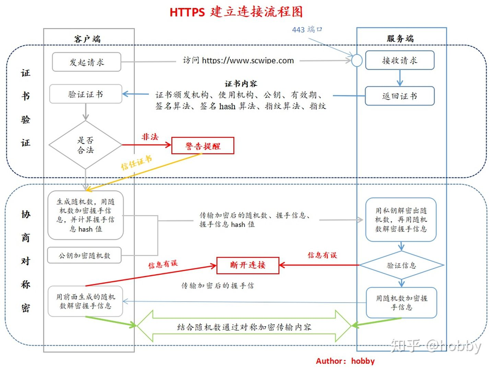

<h1 align="center">HTTPS建立连接详细过程</h1>

[TOC]

**一、客户端发起HTTPS连接**

当用户在浏览器（后文称作客户端）地址栏敲击[https://www.scwipe.com](https://link.zhihu.com/?target=https%3A//www.scwipe.com)时，浏览器去到dns服务器获取此url对应的ip，然后客户端连接上服务端的443端口，将此请求发送给到服务端，此时客户端同时将自己支持的加密算法带给服务端；

**二、服务端发送证书**

在讲这一段之前插播一条小知识点：私钥加密的密文只有公钥才能解开；公钥加密的密文只有私钥才能解开。

服务端收到这套加密算法的时候，和自己支持的加密算法进行对比（也就是和自己的私钥进行对比），如果不符合，就断开连接；如果符合，服务端就将CA证书发送给客户端，此证书中包括了数字证书包含的内容：1、证书颁发机构；2、使用机构；3、公钥；4、有效期；5、签名算法；6、签名hash算法；7、指纹算法；8、指纹。

这里服务端发送的东西是用私钥进行加密的，公钥都能解开，并不能保证发送的数据包不被别人看到，所以后面的过程会和客户端商量选择一个对称加密（只能用私钥解开，这里详情请移步[非对称、对称加解密相关问题](https://link.zhihu.com/?target=https%3A//blog.csdn.net/qq_24601199/article/details/104338962)）来对传输的数据进行加密。

**三、客户端验证服务端发来的证书**

**1、验证证书**

客户端验证收到的证书，包括发布机构是否合法、过期，证书中包含的网址是否与当前访问网址一致等等。

**2、生成随机数（此随机数就是后面用的对称加密的私钥）**

客户端验证证书无误后（或者接受了不信任的证书），会生成一个随机数，用服务端发过来的公钥进行加密。如此一来，此随机数只有服务端的私钥能解开了。

**3、生成握手信息**

用证书中的签名hash算法取握手信息的hash值，然后用生成的随机数对[握手信息和握手信息的hash值]进行加密，然后用公钥将随机数进行加密后，一起发送给服务端。其中计算握手信息的hash值，目的是为了保证传回到服务端的握手信息没有被篡改。

**四、服务端接收随机数加密的信息，并解密得到随机数，验证握手信息是否被篡改。**

服务端收到客户端传回来的用随机数加密的信息后，先**用私钥解密随机数**，然后用解密得到的**随机数解密握手信息**，获取握手信息和握手信息的hash值，计算自己发送的握手信息的hash值，与客户端传回来的进行对比验证。

如果验证无误，同样使用随机字符串加密握手信息和握手信息hash值发回给到客户端

**五、客户端验证服务端发送回来的握手信息，完成握手**

客户端收到服务端发送过来的握手信息后，用开始自己生成的随机数进行解密，验证被随机数加密的握手信息和握手信息hash值。

验证无误后，握手过程就完成了，从此服务端和客户端就开始用那串随机数进行对称加密通信了（常用的对称加密算法有AES）。

[HTTPS建立连接详细过程 - 知乎 (zhihu.com)](https://zhuanlan.zhihu.com/p/107573461)

