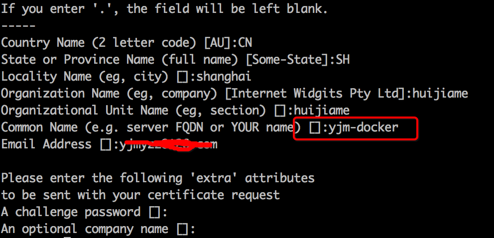

<h1 align="center">openssl、x509、crt、cer、key、csr、ssl、tls</h1>


今天尝试在mac机上搭建docker registry私有仓库时，杯具的发现最新的registry出于安全考虑，强制使用ssl认证，于是又详细了解linux/mac上openssl的使用方法，接触了一堆新英文缩写，整理于下：

TLS：传输层安全协议 Transport Layer Security的缩写

SSL：安全套接字层 Secure Socket Layer的缩写

TLS与SSL对于不是专业搞安全的开发人员来讲，可以认为是差不多的，这二者是并列关系，详细差异见 http://kb.cnblogs.com/page/197396/

KEY 通常指私钥。

CSR 是Certificate Signing Request的缩写，即证书签名请求，这不是证书，可以简单理解成公钥，生成证书时要把这个提交给权威的证书颁发机构。

CRT 即 certificate的缩写，即证书。

X.509 是一种证书格式.对X.509证书来说，认证者总是CA或由CA指定的人，一份X.509证书是一些标准字段的集合，这些字段包含有关用户或设备及其相应公钥的信息。

X.509的证书文件，一般以.crt结尾，根据该文件的内容编码格式，可以分为以下二种格式：

PEM - Privacy Enhanced Mail,打开看文本格式,以"-----BEGIN..."开头, "-----END..."结尾,内容是BASE64编码.
Apache和*NIX服务器偏向于使用这种编码格式.

DER - Distinguished Encoding Rules,打开看是二进制格式,不可读.
Java和Windows服务器偏向于使用这种编码格式

OpenSSL 相当于SSL的一个实现，如果把SSL规范看成OO中的接口，那么OpenSSL则认为是接口的实现。接口规范本身是安全没问题的，但是具体实现可能会有不完善的地方，比如之前的"心脏出血"漏洞，就是OpenSSL中的一个bug.

 

openssl 给自己颁发证书的步骤：

前提：先建一个cert目录，cd到该目录，以下所有命令的当前路径均为该目录

\1. 生成私钥KEY

```
openssl genrsa -des3 -out server.key 2048
```

这一步执行完以后，cert目录下会生成server.key文件

\2. 生成证书请求文件CSR

```
openssl req -new -key server.key -out server.csr
```

该命令先进入交互模式，让你填一堆东西，参考下图：


要注意的是Common Name这里，要填写成使用SSL证书(即：https协议)的域名或主机名，否则浏览器会认为不安全。例如：如果以后打算用https://yjm-docker/xxx 这里就填写yjm-docker

\3. 生成CA的证书

前面提过X.509证书的认证者总是CA或由CA指定的人，所以得先生成一个CA的证书

```
openssl req -new -x509 -key server.key -out ca.crt -days 3650
```

\4. 最后用第3步的CA证书给自己颁发一个证书玩玩

```
openssl x509 -req -days 3650 -``in` `server.csr \`` ``-CA ca.crt -CAkey server.key \`` ``-CAcreateserial -out server.crt
```

执行完以后，cert目录下server.crt 就是我们需要的证书。当然，如果要在google等浏览器显示出安全的绿锁标志，自己颁发的证书肯定不好使，得花钱向第三方权威证书颁发机构申请(即：第4步是交给权威机构来做，我们只需要提交server.key、server.csr，哦，还有毛爷爷就好了)