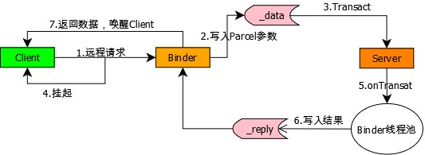
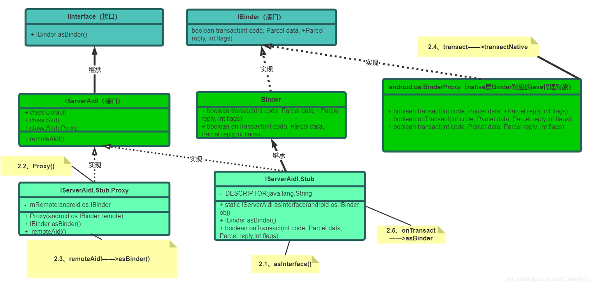
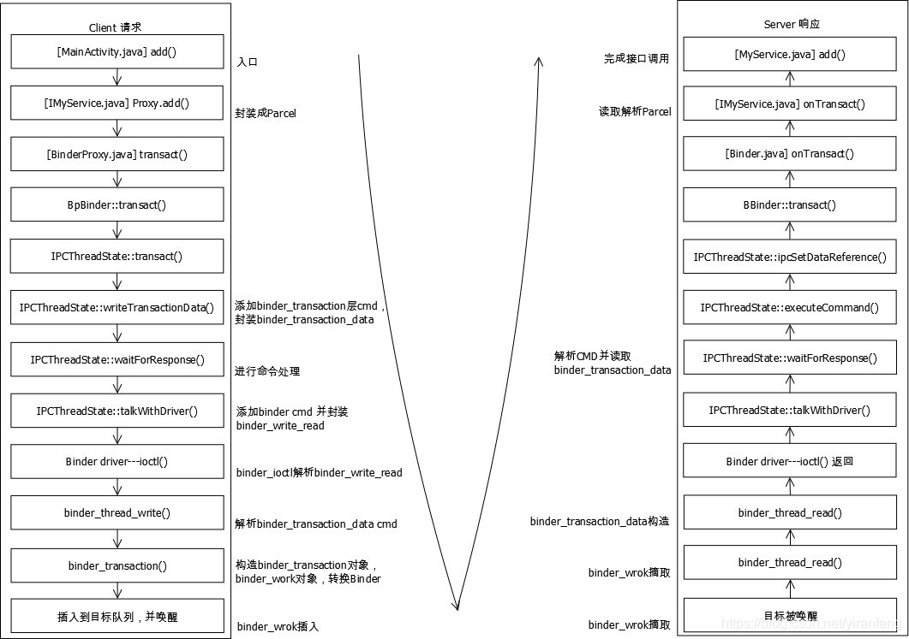

<h1 align="center">AIDL原理分析-Proxy-Stub设计模式</h1>

[TOC]

## 1.什么是AIDL

AIDL:Android Interface Definition Language，即Android接口定义语言。

Android系统中的进程之间不能共享内存，因此，需要提供一些机制在不同进程之间进行数据通信。为了使其他的应用程序也可以访问本应用程序提供的服务，Android系统采用了远程过程调用（Remote Procedure Call，RPC）方式来实现。与很多其他的基于RPC的解决方案一样，Android使用一种接口定义语言（Interface Definition Language，IDL）来公开服务的接口。我们知道4个Android应用程序组件中的3个（Activity、BroadcastReceiver和ContentProvider）都可以进行跨进程访问，另外一个Android应用程序组件Service同样可以。因此，可以将这种可以跨进程访问的服务称为AIDL（Android Interface Definition Language）服务。

 

## 2.为什么要用AIDL

Android中每个应用都是独立的进程，拥有自己的虚拟机，虚拟地址，应用之间的内存不仅不能互相访问，而且存在应用隔离，因此两个应用不能像面向对象语言一样直接进行接口的调用。两个进程之间的调用叫做IPC(进程间通信)。在Binder的起始章节，我们了解到Android中进程之间的IPC调用有：管道、共享内存、消息队列、信号量、socket、binder，在《Binder入门篇》中，从性能、安全角度分别讲解了各个IPC通信的优缺点，最终我们选择了Binder。

那么既然我们有了Binder，为什么还要有AIDL呢？

在我们前面的 《Framrwork binder示例》 中，我们知道，通过binder来进行client\server时，我们写了完成的服务创建和client获取流程，在上一节AIDL示例中，我们写完AIDL 编译后，发现生成的IMyService.java文件就和我们在Framework中写的类似，`AIDL简化了Binder的代码逻辑，把跟Service交互的逻辑通过工具编译来生成`。

 

## 4.AIDL通信流程
Client 端和Server端使用同一个AIDL，连包名都需要保持一致。

Server端继承自Service，重载一个onBind()，返回服务实体Stub()，Stub提供了一个asInterface(Binder)的方法，如果是在同一个进程下那么asInterface()将返回Stub对象本身，否则返回Stub.Proxy对象.

Code:

```java
IMyService.Stub mStub = new IMyService.Stub(){...};
	@Override
    public IBinder onBind(Intent intent) {
        Log.d(TAG,"onBind");
        return mStub; // 通过ServiceConnection在activity中拿到MyService
}
```

Client 绑定服务时通过拿到服务Stub.asInterface返回的服务的代理Stub.Proxy()

Code:

```java
myService = IMyService.Stub.asInterface(service);
```

Client和Server交互的简单示意流程：


从上面的示例来看，服务本地拿到了AIDL生成的服务实体Stub()， Client绑定服务后，拿到了服务的代理Stub.proxy()。这和我们在前面Framewok层讲解的比较类似了，Client拿到BinderProxy对象，Server拿到Binder实体对象。

AIDL在这里用到了一个Proxy-Stub  (代理-存根)的设计模式，下面我们就这种设计模式来展开说明一下。

Binder通信的数据流转如下图所示：



## 5.proxy-stub 设计模式
Proxy将特殊性接口转换成通用性接口，Stub将通用性接口转换成特殊性接口，二者之间的数据转换通过Parcel(打包)进行的，Proxy常作为数据发送代理，通过Parcel将数据打包发送，Stub常作为数据接收桩，解包并解析Parcel Data package。


**举例理解Proxy-Stub：**

假如我们现在要看电视，我是客户Client，遥控器是代理Proxy，电视机是实体(播放画面，展示功能)，遥控器传给电视机的蓝牙、红外参数为Parcel数据。

我按下了遥控器的一些按键-提升音量，遥控器之前跟电视机做了绑定，可以拿到电视机的对象--实体Stub，把按键的操作组装成一个Parcel数据，发给电视机-Server，电视机-Server拿到请求后，执行相应的处理-提升音量，结果返回给遥控器，我们操作完成(这一步其实没有，我们只是假想一下)。这样就完成了Proxy-Stub的数据交互流程。

 

**Proxy和Stub的说明：**

Stub 跟 Proxy 是一对，俗称“代理-存根”，一般用在远程方法调用
Proxy 的接口供客户端程序调用，然后它内部会把信息包装好，以某种方式传递给 Stub，而后者通过对应的接口作用于服务端系统，从而完成了“远程调用”
AIDL中，Stub为服务实体；Stub.Proxy()为服务的代理，都是通过Stub.asInterface(IBinder)中获取，可以通过AIDL生成的java文件看出。

```java
public static com.android.myservice.IMyService asInterface(android.os.IBinder obj)
{
    if ((obj==null)) {
        return null;
    }
    android.os.IInterface iin = obj.queryLocalInterface(DESCRIPTOR);
    if (((iin!=null)&&(iin instanceof com.android.myservice.IMyService))) {
        return ((com.android.myservice.IMyService)iin); //如果是同一进程，返回的是服务Stub本身
    }
    return new com.android.myservice.IMyService.Stub.Proxy(obj); //如果是不同进程，则返回Stub.Proxy()代理
}
```

## 6.AIDL原理分析



在上一节，IMyService.aidl编译后，Android Studio自动生成了IMyService.java文件，我们来看看这个文件的内容：

Code:IMyService.java

```java
/*
 * This file is auto-generated.  DO NOT MODIFY.
 */
package com.android.myservice;
// Declare any non-default types here with import statements
 
public interface IMyService extends android.os.IInterface
{
  /** Local-side IPC implementation stub class. */
  public static abstract class Stub extends android.os.Binder implements com.android.myservice.IMyService
{
    private static final java.lang.String DESCRIPTOR = "com.android.myservice.IMyService";
    /** Construct the stub at attach it to the interface. */
    public Stub()
{
      this.attachInterface(this, DESCRIPTOR);
    }
 
    /**
     * Cast an IBinder object into an com.android.myservice.IMyService interface,
     * generating a proxy if needed.
     */
    public static com.android.myservice.IMyService asInterface(android.os.IBinder obj)
{
      if ((obj==null)) {
        return null;
      }
      android.os.IInterface iin = obj.queryLocalInterface(DESCRIPTOR);
      if (((iin!=null)&&(iin instanceof com.android.myservice.IMyService))) {
        return ((com.android.myservice.IMyService)iin);
      }
      return new com.android.myservice.IMyService.Stub.Proxy(obj);
    }
 
    @Override public android.os.IBinder asBinder()
{
      return this;
    }
 
    @Override public boolean onTransact(int code, android.os.Parcel data, android.os.Parcel reply, int flags) throws android.os.RemoteException
{
      java.lang.String descriptor = DESCRIPTOR;
      switch (code)
      {
        case INTERFACE_TRANSACTION:
        {
          reply.writeString(descriptor);
          return true;
        }
        case TRANSACTION_basicTypes:
        {
          data.enforceInterface(descriptor);
          int _arg0;
          _arg0 = data.readInt();
          long _arg1;
          _arg1 = data.readLong();
          boolean _arg2;
          _arg2 = (0!=data.readInt());
          float _arg3;
          _arg3 = data.readFloat();
          double _arg4;
          _arg4 = data.readDouble();
          java.lang.String _arg5;
          _arg5 = data.readString();
          this.basicTypes(_arg0, _arg1, _arg2, _arg3, _arg4, _arg5);
          reply.writeNoException();
          return true;
        }
        case TRANSACTION_add:
        {
          data.enforceInterface(descriptor);
          int _arg0;
          _arg0 = data.readInt();
          int _arg1;
          _arg1 = data.readInt();
          int _result = this.add(_arg0, _arg1);
          reply.writeNoException();
          reply.writeInt(_result);
          return true;
        }
        default:
        {
          return super.onTransact(code, data, reply, flags);
        }
      }
    }
 
    private static class Proxy implements com.android.myservice.IMyService
{
      private android.os.IBinder mRemote;
      Proxy(android.os.IBinder remote)
      {
        mRemote = remote;
      }
 
      @Override public android.os.IBinder asBinder()
{
        return mRemote;
      }
 
      public java.lang.String getInterfaceDescriptor()
{
        return DESCRIPTOR;
      }
 
      /**
       * Demonstrates some basic types that you can use as parameters
       * and return values in AIDL.
       */
      @Override public void basicTypes(int anInt, long aLong, boolean aBoolean, float aFloat, double aDouble, java.lang.String aString) throws android.os.RemoteException
{
        android.os.Parcel _data = android.os.Parcel.obtain();
        android.os.Parcel _reply = android.os.Parcel.obtain();
        try {
          _data.writeInterfaceToken(DESCRIPTOR);
          _data.writeInt(anInt);
          _data.writeLong(aLong);
          _data.writeInt(((aBoolean)?(1):(0)));
          _data.writeFloat(aFloat);
          _data.writeDouble(aDouble);
          _data.writeString(aString);
          mRemote.transact(Stub.TRANSACTION_basicTypes, _data, _reply, 0);
          _reply.readException();
        }
        finally {
          _reply.recycle();
          _data.recycle();
        }
      }
      @Override public int add(int num1, int num2) throws android.os.RemoteException
{
        android.os.Parcel _data = android.os.Parcel.obtain();
        android.os.Parcel _reply = android.os.Parcel.obtain();
        int _result;
        try {
          _data.writeInterfaceToken(DESCRIPTOR);
          _data.writeInt(num1);
          _data.writeInt(num2);
          mRemote.transact(Stub.TRANSACTION_add, _data, _reply, 0);
          _reply.readException();
          _result = _reply.readInt();
        }
        finally {
          _reply.recycle();
          _data.recycle();
        }
        return _result;
      }
    }
    static final int TRANSACTION_basicTypes = (android.os.IBinder.FIRST_CALL_TRANSACTION + 0);
    static final int TRANSACTION_add = (android.os.IBinder.FIRST_CALL_TRANSACTION + 1);
  }
  /**
   * Demonstrates some basic types that you can use as parameters
   * and return values in AIDL.
   */
  public void basicTypes(int anInt, long aLong, boolean aBoolean, float aFloat, double aDouble, String aString) throws android.os.RemoteException;
  public int add(int num1, int num2) throws android.os.RemoteException;
}
```

```java
onTransact(int code, android.os.Parcel data, android.os.Parcel reply, int flags)
```

* code：方法标识符，在相同进程中，我们很容易的通过方法调用来执行我们的目标方法，但是在不同的进程间，方法调用的方式就不能再用了，所以我们使用code来表示远程调用函数的标识。这个标识必须介于FIRST_CALL_TRANSACTION（0x00000001）和LAST_CALL_TRANSACTION（0x00ffffff）之间。
* data：客户端请求发送的参数
* reply：服务器端返回的结果
* flags：用来区分这个调用是普通调用还是单程调用，普通调用时，Client端线程会阻塞，直到从Server端接收到返回值，若flag==IBinder.FLAG_ONEWAY，则这次调用是单程调用，Client在传出数据后会立即执行下一段代码，此时两端异步执行，单程调用时函数返回值必须为void （也就是单程调用必须舍弃返回值，要返回值就必须阻塞等待）

**IMyService.java 的说明：**

1. 有一个Stub的抽象类，Stub中又有一个Proxy的抽象类
2. Stub.asInterface(IBinder) 会根据是同一进程通信，还是不同进程通信，返回Stub()实体，或者Stub.Proxy()代理对象
3. Stub()的Binder实体中有个onTransact()函数，在前面的一些Binder Native、Framework的流程，我们知道，服务最终处理的入口就是onTransact()，这里会解析Client传来的 TRANSACTION code ，解析Parcel数据，调用对应的服务接口处理
4. Proxy()中存在一个asBinder()，返回的对象为mRemote，就如我们前面Framework了解的，对应的其实是BinderProxy对象。
5. Proxy()组装了Client中的AIDL接口的核心实现，组装Parcel数据，调用BinderProxy()的transact()发送TRANSACTION code


**AIDL的具体流程如下：**

1. Client和Server都使用同一个AIDL文件，包名相同，编译后，两边都会生成IMyService.java,其中有Stub实体和Proxy代理两个对象
2. Server端通过AndroidManifest.xml 注册Service
3. Client通过bindService()获得服务的代理Stub.Proxy()
4. Client 调用AIDL的方法add()，其实调用的是IMyService.java中的Stub.Proxy.add(),最终通过BinderProxy.java的transact()向服务端发送
5. 通过Binder驱动的流程，进入到服务端的onTransact()，根据Client发送的TRANSACTION code，解析进入相应的流程处理，进入add()
6. MyService在被绑定时，有了实体IMyService.Stub，最终进入MyService.java的add()处理，完成接口调用，调用完成后把数据写入Parcel，通过reply发送给Client



## 7.AIDL的配置方法
AIDL 使用一种简单语法，允许您通过一个或多个方法（可接收参数和返回值）来声明接口。参数和返回值可为任意类型，甚至是 AIDL 生成的其他接口。

您必须使用 Java 编程语言构建 .aidl 文件。每个 .aidl 文件均须定义单个接口，并且只需要接口声明和方法签名。

**默认情况下，AIDL 支持下列数据类型：**

* Java的8种数据类型：byte、short、int、long、float、double、boolean、char
* String
* CharSequence
* List：List 中的所有元素必须是以上列表中支持的数据类型，或者您所声明的由 AIDL 生成的其他接口或 Parcelable 类型。您可选择将 List 用作“泛型”类（例如，List<String>）。尽管生成的方法旨在使用 List 接口，但另一方实际接收的具体类始终是 ArrayList。

* Map：Map 中的所有元素必须是以上列表中支持的数据类型，或者您所声明的由 AIDL 生成的其他接口或 Parcelable 类型。不支持泛型 Map（如 Map<String,Integer> 形式的 Map）。尽管生成的方法旨在使用 Map 接口，但另一方实际接收的具体类始终是 HashMap。
* 自定义数据类型（序列化）

 

**定义服务接口时，请注意：**

方法可带零个或多个参数，返回值或空值。

所有非原语参数均需要指示数据走向的方向标记。这类标记可以是 in、out 或 inout（见下方示例）。

原语默认为 in，不能是其他方向。

 

oneway 关键字用于修改远程调用的行为。使用此关键字后，远程调用不会屏蔽，而只是发送事务数据并立即返回。最终接收该数据时，接口的实现会将其视为来自 Binder 线程池的常规调用（普通的远程调用）。如果 oneway 用于本地调用，则不会有任何影响，且调用仍为同步调用。

 

## 8.总结
Client 通过Proxy向Server进行请求，最终进入Binder Driver，binder根据不同的事务处理，发送给Binder实体，实体中根据不同的TRANSACTION code转入不同的逻辑处理，处理完得到结果后，会把数据组装为Parcel，通过reply发送出来，Client收到reply的数据，进行最终流程处理。


## 参考

https://blog.csdn.net/yiranfeng/article/details/105314318

https://www.jianshu.com/p/88ddb543265e

[Android-你真的懂AIDL的oneway嘛？_嵌入式Linux-CSDN博客](https://blog.csdn.net/weiqifa0/article/details/104284978)

