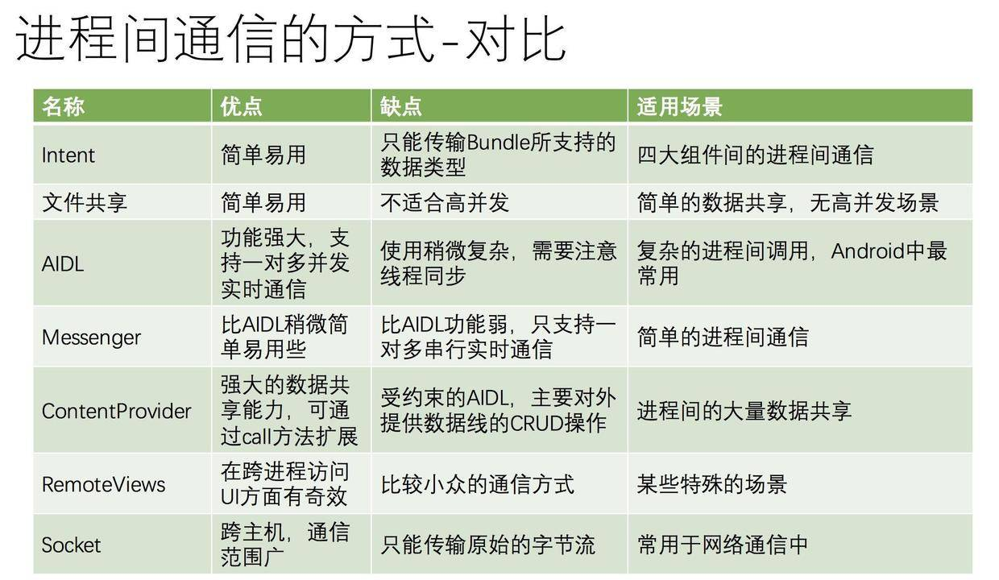
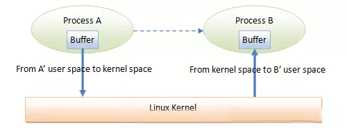
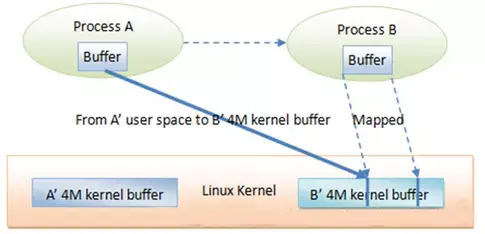
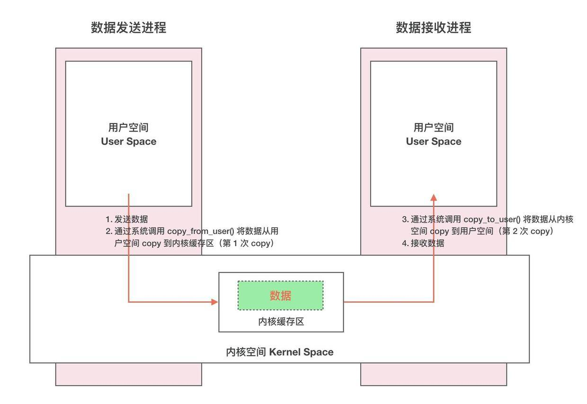
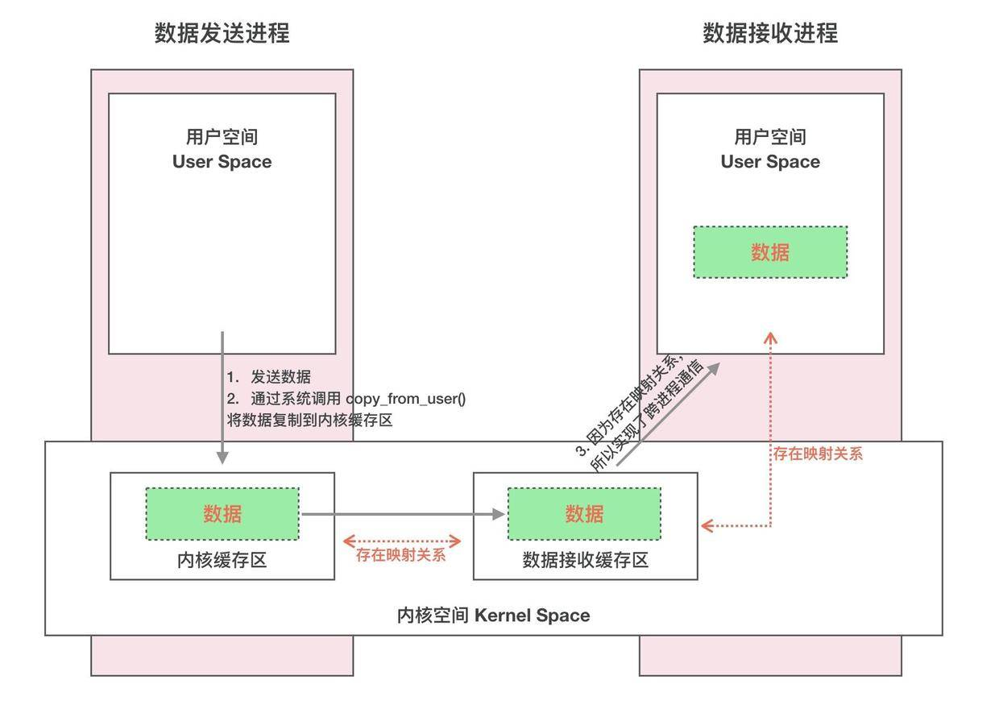
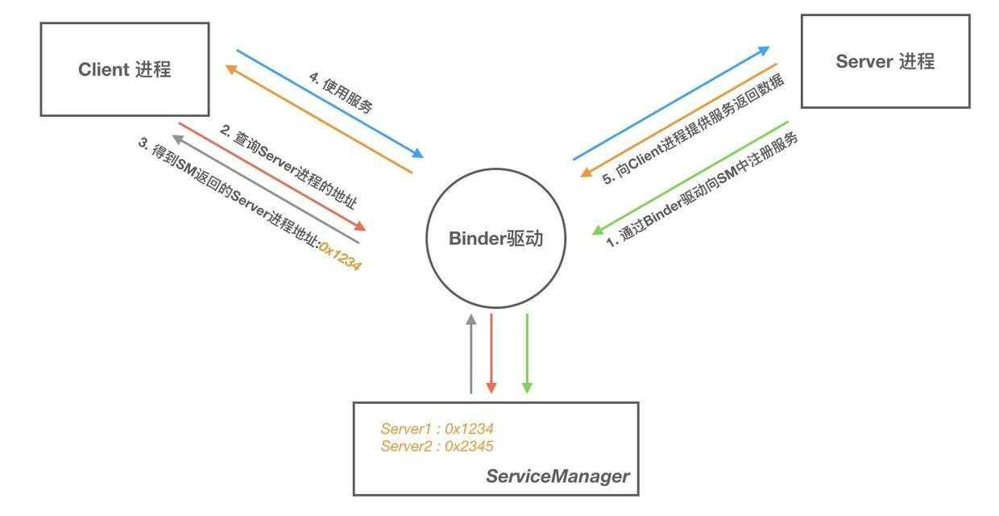
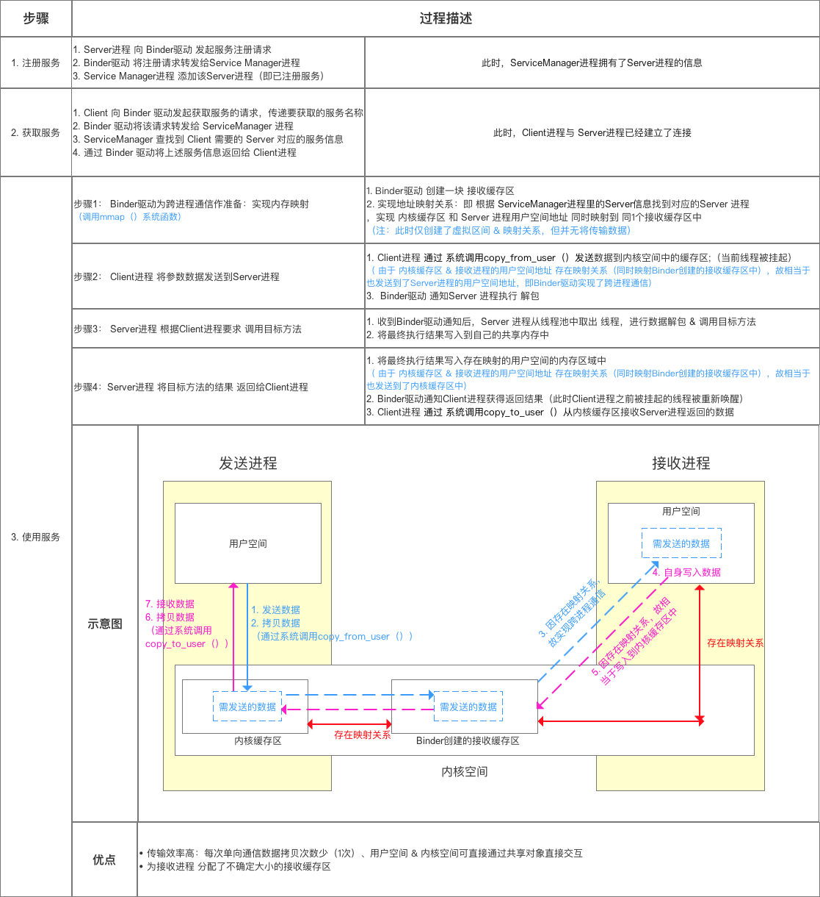

<h1 align="center">Android IPC</h1>

[toc]

> IPC 即 Inter-Process Communication (进程间通信)。Android 基于 Linux，而 Linux 出于安全考虑，不同进程间不能之间操作对方的数据，这叫做“进程隔离”。
>
> 在 Linux 系统中，虚拟内存机制为每个进程分配了线性连续的内存空间，操作系统将这种虚拟内存空间映射到物理内存空间，每个进程有自己的虚拟内存空间，进而不能操作其他进程的内存空间，只有操作系统才有权限操作物理内存空间。 进程隔离保证了每个进程的内存安全。

## IPC方式

| 名称            | 优点                                                         | 缺点                                                         | 适用场景                                                     |
| --------------- | ------------------------------------------------------------ | ------------------------------------------------------------ | ------------------------------------------------------------ |
| Bundle          | 简单易用                                                     | 只能传输 Bundle 支持的数据类型                               | 四大组件间的进程间通信                                       |
| 文件共享        | 简单易用                                                     | 不适合高并发场景，并且无法做到进程间即时通信                 | 无并发访问情形，交换简单的数据实时性不高的场景               |
| AIDL            | 功能强大，支持一对多并发通信，支持实时通信                   | 使用稍复杂，需要处理好线程同步                               | 一对多通信且有 RPC 需求                                      |
| Messenger       | 功能一般，支持一对多串行通信，支持实时通信                   | 不能很处理高并发清醒，不支持 RPC，数据通过 Message 进行传输，因此只能传输 Bundle 支持的数据类型 | 低并发的一对多即时通信，无RPC需求，或者无需返回结果的RPC需求 |
| ContentProvider | 在数据源访问方面功能强大，支持一对多并发数据共享，可通过 Call 方法扩展其他操作 | 可以理解为受约束的 AIDL，主要提供数据源的 CRUD 操作          | 一对多的进程间数据共享                                       |
| Socket          | 可以通过网络传输字节流，支持一对多并发实时通信               | 实现细节稍微有点烦琐，不支持直接的RPC                        | 网络数据交换                                                 |

## Binder

Binder 是 Android 中的一个类，实现了 IBinder 接口。从 IPC 角度来说，Binder 是 Android 中的一种扩进程通信方方式。从 Android 应用层来说，Binder 是客户端和服务器端进行通信的媒介，当 bindService 的时候，服务端会返回一个包含了服务端业务调用的 Binder 对象。

Binder 相较于传统 IPC 来说更适合于Android系统，具体原因的包括如下三点：

- Binder 本身是 C/S 架构的，这一点更符合 Android 系统的架构
- 性能上更有优势：管道，消息队列，Socket 的通讯都需要两次数据拷贝，而 Binder 只需要一次。要知道，对于系统底层的 IPC 形式，少一次数据拷贝，对整体性能的影响是非常之大的
- 安全性更好：传统 IPC 形式，无法得到对方的身份标识（UID/GID)，而在使用 Binder IPC 时，这些身份标示是跟随调用过程而自动传递的。Server 端很容易就可以知道 Client 端的身份，非常便于做安全检查

示例：

- **新建AIDL接口文件**

``RemoteService.aidl``

```java
package com.example.mystudyapplication3;

interface IRemoteService {

    int getUserId();

}
```

系统会自动生成 ``IRemoteService.java``:

```java
/*
 * This file is auto-generated.  DO NOT MODIFY.
 */
package com.example.mystudyapplication3;
// Declare any non-default types here with import statements
//import com.example.mystudyapplication3.IUserBean;

public interface IRemoteService extends android.os.IInterface {
    /**
     * Local-side IPC implementation stub class.
     */
    public static abstract class Stub extends android.os.Binder implements com.example.mystudyapplication3.IRemoteService {
        private static final java.lang.String DESCRIPTOR = "com.example.mystudyapplication3.IRemoteService";

        /**
         * Construct the stub at attach it to the interface.
         */
        public Stub() {
            this.attachInterface(this, DESCRIPTOR);
        }

        /**
         * Cast an IBinder object into an com.example.mystudyapplication3.IRemoteService interface,
         * generating a proxy if needed.
         */
        public static com.example.mystudyapplication3.IRemoteService asInterface(android.os.IBinder obj) {
            if ((obj == null)) {
                return null;
            }
            android.os.IInterface iin = obj.queryLocalInterface(DESCRIPTOR);
            if (((iin != null) && (iin instanceof com.example.mystudyapplication3.IRemoteService))) {
                return ((com.example.mystudyapplication3.IRemoteService) iin);
            }
            return new com.example.mystudyapplication3.IRemoteService.Stub.Proxy(obj);
        }

        @Override
        public android.os.IBinder asBinder() {
            return this;
        }

        @Override
        public boolean onTransact(int code, android.os.Parcel data, android.os.Parcel reply, int flags) throws android.os.RemoteException {
            java.lang.String descriptor = DESCRIPTOR;
            switch (code) {
                case INTERFACE_TRANSACTION: {
                    reply.writeString(descriptor);
                    return true;
                }
                case TRANSACTION_getUserId: {
                    data.enforceInterface(descriptor);
                    int _result = this.getUserId();
                    reply.writeNoException();
                    reply.writeInt(_result);
                    return true;
                }
                default: {
                    return super.onTransact(code, data, reply, flags);
                }
            }
        }

        private static class Proxy implements com.example.mystudyapplication3.IRemoteService {
            private android.os.IBinder mRemote;

            Proxy(android.os.IBinder remote) {
                mRemote = remote;
            }

            @Override
            public android.os.IBinder asBinder() {
                return mRemote;
            }

            public java.lang.String getInterfaceDescriptor() {
                return DESCRIPTOR;
            }

            @Override
            public int getUserId() throws android.os.RemoteException {
                android.os.Parcel _data = android.os.Parcel.obtain();
                android.os.Parcel _reply = android.os.Parcel.obtain();
                int _result;
                try {
                    _data.writeInterfaceToken(DESCRIPTOR);
                    mRemote.transact(Stub.TRANSACTION_getUserId, _data, _reply, 0);
                    _reply.readException();
                    _result = _reply.readInt();
                } finally {
                    _reply.recycle();
                    _data.recycle();
                }
                return _result;
            }
        }

        static final int TRANSACTION_getUserId = (android.os.IBinder.FIRST_CALL_TRANSACTION + 0);
    }

    public int getUserId() throws android.os.RemoteException;
}
```

| 方法                     | 含义                                                         |
| ------------------------ | ------------------------------------------------------------ |
| DESCRIPTOR               | Binder 的唯一标识，一般用当前的 Binder 的类名表示            |
| asInterface(IBinder obj) | 将服务端的 Binder 对象成客户端所需的 AIDL 接口类型对象，这种转换过程是区分进程的，如果位于同一进程，返回的就是 Stub 对象本身，否则返回的是系统封装后的 Stub.proxy 对象。 |
| asBinder                 | 用于返回当前 Binder 对象                                     |
| onTransact               | 运行在服务端中的 Binder 线程池中，远程请求会通过系统底层封装后交由此方法来处理 |

| 定向 tag | 含义                                                         |
| -------- | ------------------------------------------------------------ |
| in       | 数据只能由客户端流向服务端，服务端将会收到客户端对象的完整数据，客户端对象不会因为服务端对传参的修改而发生变动。 |
| out      | 数据只能由服务端流向客户端，服务端将会收到客户端对象，该对象不为空，但是它里面的字段为空，但是在服务端对该对象作任何修改之后客户端的传参对象都会同步改动。 |
| inout    | 服务端将会接收到客户端传来对象的完整信息，并且客户端将会同步服务端对该对象的任何变动。 |

### 流程


## AIDL 通信

Android Interface Definition Language

使用示例：

- **新建AIDL接口文件**

```java
// RemoteService.aidl
package com.example.mystudyapplication3;

interface IRemoteService {

    int getUserId();

}
```

- **创建远程服务**

```java
public class RemoteService extends Service {

    private int mId = -1;

    private Binder binder = new IRemoteService.Stub() {

        @Override
        public int getUserId() throws RemoteException {
            return mId;
        }
    };

    @Nullable
    @Override
    public IBinder onBind(Intent intent) {
        mId = 1256;
        return binder;
    }
}
```

- **声明远程服务**

```java
<service
    android:name=".RemoteService"
    android:process=":aidl" />
```

- **绑定远程服务**

```java
public class MainActivity extends AppCompatActivity {

    public static final String TAG = "wzq";

    IRemoteService iRemoteService;
    private ServiceConnection mConnection = new ServiceConnection() {
        @Override
        public void onServiceConnected(ComponentName name, IBinder service) {
            iRemoteService = IRemoteService.Stub.asInterface(service);
            try {
                Log.d(TAG, String.valueOf(iRemoteService.getUserId()));
            } catch (RemoteException e) {
                e.printStackTrace();
            }
        }

        @Override
        public void onServiceDisconnected(ComponentName name) {
            iRemoteService = null;
        }
    };

    @Override
    protected void onCreate(Bundle savedInstanceState) {
        super.onCreate(savedInstanceState);
        setContentView(R.layout.activity_main);
        bindService(new Intent(MainActivity.this, RemoteService.class), mConnection, Context.BIND_AUTO_CREATE);
    }
}
```

## Messenger

Messenger可以在不同进程中传递 Message 对象，在Message中放入我们需要传递的数据，就可以轻松地实现数据的进程间传递了。Messenger 是一种轻量级的 IPC 方案，底层实现是 AIDL。

## 管道

管道是进程间通信中最古老的方式，所有UNIX都提供此种通信机制。管道有以下两种局限性：

1. 历史上，他们是半双工的（即数据只能在一个方向上流动）。
2. 管道只能在具有公共祖先的两个进程间使用。通常，一个管道由一个进程创建，在进程调用fork之后，这个管道就能在父进程和子进程之间使用了。

FIFO没有第二种局限性。
尽管有这两种局限性，半双工管道仍然是最常用的IPC形式。

管道由pipe()函数创建：

```
#include <unistd.h>
int pipe(int fd[2]);  返回值：若成功，返回0，若出错，返回-1
参数fd返回两个文件描述符：fd[0]为读而打开，fd[1]为写而打开。fd[1]的输出是fd[0]的输入。
```

通常，进程会先调用pipe，接着调用fork，从而创建从父进程到子进程的IPC通道，反之亦然。fork之后做什么取决于我们想要的数据流的方向。
对于从父进程到子进程的管道：父进程关闭管道的读端（fd[0]），子进程关闭写端（fd[1]）。
对于从子进程到父进程的管道：父进程关闭管道的写端（fd[1]），子进程关闭读端（fd[0]）。

## FIFO

FIFO有时被称为命名管道，通过FIFO，不相关的进程也能交换数据。
FIFO由mkfifo()函数创建：

```
#include <sys/stat.h>
int mkfifo(const char *path, mode_t mode);   返回值：若成功，返回0，若出错，返回-1
```

FIFO有如下两种用途：

1. shell命令使用FIFO函数将数据从一条管道传送到另一条时，无需创建中间临时文件。
2. 客户进程-服务器进程应用程序中，FIFO用作汇聚点，在客户进程和服务器进程二者之间传递数据。

## 消息队列

消息队列是消息的链接表，存储在内核中，由消息队列标识符标识。
客户进程和服务器进程之间的双向数据流。

msgget用于创建一个新队列或打开一个现有队列，msgsnd将新消息添加到队列尾端，每个消息包含一个正的长整型类型的字段、一个非负的长度（nbytes）以及实际数据字节数（对应于长度），msgrcv用于从队列中取消息。

```
#include <sys/msg.h>
int msgget(key_t key, int flag);  返回值：若成功，返回消息队列ID，若出错，返回-1
int msgsnd(int msgid, const void *ptr, size_t nbytes, int flag);  返回值：若成功，返回0，若出错，返回-1
ssize_t msgrcv(int msqid, void *ptr, size_t nbytes, long type, int flag);  返回值：若成功，返回消息数据部分的长度，若出错，返回-1 
```

## 信号量

本质上，信号量是一个计数器，用于为多个进程提供对共享数据对象的访问。
维护信号量状态的是Linux内核操作系统而不是用户进程。

一般说来，为了获得共享资源，进程需要执行下列操作：

1. 测试控制该资源的信号量。
2. 若此信号量的值为正，则允许进行使用该资源。进程将信号量减1。
3. 若此信号量为0，则该资源目前不可用，进程进入睡眠状态，直至信号量值大于0，进程被唤醒，转入步骤（1）。
4. 当进程不再使用一个信号量控制的资源时，信号量值加1。如果此时有进程正在睡眠等待此信号量，则唤醒此进程。

## 共享存储

共享存储允许两个或多个进程共享一个给定的存储区。因为数据不需要在客户进程和服务器进程之间复制，所以这是最快的一种IPC。
通常，信号量被用来实现对共享存储数据存取的同步。（也可以用记录锁或互斥量）

shmget获得一个共享存储标识符，shmctl对共享存储段执行多种操作，shmat将共享存储段连接到它的地址空间。

```
#include<sys/shm.h>
int shmget(key_t key, size_t size, int flag); 返回值：若成功，返回共享存储ID；若出错，返回-1
int shmctl(int shmid, int cmd, struct shmid_ds *buf); 返回值：若成功，返回0；若出错，返回-1
void *shmat(int shmid, const void *addr, int flag); 返回值：若成功，返回指向共享存储段的指针；若出错，返回-1 
```

## 网络IPC：套接字

不同计算机（通过网络相连）上的进程相互通信的机制：网络进程间通信（network IPC）。
套接字是通信端点的抽象。正如使用文件描述符访问文件，应用程序用套接字描述符访问套接字。

socket创建一个套接字，shutdown禁止一个套接字的I/O。

```
#include <sys/socket.h>
int socket(int domain, int type, int protocol);  返回值：若成功，返回文件（套接字）描述符，若出错，返回-1
int shutdown(int sockfd, int how);  返回值：若成功，返回0，若出错，返回-1
```

## Android中进程和线程的关系？区别？

- 线程是CPU调度的最小单元，同时线程是一种有限的系统资源；而进程一般指一个执行单元，在PC和移动设备上指一个程序或者一个应用。
- 一般来说，一个App程序至少有一个进程，一个进程至少有一个线程（包含与被包含的关系），通俗来讲就是，在App这个工厂里面有一个进程，线程就是里面的生产线，但主线程（即主生产线）只有一条，而子线程（即副生产线）可以有多个。
- 进程有自己独立的地址空间，而进程中的线程共享此地址空间，都可以并发执行。

## 如何开启多进程？应用是否可以开启N个进程？

在AndroidManifest中给四大组件指定属性android:process开启多进程模式，在内存允许的条件下可以开启N个进程。

## 为何需要IPC？多进程通信可能会出现的问题？

所有运行在不同进程的四大组件（Activity、Service、Receiver、ContentProvider）共享数据都会失败，这是由于Android为每个应用分配了独立的虚拟机，不同的虚拟机在内存分配上有不同的地址空间，这会导致在不同的虚拟机中访问同一个类的对象会产生多份副本。比如常用例子（通过开启多进程获取更大内存空间、两个或者多个应用之间共享数据、微信全家桶）。

一般来说，使用多进程通信会造成如下几方面的问题:

- 静态成员和单例模式完全失效：独立的虚拟机造成。
- 线程同步机制完全失效：独立的虚拟机造成。
- SharedPreferences的可靠性下降：这是因为Sp不支持两个进程并发进行读写，有一定几率导致数据丢失。
- Application会多次创建：Android系统在创建新的进程时会分配独立的虚拟机，所以这个过程其实就是启动一个应用的过程，自然也会创建新的Application。

## Android中IPC方式、各种方式优缺点？

[](https://camo.githubusercontent.com/3cbb8b7584d11e562e95ce91e22380fc8755f293e54d9a490c947bfedf6a85dc/68747470733a2f2f757365722d676f6c642d63646e2e786974752e696f2f323031392f332f382f313639356331616232616162663738303f696d616765736c696d)

## 讲讲AIDL？如何优化多模块都使用AIDL的情况？

AIDL(Android Interface Definition Language，Android接口定义语言)：如果在一个进程中要调用另一个进程中对象的方法，可使用AIDL生成可序列化的参数，AIDL会生成一个服务端对象的代理类，通过它客户端可以实现间接调用服务端对象的方法。

AIDL的本质是系统提供了一套可快速实现Binder的工具。关键类和方法：

- AIDL接口：继承IInterface。
- Stub类：Binder的实现类，服务端通过这个类来提供服务。
- Proxy类：服务端的本地代理，客户端通过这个类调用服务端的方法。
- asInterface()：客户端调用，将服务端返回的Binder对象，转换成客户端所需要的AIDL接口类型的对象。如果客户端和服务端位于同一进程，则直接返回Stub对象本身，否则返回系统封装后的Stub.proxy对象。
- asBinder()：根据当前调用情况返回代理Proxy的Binder对象。
- onTransact()：运行在服务端的Binder线程池中，当客户端发起跨进程请求时，远程请求会通过系统底层封装后交由此方法来处理。
- transact()：运行在客户端，当客户端发起远程请求的同时将当前线程挂起。之后调用服务端的onTransact()直到远程请求返回，当前线程才继续执行。

当有多个业务模块都需要AIDL来进行IPC，此时需要为每个模块创建特定的aidl文件，那么相应的Service就会很多。必然会出现系统资源耗费严重、应用过度重量级的问题。解决办法是建立Binder连接池，即将每个业务模块的Binder请求统一转发到一个远程Service中去执行，从而避免重复创建Service。

工作原理：每个业务模块创建自己的AIDL接口并实现此接口，然后向服务端提供自己的唯一标识和其对应的Binder对象。服务端只需要一个Service并提供一个queryBinder接口，它会根据业务模块的特征来返回相应的Binder对象，不同的业务模块拿到所需的Binder对象后就可以进行远程方法的调用了。

## 为什么选择Binder？

为什么选用Binder，在讨论这个问题之前，我们知道Android也是基于Linux内核，Linux现有的进程通信手段有以下几种：

- 管道：在创建时分配一个page大小的内存，缓存区大小比较有限；
- 消息队列：信息复制两次，额外的CPU消耗；不合适频繁或信息量大的通信；
- 共享内存：无须复制，共享缓冲区直接附加到进程虚拟地址空间，速度快；但进程间的同步问题操作系统无法实现，必须各进程利用同步工具解决；
- 套接字：作为更通用的接口，传输效率低，主要用于不同机器或跨网络的通信；
- 信号量：常作为一种锁机制，防止某进程正在访问共享资源时，其他进程也访问该资源。因此，主要作为进程间以及同一进程内不同线程之间的同步手段。 不适用于信息交换，更适用于进程中断控制，比如非法内存访问，杀死某个进程等；

既然有现有的IPC方式，为什么重新设计一套Binder机制呢。主要是出于以上三个方面的考量：

- 1、效率：传输效率主要影响因素是内存拷贝的次数，拷贝次数越少，传输速率越高。从Android进程架构角度分析：对于消息队列、Socket和管道来说，数据先从发送方的缓存区拷贝到内核开辟的缓存区中，再从内核缓存区拷贝到接收方的缓存区，一共两次拷贝，如图：

[](https://camo.githubusercontent.com/35b161e166db02246aa31472f0bbac5f3087df50c14154eb2d51786233b01847/68747470733a2f2f757365722d676f6c642d63646e2e786974752e696f2f323031392f332f382f313639356334323733353462626563343f696d616765736c696d)

而对于Binder来说，数据从发送方的缓存区拷贝到内核的缓存区，而接收方的缓存区与内核的缓存区是映射到同一块物理地址的，节省了一次数据拷贝的过程，如图：

[](https://camo.githubusercontent.com/4b921c89fbff0c657e0d5580d80817ed29b7a7ac6fc8cb0b82ca86476d726391/68747470733a2f2f757365722d676f6c642d63646e2e786974752e696f2f323031392f332f382f313639356334323865336334613935613f696d61676556696577322f302f772f313238302f682f3936302f666f726d61742f776562702f69676e6f72652d6572726f722f31)

共享内存不需要拷贝，Binder的性能仅次于共享内存。

- 2、稳定性：上面说到共享内存的性能优于Binder，那为什么不采用共享内存呢，因为共享内存需要处理并发同步问题，容易出现死锁和资源竞争，稳定性较差。Socket虽然是基于C/S架构的，但是它主要是用于网络间的通信且传输效率较低。Binder基于C/S架构 ，Server端与Client端相对独立，稳定性较好。
- 3、安全性：传统Linux IPC的接收方无法获得对方进程可靠的UID/PID，从而无法鉴别对方身份；而Binder机制为每个进程分配了UID/PID，且在Binder通信时会根据UID/PID进行有效性检测。

## Binder机制的作用和原理？

Linux系统将一个进程分为用户空间和内核空间。对于进程之间来说，用户空间的数据不可共享，内核空间的数据可共享，为了保证安全性和独立性，一个进程不能直接操作或者访问另一个进程，即Android的进程是相互独立、隔离的，这就需要跨进程之间的数据通信方式。普通的跨进程通信方式一般需要2次内存拷贝，如下图所示：

[](https://camo.githubusercontent.com/fd7244c0fccfd29e4746f19fe120cd8a59221db72d1726fc04c621b55fceca6a/68747470733a2f2f757365722d676f6c642d63646e2e786974752e696f2f323031392f332f382f313639356331616234313139386435633f696d616765736c696d)

一次完整的 Binder IPC 通信过程通常是这样：

- 首先 Binder 驱动在内核空间创建一个数据接收缓存区。
- 接着在内核空间开辟一块内核缓存区，建立内核缓存区和内核中数据接收缓存区之间的映射关系，以及内核中数据接收缓存区和接收进程用户空间地址的映射关系。
- 发送方进程通过系统调用 copyfromuser() 将数据 copy 到内核中的内核缓存区，由于内核缓存区和接收进程的用户空间存在内存映射，因此也就相当于把数据发送到了接收进程的用户空间，这样便完成了一次进程间的通信。

[](https://camo.githubusercontent.com/42ebd45ab5c34ec1e03b5536733fea068c9f243cb61498d5df754bb244641078/68747470733a2f2f757365722d676f6c642d63646e2e786974752e696f2f323031392f332f382f313639356331616232656665386463353f696d616765736c696d)

## Binder框架中ServiceManager的作用？

Binder框架 是基于 C/S 架构的。由一系列的组件组成，包括 Client、Server、ServiceManager、Binder驱动，其中 Client、Server、Service Manager 运行在用户空间，Binder 驱动运行在内核空间。如下图所示：

[](https://camo.githubusercontent.com/663a13fb0246aa4c6eed549884c2c8a4312a6be1d4e832297484f98ee1c9afda/68747470733a2f2f757365722d676f6c642d63646e2e786974752e696f2f323031392f332f382f313639356331616235306366353235663f696d616765736c696d)

- Server&Client：服务器&客户端。在Binder驱动和Service Manager提供的基础设施上，进行Client-Server之间的通信。
- ServiceManager（如同DNS域名服务器）服务的管理者，将Binder名字转换为Client中对该Binder的引用，使得Client可以通过Binder名字获得Server中Binder实体的引用。
- Binder驱动（如同路由器）：负责进程之间binder通信的建立，计数管理以及数据的传递交互等底层支持。

最后，结合[Android跨进程通信：图文详解 Binder机制 ](https://blog.csdn.net/carson_ho/article/details/73560642)的总结图来综合理解一下：

[](https://camo.githubusercontent.com/b2f397df6be6c2c678bca27e906d10d4f5f10290e69a6d27296ca0258eee4a16/68747470733a2f2f757365722d676f6c642d63646e2e786974752e696f2f323031392f332f382f313639356331616235616264663737353f696d616765736c696d)

## Binder 的完整定义

- 从进程间通信的角度看，Binder 是一种进程间通信的机制；
- 从 Server 进程的角度看，Binder 指的是 Server 中的 Binder 实体对象；
- 从 Client 进程的角度看，Binder 指的是 Binder 代理对象，是 Binder 实体对象的一个远程代理;
- 从传输过程的角度看，Binder 是一个可以跨进程传输的对象；Binder 驱动会对这个跨越进程边界的对象对一点点特殊处理，自动完成代理对象和本地对象之间的转换。

## 手写实现简化版AMS（AIDL实现）

与Binder相关的几个类的职责:

- IBinder：跨进程通信的Base接口，它声明了跨进程通信需要实现的一系列抽象方法，实现了这个接口就说明可以进行跨进程通信，Client和Server都要实现此接口。
- IInterface：这也是一个Base接口，用来表示Server提供了哪些能力，是Client和Server通信的协议。
- Binder：提供Binder服务的本地对象的基类，它实现了IBinder接口，所有本地对象都要继承这个类。
- BinderProxy：在Binder.java这个文件中还定义了一个BinderProxy类，这个类表示Binder代理对象它同样实现了IBinder接口，不过它的很多实现都交由native层处理。Client中拿到的实际上是这个代理对象。
- Stub：这个类在编译aidl文件后自动生成，它继承自Binder，表示它是一个Binder本地对象；它是一个抽象类，实现了IInterface接口，表明它的子类需要实现Server将要提供的具体能力（即aidl文件中声明的方法）。
- Proxy：它实现了IInterface接口，说明它是Binder通信过程的一部分；它实现了aidl中声明的方法，但最终还是交由其中的mRemote成员来处理，说明它是一个代理对象，mRemote成员实际上就是BinderProxy。

aidl文件只是用来定义C/S交互的接口，Android在编译时会自动生成相应的Java类，生成的类中包含了Stub和Proxy静态内部类，用来封装数据转换的过程，实际使用时只关心具体的Java接口类即可。为什么Stub和Proxy是静态内部类呢？这其实只是为了将三个类放在一个文件中，提高代码的聚合性。通过上面的分析，我们其实完全可以不通过aidl，手动编码来实现Binder的通信，下面我们通过编码来实现ActivityManagerService：

1、首先定义IActivityManager接口：

```java
public interface IActivityManager extends IInterface {
    //binder描述符
    String DESCRIPTOR = "android.app.IActivityManager";
    //方法编号
    int TRANSACTION_startActivity = IBinder.FIRST_CALL_TRANSACTION + 0;
    //声明一个启动activity的方法，为了简化，这里只传入intent参数
    int startActivity(Intent intent) throws RemoteException;
}
```

2、然后，实现ActivityManagerService侧的本地Binder对象基类：

```java
// 名称随意，不一定叫Stub
public abstract class ActivityManagerNative extends Binder implements IActivityManager {

    public static IActivityManager asInterface(IBinder obj) {
        if (obj == null) {
            return null;
        }
        IActivityManager in = (IActivityManager) obj.queryLocalInterface(IActivityManager.DESCRIPTOR);
        if (in != null) {
            return in;
        }
        //代理对象，见下面的代码
        return new ActivityManagerProxy(obj);
    }

    @Override
    public IBinder asBinder() {
        return this;
    }

    @Override
    protected boolean onTransact(int code, Parcel data, Parcel reply, int flags) throws RemoteException {
        switch (code) {
            // 获取binder描述符
            case INTERFACE_TRANSACTION:
                reply.writeString(IActivityManager.DESCRIPTOR);
                return true;
            // 启动activity，从data中反序列化出intent参数后，直接调用子类startActivity方法启动activity。
            case IActivityManager.TRANSACTION_startActivity:
                data.enforceInterface(IActivityManager.DESCRIPTOR);
                Intent intent = Intent.CREATOR.createFromParcel(data);
                int result = this.startActivity(intent);
                reply.writeNoException();
                reply.writeInt(result);
                return true;
        }
        return super.onTransact(code, data, reply, flags);
    }
}
```

3、接着，实现Client侧的代理对象：

```java
public class ActivityManagerProxy implements IActivityManager {
    private IBinder mRemote;

    public ActivityManagerProxy(IBinder remote) {
        mRemote = remote;
    }

    @Override
    public IBinder asBinder() {
        return mRemote;
    }

    @Override
    public int startActivity(Intent intent) throws RemoteException {
        Parcel data = Parcel.obtain();
        Parcel reply = Parcel.obtain();
        int result;
        try {
            // 将intent参数序列化，写入data中
            intent.writeToParcel(data, 0);
            // 调用BinderProxy对象的transact方法，交由Binder驱动处理。
            mRemote.transact(IActivityManager.TRANSACTION_startActivity, data, reply, 0);
            reply.readException();
            // 等待server执行结束后，读取执行结果
            result = reply.readInt();
        } finally {
            data.recycle();
            reply.recycle();
        }
        return result;
    }
}
```

4、最后，实现Binder本地对象（IActivityManager接口）：

```java
public class ActivityManagerService extends ActivityManagerNative {
    @Override
    public int startActivity(Intent intent) throws RemoteException {
        // 启动activity
        return 0;
    }
}
```

简化版的ActivityManagerService到这里就已经实现了，剩下就是Client只需要获取到AMS的代理对象IActivityManager就可以通信了。

## 简单讲讲 binder 驱动吧？

从 Java 层来看就像访问本地接口一样，客户端基于 BinderProxy 服务端基于 IBinder 对象，从 native 层来看来看客户端基于 BpBinder 到 ICPThreadState 到 binder 驱动，服务端由 binder 驱动唤醒 IPCThreadSate 到 BbBinder 。跨进程通信的原理最终是要基于内核的，所以最会会涉及到 binder_open 、binder_mmap 和 binder_ioctl这三种系统调用。

## 跨进程传递大内存数据如何做？

binder 肯定是不行的，因为映射的最大内存只有 1M-8K，可以采用 binder + 匿名共享内存的形式，像跨进程传递大的 bitmap 需要打开系统底层的 ashmem 机制。

请按顺序仔细阅读下列文章提升对Binder机制的理解程度：

[写给 Android 应用工程师的 Binder 原理剖析](https://juejin.im/post/5acccf845188255c3201100f)

[Binder学习指南](http://weishu.me/2016/01/12/binder-index-for-newer/)

[Binder设计与实现](https://blog.csdn.net/universus/article/details/6211589)

[老罗Binder机制分析系列或Android系统源代码情景分析Binder章节](https://blog.csdn.net/luoshengyang/article/details/6618363)

