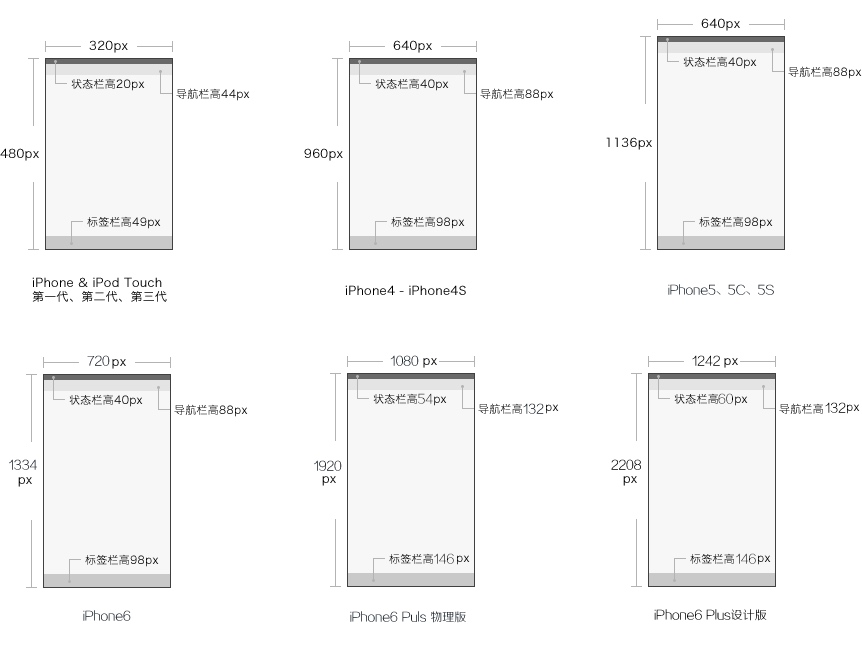
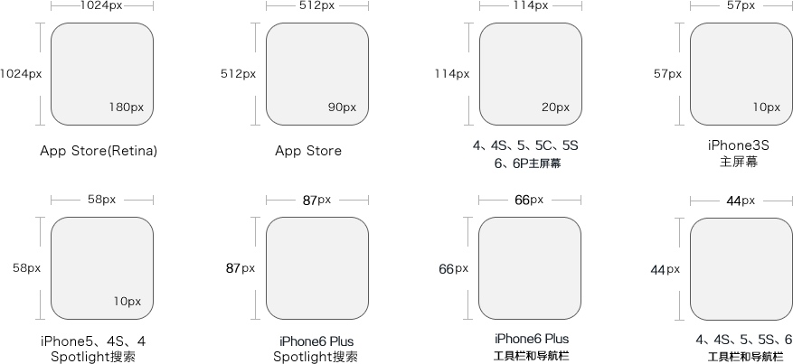
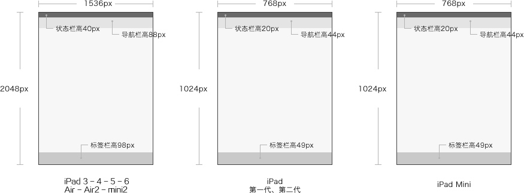
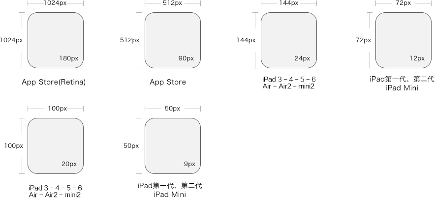
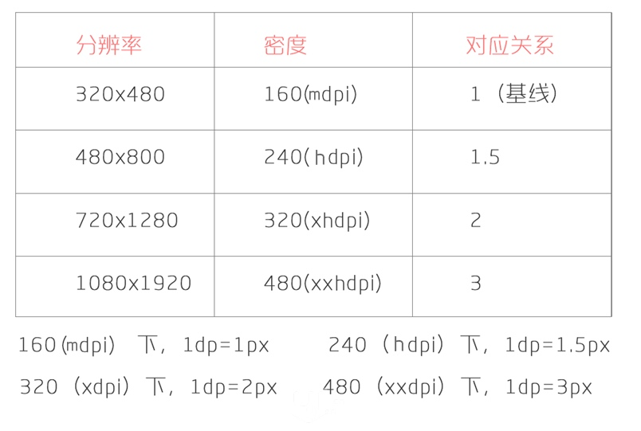

<h1 align="center">Android 适配</h1>

iPhone界面尺寸

| 设备                                      | 分辨率       | PPI    | 状态栏高度 | 导航栏高度 |
| ----------------------------------------- | ------------ | ------ | ---------- | ---------- |
| iPhone6 plus设计版                        | 1242×2208 px | 401PPI | 60px       | 132px      |
| iPhone6 plus放大版                        | 1125×2001 px | 401PPI | 54px       | 132px      |
| iPhone6 plus物理版                        | 1080×1920 px | 401PPI | 54px       | 132px      |
| iPhone6                                   | 750×1334 px  | 326PPI | 40px       | 88px       |
| iPhone5 - 5C - 5S                         | 640×1136 px  | 326PPI | 40px       | 88px       |
| iPhone4 - 4S                              | 640×960 px   | 326PPI | 40px       | 88px       |
| iPhone & iPod Touch第一代、第二代、第三代 | 320×480 px   | 163PPI | 20px       | 44px       |



iPhone图标尺寸：

| 设备                                      | App Store    | 程序应用   | 主屏幕     | Spotlight搜索 |
| ----------------------------------------- | ------------ | ---------- | ---------- | ------------- |
| iPhone6 Plus (@3×)                        | 1024×1024 px | 180×180 px | 114×114 px | 87×87 px      |
| iPhone6 (@2×)                             | 1024×1024 px | 120×120 px | 114×114 px | 58×58 px      |
| iPhone5 - 5C - 5S (@2×)                   | 1024×1024 px | 120×120 px | 114×114 px | 58×58 px      |
| iPhone4 - 4S (@2×)                        | 1024×1024 px | 120×120 px | 114×114 px | 58×58 px      |
| iPhone & iPod Touch第一代、第二代、第三代 | 1024×1024 px | 120×120 px | 57×57 px   |               |




iPad的设计尺寸

| 设备                                    | 尺寸         | 分辨率 | 状态栏高度 | 导航栏高度 |
| --------------------------------------- | ------------ | ------ | ---------- | ---------- |
| iPad 3 - 4 - 5 - 6 - Air - Air2 - mini2 | 2048×1536 px | 264PPI | 40px       | 88px       |
| iPad 1 - 2                              | 1024×768 px  | 132PPI | 20px       | 44px       |
| iPad Mini                               | 1024×768 px  | 163PPI | 20px       | 44px       |



iPad图标尺寸：

| 设备                                    | App Store    | 程序应用   | 主屏幕     | Spotlight搜索 | 标签栏   | 工具栏和导航栏 |
| --------------------------------------- | ------------ | ---------- | ---------- | ------------- | -------- | -------------- |
| iPad 3 - 4 - 5 - 6 - Air - Air2 - mini2 | 1024×1024 px | 180×180 px | 144×144 px | 100×100 px    | 50×50 px | 44×44 px       |
| iPad 1 - 2                              | 1024×1024 px | 90×90 px   | 72×72 px   | 50×50 px      | 25×25 px | 22×22 px       |
| iPad Mini                               | 1024×1024 px | 90×90 px   | 72×72 px   | 50×50 px      | 25×25 px | 22×22 px       |



Android的图标尺寸

|  mdpi   |   hdpi  |  xhdpi   |   xxhdpi    |   xxxhdpi  |
|:---:|:---:|:---:|:---:|:---:|
|   2   |   3  |  4   |       6       |       8   |
|  48x48  |  72x72 |   96x96  |  144x144  |  192x192  |


| 屏幕大小 | 启动图标   | 操作栏图标 | 上下文图标 | 系统通知图标(白色) |
| --------- | ---------- | ---------- | ---------- | ---------- |
| 320×480 px                    | 48×48 px   | 32×32 px   | 16×16 px   | 24×24 px           |
| 480×800px 480×854px 540×960px | 72×72 px   | 48×48 px   | 24×24 px   | 36×36 px           |
| 720×1280 px                   | 48×48 dp   | 32×32 dp   | 16×16 dp   | 24×24 dp           |
| 1080×1920 px                  | 144×144 px | 96×96 px   | 48×48 px   | 72×72 px           |


Android安卓系统dp/sp/px换算表

| 名称   | 分辨率    | 比率 rate (针对320px) | 比率 rate (针对640px) | 比率 rate (针对750px) |
| ------ | --------- | --------------------- | --------------------- | --------------------- |
| idpi   | 240×320   | 0.75                  | 0.375                 | 0.32                  |
| mdpi   | 320×480   | 1                     | 0.5                   | 0.4267                |
| hdpi   | 480×800   | 1.5                   | 0.75                  | 0.64                  |
| xhdpi  | 720×1280  | 2.25                  | 1.125                 | 1.042                 |
| xxhdpi | 1080×1920 | 3.375                 | 1.6875                | 1.5                   |

主流Android手机分辨率和尺寸

| 设备              | 分辨率   | 尺寸         | 设备                | 分辨率   | 尺寸         |
| ----------------- | -------- | ------------ | ------------------- | -------- | ------------ |
| 魅族MX2           | 4.4英寸  | 800×1280 px  | 魅族MX3             | 5.1英寸  | 1080×1280 px |
| 魅族MX4           | 5.36英寸 | 1152×1920 px | 魅族MX4 Pro*未上市* | 5.5英寸  | 1536×2560 px |
| 三星GALAXY Note 4 | 5.7英寸  | 1440×2560 px | 三星GALAXY Note 3   | 5.7英寸  | 1080×1920 px |
| 三星GALAXY S5     | 5.1英寸  | 1080×1920 px | 三星GALAXY Note II  | 5.5英寸  | 720×1280 px  |
| 索尼Xperia Z3     | 5.2英寸  | 1080×1920 px | 索尼XL39h           | 6.44英寸 | 1080×1920 px |
| HTC Desire 820    | 5.5英寸  | 720×1280 px  | HTC One M8          | 4.7英寸  | 1080×1920 px |
| OPPO Find 7       | 5.5英寸  | 1440×2560 px | OPPO N1             | 5.9英寸  | 1080×1920 px |
| OPPO R3           | 5英寸    | 720×1280 px  | OPPO N1 Mini        | 5英寸    | 720×1280 px  |
| 小米M4            | 5英寸    | 1080×1920 px | 小米红米Note        | 5.5英寸  | 720×1280 px  |
| 小米M3            | 5英寸    | 1080×1920 px | 小米红米1S          | 4.7英寸  | 720×1280 px  |
| 小米M3S*未上市*   | 5英寸    | 1080×1920 px | 小米M2S             | 4.3英寸  | 720×1280 px  |
| 华为荣耀6         | 5英寸    | 1080×1920 px | 锤子T1              | 4.95英寸 | 1080×1920 px |
| LG G3             | 5.5英寸  | 1440×2560 px | OnePlus One         | 5.5英寸  | 1080×1920 px |

主流浏览器的界面参数与份额

| 浏览器        | 状态栏            | 菜单栏 | 滚动条 | 市场份额(国内) |
| ------------- | ----------------- | ------ | ------ | -------------- |
| Chrome 浏览器 | 22 px（浮动出现） | 60 px  | 15 px  | 8%             |
| 火狐浏览器    | 20 px             | 132 px | 15 px  | 1%             |
| IE浏览器      | 24 px             | 120 px | 15 px  | 35%            |
| 360 浏览器    | 24 px             | 140 px | 15 px  | 28%            |
| 遨游浏览器    | 24 px             | 147 px | 15 px  | 1%             |
| 搜狗浏览器    | 25 px             | 163 px | 15 px  | 5%             |

系统分辨率统计

| 分辨率    | 占有率 | 分辨率    | 占有率 |
| --------- | ------ | --------- | ------ |
| 1336×768  | 15%    | 1440×900  | 13%    |
| 1920×1080 | 11%    | 1600×900  | 5%     |
| 1280×800  | 4%     | 1280×1024 | 3%     |
| 1680×1050 | 2.8%   | 320×480   | 2.4%   |
| 480×800   | 2%     | 1280×768  | 1%     |

| Qualifier | DPI  | Scaling factor | Launcher icon      | Action bar, tab icon | Notification icon (API 11) | Notification icon (API 9) | Notification icon (older) |
| --------- | ---- | -------------- | ------------------ | -------------------- | -------------------------- | ------------------------- | ------------------------- |
| ldpi      | 120  | 0.75           | 36 x 3632 x 32     | 24 x 2418 x 18       | 18 x 1816 x 16             | 12 x 1912 x 12            | 19 x 1916 x 16            |
| mdpi      | 160  | 1.0            | 48 x 4842 x 42     | 32 x 3224 x 24       | 24 x 2422 x 22             | 16 x 2516 x 16            | 25 x 2521 x 21            |
| hdpi      | 240  | 1.5            | 72 x 7264 x 64     | 48 x 4836 x 36       | 36 x 3633 x 33             | 24 x 3824 x 24            | 38 x 3832 x 32            |
| xhdpi     | 320  | 2.0            | 96 x 9684 x 84     | 64 x 6448 x 48       | 48 x 4844 x 44             | 32 x 5032 x 32            | 50 x 5042 x 42            |
| xxhdpi    | 480  | 3.0            | 144 x 144126 x 126 | 96 x 9672 x 72       | 72 x 7266 x 66             | 48 x 7548 x 48            | 75 x 7563 x 63            |



**公式：sw =** **160 \* pix  /  ppi**

例如：分辨率：720 x 1280， 密度为320dpi，

​      160(常量) * 720 / 320=360;

​      所以为sw360，由上面表格，320对应xhdpi，所以适配为：values-sw360-xhdpi。

## 单位

- dpi
  每英寸像素数(dot per inch)  

- dp  
  密度无关像素 - 一种基于屏幕物理密度的抽象单元。 这些单位相对于 160 dpi 的屏幕，因此一个 dp 是 160 dpi 屏幕上的一个 px。 dp 与像素的比率将随着屏幕密度而变化，但不一定成正比。为不同设备的 UI 元素的实际大小提供了一致性。

- sp  
  与比例无关的像素 - 这与 dp 单位类似，但它也可以通过用户的字体大小首选项进行缩放。建议在指定字体大小时使用此单位，以便根据屏幕密度和用户偏好调整它们。

```
dpi = px / inch

density = dpi / 160

dp = px / density
```

## 头条适配方案

```java
private static void setCustomDensity(@NonNull Activity activity, @NonNull final Application application) {
    final DisplayMetrics appDisplayMetrics = application.getResources().getDisplayMetrics();
    if (sNoncompatDensity == 0) {
        sNoncompatDensity = appDisplayMetrics.density;
        sNoncompatScaledDensity = appDisplayMetrics.scaledDensity;
        // 监听字体切换
        application.registerComponentCallbacks(new ComponentCallbacks() {
            @Override
            public void onConfigurationChanged(Configuration newConfig) {
                if (newConfig != null && newConfig.fontScale > 0) {
                    sNoncompatScaledDensity = application.getResources().getDisplayMetrics().scaledDensity;
                }
            }

            @Override
            public void onLowMemory() {

            }
        });
    }
    
    // 适配后的dpi将统一为360dpi
    final float targetDensity = appDisplayMetrics.widthPixels / 360;
    final float targetScaledDensity = targetDensity * (sNoncompatScaledDensity / sNoncompatDensity);
    final int targetDensityDpi = (int)(160 * targetDensity);

    appDisplayMetrics.density = targetDensity;
    appDisplayMetrics.scaledDensity = targetScaledDensity;
    appDisplayMetrics.densityDpi = targetDensityDpi;

    final DisplayMetrics activityDisplayMetrics = activity.getResources().getDisplayMetrics();
    activityDisplayMetrics.density = targetDensity;
    activityDisplayMetrics.scaledDensity = targetScaledDensity;
    activityDisplayMetrics.densityDpi = targetDensityDpi
}
```

## 刘海屏适配

- Android P 刘海屏适配方案

Android P 支持最新的全面屏以及为摄像头和扬声器预留空间的凹口屏幕。通过全新的 DisplayCutout 类，可以确定非功能区域的位置和形状，这些区域不应显示内容。要确定这些凹口屏幕区域是否存在及其位置，使用 getDisplayCutout() 函数。

| DisplayCutout 类方法 | 说明                                                       |
| -------------------- | ---------------------------------------------------------- |
| getBoundingRects()   | 返回Rects的列表，每个Rects都是显示屏上非功能区域的边界矩形 |
| getSafeInsetLeft ()  | 返回安全区域距离屏幕左边的距离，单位是px                   |
| getSafeInsetRight () | 返回安全区域距离屏幕右边的距离，单位是px                   |
| getSafeInsetTop ()   | 返回安全区域距离屏幕顶部的距离，单位是px                   |
| getSafeInsetBottom() | 返回安全区域距离屏幕底部的距离，单位是px                   |

Android P 中 WindowManager.LayoutParams 新增了一个布局参数属性 layoutInDisplayCutoutMode：

| 模式                                      | 模式说明                                                     |
| ----------------------------------------- | ------------------------------------------------------------ |
| LAYOUT_IN_DISPLAY_CUTOUT_MODE_DEFAULT     | 只有当DisplayCutout完全包含在系统栏中时，才允许窗口延伸到DisplayCutout区域。 否则，窗口布局不与DisplayCutout区域重叠。 |
| LAYOUT_IN_DISPLAY_CUTOUT_MODE_NEVER       | 该窗口决不允许与DisplayCutout区域重叠。                      |
| LAYOUT_IN_DISPLAY_CUTOUT_MODE_SHORT_EDGES | 该窗口始终允许延伸到屏幕短边上的DisplayCutout区域。          |

- Android P 之前的刘海屏适配

不同厂商的刘海屏适配方案不尽相同，需分别查阅各自的开发者文档。