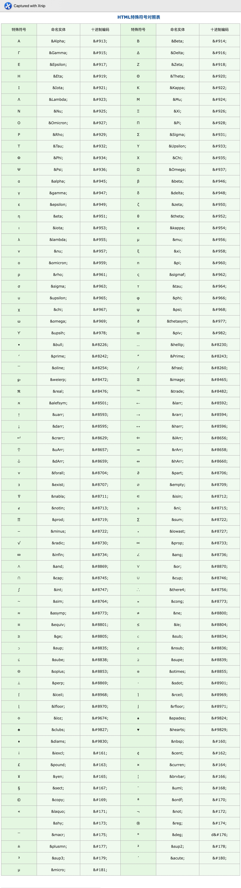
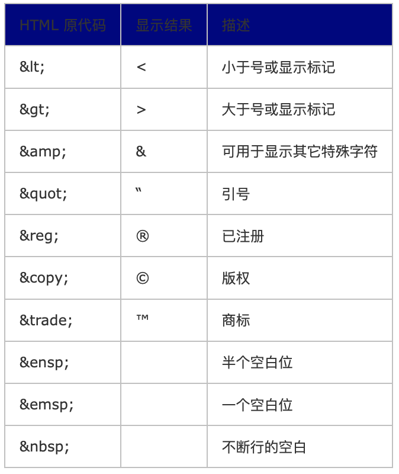
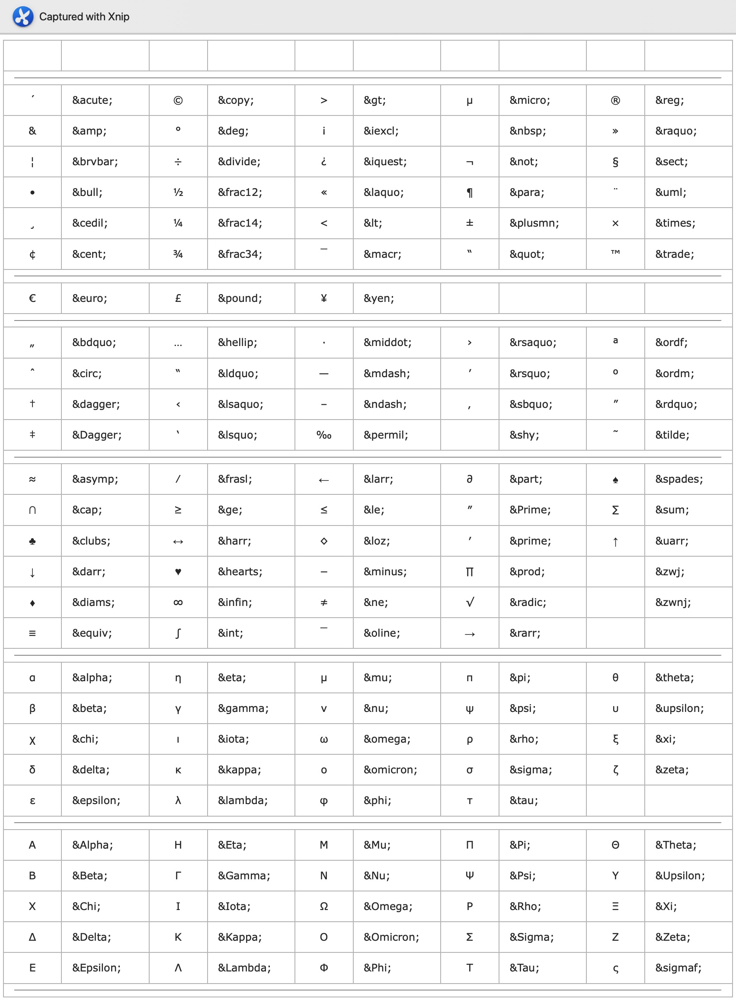

<h1 align="center">Android xml相关知识</h1>

## string.xml转移字符
例如：<string name="name">%1$s&#058;&#091;是教授&#093;</string>

其中%1$s 代表占位符，，在代码中可以动态的来设置占位符的值，如 tv_name.setText(getStringResource(R.string.name),"小张")

```
&#058; 这是转义字符，代表 冒号（:）

&#091; [

&#093; ]

&#064; @

&#160; 空格

" (&#34; 或 &quot;)
' (&#39; 或 &apos;)
& (&#38; 或 &amp;)
lt(<) (&#60; 或 &lt;)
gt(>) (&#62; 或 &gt;)
```
\n 代表换行 -----------这个很有用 例如要现实下面的效果

你好，我是
张宏

就可以在String.xml文件中这么写 
 ```
 <string name="content">你好，我是\n张宏</string>
 ```

## HTML特殊符号对照表





