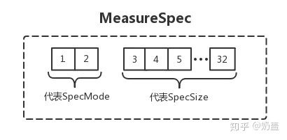

<h1 align="center">Android View</h1>

[toc]

## 绘制流程

视图绘制的起点在 ViewRootImpl 类的 `performTraversals()`方法，在这个方法内其实是按照顺序依次调用了 `mView.measure()、mView.layout()、mView.draw()`

View的绘制流程分为3步：测量、布局、绘制，分别对应3个方法 measure、layout、draw。

- **测量阶段。**measure 方法会被父 View 调用，在measure 方法中做一些优化和准备工作后会调用 onMeasure 方法进行实际的自我测量。onMeasure方法在View和ViewGroup做的事情是不一样的：
- **View。** View 中的 onMeasure 方法会计算自己的尺寸并通过 setMeasureDimension 保存。
- **ViewGroup。** ViewGroup 中的 onMeasure 方法会调用所有子 iew的measure 方法进行自我测量并保存。然后通过子View的尺寸和位置计算出自己的尺寸并保存。
- **布局阶段。**layout 方法会被父View调用，layout 方法会保存父 View 传进来的尺寸和位置，并调用 onLayout 进行实际的内部布局。onLayout 在 View 和 ViewGroup 中做的事情也是不一样的：
- **View。** 因为 View 是没有子 View 的，所以View的onLayout里面什么都不做。
- **ViewGroup。** ViewGroup 中的 onLayout 方法会调用所有子 View 的 layout 方法，把尺寸和位置传给他们，让他们完成自我的内部布局。
- **绘制阶段。**draw 方法会做一些调度工作，然后会调用 onDraw 方法进行 View 的自我绘制。draw 方法的调度流程大致是这样的：
- **绘制背景。**对应 `drawBackground(Canvas)`方法。
- **绘制主体。**对应 `onDraw(Canvas)`方法。
- **绘制子View。** 对应 `dispatchDraw(Canvas)`方法。
- **绘制滑动相关和前景。** 对应 `onDrawForeground(Canvas)`。

## MeasureSpec

MeasureSpec 是 View 的测量规则。通常父控件要测量子控件的时候，会传给子控件 widthMeasureSpec 和 heightMeasureSpec 这两个 int 类型的值。这个值里面包含两个信息，**SpecMode** 和 **SpecSize**。一个 int 值怎么会包含两个信息呢？我们知道 int 是一个4字节32位的数据，在这两个 int 类型的数据中，前面高2位是 **SpecMode** ，后面低30位代表了 **SpecSize**。




mode 有三种类型：`UNSPECIFIED`，`EXACTLY`，`AT_MOST`

测量模式应用EXACTLY精准模式，当 width 或 height 为固定 xxdp 或者为 MACH_PARENT 的时候，是这种测量模式AT_MOST当 width 或 height 设置为 warp_content 的时候，是这种测量模式UNSPECIFIED父容器对当前 View 没有任何显示，子 View 可以取任意大小。一般用在系统内部，比如：Scrollview、ListView。

我们怎么从一个 int 值里面取出两个信息呢？别担心，在 View 内部有一个 MeasureSpec 类。这个类已经给我们封装好了各种方法:

```java
//将 Size 和 mode 组合成一个 int 值
int measureSpec = MeasureSpec.makeMeasureSpec(size,mode);
//获取 size 大小
int size = MeasureSpec.getSize(measureSpec);
//获取 mode 类型
int mode = MeasureSpec.getMode(measureSpec);
```

具体实现细节，可以查看源码

## DecorView 的 measureSpec 计算逻辑

可能我们会有疑问，如果所有子控件的 measureSpec 都是父控件结合自身的 measureSpec 和子 View 的 LayoutParams 来生成的。那么作为视图的顶级父类 DecorView 怎么获取自己的 measureSpec 呢？下面我们来分析源码：（以下源码有所删减）

```java
//ViewRootImpl 类
private void performTraversals() {
    //获取 DecorView 宽度的 measureSpec 
    int childWidthMeasureSpec = getRootMeasureSpec(mWidth, lp.width);
    //获取 DecorView 高度的 measureSpec
    int childHeightMeasureSpec = getRootMeasureSpec(mHeight, lp.height);
    // Ask host how big it wants to be
    //开始执行测量
    performMeasure(childWidthMeasureSpec, childHeightMeasureSpec);
}
//ViewRootImpl 类
private static int getRootMeasureSpec(int windowSize, int rootDimension) {
    int measureSpec;
    switch (rootDimension) {
        case ViewGroup.LayoutParams.MATCH_PARENT:
            // Window can't resize. Force root view to be windowSize.
            measureSpec = MeasureSpec.makeMeasureSpec(windowSize, MeasureSpec.EXACTLY);
            break;
        case ViewGroup.LayoutParams.WRAP_CONTENT:
            // Window can resize. Set max size for root view.
            measureSpec = MeasureSpec.makeMeasureSpec(windowSize, MeasureSpec.AT_MOST);
            break;
        default:
            // Window wants to be an exact size. Force root view to be that size.
            measureSpec = MeasureSpec.makeMeasureSpec(rootDimension, MeasureSpec.EXACTLY);
            break;
    }
    return measureSpec;
}
```

windowSize 是 widow 的宽高大小，所以我们可以看出 DecorView 的 measureSpec 是根据 window 的宽高大小和自身的 LayoutParams 来生成的。

## 线性布局和相对布局的效率，约束布局和相对布局的效率

**RelativeLayout**分别对所有子View进行两次measure，横向纵向分别进行一次，这是为什么呢？首先RelativeLayout中子View的排列方式是基于彼此的依赖关系，而这个依赖关系可能和布局中View的顺序并不相同，在确定每个子View的位置的时候，需要先给所有的子View排序一下。又因为RelativeLayout允许A，B 2个子View，横向上B依赖A，纵向上A依赖B。所以需要横向纵向分别进行一次排序测量。 mSortedHorizontalChildren和mSortedVerticalChildren是分别对水平方向的子控件和垂直方向的子控件进行排序后的View数组。

与RelativeLayout相比**LinearLayout**的measure就简单的多，只需判断线性布局是水平布局还是垂直布局即可，然后才进行测量：如果不使用weight属性，LinearLayout会在当前方向上进行一次measure的过程，如果使用weight属性，LinearLayout会避开设置过weight属性的view做第一次measure，完了再对设置过weight属性的view做第二次measure。由此可见，weight属性对性能是有影响的，而且本身有大坑，请注意避让。

**结论**

（1）RelativeLayout会让子View调用2次onMeasure，LinearLayout 在有weight时，也会调用子View 2次onMeasure

（2）RelativeLayout的子View如果高度和RelativeLayout不同，则会引发效率问题，当子View很复杂时，这个问题会更加严重。如果可以，尽量使用padding代替margin。

（3）在不影响层级深度的情况下,使用LinearLayout和FrameLayout而不是RelativeLayout。

（4）提高绘制性能的使用方式

根据上面源码的分析，RelativeLayout将对所有的子View进行两次measure，而LinearLayout在使用weight属性进行布局时也会对子View进行两次measure，如果他们位于整个View树的顶端时并可能进行多层的嵌套时，位于底层的View将会进行大量的measure操作，大大降低程序性能。因此，应尽量将RelativeLayout和LinearLayout置于View树的底层，并减少嵌套

## View.inflater 过程与异步 inflater


## 参考

* [Android View的绘制流程 | Deep into Android (jsonchao.github.io)](https://jsonchao.github.io/2018/10/28/Android View的绘制流程/)

