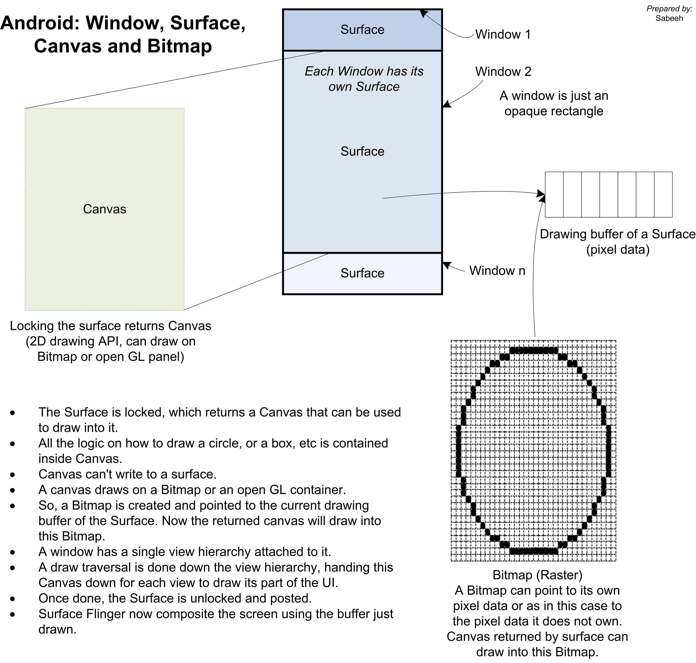

<h1 align="center">Surface</h1>

[toc]

## 概念

- A Surface is an object holding pixels that are being composited to the screen. Every window you see on the screen (a dialog, your full-screen activity, the status bar) has its own surface that it draws in to, and Surface Flinger renders these to the final display in their correct Z-order. A surface typically has more than one buffer (usually two) to do double-buffered rendering: the application can be drawing its next UI state while the surface flinger is compositing the screen using the last buffer, without needing to wait for the application to finish drawing.
- A window is basically like you think of a window on the desktop. It has a single Surface in which the contents of the window is rendered. An application interacts with the Window Manager to create windows; the Window Manager creates a Surface for each window and gives it to the application for drawing. The application can draw whatever it wants in the Surface; to the Window Manager it is just an opaque rectangle.
- A View is an interactive UI element inside of a window. A window has a single view hierarchy attached to it, which provides all of the behavior of the window. Whenever the window needs to be redrawn (such as because a view has invalidated itself), this is done into the window's Surface. The Surface is locked, which returns a Canvas that can be used to draw into it. A draw traversal is done down the hierarchy, handing the Canvas down for each view to draw its part of the UI. Once done, the Surface is unlocked and posted so that the just drawn buffer is swapped to the foreground to then be composited to the screen by Surface Flinger.
- A SurfaceView is a special implementation of View that also creates its own dedicated Surface for the application to directly draw into (outside of the normal view hierarchy, which otherwise must share the single Surface for the window). The way this works is simpler than you may expect -- all SurfaceView does is ask the window manager to create a new window, telling it to Z-order that window either immediately behind or in front of the SurfaceView's window, and positioning it to match where the SurfaceView appears in the containing window. If the surface is being placed behind the main window (in Z order), SurfaceView also fills its part of the main window with transparency so that the surface can be seen.
- A Bitmap is just an interface to some pixel data. The pixels may be allocated by Bitmap itself when you are directly creating one, or it may be pointing to pixels it doesn't own such as what internally happens to hook a Canvas up to a Surface for drawing. (A Bitmap is created and pointed to the current drawing buffer of the Surface.)

Also please keep in mind that, as this implies, a SurfaceView is a pretty heavy-weight object. If you have multiple SurfaceViews in a particular UI, stop and think about whether this is really needed. If you have more than two, you almost certainly have too many.

1. 表面(Surface)：Surface就是指向显存的一个物体，用来被绘制到屏幕上，所有你能看见的Window都拥有可以在上面绘制的Surface，在安卓中，系统使用Surface Flinger服务来把Surface按照正确的深度信息渲染到最终的屏幕上。一个Surface一般拥有超过一个（通常是２个) buffer 单元（back buffer 与 front buffer)，系统通常在back buffer中进行渲染，完成之后与front buffer交换，这样显示到屏幕上，以实现流畅显示的效果。
2. 窗口(Window)：Window拥有一个Surface，在Surface里绘制Window里的内容。一个application通过Windows Manager来创建窗口，Windows Manager为每一个窗口创建Surface来让application在上面绘制各种物体。
3. 视图(View)：视图就窗口里的UI元素，一个窗口只拥有一个View Hierarchy，这些View Hierarchy提供了窗口里的所有表现。当一个窗口需要重新绘制时（比如一个View invalidate自己），锁定Surface，并返回一个Canvas用来在上面绘制，如上图所示，在view hierarchy树向下传递Canvas，来绘制每个view。这一切都完成后，Surface被解锁，并通过Surface Flinger交换前后Buffer来显示到屏幕上。
4. Canvas：Canvas是Surface绘图时返回的一个接口，并提供一些绘图api，用来进行实际的绘图操作。目前Canvas可以绘制在bitmap或者openGL container上。
5. SurfaceView：SurfaceView是View的一个特殊子类，它拥有专有的Surface，使application可以直接在上面绘制（普通的view hierarchy必须共享窗口唯一的surface)。这其中的原理很简单，SurfaceView就是请求Window Manager创建一个新窗口，并改变窗口之间的深度信息来显示。如果SurfaceView的Window显示在主窗口的后面，surfaceview将主窗口相应的位置设置成透明来使可见。

总结一下，一个activity拥有一个window(用来绘制它的UI), 并且一个Window只有一个Surface和View hierarchy来绘制，SurfaceView实质上是创建了一个新的窗口，所以拥有自己独立的Surface，可以直接绘制在上面。

## 参考

* [Understanding Canvas and Surface concepts](https://stackoverflow.com/questions/4576909/understanding-canvas-and-surface-concepts)
* [Graphics architecture](https://source.android.com/devices/graphics/architecture.html)
* https://www.zhihu.com/question/25811504/answer/31696269
* [Android硬件加速原理与实现简介](https://tech.meituan.com/2017/01/19/hardware-accelerate.html)
* [硬件加速和软件加速的区别](https://skyacer.github.io/2018/07/30/Android窗口管理分析（五）-——-硬件加速和软件加速的区别/)
* [「Android 渲染」图像是怎样显示到屏幕上的？](https://xie.infoq.cn/article/174897b20b1c230506eba4124)
* [Android硬件加速过程分析](https://www.jianshu.com/p/03663b35ffa2)
* [Graphics](https://source.android.com/devices/graphics/index.html)

