<h1 align="center">图解 Android 事件分发机制</h1>

[toc]

在Android开发中，事件分发机制是一块Android比较重要的知识体系，了解并熟悉整套的分发机制有助于更好的分析各种点击滑动失效问题，更好去扩展控件的事件功能和开发自定义控件，同时事件分发机制也是Android面试必问考点之一，如果你能把下面的一些事件分发图当场画出来肯定加分不少。废话不多说，总结一句:**事件分发机制很重要**。

## **Android 事件分发流**

关于Android 事件分发机制网上的博文很多，但是很多都是写个Demo然后贴一下输出的Log或者拿源码分析，然后一堆的注释和说明，如果用心的去看肯定是收获不少但是确实很难把整个流程说清和记住。曾经也是拼命想记住整个流程，但是一段时间又忘了，最后觉得分析这种问题和事件流的走向，一张图来解释和说明会清晰很多，下面我根据画的一张事件分发流程图,说明的事件从用户点击之后，在不同函数不同返回值的情况的最终走向。

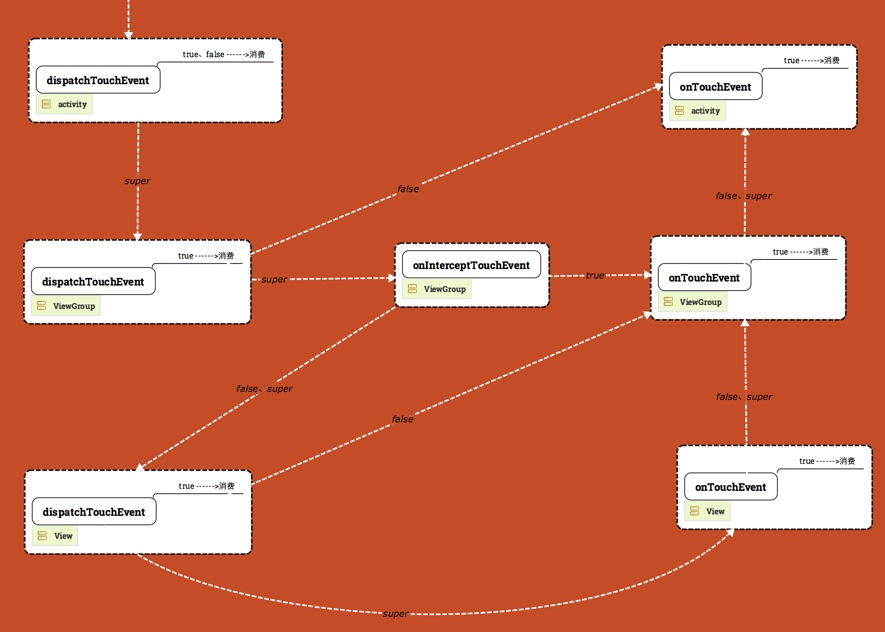

​													图 1.

**注：**

- 仔细看的话，图分为3层，从上往下依次是Activity、ViewGroup、View

- 事件从左上角那个白色箭头开始，由Activity的dispatchTouchEvent做分发
- 箭头的上面字代表方法返回值，（return true、return false、return super.xxxxx(),super 的意思是调用父类实现。
- dispatchTouchEvent和 onTouchEvent的框里有个【**true---->消费**】的字，表示的意思是如果方法返回true，那么代表事件就此消费，不会继续往别的地方传了，事件终止。
- 目前所有的图的事件是针对ACTION_DOWN的，对于ACTION_MOVE和ACTION_UP我们最后做分析。
- 之前图中的Activity 的dispatchTouchEvent 有误（图已修复），只有return super.dispatchTouchEvent(ev) 才是往下走，返回true 或者 false 事件就被消费了（终止传递）。

仔细看整个图，我们得出事件流 走向的几个结论（希望读者专心的看下图 1，多看几遍，脑子有比较清晰的概念。）

1、**如果事件不被中断，整个事件流向是一个类U型图**，我们来看下这张图，可能更能理解U型图的意思。

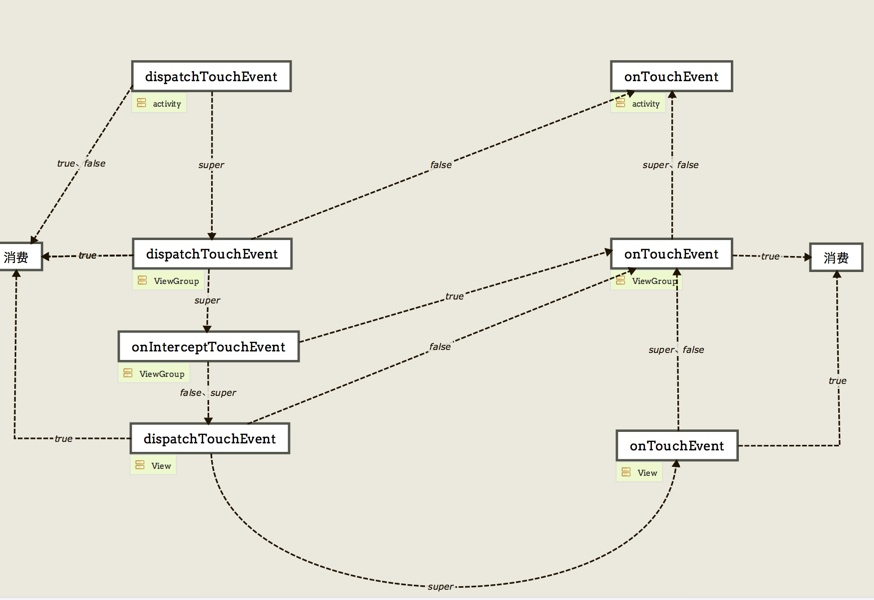

​													图 2.

所以如果我们没有对控件里面的方法进行重写或更改返回值，而直接用super调用父类的默认实现，那么整个事件流向应该是从Activity---->ViewGroup--->View 从上往下调用dispatchTouchEvent方法，一直到叶子节点（View）的时候，再由View--->ViewGroup--->Activity从下往上调用onTouchEvent方法。

**2、dispatchTouchEvent 和 onTouchEvent 一旦return true,事件就停止传递了（到达终点）（没有谁能再收到这个事件）**。看下图中只要return true事件就没再继续传下去了，**对于return true我们经常说事件被消费了，消费了的意思就是事件走到这里就是终点，不会往下传，没有谁能再收到这个事件了**。

​													图 3.

**3、dispatchTouchEvent 和 onTouchEvent return false的时候事件都回传给父控件的onTouchEvent处理。**

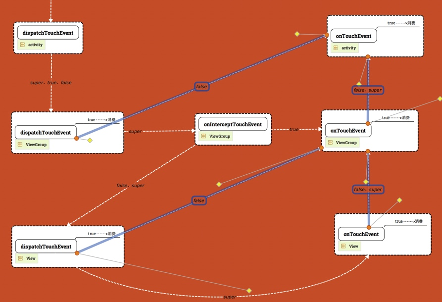

​													图 4.

看上图深蓝色的线，对于返回false的情况，事件都是传给父控件onTouchEvent处理。

- **对于dispatchTouchEvent 返回 false 的含义应该是：事件停止往子View传递和分发同时开始往父控件回溯（父控件的onTouchEvent开始从下往上回传直到某个onTouchEvent return true），事件分发机制就像递归，return false 的意义就是递归停止然后开始回溯。**

- **对于onTouchEvent return false 就比较简单了，它就是不消费事件，并让事件继续往父控件的方向从下往上流动。**

**4、dispatchTouchEvent、onTouchEvent、onInterceptTouchEvent**

**ViewGroup 和View的这些方法的默认实现就是会让整个事件安装U型完整走完，所以 return super.xxxxxx() 就会让事件依照U型的方向的完整走完整个事件流动路径），中间不做任何改动，不回溯、不终止，每个环节都走到。**

​													Paste_Image.png

所以如果看到方法return super.xxxxx() 那么事件的下一个流向就是走U型下一个目标，稍微记住上面这张图，你就能很快判断出下一个走向是哪个控件的哪个函数。

5、onInterceptTouchEvent 的作用

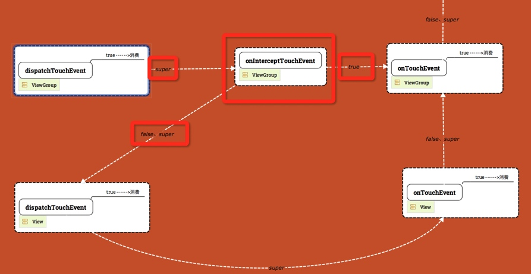

​													图 5.

Intercept 的意思就拦截，每个ViewGroup每次在做分发的时候，问一问拦截器要不要拦截（也就是问问自己这个事件要不要自己来处理）如果要自己处理那就在onInterceptTouchEvent方法中 return true就会交给自己的onTouchEvent的处理，如果不拦截就是继续往子控件往下传。**默认是不会去拦截的，因为子View也需要这个事件，所以onInterceptTouchEvent拦截器return super.onInterceptTouchEvent()和return false是一样的，是不会拦截的，事件会继续往子View的dispatchTouchEvent传递**。

6、ViewGroup 和View 的dispatchTouchEvent方法返回super.dispatchTouchEvent()的时候事件流走向。

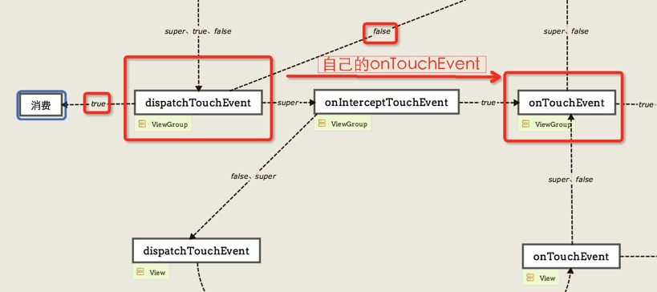

​													图 6

首先看下ViewGroup 的dispatchTouchEvent，之前说的return true是终结传递。return false 是回溯到父View的onTouchEvent，**然后ViewGroup怎样通过dispatchTouchEvent方法能把事件分发到自己的onTouchEvent处理呢，return true和false 都不行，那么只能通过Interceptor把事件拦截下来给自己的onTouchEvent，所以ViewGroup dispatchTouchEvent方法的super默认实现就是去调用onInterceptTouchEvent，记住这一点**。

那么对于**View**的dispatchTouchEvent return super.dispatchTouchEvent()的时候呢事件会传到哪里呢，很遗憾View没有拦截器。**但是同样的道理return true是终结。return false 是回溯会父类的onTouchEvent，怎样把事件分发给自己的onTouchEvent 处理呢，那只能return super.dispatchTouchEvent,View类的dispatchTouchEvent（）方法默认实现就是能帮你调用View自己的onTouchEvent方法的。**

说了这么多，不知道有说清楚没有，我这边最后总结一下：

- 对于 dispatchTouchEvent，onTouchEvent，return true是终结事件传递。return false 是回溯到父View的onTouchEvent方法。
- ViewGroup 想把自己分发给自己的onTouchEvent，需要拦截器onInterceptTouchEvent方法return true 把事件拦截下来。
- ViewGroup 的拦截器onInterceptTouchEvent 默认是不拦截的，所以return super.onInterceptTouchEvent()=return false；
- View 没有拦截器，为了让View可以把事件分发给自己的onTouchEvent，View的dispatchTouchEvent默认实现（super）就是把事件分发给自己的onTouchEvent。

ViewGroup和View 的dispatchTouchEvent 是做事件分发，那么这个事件可能分发出去的四个目标

注：------> 后面代表事件目标需要怎么做。

1、 自己消费，终结传递。------->return true ；

2、 给自己的onTouchEvent处理-------> 调用super.dispatchTouchEvent()系统默认会去调用 onInterceptTouchEvent，在onInterceptTouchEvent return true就会去把事件分给自己的onTouchEvent处理。

3、 传给子View------>调用super.dispatchTouchEvent()默认实现会去调用 onInterceptTouchEvent 在onInterceptTouchEvent return false，就会把事件传给子类。

4、 不传给子View，事件终止往下传递，事件开始回溯，从父View的onTouchEvent开始事件从下到上回归执行每个控件的onTouchEvent------->return false；

**注：**由于View没有子View所以不需要onInterceptTouchEvent 来控件是否把事件传递给子View还是拦截，所以View的事件分发调用super.dispatchTouchEvent()的时候默认把事件传给自己的onTouchEvent处理（相当于拦截），对比ViewGroup的dispatchTouchEvent 事件分发，View的事件分发没有上面提到的4个目标的第3点。

ViewGroup和View的onTouchEvent方法是做事件处理的，那么这个事件只能有两个处理方式：

1、自己消费掉，事件终结，不再传给谁----->return true;

2、继续从下往上传，不消费事件，让父View也能收到到这个事件----->return false;View的默认实现是不消费的。所以super==false。

ViewGroup的onInterceptTouchEvent方法对于事件有两种情况：

1、拦截下来，给自己的onTouchEvent处理--->return true;

2、不拦截，把事件往下传给子View---->return false,ViewGroup默认是不拦截的，所以super==false；

**关于ACTION_MOVE 和 ACTION_UP####**

上面讲解的都是针对ACTION_DOWN的事件传递，ACTION_MOVE和ACTION_UP在传递的过程中并不是和ACTION_DOWN 一样，你在执行ACTION_DOWN的时候返回了false，后面一系列其它的action就不会再得到执行了。简单的说，就是当dispatchTouchEvent在进行事件分发的时候，只有前一个事件（如ACTION_DOWN）返回true，才会收到ACTION_MOVE和ACTION_UP的事件。具体这句话很多博客都说了，但是具体含义是什么呢？我们来看一下下面的具体分析。

上面提到过了，事件如果不被打断的话是会不断往下传到叶子层（View），然后又不断回传到Activity，dispatchTouchEvent 和 onTouchEvent 可以通过return true 消费事件，终结事件传递，而onInterceptTouchEvent 并不能消费事件，它相当于是一个分叉口起到分流导流的作用，ACTION_MOVE和ACTION_UP 会在哪些函数被调用，之前说了并不是哪个函数收到了ACTION_DOWN，就会收到 ACTION_MOVE 等后续的事件的。

下面通过几张图看看不同场景下，ACTION_MOVE事件和ACTION_UP事件的具体走向并总结一下规律。

**1、我们在ViewGroup1 的dispatchTouchEvent 方法返回true消费这次事件**

ACTION_DOWN 事件从（Activity的dispatchTouchEvent）--------> （ViewGroup1 的dispatchTouchEvent） 后结束传递，事件被消费（如下图红色的箭头代码ACTION_DOWN 事件的流向）。

//打印日志 Activity | dispatchTouchEvent --> ACTION_DOWN  ViewGroup1 | dispatchTouchEvent --> ACTION_DOWN ---->消费

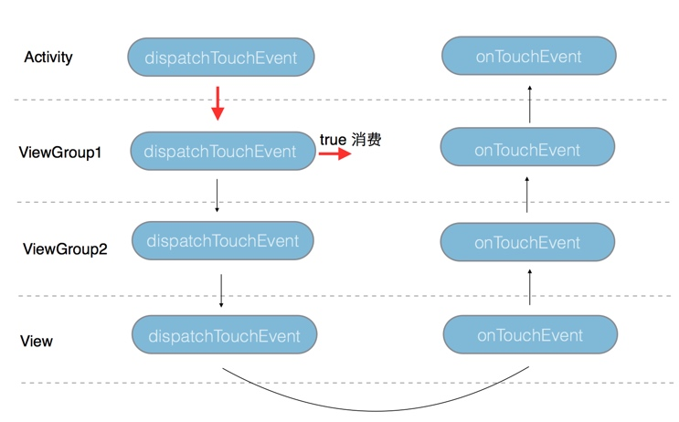

在这种场景下ACTION_MOVE和ACTION_UP 将如何呢，看下面的打出来的日志

Activity | dispatchTouchEvent --> ACTION_MOVE  ViewGroup1 | dispatchTouchEvent --> ACTION_MOVE ---- TouchEventActivity | dispatchTouchEvent --> ACTION_UP  ViewGroup1 | dispatchTouchEvent --> ACTION_UP ----

下图中

红色的箭头代表ACTION_DOWN 事件的流向

蓝色的箭头代表ACTION_MOVE 和 ACTION_UP 事件的流向

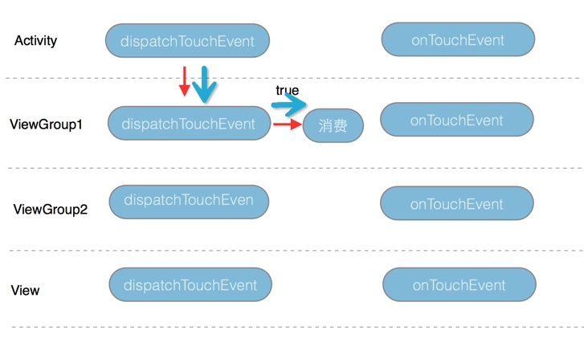

**2、我们在ViewGroup2 的dispatchTouchEvent 返回true消费这次事件**

Activity | dispatchTouchEvent --> ACTION_DOWN  ViewGroup1 | dispatchTouchEvent --> ACTION_DOWN ViewGroup1 | onInterceptTouchEvent --> ACTION_DOWN ViewGroup2 | dispatchTouchEvent --> ACTION_DOWN ---->消费 Activity | dispatchTouchEvent --> ACTION_MOVE  ViewGroup1 | dispatchTouchEvent --> ACTION_MOVE ViewGroup1 | onInterceptTouchEvent --> ACTION_MOVE ViewGroup2 | dispatchTouchEvent --> ACTION_MOVE ---- TouchEventActivity | dispatchTouchEvent --> ACTION_UP  ViewGroup1 | dispatchTouchEvent --> ACTION_UP ViewGroup1 | onInterceptTouchEvent --> ACTION_UP ViewGroup2 | dispatchTouchEvent --> ACTION_UP ----

红色的箭头代表ACTION_DOWN 事件的流向

蓝色的箭头代表ACTION_MOVE 和 ACTION_UP 事件的流向

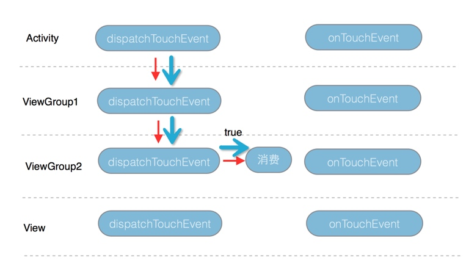

​													Paste_Image.png

**3、我们在View 的dispatchTouchEvent 返回true消费这次事件**

这个我不就画图了，效果和在ViewGroup2 的dispatchTouchEvent return true的差不多，同样的收到ACTION_DOWN 的dispatchTouchEvent函数都能收到 ACTION_MOVE和ACTION_UP。

**所以我们就基本可以得出结论如果在某个控件的dispatchTouchEvent 返回true消费终结事件，那么收到ACTION_DOWN 的函数也能收到 ACTION_MOVE和ACTION_UP。**

**4、我们在View 的onTouchEvent 返回true消费这次事件**

红色的箭头代表ACTION_DOWN 事件的流向

蓝色的箭头代表ACTION_MOVE 和 ACTION_UP 事件的流向

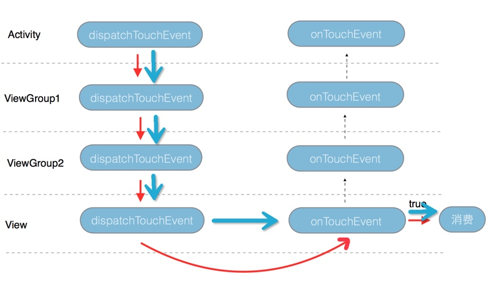

**5、我们在ViewGroup 2 的onTouchEvent 返回true消费这次事件**

红色的箭头代表ACTION_DOWN 事件的流向

蓝色的箭头代表ACTION_MOVE 和 ACTION_UP 事件的流向

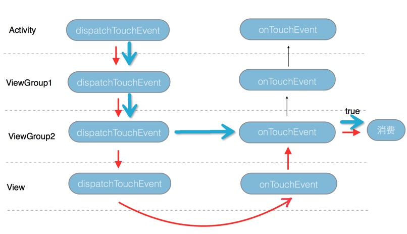

**6、我们在ViewGroup 1 的onTouchEvent 返回true消费这次事件**

红色的箭头代表ACTION_DOWN 事件的流向

蓝色的箭头代表ACTION_MOVE 和 ACTION_UP 事件的流向

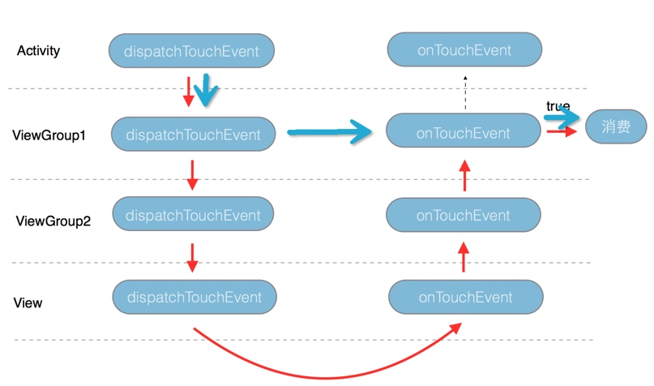

**7、我们在Activity 的onTouchEvent 返回true消费这次事件**

红色的箭头代表ACTION_DOWN 事件的流向

蓝色的箭头代表ACTION_MOVE 和 ACTION_UP 事件的流向

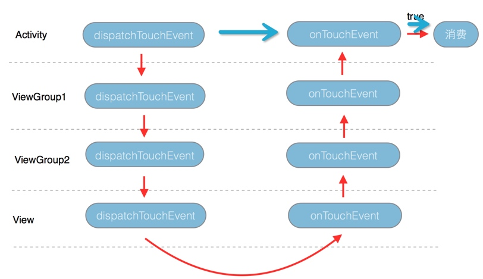

**8、我们在View的dispatchTouchEvent 返回false并且Activity 的onTouchEvent 返回true消费这次事件**

红色的箭头代表ACTION_DOWN 事件的流向

蓝色的箭头代表ACTION_MOVE 和 ACTION_UP 事件的流向

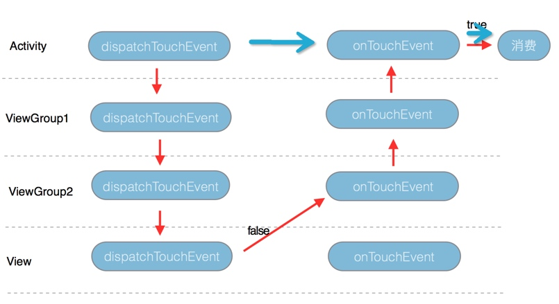

**9、我们在View的dispatchTouchEvent 返回false并且ViewGroup 1 的onTouchEvent 返回true消费这次事件**

红色的箭头代表ACTION_DOWN 事件的流向

蓝色的箭头代表ACTION_MOVE 和 ACTION_UP 事件的流向

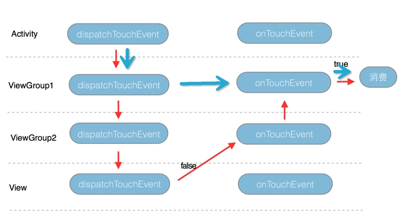

**10、我们在View的dispatchTouchEvent 返回false并且在ViewGroup 2 的onTouchEvent 返回true消费这次事件**

红色的箭头代表ACTION_DOWN 事件的流向

蓝色的箭头代表ACTION_MOVE 和 ACTION_UP 事件的流向

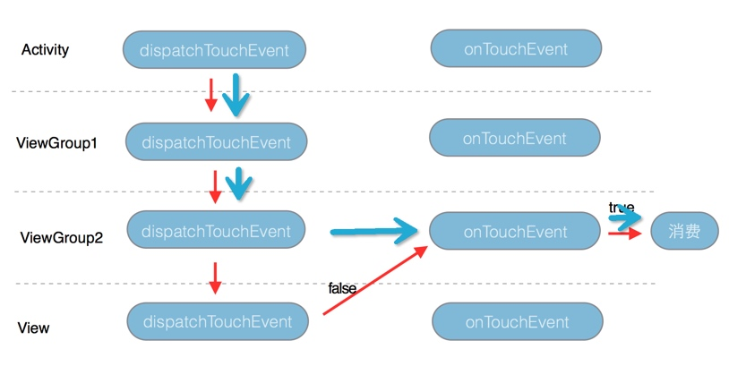

**11、我们在ViewGroup2的dispatchTouchEvent 返回false并且在ViewGroup1 的onTouchEvent返回true消费这次事件**

红色的箭头代表ACTION_DOWN 事件的流向

蓝色的箭头代表ACTION_MOVE 和 ACTION_UP 事件的流向

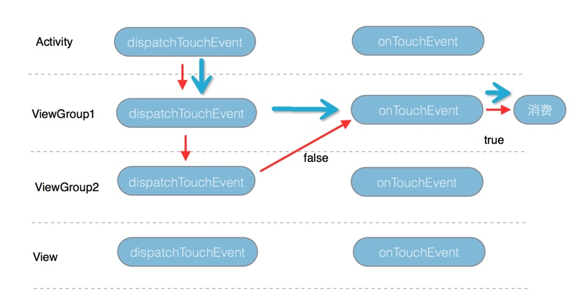

**12、我们在ViewGroup2的onInterceptTouchEvent 返回true拦截此次事件并且在ViewGroup 1 的onTouchEvent返回true消费这次事件。**

红色的箭头代表ACTION_DOWN 事件的流向

蓝色的箭头代表ACTION_MOVE 和 ACTION_UP 事件的流向

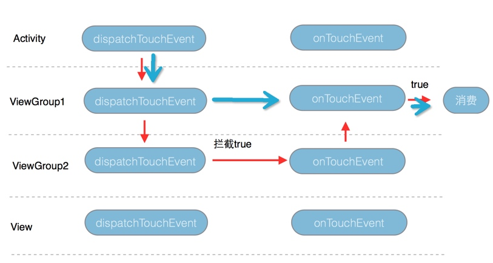

一下子画了好多图，还有好几种情况就不再画了，相信你也看出规律了，对于在onTouchEvent消费事件的情况：**在哪个View的onTouchEvent 返回true，那么ACTION_MOVE和ACTION_UP的事件从上往下传到这个View后就不再往下传递了，而直接传给自己的onTouchEvent 并结束本次事件传递过程。**

对于ACTION_MOVE、ACTION_UP总结：**ACTION_DOWN事件在哪个控件消费了（return true）， 那么ACTION_MOVE和ACTION_UP就会从上往下（通过dispatchTouchEvent）做事件分发往下传，就只会传到这个控件，不会继续往下传，如果ACTION_DOWN事件是在dispatchTouchEvent消费，那么事件到此为止停止传递，如果ACTION_DOWN事件是在onTouchEvent消费的，那么会把ACTION_MOVE或ACTION_UP事件传给该控件的onTouchEvent处理并结束传递。**

** tips : 最近刚做了一个自定义控件，里面做了不少事件分发的处理和交互，个人是觉得可以当做本篇文章的一个实践，大家可以看下源码事件分发相关的的部分代码，可能更有体会，链接地址：[CalendarListView](https://link.jianshu.com/?t=https://github.com/Kelin-Hong/CalendarListView)**

链接：https://www.jianshu.com/p/e99b5e8bd67b
