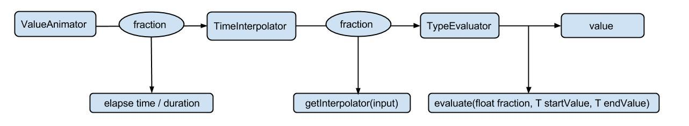

<h1 align="center">Android Animator</h1>

[toc]

## Android动画分类

Android中动画大致分为3类：帧动画（Frame Animation）、补间动画（Tween Animation）、属性动画（Property Animation）。

- 帧动画（Frame Animation0：通过AnimationDrawable控制animation-list.xml配置一组图片，动态播放。很少会使用。
- 补间动画（Tween Animation）：大致分为旋转、透明、缩放、位移四类操作。很少会使用。
- 属性动画（Property Animation）：属性动画是现在使用的最多的一种动画，它比补间动画更加强大。属性动画大致分为两种使用类型，分别是 ViewPropertyAnimator 和 ObjectAnimator。前者适合一些通用的动画，比如旋转、位移、缩放和透明，使用方式也很简单通过 `View.animate()` 即可得到 ViewPropertyAnimator，之后进行相应的动画操作即可。后者适合用于为我们的自定义控件添加动画，当然首先我们应该在自定义 View 中添加相应的 `getXXX()` 和 `setXXX()` 相应属性的 getter 和 setter 方法，这里需要注意的是在 setter 方法内改变了自定义 View 中的属性后要调用 `invalidate()` 来刷新View的绘制。之后调用 `ObjectAnimator.of` 属性类型()返回一个 ObjectAnimator，调用 `start()` 方法启动动画即可。

## 补间动画与属性动画的区别：

- 补间动画是父容器不断的绘制 view，看起来像移动了效果,其实 view 没有变化，还在原地。
- 是通过不断改变 view 内部的属性值，真正的改变 view。

## 插值器和估值器

**TimeInterpolator（时间插值器）**

**作用：**根据时间流逝的百分比计算出当前属性值改变的百分比

系统已有的插值器：

- **LinearInterpolator（线性插值器）：**匀速动画。
- **AccelerateDecelerateInterpolator（加速减速插值器）：**动画两头慢，中间快。
- **DecelerateInterpolator（减速插值器）：**动画越来越慢。

**TypeEvaluator（类型估值算法，即估值器）：**

**作用：**根据当前属性改变的百分比来计算改变后的属性值。

系统已有的估值器：

- **IntEvaluator：**针对整型属性
- **FloatEvaluator：**针对浮点型属性
- **ArgbEvaluator：**针对Color属性

## 属性动画过程

计算属性分为3个过程：

过程一：

计算已完成动画分数 elapsed fraction。为了执行一个动画，你需要创建一个ValueAnimator，并且指定目标对象属性的开始、结束和持续时间。在调用 start 后的整个动画过程中，ValueAnimator 会根据已经完成的动画时间计算得到一个0 到 1 之间的分数，代表该动画的已完成动画百分比。0表示 0%，1 表示 100%。

过程二：

计算插值（动画变化率）interpolated fraction 。当 ValueAnimator计算完已完成的动画分数后，它会调用当前设置的TimeInterpolator，去计算得到一个interpolated（插值）分数，在计算过程中，已完成动画百分比会被加入到新的插值计算中。

过程三：

计算属性值当插值分数计算完成后，ValueAnimator会根据插值分数调用合适的 TypeEvaluator去计算运动中的属性值。 以上分析引入了两个概念：已完成动画分数（elapsed fraction）、插值分数( interpolated fraction )。

## 原理及特点：

1.属性动画：

插值器：作用是根据时间流逝的百分比来计算属性变化的百分比

估值器：在1的基础上由这个东西来计算出属性到底变化了多少数值的类

其实就是利用插值器和估值器，来计出各个时刻View的属性，然后通过改变View的属性来实现View的动画效果。

2.View动画:

只是影像变化，view的实际位置还在原来地方。

3.帧动画：

是在xml中定义好一系列图片之后，使用AnimatonDrawable来播放的动画。

## 它们的区别：

属性动画才是真正的实现了 view 的移动，补间动画对view 的移动更像是在不同地方绘制了一个影子，实际对象还是处于原来的地方。 当动画的 repeatCount 设置为无限循环时，如果在Activity退出时没有及时将动画停止，属性动画会导致Activity无法释放而导致内存泄漏，而补间动画却没问题。 xml 文件实现的补间动画，复用率极高。在 Activity切换，窗口弹出时等情景中有着很好的效果。 使用帧动画时需要注意，不要使用过多特别大的图，容导致内存不足。

## 为什么属性动画移动后仍可点击？

播放补间动画的时候，我们所看到的变化，都只是临时的。而属性动画呢，它所改变的东西，却会更新到这个View所对应的矩阵中，所以当ViewGroup分派事件的时候，会正确的将当前触摸坐标，转换成矩阵变化后的坐标，这就是为什么播放补间动画不会改变触摸区域的原因了。