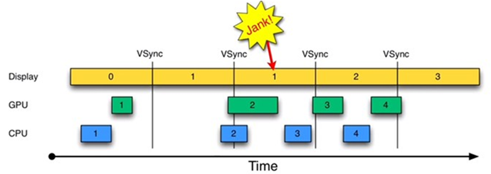
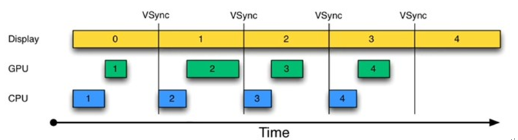
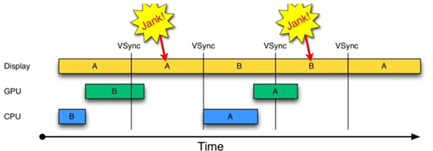
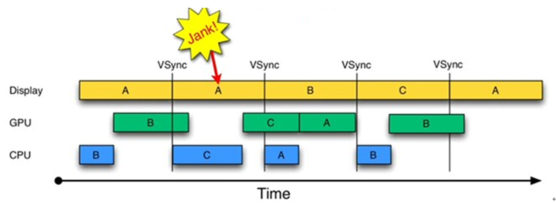
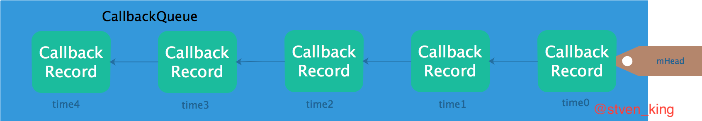
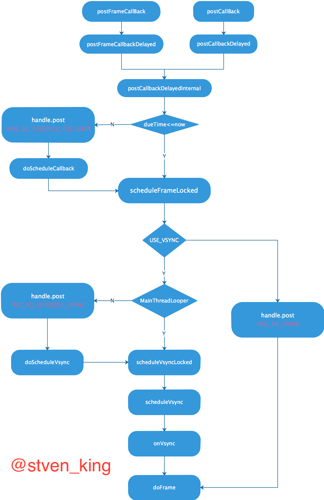

<h1 align="center">Choreographer解析</h1>

[toc]

## 一、Android的16ms和垂直同步以及三重缓存

### 1.1 前言

手机屏幕是由许多的像素点组成的，每个像素点通过显示不同的颜色最终屏幕呈现各种各样的图像。手机系统的类型和手机硬件的不同导致UI的流畅性体验个不一致。

### 1.2 屏幕展示的颜色数据

> - 在GPU中有一块缓冲区叫做 Frame Buffer ，这个帧缓冲区可以认为是存储像素值的二位数组。
> - 数组中的每一个值就对应了手机屏幕的像素点需要显示的颜色。
> - 由于这个帧缓冲区的数值是在不断变化的，所以只要完成对屏幕的刷新就可以显示不同的图像了.。
> - 至于刷新工作手记的逻辑电路会定期的刷新 Frame Buffer的 目前主流的刷新频率为60次/秒 折算出来就是16ms刷新一次。

#### 1.2.1 GPU的Frame Buffer中的数据

> - GPU 除了帧缓冲区用以交给手机屏幕进行绘制外. 还有一个缓冲区 Back Buffer 这个用以交给应用的,让CPU往里面填充数据。
> - GPU会定期交换 Back Buffer 和 Frame Buffer ，也就是对Back Buffer中的数据进行栅格化后将其转到 Frame Buffer 然后交给屏幕进行显示绘制，同时让原先的Frame Buffer 变成 Back Buffer 让程序处理。

### 1.3 Android的16ms

在Android中我们一般都会提到`16ms`绘制一次，那么到底是那里控制这16ms的呢？

在`Choreographer`类中我们有一个方法获取屏幕刷新速率：

```java
public final class Choreographer {
	private static float getRefreshRate() {
        DisplayInfo di = DisplayManagerGlobal.getInstance().getDisplayInfo(
                Display.DEFAULT_DISPLAY);
        return di.refreshRate;
    }
}

/**
 * Describes the characteristics of a particular logical display.
 * @hide
 */
public final class DisplayInfo implements Parcelable {
	/**
     * The refresh rate of this display in frames per second.
     * <p>
     * The value of this field is indeterminate if the logical display is presented on
     * more than one physical display.
     * </p>
     */
    public float refreshRate;
}

final class VirtualDisplayAdapter extends DisplayAdapter {
	private final class VirtualDisplayDevice extends DisplayDevice implements DeathRecipient {
		@Override
        public DisplayDeviceInfo getDisplayDeviceInfoLocked() {
            if (mInfo == null) {
                mInfo = new DisplayDeviceInfo();
                mInfo.name = mName;
                mInfo.uniqueId = getUniqueId();
                mInfo.width = mWidth;
                mInfo.height = mHeight;
                mInfo.refreshRate = 60;
                /***部分代码省略***/
            }
            return mInfo;
        }
	}
}
```

一秒`60`帧，计算下来大概`16.7ms`一帧。

### 1.4 屏幕绘制

作为严重影响 `Android` 口碑问题之一的UI流畅性差的问题，首先在 `Android 4.1` 版本中得到了有效处理。其解决方法就是本文要介绍的 `Project Butter`。

`Project Butter` 对 `Android Display` 系统进行了重构，引入了三个核心元素，即 `VSYNC` 、`Triple Buffer` 和 `Choreographer` 。其中， `VSYNC` 是理解 `Project Buffer` 的核心。`VSYNC` 是`Vertical Synchronization（垂直同步）` 的缩写，是一种在 `PC` 上已经很早就广泛使用的技术。 可简单的把它认为是一种定时中断。

接下来，将围绕 `VSYNC` 来介绍 `Android Display` 系统的工作方式。请注意，后续讨论将以`Display` 为基准，将其划分成 `16ms` 长度的时间段， 在每一时间段中，`Display` 显示一帧数据（相当于每秒 `60` 帧）。时间段从 `1` 开始编号。

#### 1.4.1 没有VSYNC的情况:



由上图可知

1. 时间从 `0` 开始，进入第一个 `16ms` ：`Display` 显示第 `0` 帧，`CPU` 处理完第一帧后，`GPU` 紧接其后处理继续第一帧。三者互不干扰，一切正常。
2. 时间进入第二个 `16ms`：因为早在上一个`16ms`时间内，第`1`帧已经由`CPU`，`GPU`处理完毕。故`Display`可以直接显示第`1`帧。显示没有问题。但在本`16ms`期间，`CPU`和`GPU` 却并未及时去绘制第`2`帧数据（注意前面的空白区），而是在本周期快结束时，`CPU/GPU`才去处理第`2`帧数据。
3. 时间进入第`3`个`16ms`，此时`Display`应该显示第`2`帧数据，但由于`CPU`和`GPU`还没有处理完第`2`帧数据，故`Display`只能继续显示第一帧的数据，结果使得第`1`帧多画了一次（对应时间段上标注了一个`Jank`）。
4. 通过上述分析可知，此处发生`Jank`的关键问题在于，为何第`1`个`16ms`段内，`CPU/GPU`没有及时处理第2``帧数据？原因很简单，`CPU`可能是在忙别的事情（比如某个应用通过`sleep` 固定时间来实现动画的逐帧显示），不知道该到处理 `UI绘制` 的时间了。可 `CPU` 一旦想起来要去处理第 `2` 帧数据，时间又错过了！

#### 1.4.2 NSYNC的出现

为解决这个问题，`Project Buffer`引入了`VSYNC`，这类似于时钟中断。结果如图所示：



由图可知，每收到`VSYNC`中断，`CPU`就开始处理各帧数据。整个过程非常完美。

不过，仔细琢磨`图2`却会发现一个新问题：`图2`中，`CPU`和`GPU`处理数据的速度似乎都能在`16ms`内完成，而且还有时间空余，也就是说，`CPU/GPU`的`FPS`（帧率，`Frames Per Second`）要高于`Display`的`FPS`。

确实如此。由于`CPU/GPU`只在收到`VSYNC`时才开始数据处理，故它们的`FPS`被拉低到与`Display`的`FPS`相同。但这种处理并没有什么问题，因为`Android`设备的`Display FPS`一般是`60`，其对应的显示效果非常平滑。 如果`CPU/GPU`的`FPS`小于`Display`的`FPS`，会是什么情况呢？请看下图：



由图可知：

1. 在第二个`16ms`时间段，`Display`本应显示`B`帧，但却因为`GPU`还在处理`B`帧，导致`A`帧被重复显示。
2. 同理，在第二个`16ms`时间段内，`CPU`无所事事，因为`A Buffer`被`Display`在使用。`B Buffer`被`GPU`在使用。注意，一旦过了`VSYNC`时间点， `CPU`就不能被触发以处理绘制工作了。

#### 1.4.3 三级缓存

为什么`CPU`不能在第二个`16ms`处开始绘制工作呢？原因就是只有两个`Buffer`。如果有第三个`Buffer`的存在，`CPU`就能直接使用它， 而不至于空闲。出于这一思路就引出了`Triple Buffer`。结果如图所示：



由图可知： 第二个`16ms`时间段，`CPU`使用`C Buffer`绘图。虽然还是会多显示`A帧`一次，但后续显示就比较顺畅了。

是不是`Buffer`越多越好呢？回答是否定的。由`图4`可知，在第二个时间段内，`CPU`绘制的第`C`帧数据要到第四个`16ms`才能显示， 这比`双Buffer`情况多了`16ms`延迟。所以，`Buffer`最好还是两个，三个足矣。

以上对`VSYNC`进行了理论分析，其实也引出了`Project Buffer`的三个关键点： 核心关键：需要`VSYNC`定时中断。 `Triple Buffer`：当双`Buffer`不够使用时，该系统可分配第三块`Buffer`。 另外，还有一个非常隐秘的关键点：即将绘制工作都统一到`VSYNC`时间点上。这就是`Choreographer`的作用。在它的统一指挥下，应用的绘制工作都将变得井井有条。

来自： https://blog.csdn.net/stven_king/article/details/80098798

## 二、Android系统的编舞者Choreographer

### 2.1 前言

上一篇文章 [Android的16ms和垂直同步以及三重缓存](https://dandanlove.blog.csdn.net/article/details/80098798) 解释了手机流畅性的问题，并在文章中提到了在Android4.1中添加的`Vsync`。`Choreographer`机制，用于同`Vsync`机制配合，实现统一调度界面绘图。

### 2.2 Choreographer的构造

Choreographer是线程级别的单例，并且具有处理当前线程消息循环队列的功能。

```java
public final class Choreographer {
    // Enable/disable vsync for animations and drawing.
    private static final boolean USE_VSYNC = SystemProperties.getBoolean(
            "debug.choreographer.vsync", true);
    
	//单例
	public static Choreographer getInstance() {
        return sThreadInstance.get();
    }

    //每个线程一个Choreographer实例
    private static final ThreadLocal<Choreographer> sThreadInstance =
            new ThreadLocal<Choreographer>() {
        @Override
        protected Choreographer initialValue() {
            Looper looper = Looper.myLooper();
            if (looper == null) {
                throw new IllegalStateException("The current thread must have a looper!");
            }
            return new Choreographer(looper);
        }
    };

    private Choreographer(Looper looper) {
        mLooper = looper;
        //创建Handler对象，用于处理消息，其looper为当前的线程的消息队列
        mHandler = new FrameHandler(looper);
        //创建VSYNC的信号接受对象
        mDisplayEventReceiver = USE_VSYNC ? new FrameDisplayEventReceiver(looper) : null;
        //初始化上一次frame渲染的时间点
        mLastFrameTimeNanos = Long.MIN_VALUE;
        //计算帧率，也就是一帧所需的渲染时间，getRefreshRate是刷新率，一般是60
        mFrameIntervalNanos = (long)(1000000000 / getRefreshRate());
        //创建消息处理队列
        mCallbackQueues = new CallbackQueue[CALLBACK_LAST + 1];
        for (int i = 0; i <= CALLBACK_LAST; i++) {
            mCallbackQueues[i] = new CallbackQueue();
        }
    }
}
```

> 变量USE_VSYNC用于表示系统是否是用了Vsync同步机制，该值是通过读取系统属性debug.choreographer.vsync来获取的。如果系统使用了Vsync同步机制，则创建一个FrameDisplayEventReceiver对象用于请求并接收Vsync事件，最后Choreographer创建了一个大小为3的CallbackQueue队列数组，用于保存不同类型的Callback。

### 2.3 Choreographer的使用

#### 2.3.1 注册Runnable对象

作者之前写过一篇关于**ViewRootImpl**的文章：**ViewRootImpl**的独白，我不是一个**View**(布局篇)里面有涉及使用Choreographer进行View的绘制，这次我们从ViewRootImpl的绘制出发来看看Choreographer的使用。

```java
public final class ViewRootImpl implements ViewParent,
        View.AttachInfo.Callbacks, HardwareRenderer.HardwareDrawCallbacks {
    Choreographer mChoreographer;
    /***部分代码省略***/
    public ViewRootImpl(Context context, Display display) {
        /***部分代码省略***/
        mChoreographer = Choreographer.getInstance();
        /***部分代码省略***/
    }
    /***部分代码省略***/
    void scheduleTraversals() {
        if (!mTraversalScheduled) {
            mTraversalScheduled = true;
            mTraversalBarrier = mHandler.getLooper().postSyncBarrier();
            mChoreographer.postCallback(
                    Choreographer.CALLBACK_TRAVERSAL, mTraversalRunnable, null);
            if (!mUnbufferedInputDispatch) {
                scheduleConsumeBatchedInput();
            }
            notifyRendererOfFramePending();
        }
    }
}
```

#### 2.3.2 注册FrameCallback对象

> 无论是注册`Runnable`还是注册`FrameCallback`对象最终都会调用`postCallbackDelayedInternal`方法往`mCallbackQueues`添加回调，区别在于`FrameCallback`的token为`FRAME_CALLBACK_TOKEN`，两者在回调的时候不相同。

```java
public final class Choreographer {
    // All frame callbacks posted by applications have this token.
    private static final Object FRAME_CALLBACK_TOKEN = new Object() {
        public String toString() { return "FRAME_CALLBACK_TOKEN"; }
    };

    private static final class CallbackRecord {
        public CallbackRecord next;
        public long dueTime;
        public Object action; // Runnable or FrameCallback
        public Object token;

        public void run(long frameTimeNanos) {
            if (token == FRAME_CALLBACK_TOKEN) {
                ((FrameCallback)action).doFrame(frameTimeNanos);
            } else {
                ((Runnable)action).run();
            }
        }
    }
}
```

### 2.4 Choreographer的消息处理

#### 2.4.1 Choreographer接受消息

```java
public final class Choreographer {
    //Input callback.  Runs first.
    public static final int CALLBACK_INPUT = 0;
    //Animation callback.  Runs before traversals.
    public static final int CALLBACK_ANIMATION = 1;
    // Traversal callback.  Handles layout and draw.  
    //Runs last after all other asynchronous messages have been handled.
    public static final int CALLBACK_TRAVERSAL = 2;
    private static final int CALLBACK_LAST = CALLBACK_TRAVERSAL;

    //长度为3（CALLBACK_LAST+1）的CallbackQueue类型的数组
    private final CallbackQueue[] mCallbackQueues;

    //发送回调事件
    public void postCallback(int callbackType, Runnable action, Object token) {
        postCallbackDelayed(callbackType, action, token, 0);
    }

    public void postCallbackDelayed(int callbackType,
            Runnable action, Object token, long delayMillis) {
        if (action == null) {
            throw new IllegalArgumentException("action must not be null");
        }
        if (callbackType < 0 || callbackType > CALLBACK_LAST) {
            throw new IllegalArgumentException("callbackType is invalid");
        }

        postCallbackDelayedInternal(callbackType, action, token, delayMillis);
    }

    private void postCallbackDelayedInternal(int callbackType,
            Object action, Object token, long delayMillis) {
        /***部分代码省略***/
        synchronized (mLock) {
            //从开机到现在的毫秒数（手机睡眠的时间不包括在内）； 
            final long now = SystemClock.uptimeMillis();
            final long dueTime = now + delayMillis;
            //添加类型为callbackType的CallbackQueue（将要执行的回调封装而成）
            mCallbackQueues[callbackType].addCallbackLocked(dueTime, action, token);
            //函数执行时间
            if (dueTime <= now) {
                //立即执行
                scheduleFrameLocked(now);
            } else {
                //异步回调延迟执行
                Message msg = mHandler.obtainMessage(MSG_DO_SCHEDULE_CALLBACK, action);
                msg.arg1 = callbackType;
                msg.setAsynchronous(true);
                mHandler.sendMessageAtTime(msg, dueTime);
            }
        }
    }
    /**
     * @param dueTime 任务开始时间
     * @param action 任务
     * @param token 标识
     */
    private CallbackRecord obtainCallbackLocked(long dueTime, Object action, Object token) {
        CallbackRecord callback = mCallbackPool;
        if (callback == null) {
            callback = new CallbackRecord();
        } else {
            mCallbackPool = callback.next;
            callback.next = null;
        }
        callback.dueTime = dueTime;
        callback.action = action;
        callback.token = token;
        return callback;
    }
    private final class CallbackQueue {
        private CallbackRecord mHead;
        public void addCallbackLocked(long dueTime, Object action, Object token) {
            CallbackRecord callback = obtainCallbackLocked(dueTime, action, token);
            CallbackRecord entry = mHead;
            //判断当前的是否不头节点
            if (entry == null) {
                mHead = callback;
                return;
            }
            //判断当前任务出发起始时间是不是当前所有任务的最开始时间
            if (dueTime < entry.dueTime) {
                callback.next = entry;
                mHead = callback;
                return;
            }
            //根据任务开始时间由小到大插入到链表当中
            while (entry.next != null) {
                if (dueTime < entry.next.dueTime) {
                    callback.next = entry.next;
                    break;
                }
                entry = entry.next;
            }
            entry.next = callback;
        }
    }
}
```

##### 2.4.1.1 CallbackQueue

```java
public final class Choreographer {
    /**
     * Callback type: Input callback.  Runs first.
     * @hide
     */
    public static final int CALLBACK_INPUT = 0;

    /**
     * Callback type: Animation callback.  Runs before traversals.
     * @hide
     */
    public static final int CALLBACK_ANIMATION = 1;

    /**
     * Callback type: Traversal callback.  Handles layout and draw.  Runs
     * after all other asynchronous messages have been handled.
     * @hide
     */
    public static final int CALLBACK_TRAVERSAL = 2;
}
```

> 三种类型不同的`CallbackRecord`链表，按照任务触发时间由小到大排列。



#### 2.4.2 FrameHandler异步处理

```java
public final class Choreographer {

    private static final int MSG_DO_FRAME = 0;
    private static final int MSG_DO_SCHEDULE_VSYNC = 1;
    private static final int MSG_DO_SCHEDULE_CALLBACK = 2;
    private final class FrameHandler extends Handler {
        public FrameHandler(Looper looper) {
            super(looper);
        }

        @Override
        public void handleMessage(Message msg) {
            switch (msg.what) {
                case MSG_DO_FRAME:
                    //刷新当前这一帧
                    doFrame(System.nanoTime(), 0);
                    break;
                case MSG_DO_SCHEDULE_VSYNC:
                    //做VSYNC的信号同步
                    doScheduleVsync();
                    break;
                case MSG_DO_SCHEDULE_CALLBACK:
                    //将当前任务加入执行队列
                    doScheduleCallback(msg.arg1);
                    break;
            }
        }
    }
}
```

##### 2.4.2.1 doFrame

```java
public final class Choreographer {
    void doFrame(long frameTimeNanos, int frame) {
        final long startNanos;
        synchronized (mLock) {
            if (!mFrameScheduled) {
                return; // no work to do
            }
            //当前时间
            startNanos = System.nanoTime();
            //抖动间隔
            final long jitterNanos = startNanos - frameTimeNanos;
            //抖动间隔大于屏幕刷新时间间隔（16ms）
            if (jitterNanos >= mFrameIntervalNanos) {
                final long skippedFrames = jitterNanos / mFrameIntervalNanos;
                //跳过了几帧！，也许当前应用在主线程做了太多的事情。
                if (skippedFrames >= SKIPPED_FRAME_WARNING_LIMIT) {
                    Log.i(TAG, "Skipped " + skippedFrames + " frames!  "
                            + "The application may be doing too much work on its main thread.");
                }
                //最后一次的屏幕刷是lastFrameOffset之前开始的
                final long lastFrameOffset = jitterNanos % mFrameIntervalNanos;
                if (DEBUG) {
                    Log.d(TAG, "Missed vsync by " + (jitterNanos * 0.000001f) + " ms "
                            + "which is more than the frame interval of "
                            + (mFrameIntervalNanos * 0.000001f) + " ms!  "
                            + "Skipping " + skippedFrames + " frames and setting frame "
                            + "time to " + (lastFrameOffset * 0.000001f) + " ms in the past.");
                }
                //最后一帧的刷新开始时间
                frameTimeNanos = startNanos - lastFrameOffset;
            }
            //由于跳帧可能造成了当前展现的是之前的帧，这样需要等待下一个vsync信号
            if (frameTimeNanos < mLastFrameTimeNanos) {
                if (DEBUG) {
                    Log.d(TAG, "Frame time appears to be going backwards.  May be due to a "
                            + "previously skipped frame.  Waiting for next vsync.");
                }
                scheduleVsyncLocked();
                return;
            }
            //当前画面刷新的状态置false
            mFrameScheduled = false;
            //更新最后一帧的刷新时间
            mLastFrameTimeNanos = frameTimeNanos;
        }
        //按照优先级策略进行画面刷新时间处理
        doCallbacks(Choreographer.CALLBACK_INPUT, frameTimeNanos);
        doCallbacks(Choreographer.CALLBACK_ANIMATION, frameTimeNanos);
        doCallbacks(Choreographer.CALLBACK_TRAVERSAL, frameTimeNanos);
        
        if (DEBUG) {
            final long endNanos = System.nanoTime();
            Log.d(TAG, "Frame " + frame + ": Finished, took "
                    + (endNanos - startNanos) * 0.000001f + " ms, latency "
                    + (startNanos - frameTimeNanos) * 0.000001f + " ms.");
        }
    }
}
```

##### 2.4.2.2 doScheduleVsync

```java
public final class Choreographer {
    //等待vsync信号
    void doScheduleVsync() {
        synchronized (mLock) {
            if (mFrameScheduled) {
                scheduleVsyncLocked();
            }
        }
    }
    //当运行在Looper线程，则立刻调度vsync
    private void scheduleVsyncLocked() {
        mDisplayEventReceiver.scheduleVsync();
    }
}
```

##### 2.4.2.3 doScheduleCallback

```java
public final class Choreographer {
    // Enable/disable vsync for animations and drawing.
    private static final boolean USE_VSYNC = SystemProperties.getBoolean(
            "debug.choreographer.vsync", true);
    private final class CallbackQueue {
        //判断是否有能执行的任务
        public boolean hasDueCallbacksLocked(long now) {
            return mHead != null && mHead.dueTime <= now;
        }
        /***部分代码省略***/
    }
    /***部分代码省略***/
    //执行任务回调
    void doScheduleCallback(int callbackType) {
        synchronized (mLock) {
            if (!mFrameScheduled) {
                final long now = SystemClock.uptimeMillis();
                //有能执行的任务
                if (mCallbackQueues[callbackType].hasDueCallbacksLocked(now)) {
                    scheduleFrameLocked(now);
                }
            }
        }
    }

    private void scheduleFrameLocked(long now) {
        if (!mFrameScheduled) {
            mFrameScheduled = true;
            if (USE_VSYNC) {
                if (DEBUG) {
                    Log.d(TAG, "Scheduling next frame on vsync.");
                }

                // If running on the Looper thread, then schedule the vsync immediately,
                // otherwise post a message to schedule the vsync from the UI thread
                // as soon as possible.
                if (isRunningOnLooperThreadLocked()) {
                    //当运行在Looper线程，则立刻调度vsync
                    scheduleVsyncLocked();
                } else {
                    //切换到主线程，调度vsync
                    Message msg = mHandler.obtainMessage(MSG_DO_SCHEDULE_VSYNC);
                    msg.setAsynchronous(true);
                    mHandler.sendMessageAtFrontOfQueue(msg);
                }
            } else {
                //如果没有VSYNC的同步，则发送消息刷新画面
                final long nextFrameTime = Math.max(
                        mLastFrameTimeNanos / TimeUtils.NANOS_PER_MS + sFrameDelay, now);
                if (DEBUG) {
                    Log.d(TAG, "Scheduling next frame in " + (nextFrameTime - now) + " ms.");
                }
                Message msg = mHandler.obtainMessage(MSG_DO_FRAME);
                msg.setAsynchronous(true);
                mHandler.sendMessageAtTime(msg, nextFrameTime);
            }
        }
    }
    //检测当前的Looper线程是不是主线程
    private boolean isRunningOnLooperThreadLocked() {
        return Looper.myLooper() == mLooper;
    }
}
public final class Choreographer {
    // The display event receiver can only be accessed by the looper thread to which
    // it is attached.  We take care to ensure that we post message to the looper
    // if appropriate when interacting with the display event receiver.
    private final FrameDisplayEventReceiver mDisplayEventReceiver;

    private Choreographer(Looper looper) {
        /***部分代码省略***/
        //在Choreographer的构造函数中，我们使用USE_VSYNC则会有FrameDisplayEventReceiver做为与显示器时间进行交互
        mDisplayEventReceiver = USE_VSYNC ? new FrameDisplayEventReceiver(looper) : null;
    }
    /***部分代码省略***/
    private final class FrameDisplayEventReceiver extends DisplayEventReceiver
            implements Runnable {
        //构造函数需要传入当前的looper队列  
        public FrameDisplayEventReceiver(Looper looper) {
            super(looper);
        }
        /***部分代码省略***/  
    }
}
public abstract class DisplayEventReceiver {
    private static native void nativeScheduleVsync(long receiverPtr);
    /**
     * Creates a display event receiver.
     *
     * @param looper The looper to use when invoking callbacks.
     */
    public DisplayEventReceiver(Looper looper) {
        if (looper == null) {
            throw new IllegalArgumentException("looper must not be null");
        }
        mMessageQueue = looper.getQueue();
        //接受数量多少等于looper中消息的多少
        mReceiverPtr = nativeInit(this, mMessageQueue);
        mCloseGuard.open("dispose");
    }
    /**
     * Schedules a single vertical sync pulse to be delivered when the next
     * display frame begins.
     */
    public void scheduleVsync() {
        if (mReceiverPtr == 0) {
            Log.w(TAG, "Attempted to schedule a vertical sync pulse but the display event "
                    + "receiver has already been disposed.");
        } else {
            nativeScheduleVsync(mReceiverPtr);
        }
    }
}
```

#### 2.4.3 Choreographer流程汇总



### 2.5 native端的消息处理

文件路径：`frameworks/base/core/jni/android_view_DisplayEventReceiver.cpp`

#### 2.5.1 NativeDisplayEventReceiver类结构

```cpp
//NativeDisplayEventReceiver类的定义
class NativeDisplayEventReceiver : public LooperCallback {
public://对象公共方法
    //构造函数
    NativeDisplayEventReceiver(JNIEnv* env,
            jobject receiverObj, const sp<MessageQueue>& messageQueue);
    status_t initialize();  //初始化方法
    void dispose();
    status_t scheduleVsync();//获取下一个VSYNC信号

protected:
    virtual ~NativeDisplayEventReceiver();//析构函数

private:
    jobject mReceiverObjGlobal;//java层的DisplayEventReceiver的全局引用
    sp<MessageQueue> mMessageQueue;//looper的消息队列
    DisplayEventReceiver mReceiver;//frameworks/nivate/libs/gui/DisplayEventReceiver.cpp
    bool mWaitingForVsync;//默认为false

    virtual int handleEvent(int receiveFd, int events, void* data);
    bool processPendingEvents(nsecs_t* outTimestamp, int32_t* id, uint32_t* outCount);
    void dispatchVsync(nsecs_t timestamp, int32_t id, uint32_t count);
    void dispatchHotplug(nsecs_t timestamp, int32_t id, bool connected);
};

//ststem/core/include/utils/Looper.h
/**
 * A looper callback.
 */
//NativeDisplayEventReceiver的父类，用与looper中消息的回调
class LooperCallback : public virtual RefBase {
protected:
    virtual ~LooperCallback() { }

public:
    virtual int handleEvent(int fd, int events, void* data) = 0;
};
```

#### 2.5.2 NativeDisplayEventReceiver初始化

```cpp
//初始化native的消息队列
static jlong nativeInit(JNIEnv* env, jclass clazz, jobject receiverObj,
        jobject messageQueueObj) {
    sp<MessageQueue> messageQueue = android_os_MessageQueue_getMessageQueue(env, messageQueueObj);
    if (messageQueue == NULL) {
        jniThrowRuntimeException(env, "MessageQueue is not initialized.");
        return 0;
    }
    //构造NativeDisplayEventReceiver对象
    sp<NativeDisplayEventReceiver> receiver = new NativeDisplayEventReceiver(env,
            receiverObj, messageQueue);
    status_t status = receiver->initialize();
    if (status) {
        String8 message;
        message.appendFormat("Failed to initialize display event receiver.  status=%d", status);
        jniThrowRuntimeException(env, message.string());
        return 0;
    }

    receiver->incStrong(gDisplayEventReceiverClassInfo.clazz); // retain a reference for the object
    return reinterpret_cast<jlong>(receiver.get());
}
//NativeDisplayEventReceiver的构造函数
NativeDisplayEventReceiver::NativeDisplayEventReceiver(JNIEnv* env,
        jobject receiverObj, const sp<MessageQueue>& messageQueue) :
        mReceiverObjGlobal(env->NewGlobalRef(receiverObj)),
        mMessageQueue(messageQueue), mWaitingForVsync(false) {
    ALOGV("receiver %p ~ Initializing input event receiver.", this);
}
//receiver内部数据的初始化
status_t NativeDisplayEventReceiver::initialize() {
    status_t result = mReceiver.initCheck();
    if (result) {
        ALOGW("Failed to initialize display event receiver, status=%d", result);
        return result;
    }
    //监听mReceiver的所获取的文件句柄。
    int rc = mMessageQueue->getLooper()->addFd(mReceiver.getFd(), 0, Looper::EVENT_INPUT,
            this, NULL);
    if (rc < 0) {
        return UNKNOWN_ERROR;
    }
    return OK;
}
```

#### 2.5.3 NativeDisplayEventReceiver请求VSYNC的同步

```cpp
//java层调用DisplayEventReceiver的scheduleVsync请求VSYNC的同步
static void nativeScheduleVsync(JNIEnv* env, jclass clazz, jlong receiverPtr) {
    sp<NativeDisplayEventReceiver> receiver =
            reinterpret_cast<NativeDisplayEventReceiver*>(receiverPtr);
    status_t status = receiver->scheduleVsync();
    if (status) {
        String8 message;
        message.appendFormat("Failed to schedule next vertical sync pulse.  status=%d", status);
        jniThrowRuntimeException(env, message.string());
    }
}

status_t NativeDisplayEventReceiver::scheduleVsync() {
    if (!mWaitingForVsync) {
        ALOGV("receiver %p ~ Scheduling vsync.", this);

        // Drain all pending events.
        nsecs_t vsyncTimestamp;
        int32_t vsyncDisplayId;
        uint32_t vsyncCount;
        processPendingEvents(&vsyncTimestamp, &vsyncDisplayId, &vsyncCount);
        //请求下一次Vsync信息处理
        status_t status = mReceiver.requestNextVsync();
        if (status) {
            ALOGW("Failed to request next vsync, status=%d", status);
            return status;
        }

        mWaitingForVsync = true;
    }
    return OK;
}

//frameworks/native/libs/gui/DisplayEventReceiver.cpp
//通过IDisplayEventConnection接口来请求Vsync信号，IDisplayEventConnection实现了Binder通信框架，可以跨进程调用。
//因为Vsync信号请求进程和Vsync产生进程有可能不在同一个进程空间，因此这里就借助IDisplayEventConnection接口来实现。
status_t DisplayEventReceiver::requestNextVsync() {
    if (mEventConnection != NULL) {
        mEventConnection->requestNextVsync();
        return NO_ERROR;
    }
    return NO_INIT;
}
```

#### 2.5.4 NativeDisplayEventReceiver处理消息

```cpp
//NativeDisplayEventReceiver处理消息
int NativeDisplayEventReceiver::handleEvent(int receiveFd, int events, void* data) {
    ...
    nsecs_t vsyncTimestamp;
    int32_t vsyncDisplayId;
    uint32_t vsyncCount;
    //过滤出最后一次的vsync
    if (processPendingEvents(&vsyncTimestamp, &vsyncDisplayId, &vsyncCount)) {
        mWaitingForVsync = false;
        //分发Vsync，调用到native的android/view/DisplayEventReceiver.class的dispatchVsync方法
        dispatchVsync(vsyncTimestamp, vsyncDisplayId, vsyncCount);
    }
    return 1;
}
```

#### 2.5.5 DisplayEventReceiver分发VSYNC信号

```java
public abstract class DisplayEventReceiver {
    /***部分代码省略***/
    public void onVsync(long timestampNanos, int builtInDisplayId, int frame) {
    }
    // Called from native code.
    @SuppressWarnings("unused")
    private void dispatchVsync(long timestampNanos, int builtInDisplayId, int frame) {
        onVsync(timestampNanos, builtInDisplayId, frame);
    }
}

private final class FrameDisplayEventReceiver extends DisplayEventReceiver
            implements Runnable {
    private boolean mHavePendingVsync;
    private long mTimestampNanos;
    private int mFrame;
    /***部分代码省略***/
    @Override
    public void onVsync(long timestampNanos, int builtInDisplayId, int frame) {
        //忽略来自第二显示屏的Vsync
        if (builtInDisplayId != SurfaceControl.BUILT_IN_DISPLAY_ID_MAIN) {
            scheduleVsync();
            return;
        }
        /***部分代码省略***/
        mTimestampNanos = timestampNanos;
        mFrame = frame;
        //该消息的callback为当前对象FrameDisplayEventReceiver
        Message msg = Message.obtain(mHandler, this);
        msg.setAsynchronous(true);
        mHandler.sendMessageAtTime(msg, timestampNanos / TimeUtils.NANOS_PER_MS);
    }

    @Override
    public void run() {
        mHavePendingVsync = false;
        //DisplayEventReceiver消息处理
        doFrame(mTimestampNanos, mFrame);
    }
}
```

#### 2.5.6 DisplayEventReceiver消息处理

> 参见`4.2.1、doFrame`介绍

### 2.6 Choreographer处理回调

#### 2.6.1 Choreographer触发可执行任务的回调

> 这里为什么说可执行任务呢？因为每个任务都有自己的触发时间，`Choreographer`只选择它能触发的任务。

```java
public final class Choreographer {
    //进行回调的标识
    private boolean mCallbacksRunning;
    /***部分代码省略***/
    void doCallbacks(int callbackType, long frameTimeNanos) {
        CallbackRecord callbacks;
        synchronized (mLock) {
            final long now = SystemClock.uptimeMillis();
            //找到当前能触发的回调链表
            callbacks = mCallbackQueues[callbackType].extractDueCallbacksLocked(now);
            if (callbacks == null) {
                return;
            }
            mCallbacksRunning = true;
        }
        try {
            for (CallbackRecord c = callbacks; c != null; c = c.next) {
                //循环遍历，回调所有的任务
                c.run(frameTimeNanos);
            }
        } finally {
            synchronized (mLock) {
                mCallbacksRunning = false;
                do {
                    final CallbackRecord next = callbacks.next;
                    recycleCallbackLocked(callbacks);
                    callbacks = next;
                } while (callbacks != null);
            }
        }
    }
    //回收回调任务资源
    private void recycleCallbackLocked(CallbackRecord callback) {
        callback.action = null;
        callback.token = null;
        callback.next = mCallbackPool;
        mCallbackPool = callback;
    }
    private final class CallbackQueue {
        public CallbackRecord extractDueCallbacksLocked(long now) {
            CallbackRecord callbacks = mHead;
            //当链表头部的任务触发事件都比当前时间晚，那么整个链表则没有任务需要触发
            if (callbacks == null || callbacks.dueTime > now) {
                return null;
            }

            CallbackRecord last = callbacks;
            CallbackRecord next = last.next;
            //找到当前时间之前需要触发任务链表，将该链表截断并返回
            while (next != null) {
                if (next.dueTime > now) {
                    last.next = null;
                    break;
                }
                last = next;
                next = next.next;
            }
            //mHead重置为原始链表截断的头部
            mHead = next;
            return callbacks;
        }
    }
}
```

#### 2.6.2 处理Choreographer回调

`3、Choreographer的使用`部分讲述了`ViewRootImpl`使用`Choreographer`的使用，那么我们现在来看一下`ViewRootImpl`对`Choreographer`回调时间的处理。

```java
public final class ViewRootImpl implements ViewParent,
        View.AttachInfo.Callbacks, HardwareRenderer.HardwareDrawCallbacks {
    Choreographer mChoreographer;
    /***部分代码省略***/
    public ViewRootImpl(Context context, Display display) {
        /***部分代码省略***/
        mChoreographer = Choreographer.getInstance();
        /***部分代码省略***/
    }
    /***部分代码省略***/
    void scheduleTraversals() {
        if (!mTraversalScheduled) {
            mTraversalScheduled = true;
            mTraversalBarrier = mHandler.getLooper().postSyncBarrier();
            mChoreographer.postCallback(
                    Choreographer.CALLBACK_TRAVERSAL, mTraversalRunnable, null);
            if (!mUnbufferedInputDispatch) {
                scheduleConsumeBatchedInput();
            }
            notifyRendererOfFramePending();
        }
    }
    final class TraversalRunnable implements Runnable {
        @Override
        public void run() {
            //开始View的测量、布局、绘制
            doTraversal();
        }
    }
    final TraversalRunnable mTraversalRunnable = new TraversalRunnable();
}
```

### 2.7 总结

整片文章单独看起来留下的印象不是很深刻，以前阅读过 [Android的16ms和垂直同步以及三重缓存](https://blog.csdn.net/stven_king/article/details/80098798) 这篇文章之后就会知道本文章是对 [Android的16ms和垂直同步以及三重缓存](https://blog.csdn.net/stven_king/article/details/80098798) 这篇文章其中的一些疑问进行解答。从代码的角度讲述了android的屏幕绘制部分知识。

来自：https://blog.csdn.net/stven_king/article/details/80098845

## 参考

[Android-Choreographer原理 | 苍耳的博客 (ljd1996.github.io)](https://ljd1996.github.io/2020/09/07/Android-Choreographer原理/)

[Android图形渲染之Choreographer原理 | 大专栏 (dazhuanlan.com)](https://www.dazhuanlan.com/2020/03/01/5e5ae8fd57c6d/)

[Android-Choreographer原理 | 苍耳的博客 (ljd1996.github.io)](https://ljd1996.github.io/2020/09/07/Android-Choreographer原理/)

[Android Choreographer 源码分析 - 简书 (jianshu.com)](https://www.jianshu.com/p/996bca12eb1d)

[【总结】Android的16ms和垂直同步以及三重缓存_stven_king的专栏-CSDN博客](https://blog.csdn.net/stven_king/article/details/80098798)

[Android系统的编舞者Choreographer_stven_king的专栏-CSDN博客](https://blog.csdn.net/stven_king/article/details/80098845)

[Choreographer原理 - Gityuan博客 | 袁辉辉的技术博客](http://gityuan.com/2017/02/25/choreographer/)

