<h1 align="center">Vsync 解读</h1>

[TOC]

Vsync 信号可以由硬件产生，也可以用软件模拟，不过现在基本上都是硬件产生，负责产生硬件 Vsync 的是 HWC,HWC 可生成 VSYNC 事件并通过回调将事件发送到 SurfaceFlinge , DispSync 将 Vsync 生成由 Choreographer 和 SurfaceFlinger 使用的 VSYNC_APP 和 VSYNC_SF 信号

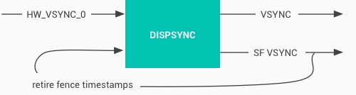

在 [Android 基于 Choreographer 的渲染机制详解](https://www.androidperformance.com/2019/10/22/Android-Choreographer/) 这篇文章里面，我们有提到 ：Choreographer 的引入，主要是配合 Vsync，给上层 App 的渲染提供一个稳定的 Message 处理的时机，也就是 Vsync 到来的时候 ，系统通过对 Vsync 信号周期的调整，来控制每一帧绘制操作的时机. 目前大部分手机都是 60Hz 的刷新率，也就是 16.6ms 刷新一次，系统为了配合屏幕的刷新频率，将 Vsync 的周期也设置为 16.6 ms，每个 16.6 ms，Vsync 信号唤醒 Choreographer 来做 App 的绘制操作 ，这就是引入 Choreographer 的主要作用

渲染层(App)与 Vsync 打交道的是 Choreographer，而合成层与 Vsync 打交道的，则是 SurfaceFlinger。SurfaceFlinger 也会在 Vsync 到来的时候，将所有已经准备好的 Surface 进行合成操作

下图显示在 Systrace 中，SurfaceFlinger 进程中的 VSYNC_APP 和 VSYNC_SF 的情况

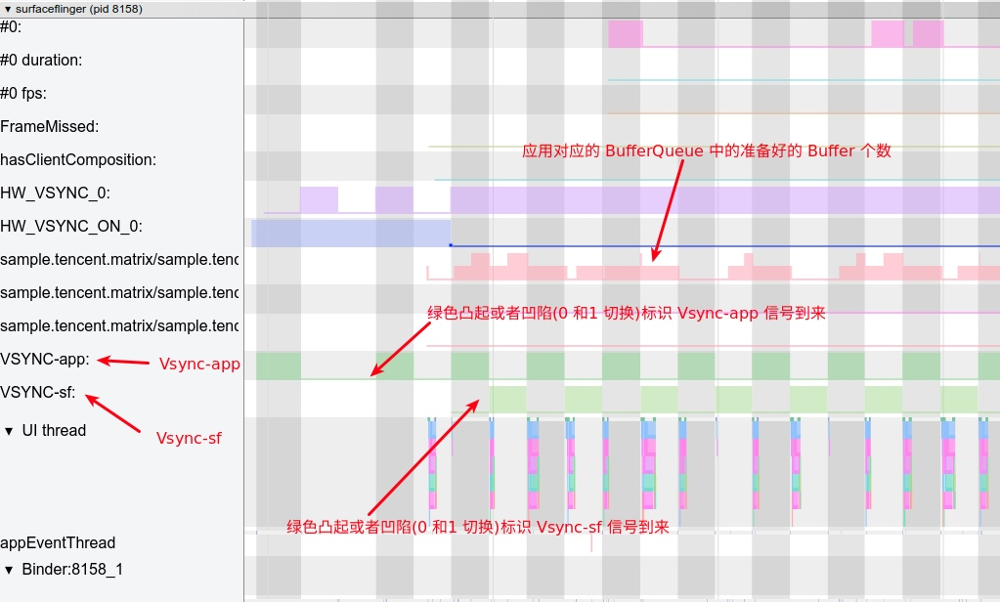

## Android 图形数据流向

首先我们要大概了解 Android 中的图形数据流的方向，从下面这张图，结合 Android 的图像流，我们大概把从 App 绘制到屏幕显示，分为下面几个阶段：

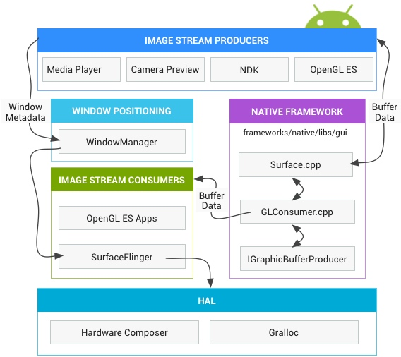

1. 第一阶段：App 在收到 Vsync-App 的时候，在主线程进行 measure、layout、draw(构建 DisplayList , 里面包含 OpenGL 渲染需要的命令及数据) 。这里对应的 Systrace 中的主线程 **doFrame** 操作
2. 第二阶段：CPU 将数据上传（共享或者拷贝）给 GPU,　这里 ARM 设备 内存一般是 GPU 和 CPU 共享内存。这里对应的 Systrace 中的渲染线程的 **flush drawing commands** 操作
3. 第三阶段：通知 GPU 渲染，真机一般不会阻塞等待 GPU 渲染结束，CPU 通知结束后就返回继续执行其他任务，使用 Fence 机制辅助 GPU CPU 进行同步操作
4. 第四 阶段：swapBuffers，并通知 SurfaceFlinger 图层合成。这里对应的 Systrace 中的渲染线程的 **eglSwapBuffersWithDamageKHR** 操作
5. 第五阶段：SurfaceFlinger 开始合成图层，如果之前提交的 GPU 渲染任务没结束，则等待 GPU 渲染完成，再合成（Fence 机制），合成依然是依赖 GPU，不过这就是下一个任务了.这里对应的 Systrace 中的 SurfaceFlinger 主线程的 onMessageReceived 操作（包括 handleTransaction、handleMessageInvalidate、handleMessageRefresh）SurfaceFlinger 在合成的时候，会将一些合成工作委托给 Hardware Composer,从而降低来自 OpenGL 和 GPU 的负载，只有 Hardware Composer 无法处理的图层，或者指定用 OpenGL 处理的图层，其他的 图层偶会使用 Hardware Composer 进行合成
6. 第六阶段 ：最终合成好的数据放到屏幕对应的 Frame Buffer 中，固定刷新的时候就可以看到了

下面这张图也是官方的一张图，结合上面的阶段，从左到右看，可以看到一帧的数据是如何在各个进程之间流动的

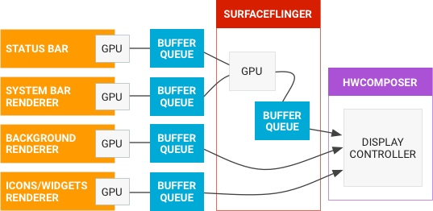

## Systrace 中的图像数据流

了解了 Android 中的图形数据流的方向，我们就可以把上面这个比较抽象的数据流图，在 Systrace 上进行映射展示

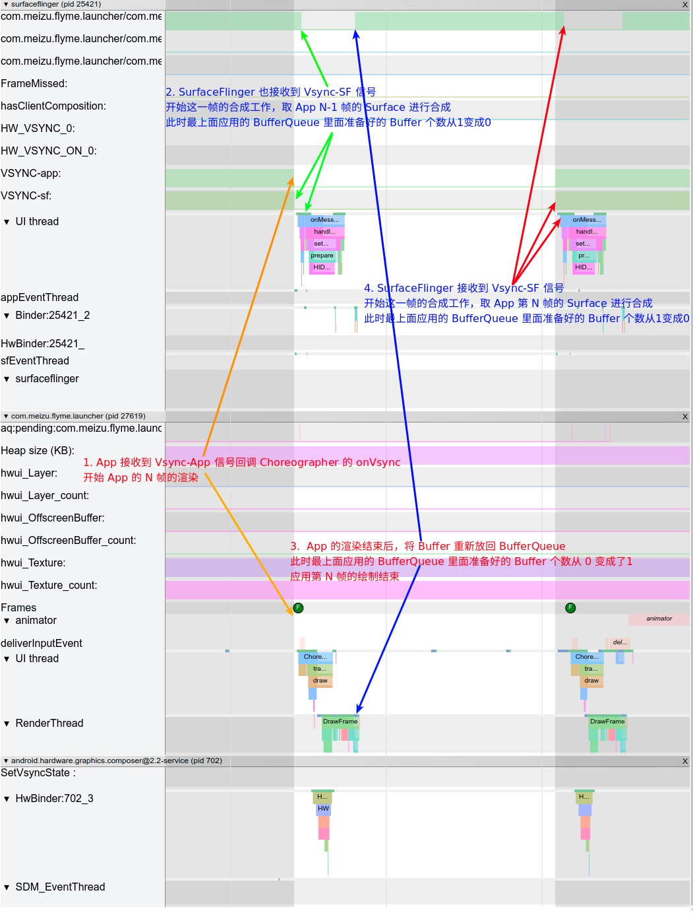

上图中主要包含 SurfaceFlinger、App 和 hwc 三个进程，下面就来结合图中的标号，来进一步说明数据的流向

1. 第一个 Vsync 信号到来, SurfaceFlinger 和 App 同时收到 Vsync 信号
2. SurfaceFlinger 收到 Vsync-sf 信号，开始进行 App 上一帧的 Buffer 的合成
3. App 收到 Vsycn-app 信号，开始进行这一帧的 Buffer 的渲染(对应上面的第一、二、三、四阶段)
4. 第二个 Vsync 信号到来 ，SurfaceFlinger 和 App 同时收到 Vsync 信号，SurfaceFlinger 获取 App 在第二步里面渲染的 Buffer，开始合成（对应上面的第五阶段），App 收到 Vsycn-app 信号，开始新一帧的 Buffer 的渲染(对应上面的第一、二、三、四阶段)

## Vsync Offset

文章最开始有提到，Vsync 信号可以由硬件产生，也可以用软件模拟，不过现在基本上都是硬件产生，负责产生硬件 Vsync 的是 HWC,HWC 可生成 VSYNC 事件并通过回调将事件发送到 SurfaceFlinge , DispSync 将 Vsync 生成由 Choreographer 和 SurfaceFlinger 使用的 VSYNC_APP 和 VSYNC_SF 信号.

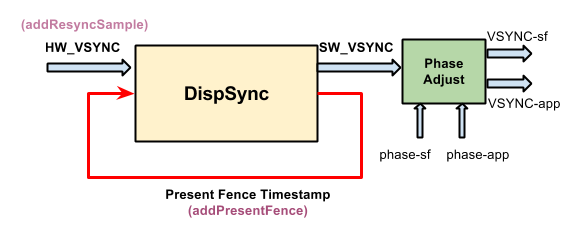

其中 app 和 sf 相对 hw_vsync_0 都有一个偏移,即 phase-app 和 phase-sf，如下图

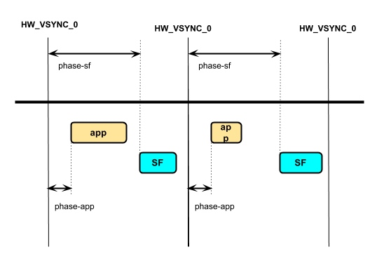

**Vsync Offset 我们指的是 VSYNC_APP 和 VSYNC_SF 之间有一个 Offset，即上图中 phase-sf - phase-app 的值**，这个 Offset 是厂商可以配置的。如果 Offset 不为 0，那么意味着 **App 和 SurfaceFlinger 主进程不是同时收到 Vsync 信号，而是间隔 Offset (通常在 0 - 16.6ms 之间)**

目前大部分厂商都没有配置这个 Offset，所以 App 和 SurfaceFlinger 是同时收到 Vsync 信号的.

可以通过 Dumpsys SurfaceFlinger 来查看对应的值

**Offset 为 0**：（sf phase - app phase = 0)

```
Sync configuration: [using: EGL_ANDROID_native_fence_sync EGL_KHR_wait_sync]
DispSync configuration: 
          app phase 1000000 ns,              sf phase 1000000 ns 
    early app phase 1000000 ns,        early sf phase 1000000 ns 
 early app gl phase 1000000 ns,     early sf gl phase 1000000 ns 
     present offset 0 ns                      refresh 16666666 ns
```

**Offset 不为 0** (SF phase - app phase = 4 ms)

```
Sync configuration: [using: EGL_ANDROID_native_fence_sync EGL_KHR_wait_sync]

VSYNC configuration:
         app phase:   2000000 ns	         SF phase:   6000000 ns
   early app phase:   2000000 ns	   early SF phase:   6000000 ns
GL early app phase:   2000000 ns	GL early SF phase:   6000000 ns
    present offset:         0 ns	     VSYNC period:  16666666 ns
```

下面以 Systrace 为例，来看 Offset 在 Systrace 中的表现

### Offset 为 0

首先说 Offset 为 0 的情况， 此时 App 和 SurfaceFlinger 是同时收到 Vsync 信号 ， 其对应的 Systrace 图如下：

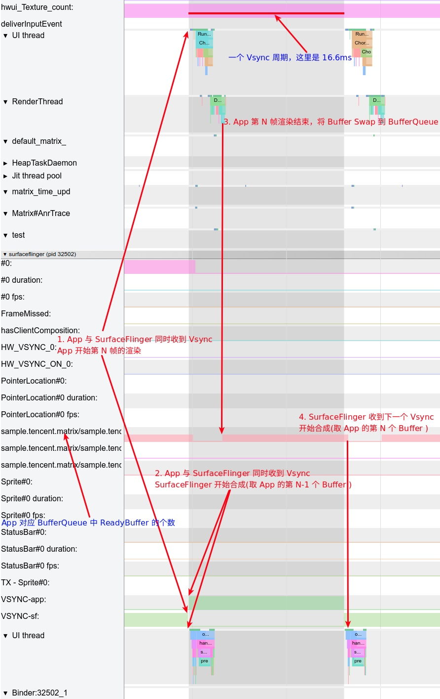

这个图上面也有讲解，这里就不再详细说明，大家只需要看到，App 渲染好的 Buffer，要等到下一个 Vsync-SF 来的时候才会被 SurfaceFlinger 拿去做合成，这个时间大概在 16.6 ms。这时候大家可能会想，**如果 App 的 Buffer 渲染结束，Swap 到 BufferQueue 中 ，就触发 SurfaceFlinger 去做合成，那岂不是省了一些时间(0-16.6ms )**?

答案是可行的，这也就引入了 Offset 机制，在这种情况下，App 先收到 Vsync 信号，进行一帧的渲染工作，然后过了 Offset 时间后，SurfaceFlinger 才收到 Vsync 信号开始合成，这时候如果 App 的 Buffer 已经 Ready 了，那么 SurfaceFlinger 这一次合成就可以包含 App 这一帧，用户也会早一点看到。

### Offset 不为 0

下图中，就是一个 Offset 为 4ms 的案例，App 收到 Vsync 4 ms 之后，SurfaceFlinger 才收到 Vsync 信号

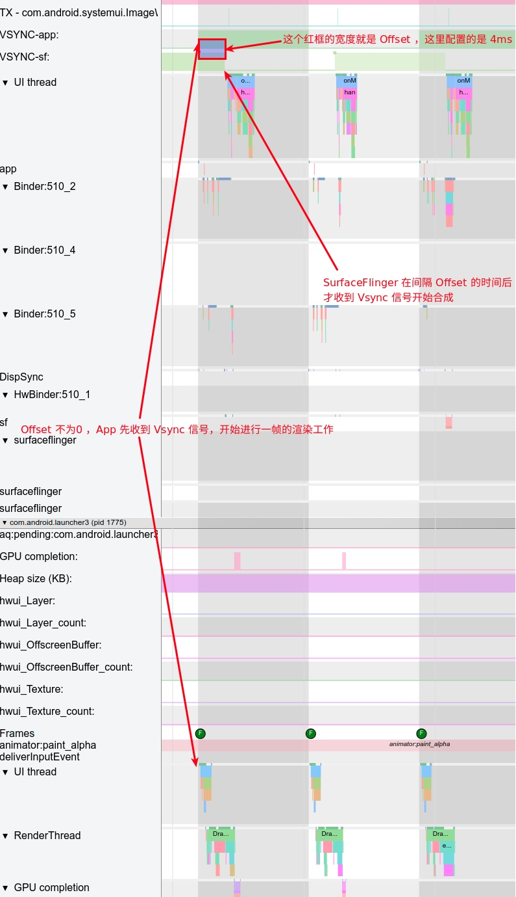

### Offset 的优缺点

Offset 的一个比较难以确定的点就在于 Offset 的时间该如何设置，这也是众多厂商默认都不进行配置 Offset 的一个原因，其优缺点是动态的，与机型的性能和使用场景有很大的关系

1. 如果 Offset 配置过短，那么可能 App 收到 Vsync-App 后还没有渲染完成，SurfaceFlinger 就收到 Vsync-SF 开始合成，那么此时如果 App 的 BufferQueue 中没有之前累积的 Buffer，那么 SurfaceFlinger 这次合成就不会有 App 的东西在里面，需要等到下一个 Vsync-SF 才能合成这次 App 的内容，时间相当于变成了 Vsync 周期+Offset，而不是我们期待的 Offset
2. 如果 Offset 配置过长，就起不到作用了

## HW_Vsync

这里需要说明的是，不是每次申请 Vsync 都会由硬件产生 Vsync，只有此次请求 vsync 的时间距离上次合成时间大于 500ms，才会通知 hwc，请求 HW_VSYNC

以桌面滑动为例，看 SurfaceFlinger 的进程 Trace 可以看到 HW_VSYNC 的状态

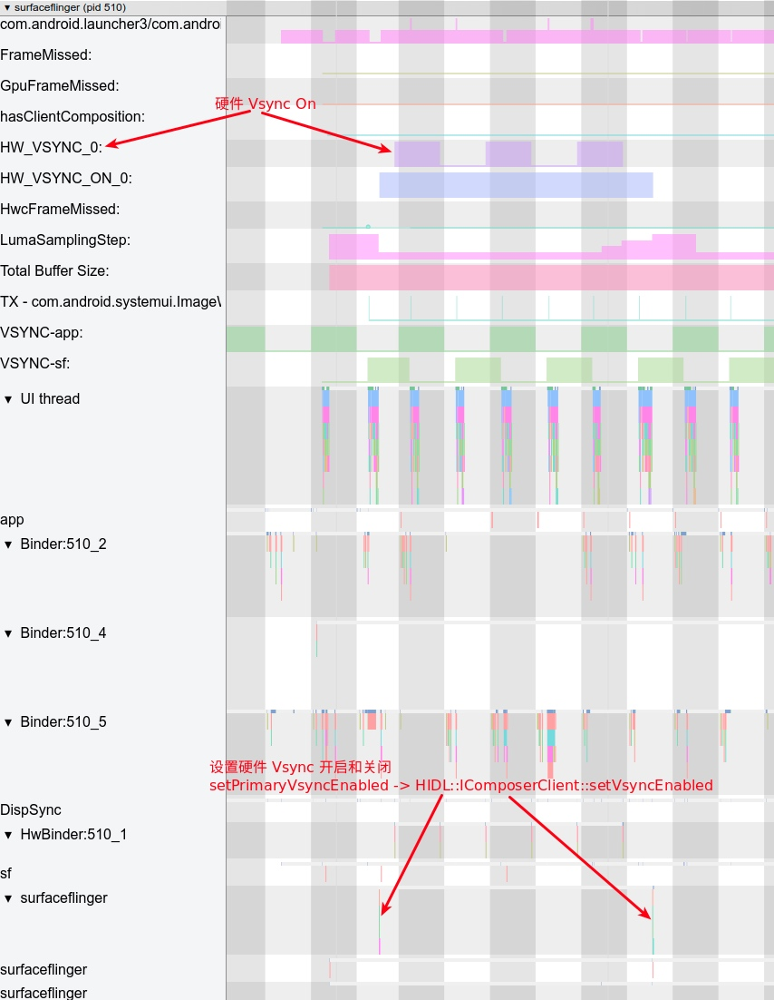

后续 App 申请 Vsync 时候，会有两种情况，一种是有 HW_VSYNC 的情况，一种是没有有 HW_VSYNC 的情况

### 不使用HW_VSYNC

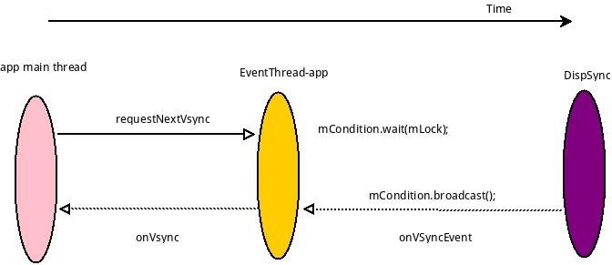

## 使用 HW_VSYNC

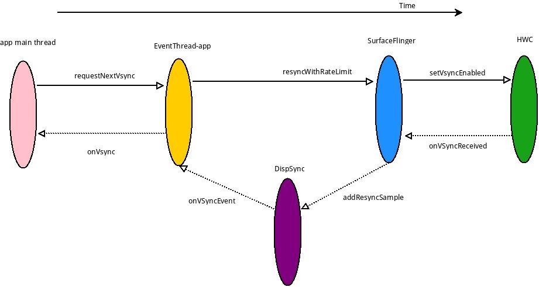

HW_VSYNC 主要是利用最近的硬件 VSYNC 来做预测,最少要 3 个,最多是 32 个,实际上要用几个则不一定, DispSync 拿到 6 个 VSYNC 后就会计算出 SW_VSYNC,只要收到的 Present Fence 没有超过误差,硬件 VSYNC 就会关掉,不然会继续接收硬件 VSYNC 计算 SW_VSYNC 的值,直到误差小于 threshold.关于这一块的计算具体过程，可以参考这篇文章： [S](https://juejin.im/post/5dbe658be51d452a45800e76#heading-20) [W-VS](https://juejin.im/post/5dbe658be51d452a45800e76#heading-20) [YN](https://juejin.im/post/5dbe658be51d452a45800e76#heading-20) [C](https://juejin.im/post/5dbe658be51d452a45800e76#heading-20)[ 的生成与传递](https://juejin.im/post/5dbe658be51d452a45800e76#heading-20) ，关于这一块的流程大家也可以参考这篇文章，里面有更细节的内容，这里摘录了他的结论

> SurfaceFlinger 通过实现了 HWC2::ComposerCallback 接口，当 HW-VSYNC 到来的时候，SurfaceFlinger 将会收到回调并且发给 DispSync。DispSync 将会把这些 HW-VSYNC 的时间戳记录下来，当累计了足够的 HW-VSYNC 以后（目前是大于等于 6 个），就开始计算 SW-VSYNC 的偏移 mPeriod。计算出来的 mPeriod 将会用于 DispSyncThread 用来模拟 HW-VSYNC 的周期性起来并且通知对 VSYNC 感兴趣的 Listener，这些 Listener 包括 SurfaceFlinger 和所有需要渲染画面的 app。这些 Listener 通过 EventThread 以 Connection 的抽象形式注册到 EventThread。DispSyncThread 与 EventThread 通过 DispSyncSource 作为中间人进行连接。EventThread 在收到 SW-VSYNC 以后将会把通知所有感兴趣的 Connection，然后 SurfaceFlinger 开始合成，app 开始画帧。在收到足够多的 HW-VSYNC 并且在误差允许的范围内，将会关闭通过 EventControlThread 关闭 HW-VSYNC。

## 参考

1. [VSYNC](https://source.android.google.cn/devices/graphics/implement-vsync)
2. https://juejin.im/post/5b6948086fb9a04fb87771fb
3. http://gityuan.com/2017/02/05/graphic_arch/
4. [SW-VSYNC 的生成与传递](https://juejin.im/post/5dbe658be51d452a45800e76#heading-20)
5. http://echuang54.blogspot.com/2015/01/dispsync.html

## 来源

[Vsync 解读](https://www.androidperformance.com/2019/12/01/Android-Systrace-Vsync/#)