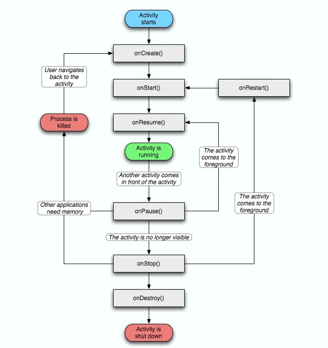

<h1 align="center">Activity</h1>

[toc]

## Activity生命周期



## 切换Activity时生命周期

(A)onPause→(B)onCreate→(B)onStart→(B)onResume→(A)onStop

如果B是透明主题又或则是个DialogActivity，则不会回调A的onStop；

## **弹出 Dialog 对生命周期有什么影响？**

我们知道，生命周期回调都是 AMS 通过 Binder 通知应用进程调用的；而弹出 Dialog、Toast、PopupWindow 本质上都直接是通过 WindowManager.addView 显示的（没有经过 AMS），所以不会对生命周期有任何影响。

如果是启动一个 **Theme 为 Dialog 的 Activity**, 则生命周期为：

**A.onPause -> B.onCrete -> B.onStart -> B.onResume**

注意这边没有前一个 Activity 不会回调 onStop，因为只有在 Activity 切到后台不可见才会回调 onStop；而弹出 Dialog 主题的 Activity 时前一个页面还是可见的，只是失去了焦点而已所以仅有 onPause 回调。

## Activity上有Dialog的时候按Home键时的生命周期

onCreate() -> onStart() -> onResume -> onPause() -> onStop() 

## 横竖屏切换的时候，Activity 各种情况下的生命周期

- 不配置configChanges时：切屏会重新回调各个生命周期，切横屏时会执行一次，切竖屏时会执行两次。
- 配置configChanges时：必须设置为android:configChanges="orientation|screenSize"时，才不会重走生命周期方法，只会回调onConfigurationChanged方法，注意，不配置configChanges或是配置了但不同时包含这两个值时，都会重走一遍生命周期方法，并且不会回调onConfigurationChanged方法。
- 另外重走生命周期方法时，还会调用**onSaveInstanceState()**与**onRestoreIntanceState()**，资源相关的系统配置发生改变或者资源不足：例如屏幕旋转，当前Activity会销毁，并且**在onStop之前**回调**onSaveInstanceState**保存数据，在重新创建Activity的时候**在onStart之后**回调**onRestoreInstanceState**。其中Bundle数据会传到onCreate（不一定有数据）和onRestoreInstanceState（一定有数据）。用户或者程序员主动去销毁一个Activity的时候不会回调，其他情况都会调用，来保存界面信息。如代码中finish（）或用户按下back，不会回调。

## Activity之间的通信方式

Intent + startActivityForResult

## 在 onResume 中可以测量宽高么

不能直接获取，可以通过下面方式获取

```java
view.post(new Runnable{
	@override
	public void run () {
	
	}
})
```


## singleInstance 如果不指定栈名，是怎么分配的？


## Activity启动流程

从另一个角度下图来概括：


启动流程：

1. 点击桌面App图标，Launcher进程采用Binder IPC向system_server进程发起startActivity请求；
2. system_server进程接收到请求后，向zygote进程发送创建进程的请求；
3. Zygote进程fork出新的子进程，即App进程；
4. App进程，通过Binder IPC向sytem_server进程发起attachApplication请求；
5. system_server进程在收到请求后，进行一系列准备工作后，再通过binder IPC向App进程发送scheduleLaunchActivity请求；
6. App进程的binder线程（ApplicationThread）在收到请求后，通过handler向主线程发送LAUNCH_ACTIVITY消息；
7. 主线程在收到Message后，通过发射机制创建目标Activity，并回调Activity.onCreate()等方法。

## 参考

* [Fragment生命周期](https://juejin.im/post/6844903752114126855)

* [Android 高级面试-5：四大组件、系统源码等](https://juejin.im/post/6844903783550418958#heading-9)