<h1 align="center">Activity Stack管理</h1>

[toc]

## Task Affinity: Impact

> **Google Developer Document Statement**
>
> The affinity of an activity is defined by the taskAffinity attribute. The affinity of a task is determined by reading the affinity of its root activity. Therefore, by definition, a root activity is always in a task with the same affinity. Since activities with “singleTask” or “singleInstance” launch modes can only be at the root of a task, re-parenting is limited to the “standard” and “singleTop” modes.

**Let me explain this statement with visualisation:**

I have taken 4 activities A, B, C, D

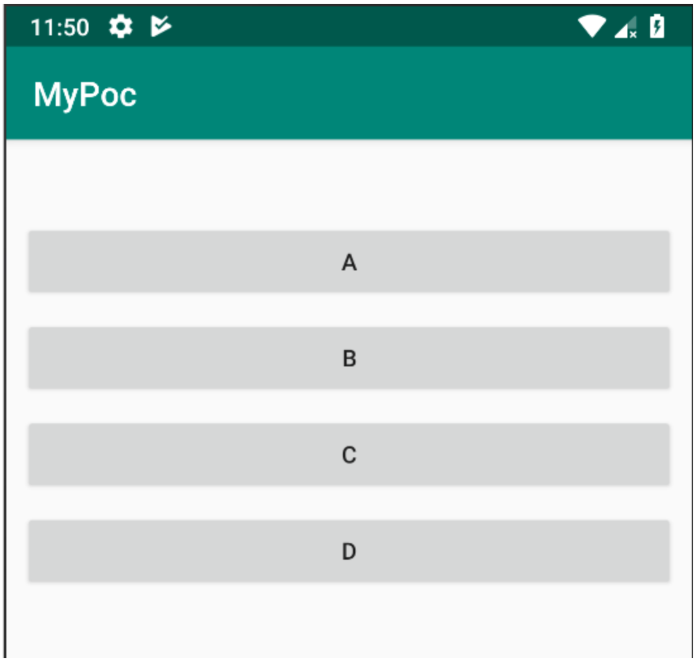

A, B, C, D can be called from A/B/C/D

So for understanding , I am calling B from A, C from B, D from C

A > B > C > D

> NOTE: task affinity works with launch mode

For understanding purpose, we have to study the following cases with launch mode and task affinity

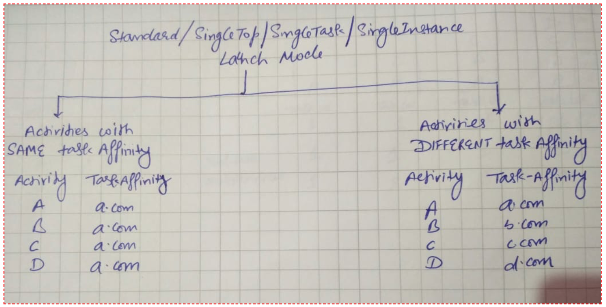

Now lets see impact

## Standard Launch Mode

> All activities with same task affinity

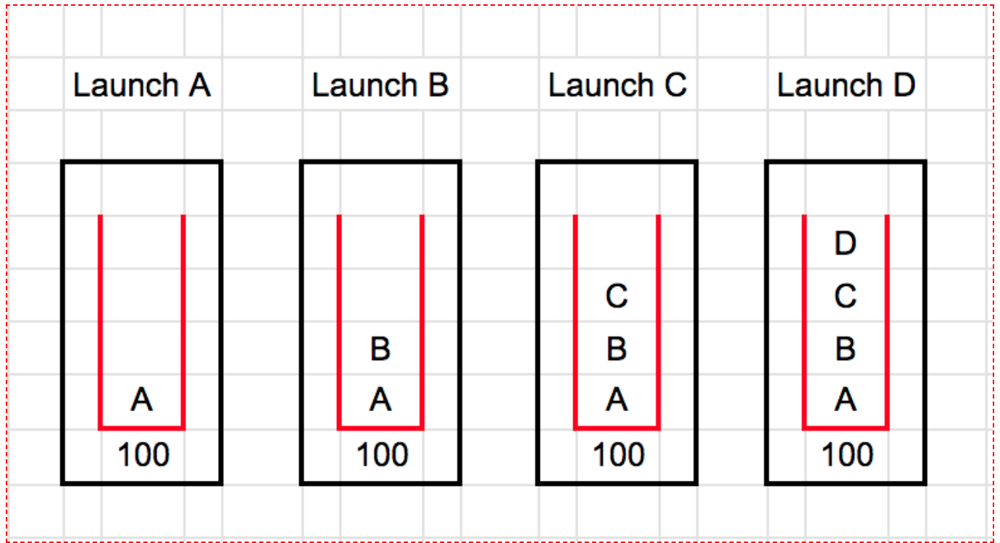

> All activities with different task affinity

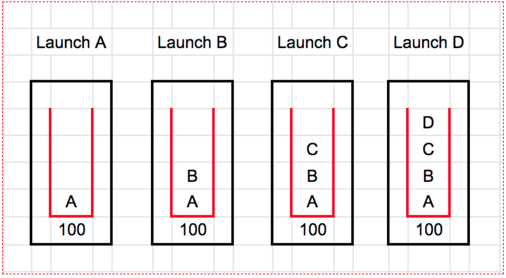

> Conclusion: No impact of task affinity change with standard launch mode

## SingleTop Launch Mode

> All activities with same task affinity

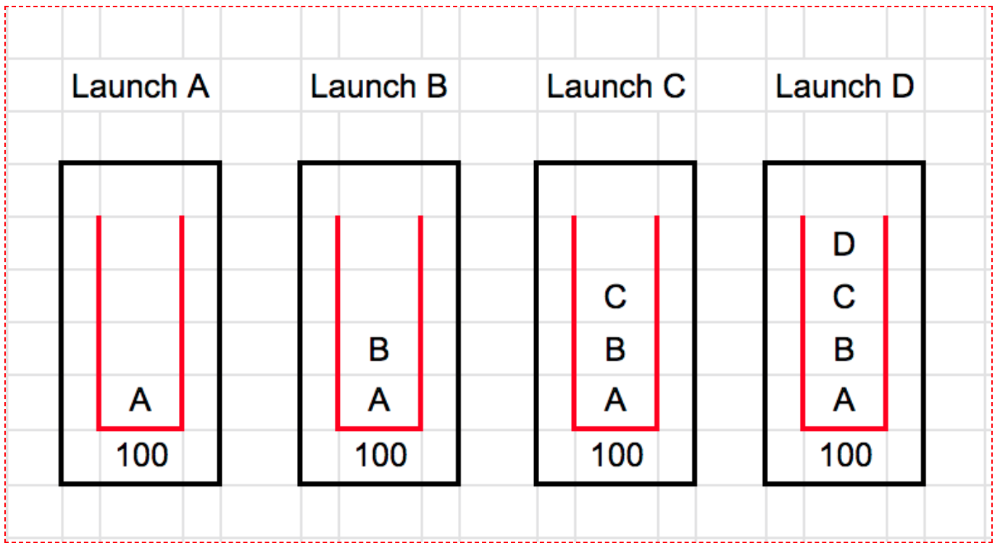

> All activities with different task affinity

> *Conclusion: No impact of task affinity change with SingleTop launch mode*

## SingleTask Launch Mode

> All activities with same task affinity

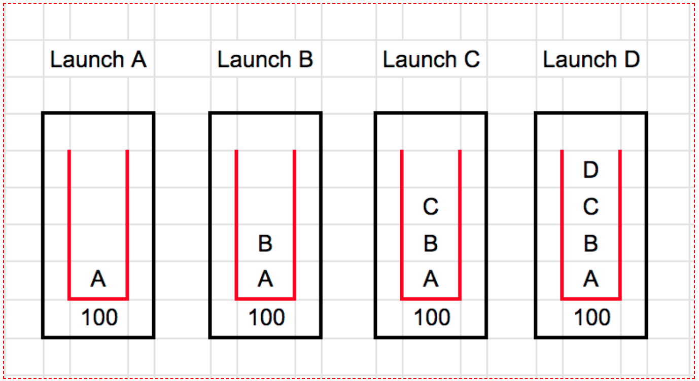

> All activities with different task affinity

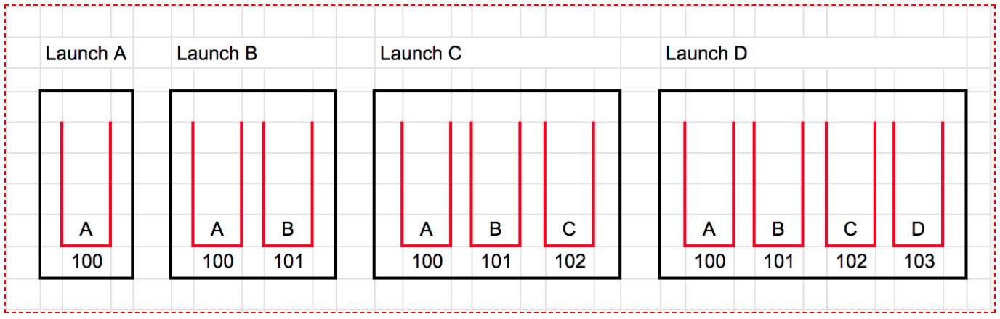

> Conclusion: Task affinity changes, activity moved to new task

## SingleInstance Launch Mode

> All activities with same task affinity

> All activities with different task affinity

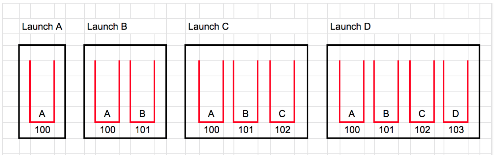

> Conclusion: No impact of task affinity change with SingleInstance launch mode

> ***Summary:\***
>
> *Changing task affinity, only impact the activity with single task.*
>
> *On other hand, behaviour of activity same as without task affinity.*

## Some Tricky Example

Example1

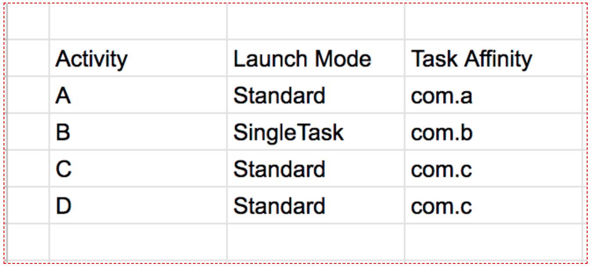

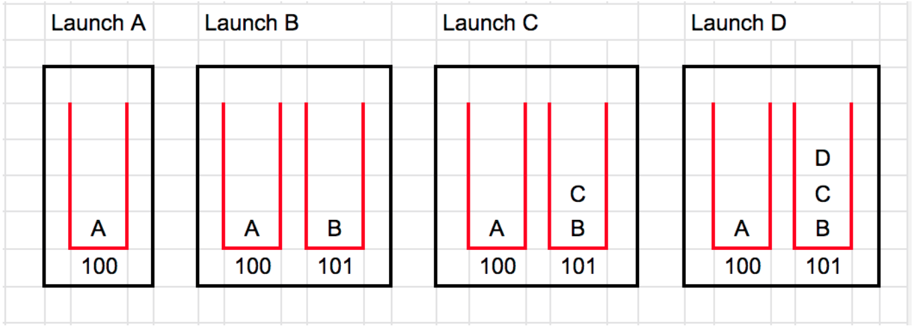

**Explanation**

**Launch B** :

Task affinity differ from A so B created in new task

**Launch C**:

Task Affinity differ from B BUT launch mode is standard so no impact and created in same task

**Launch D**:

Task Affinity differ from C BUT launch mode is standard so no impact and created in same task

Example 2

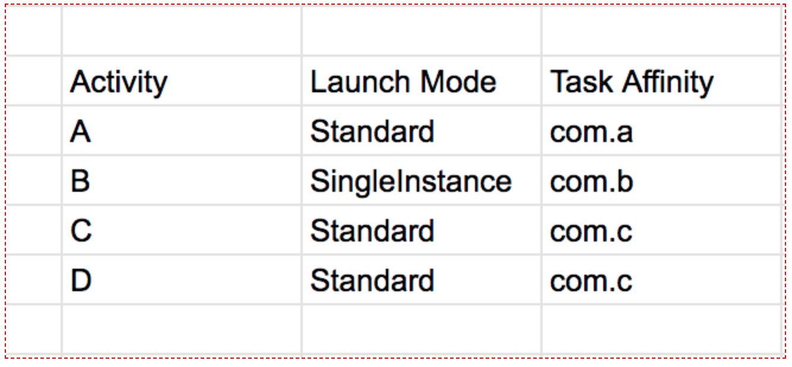

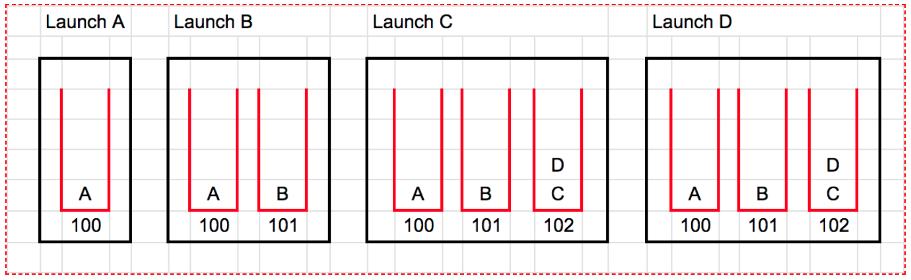

**Explanation**

**Launch B**:

Task affinity differ from A so B created in new task

**Launch C**:

Task Affinity differ from B BUT launch mode is standard so there should be no impact BUT

SingleTask Launch mode of parent B does not allow So C is created in new task

**Launch D**:

Task Affinity differ from C BUT launch mode is standard so no impact and created in same task

## 参考

* [探索Activity之启动Intent Flag和taskAffinity](https://www.jianshu.com/p/c97688eb5056)

* [Understand Tasks and Back Stack](https://developer.android.com/guide/components/activities/tasks-and-back-stack)
* [Playing with Android Task Affinity and Launch Modes](https://medium.com/@veeresh.charantimath8/playing-with-android-task-affinity-and-launch-modes-5c36a0421e83)
* [Task Affinity: Impact](https://medium.com/@jangraajit/task-affinity-impact-31d9032642d4)
* [Android中Activity四种启动模式和taskAffinity属性详解](https://blog.csdn.net/zhangjg_blog/article/details/10923643)
* 