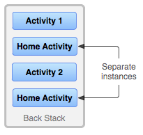

<h1 align="center">了解任务和返回堆栈</h1>

[toc]

任务是用户在执行某项工作时与之互动的一系列 Activity 的集合。这些 Activity 按照每个 Activity 打开的顺序排列在一个返回堆栈中。例如，电子邮件应用可能有一个 Activity 来显示新邮件列表。当用户选择一封邮件时，系统会打开一个新的 Activity 来显示该邮件。这个新的 Activity 会添加到返回堆栈中。如果用户按**返回**按钮，这个新的 Activity 即会完成并从堆栈中退出。通过以下视频可以大致了解返回堆栈的工作原理。

Android 7.0（API 级别 24）及更高版本支持[多窗口环境](https://developer.android.com/guide/topics/ui/multi-window)，当应用在这种环境中同时运行时，系统会单独管理每个窗口的任务；而每个窗口可能包含多项任务。[在 Chromebook 上运行的 Android 应用](https://developer.android.com/topic/arc)也是如此：系统按窗口管理任务或任务组。

大多数任务都从设备主屏幕上启动。当用户轻触应用启动器中的图标（或主屏幕上的快捷方式）时，该应用的任务就会转到前台运行。如果该应用没有任务存在（应用最近没有使用过），则会创建一个新的任务，并且该应用的“主”Activity 将会作为堆栈的根 Activity 打开。

在当前 Activity 启动另一个 Activity 时，新的 Activity 将被推送到堆栈顶部并获得焦点。上一个 Activity 仍保留在堆栈中，但会停止。当 Activity 停止时，系统会保留其界面的当前状态。当用户按**返回**按钮时，当前 Activity 会从堆栈顶部退出（该 Activity 销毁），上一个 Activity 会恢复（界面会恢复到上一个状态）。堆栈中的 Activity 永远不会重新排列，只会被送入和退出，在当前 Activity 启动时被送入堆栈，在用户使用**返回**按钮离开时从堆栈中退出。因此，返回堆栈按照“后进先出”的对象结构运作。图 1 借助一个时间轴直观地显示了这种行为。该时间轴显示了 Activity 之间的进展以及每个时间点的当前返回堆栈。


**图 1.** 有关任务中的每个新 Activity 如何添加到返回堆栈的图示。当用户按**返回**按钮时，当前 Activity 会销毁，上一个 Activity 将恢复。

如果用户继续按**返回**，则堆栈中的 Activity 会逐个退出，以显示前一个 Activity，直到用户返回到主屏幕（或任务开始时运行的 Activity）。移除堆栈中的所有 Activity 后，该任务将不复存在。


**图 2.** 两个任务：任务 B 在前台接收用户互动，任务 A 在后台等待恢复。

任务是一个整体单元，当用户开始一个新任务或通过主屏幕按钮进入主屏幕时，任务可移至“后台”。在后台时，任务中的所有 Activity 都会停止，但任务的返回堆栈会保持不变，当其他任务启动时，当前任务只是失去了焦点，如图 2 所示。这样一来，任务就可以返回到“前台”，以便用户可以从他们离开的地方继续操作。举例来说，假设当前任务（任务 A）的堆栈中有 3 个 Activity，当前 Activity 下有 2 个 Activity。用户按主屏幕按钮，然后从应用启动器中启动新应用。主屏幕出现后，任务 A 转到后台。当新应用启动时，系统会启动该应用的任务（任务 B），该任务具有自己的 Activity 堆栈。与该应用互动后，用户再次返回到主屏幕并选择最初启动任务 A 的应用。现在，任务 A 进入前台，其堆栈中的所有三个 Activity 都完好如初，堆栈顶部的 Activity 恢复运行。此时，用户仍可通过以下方式切换到任务 B：转到主屏幕并选择启动该任务的应用图标（或者从[**最近使用的应用**屏幕中](https://developer.android.com/guide/components/recents)选择该应用的任务）。这就是在 Android 上进行多任务处理的一个例子。

**注意**：多个任务可以同时在后台进行。但是，如果用户同时运行很多后台任务，系统可能会为了恢复内存而开始销毁后台 Activity，导致 Activity 状态丢失。



**图 3.** 单个 Activity 会被多次实例化。

由于返回堆栈中的 Activity 不会被重新排列，如果您的应用允许用户从多个 Activity 启动特定的 Activity，系统便会创建该 Activity 的新实例并将其推送到堆栈中（而不是将该 Activity 的某个先前的实例移至堆栈顶部）。这样一来，应用中的一个 Activity 就可能被多次实例化（甚至是从其他任务对其进行实例化），如图 3 所示。因此，如果用户使用**返回**按钮向后导航，Activity 的每个实例将按照它们被打开的顺序显示出来（每个实例都有自己的界面状态）。不过，如果您不希望某个 Activity 被实例化多次，可以修改此行为。有关如何实现此操作，将在后面的[管理任务](https://developer.android.com/guide/components/activities/tasks-and-back-stack#ManagingTasks)部分中讨论。

Activity 和任务的默认行为总结如下：

- 当 Activity A 启动 Activity B 时，Activity A 会停止，但系统会保留其状态（例如滚动位置和输入到表单中的文本）。如果用户在 Activity B 中按**返回**按钮，系统会恢复 Activity A 及其状态。
- 当用户通过按主屏幕按钮离开任务时，当前 Activity 会停止，其任务会转到后台。系统会保留任务中每个 Activity 的状态。如果用户稍后通过点按该任务的启动器图标来恢复该任务，该任务会进入前台并恢复堆栈顶部的 Activity。
- 如果用户按**返回**按钮，当前 Activity 将从堆栈中退出并销毁。堆栈中的上一个 Activity 将恢复。Activity 被销毁后，系统不会保留该 Activity 的状态。
- Activity 可以多次实例化，甚至是从其他任务对其进行实例化。

**导航设计**

要详细了解 Android 上的应用导航如何运作，请参阅 Android 设计中的[导航](https://developer.android.com/design/patterns/navigation)指南。

## 管理任务

如上文所述，Android 管理任务和返回堆栈的方式是将所有接连启动的 Activity 放到同一任务和一个“后进先出”堆栈中，这对于大多数应用都很有效，而且您不必担心 Activity 如何与任务相关联，或者它们如何存在于返回堆栈中。不过，您可能需要决定是否要打破正常行为。或许您希望应用中的某个 Activity 在启动时开启一个新的任务（而不是被放入当前的任务中），或者当您启动某个 Activity 时，您希望调用它的一个现有实例（而不是在返回堆栈顶部创建一个新实例），或者您希望在用户离开任务时清除返回堆栈中除根 Activity 以外的所有 Activity。

您可以借助 [``<activity>``](https://developer.android.com/guide/topics/manifest/activity-element) 清单元素中的属性以及您传递给 `startActivity()` 的 intent 中的标记来实现上述目的。

在这方面，您可以使用的主要 [`<activity>`](https://developer.android.com/guide/topics/manifest/activity-element) 属性包括：

- [`taskAffinity`](https://developer.android.com/guide/topics/manifest/activity-element#aff)
- [`launchMode`](https://developer.android.com/guide/topics/manifest/activity-element#lmode)
- [`allowTaskReparenting`](https://developer.android.com/guide/topics/manifest/activity-element#reparent)
- [`clearTaskOnLaunch`](https://developer.android.com/guide/topics/manifest/activity-element#clear)
- [`alwaysRetainTaskState`](https://developer.android.com/guide/topics/manifest/activity-element#always)
- [`finishOnTaskLaunch`](https://developer.android.com/guide/topics/manifest/activity-element#finish)

您可以使用的主要 intent 标记包括：

- `FLAG_ACTIVITY_NEW_TASK`
- `FLAG_ACTIVITY_CLEAR_TOP`
- `FLAG_ACTIVITY_SINGLE_TOP`

在下面几节中，您将了解到如何使用这些清单属性和 intent 标记来定义 Activity 与任务之间的关联方式，以及它们在返回堆栈中的行为。

另外，下面还分别介绍了如何在**最近使用的应用**屏幕中表示和管理任务与 Activity。有关详情，请参阅[“最近使用的应用”屏幕](https://developer.android.com/guide/components/recents)。通常，您应允许系统定义任务和 Activity 在**最近使用的应用**屏幕中的表示方式，您无需修改此行为。

**注意**：大多数应用不应打破 Activity 和任务的默认行为。如果您确定需要让 Activity 改变默认行为，请谨慎操作，并且务必要测试该 Activity 在以下情况下的可用性：启动期间以及您通过**返回**按钮从其他 Activity 和任务返回该 Activity 时。务必要测试是否存在可能与用户预期的行为冲突的导航行为。

### 定义启动模式

您可以通过启动模式定义 Activity 的新实例如何与当前任务关联。您可以通过两种方式定义不同的启动模式：

- 使用清单文件

   当您在清单文件中声明 Activity 时，您可以指定该 Activity 在启动时如何与任务关联。

- 使用 Intent 标记

   当您调用 `startActivity()` 时，可以在 `Intent` 中添加一个标记，用于声明新 Activity 如何（或是否）与当前任务相关联。

因此，如果 Activity A 启动 Activity B，Activity B 可在其清单中定义如何与当前任务相关联（如果关联的话），Activity A 也可以请求 Activity B 应该如何与当前任务关联。如果两个 Activity 都定义了 Activity B 应如何与任务关联，将优先遵循 Activity A 的请求（在 intent 中定义），而不是 Activity B 的请求（在清单中定义）。

**注意**：有些启动模式可通过清单文件定义，但不能通过 intent 标记定义，同样，有些启动模式可通过 intent 标记定义，却不能在清单中定义。

#### 使用清单文件

在清单文件中声明 Activity 时，可以使用 [android:launchMode](https://developer.android.com/guide/topics/manifest/activity-element#lmode) 属性指定 Activity 应该如何与任务关联。

[`launchMode`](https://developer.android.com/guide/topics/manifest/activity-element#lmode) 属性说明了 Activity 应如何启动到任务中。您可以为 `launchMode` 属性指定 4 种不同的启动模式：

- `"standard"`（默认模式）

   默认值。系统在启动该 Activity 的任务中创建 Activity 的新实例，并将 intent 传送给该实例。Activity 可以多次实例化，每个实例可以属于不同的任务，一个任务可以拥有多个实例。

- `"singleTop"`--栈顶单例

   如果当前任务的顶部已存在 Activity 的实例，则系统会通过调用其 `onNewIntent()` 方法来将 intent 转送给该实例，而不是创建 Activity 的新实例。Activity 可以多次实例化，每个实例可以属于不同的任务，一个任务可以拥有多个实例（但前提是返回堆栈顶部的 Activity 不是该 Activity 的现有实例）。例如，假设任务的返回堆栈包含根 Activity A 以及 Activity B、C 和位于顶部的 D（堆栈为 A-B-C-D；D 位于顶部）。收到以 D 类型 Activity 为目标的 intent。如果 D 采用默认的 `"standard"` 启动模式，则会启动该类的新实例，并且堆栈将变为 A-B-C-D-D。但是，如果 D 的启动模式为 `"singleTop"`，则 D 的现有实例会通过 `onNewIntent()` 接收 intent，因为它位于堆栈顶部，堆栈仍为 A-B-C-D。但是，如果收到以 B 类型 Activity 为目标的 intent，则会在堆栈中添加 B 的新实例，即使其启动模式为 `"singleTop"` 也是如此。**注意**：创建 Activity 的新实例后，用户可以按**返回**按钮返回到上一个 Activity。但是，当由 Activity 的现有实例处理新 intent 时，用户将无法通过按**返回**按钮返回到 `onNewIntent()` 收到新 intent 之前的 Activity 状态。

- `"singleTask"`--栈内单例

   系统会创建新任务，并实例化新任务的根 Activity。但是，如果另外的任务中已存在该 Activity 的实例，则系统会通过调用其 `onNewIntent()` 方法将 intent 转送到该现有实例，而不是创建新实例。Activity 一次只能有一个实例存在。**注意**：虽然 Activity 在新任务中启动，但用户按**返回**按钮仍会返回到上一个 Activity。

- `"singleInstance"`--堆内单例

   与 `"singleTask"` 相似，唯一不同的是系统不会将任何其他 Activity 启动到包含该实例的任务中。该 Activity 始终是其任务唯一的成员；由该 Activity 启动的任何 Activity 都会在其他的任务中打开。

再举个例子，Android 浏览器应用在 [`<activity>`](https://developer.android.com/guide/topics/manifest/activity-element) 元素中指定 `singleTask` 启动模式，由此声明网络浏览器 Activity 应始终在它自己的任务中打开。这意味着，如果您的应用发出打开 Android 浏览器的 intent，系统不会将其 Activity 置于您的应用所在的任务中，而是会为浏览器启动一个新任务，如果浏览器已经有任务在后台运行，则会将该任务转到前台来处理新 intent。

无论 Activity 是在新任务中启动的，还是在和启动它的 Activity 相同的任务中启动，用户按**返回**按钮都会回到上一个 Activity。但是，如果您启动了指定 `singleTask` 启动模式的 Activity，而后台任务中已存在该 Activity 的实例，则系统会将该后台任务整个转到前台运行。此时，返回堆栈包含了转到前台的任务中的所有 Activity，这些 Activity 都位于堆栈的顶部。图 4 展示了具体的情景。


**图 4.** 采用“singleTask”启动模式的 Activity 添加到返回堆栈的过程图示。如果 Activity 已经存在于某个具有自己的返回堆栈的后台任务中，那么整个返回堆栈也会转到前台，覆盖当前任务。

要详细了解如何在清单文件中设置启动模式，请参阅 `<activity>` 元素的说明文档，里面详细介绍了 `launchMode` 属性和可接受的值。

**注意**：您通过 [`launchMode`](https://developer.android.com/guide/topics/manifest/activity-element#lmode) 属性为 Activity 指定的行为，可被启动 Activity 的 intent 所包含的标记替换。下一节将对此进行介绍。

### 使用 Intent 标记

启动 Activity 时，您可以在传送给 `startActivity()` 的 intent 中添加相应的标记来修改 Activity 与其任务的默认关联。您可以使用以下标记来修改默认行为：

- `FLAG_ACTIVITY_NEW_TASK`--singleTask

   在新任务中启动 Activity。如果您现在启动的 Activity 已经有任务在运行，则系统会将该任务转到前台并恢复其最后的状态，而 Activity 将在 `onNewIntent()` 中收到新的 intent。这与上一节中介绍的 `"singleTask"` [`launchMode`](https://developer.android.com/guide/topics/manifest/activity-element#lmode) 值产生的行为相同。

   这个属性需要在被 start 的目标 Activity 在AndroidManifest.xml 文件配置 taskAffinity 的值【必须和 startActivity 发起者 Activity 的包名不一样，如果是跳转另一个 App 的话可以taskAffinity 可以省略】，则会在新标记的 Affinity 所存在的 taskAffinity中压入这个 Activity。

- `FLAG_ACTIVITY_SINGLE_TOP`--singleTop

   如果要启动的 Activity 是当前 Activity（即位于返回堆栈顶部的 Activity），则现有实例会收到对 `onNewIntent()` 的调用，而不会创建 Activity 的新实例。这与上一节中介绍的 `"singleTop"` [`launchMode`](https://developer.android.com/guide/topics/manifest/activity-element#lmode) 值产生的行为相同。

- `FLAG_ACTIVITY_CLEAR_TOP`--singleTask

   如果要启动的 Activity 已经在当前任务中运行，则不会启动该 Activity 的新实例，而是会销毁位于它之上的所有其他 Activity，并通过 `onNewIntent()` 将此 intent 传送给它的已恢复实例（现在位于堆栈顶部）。[`launchMode`](https://developer.android.com/guide/topics/manifest/activity-element#lmode) 属性没有可产生此行为的值。`FLAG_ACTIVITY_CLEAR_TOP` 最常与 `FLAG_ACTIVITY_NEW_TASK` 结合使用。将这两个标记结合使用，可以查找其他任务中的现有 Activity，并将其置于能够响应 intent 的位置。**注意**：如果指定 Activity 的启动模式为 `"standard"`，系统也会将其从堆栈中移除，并在它的位置启动一个新实例来处理传入的 intent。这是因为当启动模式为 `"standard"` 时，始终会为新 intent 创建新的实例。
   
- `FLAG_ACTIVITY_EXCLUDE_FROM_RECENTS:`

   其对应在AndroidManifest 中的属性为 android:excludeFromRecents=“true”, 当用户按了“最近任务列表”时候,该 Task 不会出现在最近任务列表中，可达到隐藏应用的目的。

- `FLAG_ACTIVITY_NO_HISTORY:`

   对应在 AndroidManifest 中的属性为:android:noHistory=“true”，这个 FLAG 启动的 Activity，一旦退出，它不会存在于栈中。

## 处理亲和性（affinities）

“亲和性（*affinity*）”表示 Activity 倾向于属于哪个任务。默认情况下，同一应用中的所有 Activity 彼此具有亲和性。因此，在默认情况下，同一应用中的所有 Activity 都倾向于位于同一任务。不过，您可以修改 Activity 的默认亲和性。在不同应用中定义的 Activity 可以具有相同的亲和性，或者在同一应用中定义的 Activity 也可以被指定不同的任务亲和性。

您可以使用 [`<activity>`](https://developer.android.com/guide/topics/manifest/activity-element) 元素的 [`taskAffinity`](https://developer.android.com/guide/topics/manifest/activity-element#aff) 属性修改任何给定 Activity 的亲和性。

[`taskAffinity`](https://developer.android.com/guide/topics/manifest/activity-element#aff) 属性采用字符串值，该值必须不同于 [`<manifest>`](https://developer.android.com/guide/topics/manifest/manifest-element) 元素中声明的默认软件包名称，因为系统使用该名称来标识应用的默认任务亲和性。

亲和性可在两种情况下发挥作用：

- 当启动 Activity 的 intent 包含

  ```java
FLAG_ACTIVITY_NEW_TASK 
  ```
  
   标记时。

   默认情况下，新 Activity 会启动到调用 `startActivity()` 的 Activity 的任务中。它会被推送到调用方 Activity 所在的返回堆栈中。但是，如果传递给 `startActivity()` 的 intent 包含 `FLAG_ACTIVITY_NEW_TASK` 标记，则系统会寻找其他任务来容纳新 Activity。通常会是一个新任务，但也可能不是。如果已存在与新 Activity 具有相同亲和性的现有任务，则会将 Activity 启动到该任务中。如果不存在，则会启动一个新任务。

   如果此标记导致 Activity 启动一个新任务，而用户按下主屏幕按钮离开该任务，则必须为用户提供某种方式来返回到该任务。有些实体（例如通知管理器）总是在外部任务中启动 Activity，而不在它们自己的任务中启动，因此它们总是将 `FLAG_ACTIVITY_NEW_TASK` 添加到传递给 `startActivity()` 的 intent 中。如果您的 Activity 可由外部实体调用，而该实体可能使用此标记，请注意用户可以通过一种独立的方式返回到所启动的任务，例如使用启动器图标（任务的根 Activity 具有一个 `CATEGORY_LAUNCHER` intent 过滤器；请参阅下面的[启动任务](https://developer.android.com/guide/components/activities/tasks-and-back-stack#Starting)部分）。

- 当 Activity 的

  `allowTaskReparenting`

   属性设为

   ```
"true" 
   ```

   时。

   在这种情况下，一旦和 Activity 有亲和性的任务进入前台运行，Activity 就可从其启动的任务转移到该任务。
  
   举例来说，假设一款旅行应用中定义了一个报告特定城市天气状况的 Activity。该 Activity 与同一应用中的其他 Activity 具有相同的亲和性（默认应用亲和性），并通过此属性支持重新归属。当您的某个 Activity 启动该天气预报 Activity 时，该天气预报 Activity 最初会和您的 Activity 同属于一个任务。不过，当旅行应用的任务进入前台运行时，该天气预报 Activity 就会被重新分配给该任务并显示在其中。

taskAffinity 为宿主 Activity 指定了存放的任务栈[不同于 App 中其他的 Activity 的栈]，为 activity 设置 taskAffinity 属性时不能和包名相同，因为 Android 团队为 taskAffinity 默认设置为包名任务栈。taskAffinity 只有和 SingleTask 启动模式匹配使用时，启动的 Activity 才会运行在名字和 taskAffinity 相同的任务栈中。

**提示**：如果一个 APK 文件中包含了就用户角度而言的多个“应用”，您可能需要使用 [`taskAffinity`](https://developer.android.com/guide/topics/manifest/activity-element#aff) 属性为每个“应用”所关联的 Activity 指定不同的亲和性。

## 清除返回堆栈

如果用户离开任务较长时间，系统会清除任务中除根 Activity 以外的所有 Activity。当用户再次返回到该任务时，只有根 Activity 会恢复。系统之所以采取这种行为方式是因为，经过一段时间后，用户可能已经放弃了之前执行的操作，现在返回任务是为了开始某项新的操作。

您可以使用一些 Activity 属性来修改此行为：

- `alwaysRetainTaskState`

   如果在任务的根 Activity 中将该属性设为 `"true"`，则不会发生上述默认行为。即使经过很长一段时间后，任务仍会在其堆栈中保留所有 Activity。

- `clearTaskOnLaunch`

   如果在任务的根 Activity 中将该属性设为 `"true"`，那么只要用户离开任务再返回，堆栈就会被清除到只剩根 Activity。也就是说，它与 [`alwaysRetainTaskState`](https://developer.android.com/guide/topics/manifest/activity-element#always) 正好相反。用户始终会返回到任务的初始状态，即便只是短暂离开任务也是如此。

- `finishOnTaskLaunch`

   该属性与 [`clearTaskOnLaunch`](https://developer.android.com/guide/topics/manifest/activity-element#clear) 类似，但它只会作用于单个 Activity 而非整个任务。它还可导致任何 Activity 消失，包括根 Activity。如果将该属性设为 `"true"`，则 Activity 仅在当前会话中归属于任务。如果用户离开任务再返回，则该任务将不再存在。

### 启动任务

您可以设置一个 Activity 作为任务的入口点，方法是为该 Activity 提供一个 intent 过滤器，并将 `"android.intent.action.MAIN"` 作为指定操作，将 `"android.intent.category.LAUNCHER"` 作为指定类别。例如：

```xml
    <activity ... >
        <intent-filter ... >
            <action android:name="android.intent.action.MAIN" />
            <category android:name="android.intent.category.LAUNCHER" />
        </intent-filter>
        ...
    </activity>
    
```

这种 intent 过滤器可在应用启动器中显示 Activity 的图标和标签，让用户可以启动 Activity 并在启动后随时返回到该 Activity 创建的任务。

第二个作用非常重要：用户必须能够离开任务，之后再使用此 Activity 启动器返回到该任务。因此，只有当 Activity 具有 `ACTION_MAIN` 和 `CATEGORY_LAUNCHER` 过滤器时，才应使用 `"singleTask"` 和 `"singleInstance"` 这两种启动模式，它们会将 Activity 标记为始终启动任务。比如，可以想象一下，如果缺少该过滤器会发生什么情况：intent 会启动 `"singleTask"` Activity，随之启动新任务，用户花了一些时间在该任务上。然后，用户按主屏幕按钮。此时，该任务会转到后台，不再可见。现在，用户无法返回到该任务，因为它未显示在应用启动器中。

对于那些您不希望用户能够返回到 Activity 的情况，请将 `<activity>` 元素的 [`finishOnTaskLaunch`](https://developer.android.com/guide/topics/manifest/activity-element#finish) 设置为 `"true"`（请参阅[清除返回堆栈](https://developer.android.com/guide/components/activities/tasks-and-back-stack#Clearing)）。

如需详细了解如何在**概览**屏幕中显示和管理任务及 Activity，请参阅[“最近使用的应用”屏幕](https://developer.android.com/guide/components/activities/recents)。

## startActivity 场景

Activity 的启动模式的应用的设置是和它的开发场景有关系的，在 App 中打开新的 Activity 的基本上分为两种情况：

**目标** **Activity** **是本应用中的** **Activity**，即它的启动模式是可以直接在 manifest 中配置或者默认为 standard，任务栈也可以自己随意设置；

**目标** **Activity** **是第三方** **App** **中的** **Activity**，这个时候就需要先考虑打开新 Activity 的是和自己 App 放在同一任务栈中还是新的 task 中【这个是很重要的因为在 Android 的机制中：同一个任务栈中的 activity 的生命周期是和这个 task 相关联的[具体实例见下文]】，然后考虑 Activity 的启动模式； 所以 Android 提供了优先级更高的设置方式在 Intent.setFlags(int flags),通过这 setFlags 就可以为打开第三方的 App 中 Activity 设置任务栈和启动模式了，具体设置就自己去看源码了。

## **Activity 四种启动模式常见使用场景：**

| LaunchMode     | Instance                                                     |
| -------------- | ------------------------------------------------------------ |
| standard       | 邮件、mainfest没有默认配置就是默认标准模式                   |
| singleTop      | 登录页面、WXPayEntryActivity、WXEntryActivity、推动通知栏    |
| singleTask     | 程序模块逻辑入口：主页面（Fragment的containerActivity）、WebView页面，扫一扫页面、电商中：购物界面、确认界面、订单界面，付款界面 |
| singleInstance | 系统Launcher、锁屏键、来电显示等系统应用                     |

## 生命周期

### 正常

onCreat() onStart() onResume() onPause() onStop() onDestroy()

### 横竖屏切换

onCreat() onStart() onResume() onPause() onStop() onDestroy()onCreat() onStart() onResume()

### configChanges

onCreat() onStart() onResume()

## 来源

* https://developer.android.com/guide/components/activities/tasks-and-back-stack#Starting