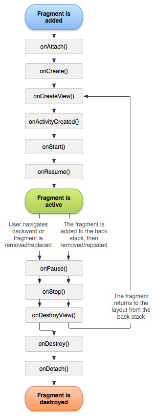

<h1 align="center">Fragment</h1>

[toc]

## 特点

- Fragment 解决 Activity 间的切换不流畅，轻量切换
- 可以从 startActivityForResult 中接收到返回结果，但是View不能
- 只能在 Activity 保存其状态（用户离开 Activity）之前使用 commit() 提交事务。如果您试图在该时间点后提交，则会引发异常。 这是因为如需恢复 Activity，则提交后的状态可能会丢失。 对于丢失提交无关紧要的情况，请使用 commitAllowingStateLoss()。

## 生命周期  

  

onAttach()：在片段已与 Activity 关联时调用（Activity 传递到此方法内）。

onCreate()：系统会在创建片段时调用此方法。您应该在实现内初始化您想在片段暂停或停止后恢复时保留的必需片段组件。

onCreateView()：调用它可创建与片段关联的视图层次结构。

onActivityCreated()：在 Activity 的 onCreate() 方法已返回时调用。

onStart()：执行该方法时，Fragment由不可见变为可见状态。

onResume()：执行该方法时，Fragment处于活动状态，用户可与之交互。

onPause()：执行该方法时，Fragment处于暂停状态，但依然可见，用户不能与之交互。

onStop()：执行该方法时，Fragment完全不可见。

onDestroyView()：在移除与片段关联的视图层次结构时调用。

onDestory()：销毁Fragment。通常按Back键退出或者Fragment被回收时调用此方法。

onDetach()：在取消片段与 Activity 的关联时调用。

## Fragment生命周期执行流程:

Fragment创建：setUserVisibleHint()->onAttach()->onCreate()->onCreateView()->onActivityCreated()->onStart()->onResume()；

Fragment变为不可见状态（锁屏、回到桌面、被Activity完全覆盖）：onPause()->onSaveInstanceState()->onStop()；

Fragment变为部分可见状态（打开Dialog样式的Activity）：onPause()->onSaveInstanceState()；

Fragment由不可见变为活动状态：onStart()->OnResume()；

Fragment由部分可见变为活动状态：onResume()；

退出应用：onPause()->onStop()->onDestroyView()->onDestroy()->onDetach()（注意退出不会调用onSaveInstanceState方法，因为是人为退出，没有必要再保存数据）；

Fragment被回收又重新创建：被回收执行onPause()->onSaveInstanceState()->onStop()->onDestroyView()->onDestroy()->onDetach()，重新创建执行onAttach()->onCreate()->onCreateView()->onActivityCreated()->onStart()->onResume()->setUserVisibleHint()；

横竖屏切换：与Fragment被回收又重新创建一样。

## Activity与Fragment的区别

- 当Activity需要模块化的时候不同设备上的适配，比如平台和手机Activity相对Fragment而言，非常笨重，一般小界面小模块用Fragment比较合适，或者首页的tab之类的。

## 与Activity通信

执行此操作的一个好方法是，在片段内定义一个回调接口，并要求宿主 Activity 实现它。

```java
public static class FragmentA extends ListFragment {
    ...
    // Container Activity must implement this interface
    public interface OnArticleSelectedListener {
        public void onArticleSelected(Uri articleUri);
    }
    ...
}

public static class FragmentA extends ListFragment {
    OnArticleSelectedListener mListener;
    ...
    @Override
    public void onAttach(Activity activity) {
        super.onAttach(activity);
        try {
            mListener = (OnArticleSelectedListener) activity;
        } catch (ClassCastException e) {
            throw new ClassCastException(activity.toString());
        }
    }
    ...
}
```

