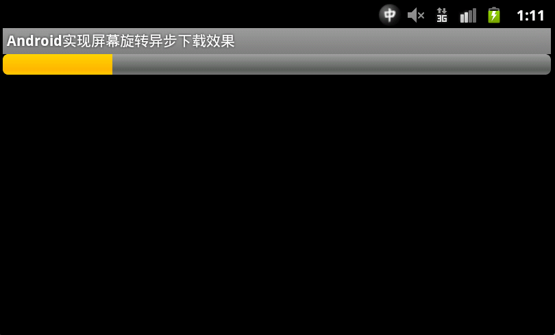

<h1 align="center">Android开发之InstanceState详解</h1>

**本文介绍Android中关于Activity的两个神秘方法：onSaveInstanceState() 和 onRestoreInstanceState()，并且在介绍这两个方法之后，再分别来实现使用InstanceState保存和恢复数据功能、Android实现屏幕旋转异步下载效果这样两个示例。**

首先来介绍onSaveInstanceState() 和 onRestoreInstanceState() 。关于这两个方法，一些朋友可能在Android开发过程中很少用到，但在有时候掌握其用法会帮我们起到比较好的效果。尤其是在应用程序在不知道的情况下退出后，如何实现其数据保存的功能。先来让我们看下这两个方法的有什么样的作用。

**1. 基本作用：** 

Activity的 onSaveInstanceState() 和 onRestoreInstanceState()并不是生命周期方法，它们不同于 onCreate()、onPause()等生命周期方法，它们并不一定会被触发。当应用遇到意外情况（如：内存不足、用户直接按Home键）由系统销毁一个Activity时，onSaveInstanceState() 会被调用。但是当用户主动去销毁一个Activity时，例如在应用中按返回键，onSaveInstanceState()就不会被调用。因为在这种情况下，用户的行为决定了不需要保存Activity的状态。通常onSaveInstanceState()只适合用于保存一些临时性的状态，而onPause()适合用于数据的持久化保存。

在activity被杀掉之前调用保存每个实例的状态,以保证该状态可以在onCreate(Bundle)或者onRestoreInstanceState(Bundle) (传入的Bundle参数是由onSaveInstanceState封装好的)中恢复。这个方法在一个activity被杀死前调用，当该activity在将来某个时刻回来时可以恢复其先前状态。  

例如，如果activity B启用后位于activity A的前端，在某个时刻activity A因为系统回收资源的问题要被杀掉，A通过onSaveInstanceState将有机会保存其用户界面状态，使得将来用户返回到activity A时能通过onCreate(Bundle)或者onRestoreInstanceState(Bundle)恢复界面的状态。

关于onSaveInstanceState ()，是在函数里面保存一些View有用的数据到一个Parcelable对象并返回。在Activity的onSaveInstanceState(Bundle outState)中调用View的onSaveInstanceState ()，返回Parcelable对象，

接着用Bundle的putParcelable方法保存在Bundle  savedInstanceState中。

当系统调用Activity的的onRestoreInstanceState(Bundle savedInstanceState)时， 同过Bundle的getParcelable方法得到Parcelable对象，然后把该Parcelable对象传给View的onRestoreInstanceState (Parcelable state)。在的View的onRestoreInstanceState中从Parcelable读取保存的数据以便View使用。 

这就是onSaveInstanceState() 和 onRestoreInstanceState() 两个函数的基本作用和用法。

**2. onSaveInstanceState() 什么时候调用** 

先看Application Fundamentals上的一段话：

Android calls onSaveInstanceState() before the activity becomes vulnerable to being destroyed by the system, but does not bothercalling it when the instance is actually being destroyed by a user action (suchas pressing the BACK key).

从这句话可以知道，当某个activity变得"容易"被系统销毁时，该activity的onSaveInstanceState()就会被执行，除非该activity是被用户主动销毁的，例如当用户按BACK键的时候。

注意上面的双引号，何为"容易"？意思就是说该activity还没有被销毁，而仅仅是一种可能性。这种可能性有哪些？通过重写一个activity的所有生命周期的onXXX方法，包括onSaveInstanceState()和onRestoreInstanceState() 方法，我们可以清楚地知道当某个activity（假定为activity A）显示在当前task的最上层时，其onSaveInstanceState()方法会在什么时候被执行，有这么几种情况：

(1)、当用户按下HOME键时。

这是显而易见的，系统不知道你按下HOME后要运行多少其他的程序，自然也不知道activity A是否会被销毁，因此系统会调用onSaveInstanceState()，让用户有机会保存某些非永久性的数据。以下几种情况的分析都遵循该原则

(2)、长按HOME键，选择运行其他的程序时。

(3)、按下电源按键（关闭屏幕显示）时。

(4)、从activity A中启动一个新的activity时。

(5)、屏幕方向切换时，例如从竖屏切换到横屏时。

(6)、系统回收引起异常。

在屏幕切换之前，系统会销毁activity A，在屏幕切换之后系统又会自动地创建activity A，所以onSaveInstanceState()一定会被执行，且也一定会执行onRestoreInstanceState()。 

总而言之，onSaveInstanceState()的调用遵循一个重要原则，即当系统存在“未经你许可”时销毁了我们的activity的可能时，则onSaveInstanceState()会被系统调用，这是系统的责任，因为它必须要提供一个机会让你保存你的数据（当然你不保存那就随便你了）。如果调用，调用将发生在onPause()或onStop()方法之前。（虽然测试时发现多数在onPause()前）

**3. onRestoreInstanceState()什么时候调用** 

onRestoreInstanceState()被调用的前提是，activity A“确实”被系统销毁了，而如果仅仅是停留在有这种可能性的情况下，则该方法不会被调用，例如，当正在显示activity A的时候，用户按下HOME键回到主界面，然后用户紧接着又返回到activity A，这种情况下activity A一般不会因为内存的原因被系统销毁，故activity A的onRestoreInstanceState方法不会被执行 此也说明上二者，大多数情况下不成对被使用。 

onRestoreInstanceState()在onStart() 和 onPostCreate(Bundle)之间调用。

**4. onSaveInstanceState()方法的默认实现**

如果我们没有覆写onSaveInstanceState()方法，此方法的默认实现会自动保存activity中的某些状态数据，比如activity中各种UI控件的状态。android应用框架中定义的几乎所有UI控件都恰当的实现了onSaveInstanceState()方法，因此当activity被摧毁和重建时，这些UI控件会自动保存和恢复状态数据。比如EditText控件会自动保存和恢复输入的数据，而CheckBox控件会自动保存和恢复选中状态.开发者只需要为这些控件指定一个唯一的ID(通过设置android:id属性即可)，剩余的事情就可以自动完成了。如果没有为控件指定ID，则这个控件就不会进行自动的数据保存和恢复操作。 

由上所述, 如果我们需要覆写onSaveInstanceState()方法, 一般会在第一行代码中调用该方法的默认实现:super.onSaveInstanceState(outState)。 

使用onSaveInstanceState（）保存简单，轻量级的UI状态

**5. 是否需要重写onSaveInstanceState()方法** 

既然该方法的默认实现可以自动的保存UI控件的状态数据，那什么时候需要覆写该方法呢？

如果需要保存额外的数据时，就需要覆写onSaveInstanceState()方法。大家需要注意的是：onSaveInstanceState()方法只适合保存瞬态数据，比如UI控件的状态，成员变量的值等，而不应该用来保存持久化数据，持久化数据应该当用户离开当前的 activity时，在 onPause() 中保存（比如将数据保存到数据库或文件中）。说到这里，还要说一点的就是在onPause()中不适合用来保存比较费时的数据，所以这点要理解。

由于onSaveInstanceState()方法方法不一定会被调用, 因此不适合在该方法中保存持久化数据, 例如向数据库中插入记录等. 保存持久化数据的操作应该放在onPause()中。若是永久性值，则在onPause()中保存；若大量，则另开线程吧，别阻塞UI线程。  

**6. 引发activity销毁和重建的其它情况**

除了系统处于内存不足的原因会摧毁activity之外，某些系统设置的改变也会导致activity的摧毁和重建。例如改变屏幕方向(见上例)，改变设备语言设定，键盘弹出等。

另外，当屏幕的方向发生了改变， Activity会被摧毁并且被重新创建，如果你想在Activity被摧毁前缓存一些数据，并且在Activity被重新创建后恢复缓存的数据。可以重写Activity的 onSaveInstanceState() 和 onRestoreInstanceState()方法，如下代码所示：

```java
/**
 * Android使用InstanceState保存和恢复数据
 * @Description: Android使用InstanceState保存和恢复数据
 * @File: MyTestCodeActivity.java
 * @Package com.code.test
 * @Author Hanyonglu
 * @Date 2012-03-28 下午04:53:15
 * @Version V1.0
 */
public class MainActivity extends Activity {
    private String message = "";
    private EditText text = null;
    private Button button = null;
 
    /** Called when the activity is first created. */
    @Override
    public void onCreate(Bundle savedInstanceState) {
        super.onCreate(savedInstanceState);
        setContentView(R.layout.main);
        text = (EditText) findViewById(R.id.editText1);
        button = (Button) findViewById(R.id.btnSave);
        
        button.setOnClickListener(new OnClickListener(){
            @Override
            public void onClick(View v) {
                Toast.makeText(getApplicationContext(), "保存", Toast.LENGTH_SHORT).show();
            }
        });
    }
 
    @Override
    public void onResume(){
        super.onResume();
        Toast.makeText(getApplicationContext(), message, Toast.LENGTH_LONG).show();
    }
 
    @Override
    public void onSaveInstanceState(Bundle savedInstanceState){
        super.onSaveInstanceState(savedInstanceState);
        savedInstanceState.putString("message", text.getText().toString());
    }
 
    @Override
    public void onRestoreInstanceState(Bundle savedInstanceState){
        super.onRestoreInstanceState(savedInstanceState);
        message = savedInstanceState.getString("message");
    }
}
```

还有需要注意的是, onSaveInstanceState()方法并不是一定会被调用的, 因为有些场景是不需要保存状态数据的。 比如用户按下BACK键退出activity时, 用户显然想要关闭这个activity, 此时是没有必要保存数据以供下次恢复的, 也就是onSaveInstanceState()方法不会被调用。如果调用onSaveInstanceState()方法,调用将发生在onPause()或onStop()方法之前。

代码如下所示：

```java
    @Override
    public void onSaveInstanceState(BundlesavedInstanceState) {
        savedInstanceState.putBoolean("MyBoolean", true);
        savedInstanceState.putDouble("myDouble", 1.9); 
        // etc.
        super.onSaveInstanceState(savedInstanceState);
    }

    @Override
    public void onRestoreInstanceState(BundlesavedInstanceState) {
        super.onRestoreInstanceState(savedInstanceState);
        boolean myBoolean =savedInstanceState.getBoolean("MyBoolean");
        double myDouble =savedInstanceState.getDouble("myDouble");
    } 


```

我们可以用旋转屏幕来测试我们的程序保存状态的能力。因为一般旋转时，activity会被重新执行onCreate() onStart()等操作，程序此时能够保存状态是很重要的。可以考虑使用该方法保存数据。 当然了在旋转屏幕时我们除了使用onSaveInstanceState()外，还可以使用onRetainNonConfigurationInstance()和getLastNonConfigurationInstance()这两个方法来保存切换屏幕的状态。与onSaveInstanceState() 不同的是，onRetainNonConfigurationInstance()和getLastNonConfigurationInstance() 方法主要用于屏幕之间的旋转操作时保存数据。

如下代码所示：

```java
    @Override
    public Object onRetainNonConfigurationInstance() {
        // 在这里设置需要保存的内容，在切换时不是bundle了，我们可以直接通过object来代替。
        return super.onRetainNonConfigurationInstance();
    } 

```

在恢复屏幕时可以不使用onRestoreInstanceState()，而使用getLastNonConfigurationInstance()来代替。我们可以直接在oncreate()方法中获取上次保存的对象。

如下代码所示：

```java
    @Override
    protected void onCreate(Bundle savedInstanceState) {
        // TODO Auto-generated method stub
        super.onCreate(savedInstanceState);
        setContentView(R.layout.main);
        
        // 获取上次切换屏幕保存的对象
        Object obj = getLastNonConfigurationInstance(); 
    }
```

对于我们的程序而言，或多或少的都需要进行Activity之间的跳转操作，其中有一些是为了获得系统中的资源或是一些必要信息，而一般是通过启动Activity(常用startActivity()和startActivityForResult()函数)来进行操作。在这个跳转的期间，我们当前的Activity暂时失去了焦点，处于不可操作状态，可在此之前先通过onSaveInstanceState()方法来保存一些暂时的数据。当回到先前的Activity时，先前的Activity重新获取了焦点，系统就是触发onRestoreInstanceState()方法，可获取失去焦点前的一些数据。onRetainNonConfigurationInstance()方法也具有类似的功能来处理这样的数据操作。先前说过，onRetainNonConfigurationInstance()方法主要是用于屏幕的旋转操作。

说到这里了，可能有的人就要问了，既然onSaveInstanceState()和onRetainNonConfigurationInstance()都可以实现保存数据的功能，如果是两个同时使用时，执行顺序是哪个在先，哪个在后呢？根据Android官方网站上介绍，如果两个方法同时出现时，onSaveInstanceState()方法执行在先，而onRetainNonConfigurationInstance()方法执行在后。它们的执行顺序都在onStop()和onDestroy()之间，关于这点需要我们大家注意。

之前在其它网站上看到有的朋友说："onSaveInstanceState()和onRetainNonConfigurationInstance()既然都可以实现保存数据的功能，而且onSaveInstanceState()相比onRetainNonConfigurationInstance()方法可以实现更多情况下的数据保存功能，那么onRetainNonConfigurationInstance()岂不是多余的吗？"。关于这点，从设计的角度看，onRetainNonConfigurationInstance()并不是多余的函数。一般情况下，如果我们要保存的数据不太大，而且适合放在Bundle中，那么使用onSaveInstanceState()是比较合适的；如果要保存的数据不适合放在Bundle中（比如： 一个socket）或是数据比较大（比如：一个Bitmap），那么这个时间我们就应该使用onRetainNonConfigurationInstance()，而且我们使用onRetainNonConfigurationInstance()可以保存任何类型的对象，像AsyncTask和SQLiteDatabse，我们都可以进行保存。这些类型的数据可能会被一个新的Activity实例所重新使用。所以onSaveInstanceState()和onRetainNonConfigurationInstance()在我们的程序中扮演的是不同的角色，需要在不同的时机下调用，用来处理不同类型的数据。

例如下面代码所示要保存一个复杂的数据：

```java
    public class DataHolder {
        int a;
        Bitmap b;
        String s;
    }

    @Override
    public Object onRetainNonConfigurationInstance() {
        DataHolder dh = new DataHolder();
        dh.a = a;
        dh.b = b;
				dh.s = s;

        return dh;
    }
```

不过呢，onRetainNonConfigurationInstance()在新版本的SDK中是一个过时的方法，我们可以用 setRetainInstance(boolean)来代替onRetainNonConfigurationInstance()，在旧的平台中我们仍然可以使用onRetainNonConfigurationInstance()。如果是部分朋友不知道如何使用setRetainInstance(boolean)来保存自定义的对象数据，可以使用onRetainCustomNonConfigurationInstance()来代表onRetainNonConfigurationInstance()，同时使用getLastCustomNonConfigurationInstance()代替getLastNonConfigurationInstance() 。

下面是一个使用onRetainNonConfigurationInstance() 和 getLastNonConfigurationInstance()来实现屏幕旋转时异步下载更新进度条并保存数据的效果，代码如下所示：

```java
/**
 * Android实现屏幕旋转异步下载效果
 * @Description: Android实现屏幕旋转异步下载效果
 * @File: RotationAsyncActivity.java
 * @Package com.rotation.demo
 * @Author Hanyonglu
 * @Date 2012-03-28 下午08:14:57
 * @Version V1.0
 */
public class RotationAsyncActivity extends Activity {
    // 进度条
    private ProgressBar progressBar=null;
    // 异步任务类
    private RotationAsyncTask asyncTask=null;
    
    @Override
    public void onCreate(Bundle savedInstanceState) {
        super.onCreate(savedInstanceState);
        setContentView(R.layout.main);
        
        progressBar=(ProgressBar)findViewById(R.id.progress);
        // 获取对象
        asyncTask=(RotationAsyncTask)getLastNonConfigurationInstance();
        
        if (asyncTask==null) {
            asyncTask=new RotationAsyncTask(this);
            asyncTask.execute();
        } else {
            asyncTask.attach(this);
            updateProgress(asyncTask.getProgress());
        
            if (asyncTask.getProgress()>=100) {
                markAsDone();
            }
        }
    }
    
    /**
     * 保存对象
     */
    @Override
    public Object onRetainNonConfigurationInstance() {
        asyncTask.detach();
        return asyncTask;
    }
      
    private void updateProgress(int progress) {
        progressBar.setProgress(progress);
    }
      
    private void markAsDone() {
        findViewById(R.id.completed).setVisibility(View.VISIBLE);
    }
     
    // 异步任务类
    private static class RotationAsyncTask extends AsyncTask<Void, Void, Void> {
        private RotationAsyncActivity activity=null;
        private int progress=0;
        
        /**
         * 默认的构造器
         */
        public RotationAsyncTask() {
            // TODO Auto-generated constructor stub
        }
        
        /**
         * 带参构造器
         * @param activity
         */
        public RotationAsyncTask(RotationAsyncActivity activity) {
            attach(activity);
        }
        
        @Override
        protected Void doInBackground(Void... unused) {
            for (int i=0;i<20;i++) {
                SystemClock.sleep(500);
                publishProgress();
            }
          
            return null;
        }
        
        @Override
        protected void onProgressUpdate(Void... unused) {
            if (activity==null) {
                Log.w("RotationAsyncActivity", "onProgressUpdate()");
            } else {
                progress += 5;
                activity.updateProgress(progress);
            }
        }
        
        @Override
        protected void onPostExecute(Void unused) {
            if (activity==null) {
                Log.w("RotationAsyncActivity", "onPostExecute()");
            } else {
                activity.markAsDone();
            }
        }
        
        protected void detach() {
            activity = null;
        }
        
        protected void attach(RotationAsyncActivity activity) {
            this.activity = activity;
        }
        
        protected int getProgress() {
            return progress;
        }
    }
}
```

我们在运行示例时就会发现，无论怎样旋转屏幕都不会影响进度条的更新与下载，需要解释下的是这里我并没有设置下载功能，有兴趣或需要的朋友自己添加即可。实现效果图如下所示：

   

以上就是在Android中关于InstanceState保存数据和恢复数据的过程，在这里我想再重复一遍：onSaveInstanceState()和onRestoreInstanceState()机制来保存数据时，它仅在非用户显式的指令杀死应用程序时保存和恢复数据。我们可以使用它在我们的程序中来保存数据，可以作为保存数据的一种方式，但在使用过程中需要注意其使用原理和方法。

Android使用InstanceState保存和恢复数据示例下载： [/Files/hanyonglu/AndroidFile/MyTestCode.rar](http://files.cnblogs.com/hanyonglu/AndroidFile/MyTestCode.rar)

Android实现屏幕旋转异步下载效果示例下载：[/Files/hanyonglu/AndroidFile/MyRotationAsync.rar](http://files.cnblogs.com/hanyonglu/AndroidFile/MyRotationAsync.rar) 

最后，希望转载的朋友能够尊重作者的劳动成果，加上转载地址：http://www.cnblogs.com/hanyonglu/archive/2012/03/28/2420515.html 谢谢。