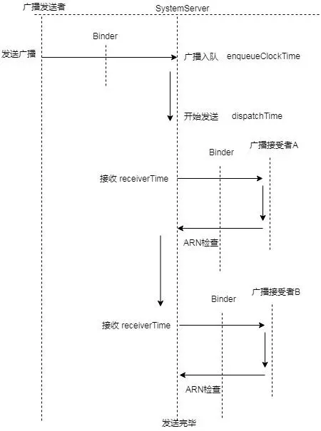

<h1 align="center">Android Broadcast</h1>

[toc]

## 广播新特性

target 26 之后，无法在 AndroidManifest 显示声明大部分广播，除了一部分必要的广播，如：

- ACTION_BOOT_COMPLETED
- ACTION_TIME_SET
- ACTION_LOCALE_CHANGED

## 广播静态注册和动态注册的区别

1. 动态注册广播不是常驻型广播，也就是说广播跟随 Activity 的生命周期。注意在 Activity 结束前，移除广播接收器。静态注册是常驻型，也就是说当应用程序关闭后，如果有信息广播来，程序也会被系统调用自动运行。
2. 当广播为有序广播时：优先级高的先接收（不分静态和动态）。同优先级的广播接收器，动态优先于静态
3. 同优先级的同类广播接收器，静态：先扫描的优先于后扫描的，动态：先注册的优先于后注册的。
4. 当广播为默认广播时：无视优先级，动态广播接收器优先于静态广播接收器。同优先级的同类广播接收器，静态：先扫描的优先于后扫描的，动态：先注册的优先于后册的。

## 普通广播与有序广播

- 普通广播
   普通广播是完全异步的，逻辑上可以在同一时刻被所有匹配的接受者接收到，消息传递效率高，缺点是接受者不能将处理结果传递给下一个接收者，也无法终止广播传播。
   普工广播是并行广播。
   
- 有序广播
   有序广播的接收者们将按照事先声明的优先级依次接收，数越大优先级越高（取值范围：-1000~10000），优先级可以声明在<intent-filter android:priority="n".../>，也可以调用IntentFilter对象的setPriority设置。并且接收者可以终止传播（调用abortBroadcast()方法即可终止），一旦终止后面接收者就无法接受广播。另外，接受者可以将处理结果存入数据（可通过setResultExtras(Bundle)方法将数据存入Broadcast），当做Broadcast再传递给下一级接收者（可通过代码Bundle bundle = getResultExtras(true)获取上一级传递过来的数据）。
   有序广播是串行广播。
   
- 粘性广播

   粘性消息在发送后就一直存在于系统的消息容器里面，等待对应的处理器去处理，如果暂时没有处理器处理这个消息则一直在消息容器里面处于等待状态，粘性广播的Receiver如果被销毁，那么下次重建时会自动接收到消息数据。

   注意：普通广播和粘性消息不能被截获，而有序广播是可以被截获的。

   在Android系统粘性广播一般用来确保重要的状态改变后的信息被持久保存，并且能随时广播给新的广播接收器，比如电源的改变，因为耗电需要一个过程，前一个过程必须提前得到，否则可能遇到下次刚好接收到的广播后系统自动关机了，随之而来的是kill行为，所以对某些未处理完的任务来说，后果很严重。

   发送粘性广播需要权限（这里的权限是保存信息的权限和由系统发送未处理的广播的权限）

   ```css
   <uses-permission android:name="android.permission.BROADCAST_STICKY" />
   ```

## 有序广播的发送

### 各个时间点

- enqueueClockTime 一次广播插入到广播队列时的时间点，取System.currentTimeMillis()
- dispatchTime 一次广播从广播队列中被取出，准备开始发送，取SystemClock.uptimeMillis()
- dispatchClockTime 含义同dispatchTime，取System.currentTimeMillis()
- receiverTime 一次广播中，开始派发给其中每个接收者时的时间点，主要记录的是有序广播的情况，取SystemClock.uptimeMillis()。
- finishTime 一次广播完成时的时间点
   **每次把广播发送给一个接受者之后会去检查当前时间与dispatchTime 时间差是否大于超时时间，大于时就是ANR超时**


### 时序图



​																															

从图中可以看出决定广播B接受者的广播接受是否超时，取决于广播A处理的时间和广播B处理的时间

## 超时的原因

- 同一个广播接收者较多，抢占了后面的接收者允许处理的时间。广播接受者较多也可能是由于代码设计不合理，注册了广播监听没有解注册有关。
- Binder被耗尽，导致Binder通信时间较长，挤压了广播处理的时间
- 广播接受的onReceive中做了繁重的任务
- 系统资源紧张，CPU处理时间被抢占

## 优化建议

- 保证广播监听的注册与取消注册成对实现
- 同一个应用对同一个广播的监听应该使用同一个监听者，不应该多处监听
- 在广播的onReceive中不应该做繁重的任务

## 注册过程


## 本地广播

```java
LocalBroadcastManager.getInstance(MainActivity.this).registerReceiver(receiver, filter);
```

