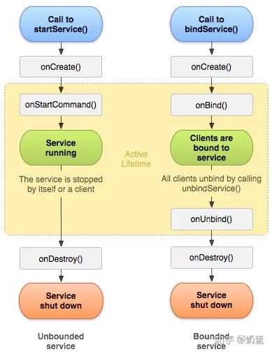
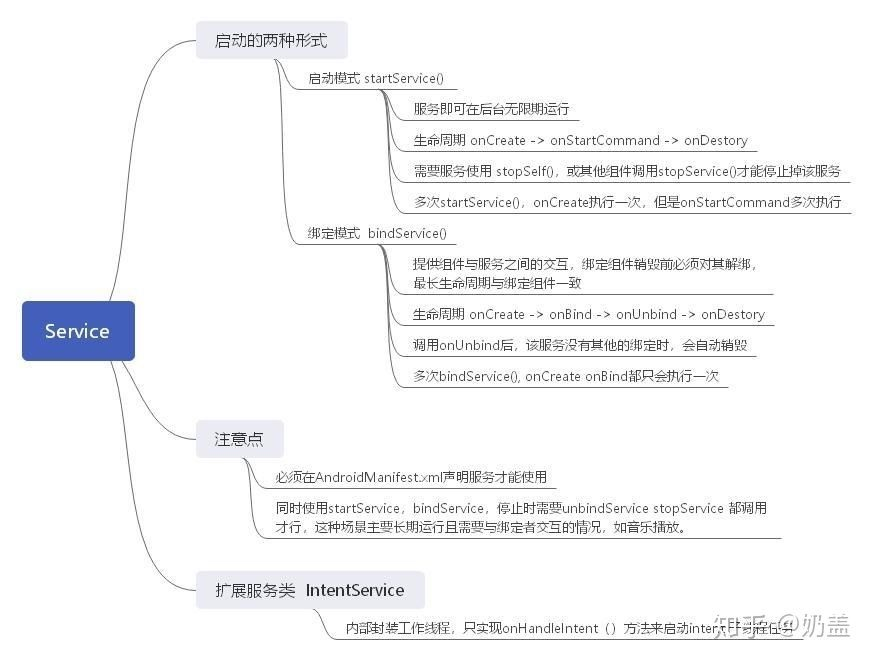

<h1 align="center">Android Service</h1>

[toc]

> Service 分为两种工作状态，一种是启动状态，主要用于执行后台计算；另一种是绑定状态，主要用于其他组件和 Service 的交互。

## 启动过程


## 绑定过程


| 值                     | 说明                                                         |
| ---------------------- | ------------------------------------------------------------ |
| START_NOT_STICKY       | 如果系统在 onStartCommand() 返回后终止服务，则除非有挂起 Intent 要传递，否则系统不会重建服务。这是最安全的选项，可以避免在不必要时以及应用能够轻松重启所有未完成的作业时运行服务 |
| START_STICKY           | 如果系统在 onStartCommand() 返回后终止服务，则会重建服务并调用 onStartCommand()，但不会重新传递最后一个 Intent。相反，除非有挂起 Intent 要启动服务（在这种情况下，将传递这些 Intent ），否则系统会通过空 Intent 调用 onStartCommand()。这适用于不执行命令、但无限期运行并等待作业的媒体播放器（或类似服务 |
| START_REDELIVER_INTENT | 如果系统在 onStartCommand() 返回后终止服务，则会重建服务，并通过传递给服务的最后一个 Intent 调用 onStartCommand()。任何挂起 Intent 均依次传递。这适用于主动执行应该立即恢复的作业（例如下载文件）的服务 |

## 启用前台服务

```java
<uses-permission android:name="android.permission.FOREGROUND_SERVICE"/>
```

```java
Notification notification = new Notification(icon, text, System.currentTimeMillis());
Intent notificationIntent = new Intent(this, ExampleActivity.class);
PendingIntent pendingIntent = PendingIntent.getActivity(this, 0, notificationIntent, 0);
notification.setLatestEventInfo(this, title, mmessage, pendingIntent);
startForeground(ONGOING_NOTIFICATION_ID, notification);
```

## startService和bindService的区别，生命周期以及使用场景



## **startService 和 bindService 区别**

startService： onCreate -> onStartCommand -> onDestory ，在多次调用startService的时候，onCreate不重复执行，但是onStartCommand会执行。startService调用了这后，会一直存在，直到其调用了stopService。

bindService : onCreate -> onBind -> onUnbind -> onDestory，多次调用bindService，onCreate及onBind都只执行一次。它生命周期跟随其调用者，调用者释放的时候，必须对该Service解绑，当所有绑定全部取消后，系统即会销毁该服务。bindService 的方式通过onServiceConnected方法，获取到Service对象，通过该对象可以直接操作到Service内部的方法，从而实现的Service 与调用者之间的交互。

**使用场景**

如果想要启动一个后台服务长期进行某项任务，那么使用startService

如果只是短暂的使用，那么使用bindService。

如果想启动一个后台服务长期进行任务，且这个过程中需要与调用者进行交互，那么可以两者同时使用，或者使用startService + BoardCast/ EventBus 等方法。

对于既使用startService，又使用bindService的情况，结束服务时需要注意的事项：

- Service的终止，需要unbindService和stopService都调用才行；

顺便提一下IntentService，与Service的区别在于它内部封装了一个工作线程，也就是说，在其内部onHandleIntent的代码都是在子线程里面工作的。



## 为什么bindService可以跟Activity生命周期联动？

1、bindService 方法执行时，LoadedApk 会记录 ServiceConnection 信息。

2、Activity 执行 finish 方法时，会通过 LoadedApk 检查 Activity 是否存在未注销/解绑的 BroadcastReceiver 和 ServiceConnection，如果有，那么会通知 AMS 注销/解绑对应的 BroadcastReceiver 和 Service，并打印异常信息，告诉用户应该主动执行注销/解绑的操作。

## IntentService

IntentService 可用于执行后台耗时的任务，当任务执行后会自动停止，由于其是 Service 的原因，它的优先级比单纯的线程要高，所以 IntentService 适合执行一些高优先级的后台任务。在实现上，IntentService 封装了 HandlerThread 和 Handler。

``IntentService.java``

```java
@Override
public void onCreate() {
    // TODO: It would be nice to have an option to hold a partial wakelock
    // during processing, and to have a static startService(Context, Intent)
    // method that would launch the service & hand off a wakelock.

    super.onCreate();
    HandlerThread thread = new HandlerThread("IntentService[" + mName + "]");
    thread.start();

    mServiceLooper = thread.getLooper();
    mServiceHandler = new ServiceHandler(mServiceLooper);
}
```

IntentService 第一次启动时，会在 onCreatea 方法中创建一个 HandlerThread，然后使用的 Looper 来构造一个 Handler 对象 mServiceHandler，这样通过 mServiceHandler 发送的消息最终都会在 HandlerThread 中执行。每次启动 IntentService，它的 onStartCommand 方法就会调用一次，onStartCommand 中处理每个后台任务的 Intent，onStartCommand 调用了 onStart 方法：

``IntentService.java``

```java
private final class ServiceHandler extends Handler {
    public ServiceHandler(Looper looper) {
        super(looper);
    }

    @Override
    public void handleMessage(Message msg) {
        onHandleIntent((Intent)msg.obj);
        stopSelf(msg.arg1);
    }
}

···

@Override
public void onStart(@Nullable Intent intent, int startId) {
    Message msg = mServiceHandler.obtainMessage();
    msg.arg1 = startId;
    msg.obj = intent;
    mServiceHandler.sendMessage(msg);
}
```

可以看出，IntentService 仅仅是通过 mServiceHandler 发送了一个消息，这个消息会在 HandlerThread 中被处理。mServiceHandler 收到消息后，会将 Intent 对象传递给 onHandlerIntent 方法中处理，执行结束后，通过 stopSelf(int startId) 来尝试停止服务。（stopSelf() 会立即停止服务，而 stopSelf(int startId) 则会等待所有的消息都处理完毕后才终止服务）。

## Android中IntentService有何优点

IntentService是一个通过Context.startService(Intent)启动可以处理异步请求的Service，使用时你只需要继承IntentService和重写其中的onHandleIntent(Intent)方法接收一个Intent对象，在适当的时候会停止自己(一般在工作完成的时候)。 所有的请求的处理都在一个工作线程中完成,它们会交替执行(但不会阻塞主线程的执行)，一次只能执行一个请求。

这是一个基于消息的服务，每次启动该服务并不是马上处理你的工作，而是首先会创建对应的Looper，Handler并且在MessageQueue中添加的附带客户Intent的Message对象，当Looper发现有Message的时候接着得到Intent对象通过在onHandleIntent((Intent)msg.obj)中调用你的处理程序。处理完后即会停止自己的服务。意思是Intent的生命周期跟你的处理的任务是一致的。所以这个类用下载任务中非常好，下载任务结束后服务自身就会结束退出。

## Service 和 Thread 的区别？

