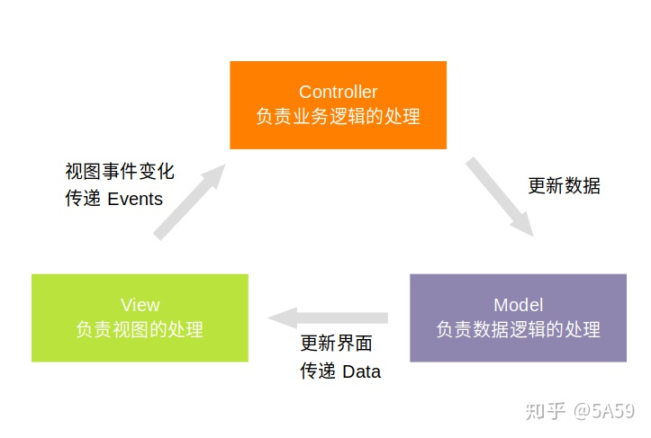
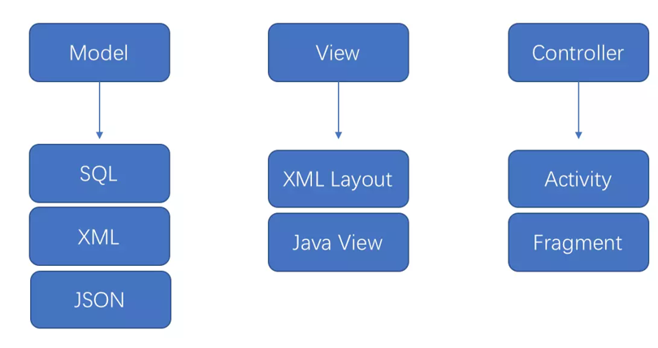
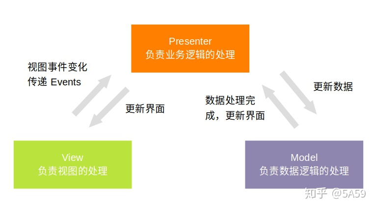
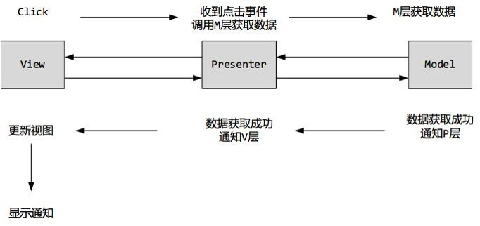
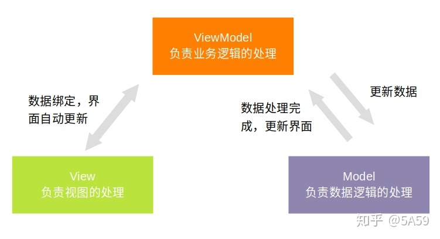
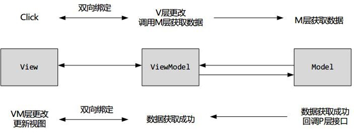
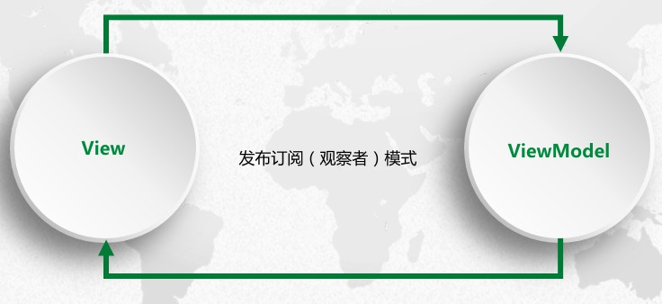

<h1 align="center">MVC、MVP、MVVM</h1>

[toc]

## 1.Android架构设计模式概述

### 三种架构模式

- MVC架构设计模式：MVC全名是Model View Controller，是`模型(model)`-`视图(view)`-`控制器(controller)`的缩写。
  - Model : 模型层，业务逻辑+数据存储等
  - View : 用户界面，一般就是xml+Activity
  - Controller : 控制层，一般就是Activity
- MVP架构设计模式：MVP全名是Model View Persenter，MVP由MVC演变而来，是现在主流的开发模式。
  - Model：模型层，业务逻辑+数据存储+网络请求
  - View：视图层，View绘制和用户交互等，一般是Activity
  - Presenter：呈现层，连接V层和M层，完成他们之间的交互
- MVVM架构设计模式：MVVM全名是Model-View-ViewModel，它本质上就是MVC的改进版。
  - Model：模型层，业务逻辑+数据存储+网络请求
  - View：视图层，View绘制和用户交互等，一般是Activity
  - ViewModel：其实就是Presenter和View的数据模型的合体。双向绑定，View的变动会反应到ViewModel中，数据的变动也会反应到View上。

> 各种模型的**主要目的**都是是分离视图（View）和模型（Model），即将UI界面显示和业务逻辑进行分离。

### 三层架构

将整个业务应用划分为：`界面层（User Interface layer, UIL）`、`业务逻辑层（Business Logic Layer, BLL）`、`数据访问层（Data access layer, DAL）`。

1：界面层：主要是指与用户交互的界面。用于接收用户输入的数据和显示处理后用户需要的数据。如果逻辑层相当强大和完善，无论表现层如何定义和更改，逻辑层都能完善地提供服务。

2：业务逻辑层：UI层和DAL层之间的桥梁。实现业务逻辑。业务逻辑具体包含：验证、计算、业务规则等等。

3：数据访问层：与数据库打交道。主要实现对数据的增、删、改、查。将存储在数据库中的数据提交给业务层，同时将业务层处理的数据保存到数据库。（当然这些操作都是基于UI层的。用户的需求反映给界面（UI），UI反映给BLL，BLL反映给DAL，DAL进行数据的操作，操作后再一一返回，直到将用户所需数据反馈给用户）。

## 2.架构设计模式-MVC

**(1) 定义：**

在android开发过程中，比较流行的开发框架曾经采用的是MVC框架模式。

- M（Model-模型）层：持有所有的数据、状态和程序逻辑（处理数据加载和存储等业务）。如：数据库操作，网络操作，I/O操作，复杂操作和耗时任务等。

- V（View-视图）层：用户看到并与之交互的页面，通常直接从模型中取得它需要显示的状态与数据，一个视图往往有一个相应的控制器。在Android开发中，它一般对应着**View、xml布局**文件。

- C（Controller-控制器）层：位于视图和模型中间，负责接受用户的输入，将输入进行解析并反馈给模型。在Android开发中，它一般对应着**Activity/Feagment**。android中主要通过activity处理用户交互和业务逻辑，接受用户的输入并调用Model和View去完成用户的需求。

  Android中的MVC：

  

**(2) 特点**

- 低耦合
- 可重用易拓展
- 模块职责划分明确

**(3) 实例**

> android本身的设计结构符合 MVC 模式。

**(4) MVC优缺点**

* 优点：
  * MVC模式通过Controller来掌控全局，同时将View展示和Model的变化分离开
  * 结构清晰，职责划分清晰
  * 减低耦合
  * 有利于组件重用

* 缺点
  * View层对应xml布局文件能做的事情非常有限，所以需要把大部分View相关的操作移到Controller层的activity中。导致activity相当于充当了2个角色(View层和Controller层)，不仅要处理业务逻辑，还要操作UI。一旦一个页面的业务繁多复杂的话，activity的代码就会越来越臃肿和复杂。
  * Model 直接操作 View，View 的修改会导致 Controller 和 Model 都进行改动
  * 增加了代码结构的复杂性

## 3.架构设计模式-MVP

> MVP是从经典的MVC模式演变而来，它们的基本思想有相通的地方:Controller/Presenter负责逻辑的处理，Model提供数据，View负责显示。在Android开发中，MVP的具体实现流程是当Presenter接收到View的请求，便从Model层获取数据，将数据进行处理。处理好的数据再通过View层的接口回调给Activity或Fragment。这样MVP能够让Activity或Fragment成为真正的View，只做与UI相关的事而不处理其他业务流程。

**(1) 定义**

- M（Model-模型）层：持有所有的数据、状态和程序逻辑（处理数据加载和存储等业务）。如：数据库操作，网络操作，I/O操作，复杂操作和耗时任务等。

- V（View-视图）层：用户看到并与之交互的页面，通常直接从模型中取得它需要显示的状态与数据，一个视图往往有一个相应的控制器。在Android开发中，它一般对应着**View、xml布局**文件。

- P（Presenter-控制器）层：负责完成Model层和View层间的数据交互和业务逻辑。

  Android中的MVP

  

**(2) MVC和MVP的区别**

> MVP中的View并不直接使用Model，它们之间的通信是通过Presenter来进行的，所有的交互都发生在Presenter内部，而在MVC中View会直接从Model中读取数据而不通过Controller

- MVC和MVP的最大区别：MVC的Model层和View层能够直接交互；MVP的Model层和View层不能直接交互，需通过Presenter层来进行交互。
- Activity职责不同：Activity在MVC中属于Controller层，在MVP中属于View层，这是MVC和MVP很主要的一个区别。可以说Android从MVC转向MVP开发也主要是优化Activity的代码，避免Activity的代码臃肿庞大。
- View层不同：MVC的View层指的是XML布局文件（或用Java自定义的View）；MVP的View层是Activity（或Fragment）
- 控制层不同：MVC的控制层是Activity（或Fragment）；MVP的控制层是Presenter，里面没有很多的实际东西，主要负责Model层和View层的交互。

**(3) MVP优缺点**

- MVP的优点如下:
  - 结构清晰，职责划分清晰
  - 模块间充分解耦
  - 有利于组件的重用

- MVP也有不足之处:
  - 会引入大量的接口，导致项目文件数据激增
  - 增大代码结构复杂性

## 4.架构设计模式-MVVM

**(1) 定义**

- M（Model-模型）层：不同于之前定义的Model层，主要负责数据获取、存储和变化，提供数据接口供 ViewModel 层调用。

- V（View-视图）层：对应Activity/Fregment 和xml布局文件 ，负责View的绘制以及与用户交互
   说明：View层仅能**操作UI**（数据绑定来实现 UI 更新）；不能做任何和业务逻辑有关的数据操作
   
- VM（ViewModel-控制器）层：采用 databind 进行 ViewModel 和 View 的双向绑定，负责完成Model层和View层间的数据交互和业务逻辑
   说明：ViewModel层仅能做和**业务逻辑**有关的数据操作；不能做UI相关的操作
   
   Android中的MVVM：
   
   

**(2) DataBinding**

用于降低布局和逻辑的耦合性，使代码逻辑更加清晰。

**(3) 优缺点**

* 优点：
  * 结构清晰，职责划分清晰
  * 模块间充分解耦
  * 在MVP基础上，MVVM把View和ViewModel也进行了解耦
* 缺点：
  * Debug困难，由于View和ViewModel解耦，导致debug时难以一眼看出View的事件传递
  * 代码复杂性增大

## 参考

* [Android中的框架模式：MVC&MVP&MVVM](https://kingsfish.github.io/2019/05/13/Android%E4%B8%AD%E7%9A%84%E6%A1%86%E6%9E%B6%E6%A8%A1%E5%BC%8F%EF%BC%9AMVC-MVP-MVVM/)
* [Android 开发中的架构模式 -- MVC / MVP / MVVM](https://zhuanlan.zhihu.com/p/83635530)
* http://www.cnblogs.com/wj033/p/5812938.html
* [关于Android架构，你是否还在生搬硬套？](https://juejin.cn/post/6942464122273398820#heading-10)--【优】

