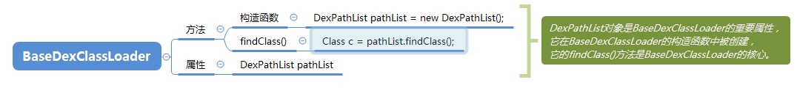
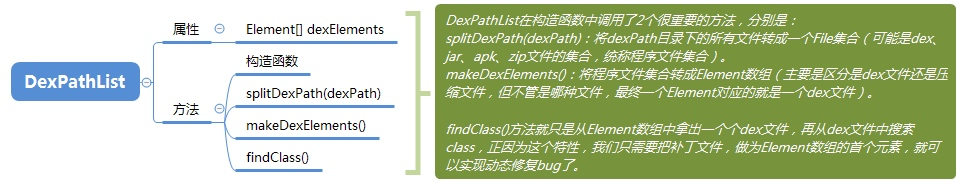
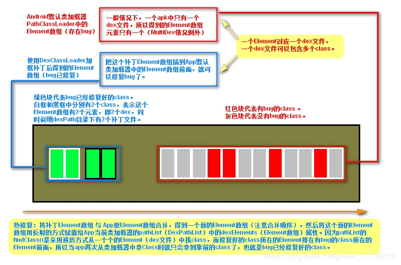
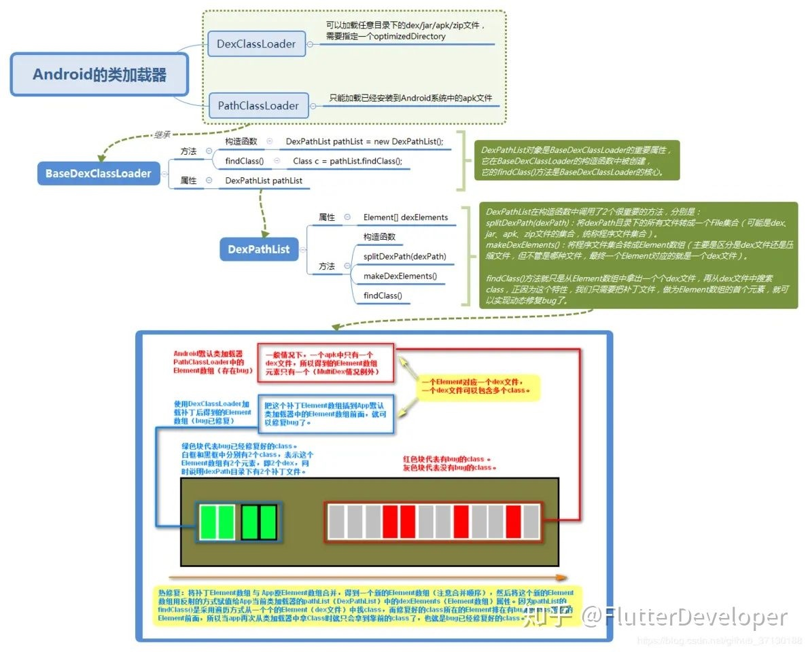

<h1 align="center">对热修复和插件化的理解</h1>

[TOC]

## 1. Android 类加载器

（以下是Android5.0中的部分源码）
* PathClassLoader.java
* DexClassLoader.java
* BaseDexClassLoader.java
* DexPathList.java

### 1.1 PathClassLoader与DexClassLoader的区别
使用场景:

* PathClassLoader：只能加载已经安装到Android系统中的apk文件（/data/app目录），是Android默认使用的类加载器。
* DexClassLoader：可以加载任意目录下的dex/jar/apk/zip文件，比PathClassLoader更灵活，是实现热修复的重点。

代码差异：

因为PathClassLoader与DexClassLoader的源码都很简单，我就直接将它们的全部源码复制过来了：

```java
// PathClassLoader
public class PathClassLoader extends BaseDexClassLoader {
    public PathClassLoader(String dexPath, ClassLoader parent) {
        super(dexPath, null, null, parent);
    }
 
    public PathClassLoader(String dexPath, String librarySearchPath, ClassLoader parent) {
        super(dexPath, null, librarySearchPath, parent);
    }
}
 
// DexClassLoaderpublic 
class DexClassLoader extends BaseDexClassLoader {
    public DexClassLoader(String dexPath, String optimizedDirectory,
            String librarySearchPath, ClassLoader parent) {
        super(dexPath, new File(optimizedDirectory), librarySearchPath, parent);
    }
}
```

通过比对，可以得出2个结论：

* PathClassLoader与DexClassLoader都继承于BaseDexClassLoader。
* PathClassLoader与DexClassLoader在构造函数中都调用了父类的构造函数，但DexClassLoader多传了一个optimizedDirectory。


### 1.2 BaseDexClassLoader

通过观察PathClassLoader与DexClassLoader的源码我们就可以确定，真正有意义的处理逻辑肯定在BaseDexClassLoader中，所以下面着重分析BaseDexClassLoader源码。

1）构造函数

先来看看BaseDexClassLoader的构造函数都做了什么：

```java

public class BaseDexClassLoader extends ClassLoader {
    ...
    public BaseDexClassLoader(String dexPath, File optimizedDirectory, String libraryPath, ClassLoader parent){
        super(parent);
        this.pathList = new DexPathList(this, dexPath, libraryPath, optimizedDirectory);
    }
    ...
}
```

* dexPath：要加载的程序文件（一般是dex文件，也可以是jar/apk/zip文件）所在目录。
* optimizedDirectory：dex文件的输出目录（因为在加载jar/apk/zip等压缩格式的程序文件时会解压出其中的dex文件，该目录就是专门用于存放这些被解压出来的dex文件的）。
* libraryPath：加载程序文件时需要用到的库路径。
* parent：父加载器

2）获取class

类加载器肯定会提供有一个方法来供外界找到它所加载到的class，该方法就是findClass()，不过在PathClassLoader和DexClassLoader源码中都没有重写父类的findClass()方法，但它们的父类BaseDexClassLoader就有重写findClass()

BaseDexClassLoader的findClass()方法实际上是通过DexPathList对象（pathList）的findClass()方法来获取class的，而这个DexPathList对象恰好在之前的BaseDexClassLoader构造函数中就已经被创建好了。



### 1.3 DexPathList

DexPathList的构造函数是将一个个的程序文件（可能是dex、apk、jar、zip）封装成一个个Element对象，最后添加到Element集合中。

### 1.4 findClass()

结合DexPathList的构造函数，其实DexPathList的findClass()方法很简单，就只是对Element数组进行遍历，一旦找到类名与name相同的类时，就直接返回这个class，找不到则返回null。



## 2. 热修复的实现原理

经过对PathClassLoader、DexClassLoader、BaseDexClassLoader、DexPathList的分析，我们知道，安卓的类加载器在加载一个类时会先从自身DexPathList对象中的Element数组中获取（Element[] dexElements）到对应的类，之后再加载。采用的是数组遍历的方式，不过注意，遍历出来的是一个个的dex文件。

在for循环中，首先遍历出来的是dex文件，然后再是从dex文件中获取class，所以，我们只要让修复好的class打包成一个dex文件，放于Element数组的第一个元素，这样就能保证获取到的class是最新修复好的class了（当然，有bug的class也是存在的，不过是放在了Element数组的最后一个元素中，所以没有机会被拿到而已）。

利用PathClassLoader和DexClassLoader去加载与bug类同名的类，替换掉bug类，进而达到修复bug的目的，原理是在app打包的时候阻止类打上CLASS_ISPREVERIFIED标志，然后在热修复的时候动态改变BaseDexClassLoader对象间接引用的dexElements，替换掉旧的类。



目前较火的热修复方案大致分为两派，分别是：

1. 阿里系：DeXposed、andfix：从底层二进制入手（c语言）。阿里andFix hook 方法在native的具体字段。art虚拟机上是一个叫ArtMethod的结构体。通过修改该结构体上有bug的字段来达到修复bug方法的目的，但这个artMethod是根据安卓原生的结构写死的，国内很多第三方厂家会改写ArtMethod结构，导致替换失效。
2. 腾讯系：tinker：从java加载机制入手。qq的dex插装就类似上面分析的那种。通过将修复的dex文件插入到app的dexFileList的前面，达到更新bug的效果，但是不能及时生效，需要重启。但虚拟机在安装期间会为类打上CLASS_ISPREVERIFIED标志，是为了提高性能的，我们强制防止类被打上标志是否会有些影响性能
3. 美团robust 是在编译器为每个方法插入了一段逻辑代码，并为每个类创建了一个ChangeQuickRedirect静态成员变量，当它不为空会转入新的代码逻辑达到修复bug的目的。有点是兼容性高,但是会增加应用体积



**原理**

1. 安卓在加载class时会通过双亲委托机制去加载一个类，先让父类去加载，如果找不到再让子类去加载某个类。
2. 通过查看ClassLoader源码发现findClass方法是由每个子类自己实现的，比如BootClassLoader或者BaseDexClassLoader。而PathClassLoader是继承自BaseDexClassLoader的，它的findClass也是在BaseDexClassLoader里面实现的。
3. BaseDexClassLoader的findClass里面使用了另一个对象DexPathList去查找对应的class，这是安卓里面特有的实现。在DexPathList对象里面有一个属性dexElements，dexElements是用于存放加载好了的dex数组的，查找class是从这个dexElements数组里面去找的。
4. dexElements里面存放的是Element对象，findClass最终会交给Element去实现，Element又会交给Element里面的一个属性DexFile去实现。我看了下，最终是用native实现的。
5. 回到上面的第3步中的DexPathList对象从dexElements数组里面查找class，从数组的前面往后找,找到了就返回结果，不再继续查找。
6. 所以当我们把修复好bug了的class，搞成dex,然后通过反射等技术放到dexElements的最前面，这样系统在通过PathClassLoader找到class时，就能先找到我们放置的修复好bug的class，然后就不会再往后找了，相当于实现了热修复。这样有bug的class就不会被用了。应了一句古话，近水楼台先得月。
7. 第6点中的反射，流程是：获取到PathClassLoader，然后反射获取到父类中的DexPathList对象，然后再反射到DexPathList对象中的dexElements数组。然后将补丁(dex)转为Element对象，插入到dexElements数组的前面(先复制出来，再合并，再通过反射放回去)。

一句话总结。将修复好的类放在dexElements的最前面，这样在加载类的时候就会被优先加载到而达到修复的目的。

## 3. 插件化

插件化一般就是提供一个apk（插件）文件，然后在程序中load该apk，那么如何加载apk中的类呢？其实就是通过这个DexClassLoader。

PathClassLoader和DexClassLoader都继承自BaseDexClassLoader

1、Android使用PathClassLoader作为其类加载器，只能去加载已经安装到Android系统中的apk文件；

2、DexClassLoader可以从.jar和.apk类型的文件内部加载classes.dex文件就好了。热修复也用到这个类。

​	（1）动态改变BaseDexClassLoader对象间接引用的dexElements；

​	（2）在app打包的时候，阻止相关类去打上CLASS_ISPREVERIFIED标志。

​	（3）我们使用 hook 思想代理 startActivity 这个方法，使用占坑的方式，也就是说我们可以提前在 AndroidManifest 中固定写死一个 Activity，这个 Activity 只不过是一个傀儡，我们在启动我们插件apk的时候使用它去系统层校检合法性，然后等真正创建 Activity 的时候再通过 hook 思想拦截 Activity 的创建方法，提前将信息更换回来创建真正的插件apk。

1. startActivity 的时候最终会走到 AMS 的 startActivity 方法
2. 系统会检查一堆的信息验证这个 Activity 是否合法。
3. 然后会回调 ActivityThread 的 Handler 里的 handleLaunchActivity
4. 在这里走到了 performLaunchActivity 方法去创建 Activity 并回调一系列生命周期的方法
5. 创建 Activity 的时候会创建一个 LoaderApk对象，然后使用这个对象的 getClassLoader 来创建 Activity
6. 我们查看 getClassLoader() 方法发现返回的是 PathClassLoader，然后他继承自 BaseDexClassLoader
7. 然后我们查看 BaseDexClassLoader 发现他创建时创建了一个 DexPathList 类型的 pathList对象，然后在 findClass 时调用了 pathList.findClass 的方法
8. 然后我们查看 DexPathList类 中的 findClass 发现他内部维护了一个 Element[] dexElements的dex 数组，findClass 时是从数组中遍历查找的

共同原理：

都使用ClassLoader来实现的加载的新的功能类，都可以使用PathClassLoader与DexClassLoader


不同的是：

热修复：热修复是体现在bug修复方面的，它实现的是不需要重新发版和重新安装，就可以去修复已知的bug。热修复因为是为了修复Bug的，所以要将新的同名类替代同名的Bug类，要抢先加载新的类而不是Bug类，所以多做两件事：在原先的app打包的时候，阻止相关类去打上CLASS_ISPREVERIFIED标志，还有在热修复时动态改变BaseDexClassLoader对象间接引用的dexElements，这样才能抢先代替Bug类，完成系统不加载旧的Bug类

插件化：插件化是体现在功能拆分方面的，它将某个功能独立提取出来，独立开发，独立测试，再插入到主应用中。以此来减少主应用的规模。插件化只是增加新的功能类或者是资源文件，所以不涉及抢先加载旧的类这样的使命，就避过了阻止相关类去打上CLASS_ISPREVERIFIED标志和还有在热修复时动态改变BaseDexClassLoader对象间接引用的dexElements

所以插件化比热修复简单，热修复是在插件化的基础上在进行替旧的Bug类。

*来源：[https://blog.csdn.net/github_37130188/article/details/89762543](https://blog.csdn.net/github_37130188/article/details/89762543)*


