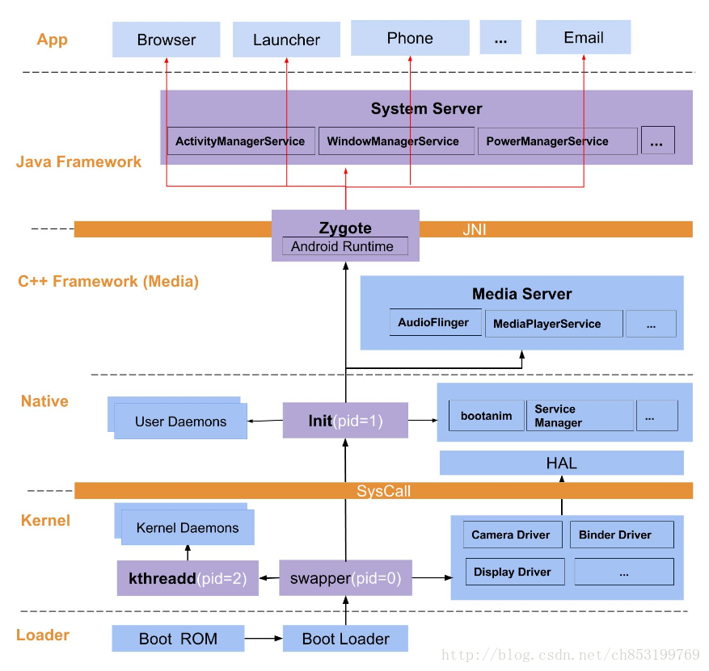
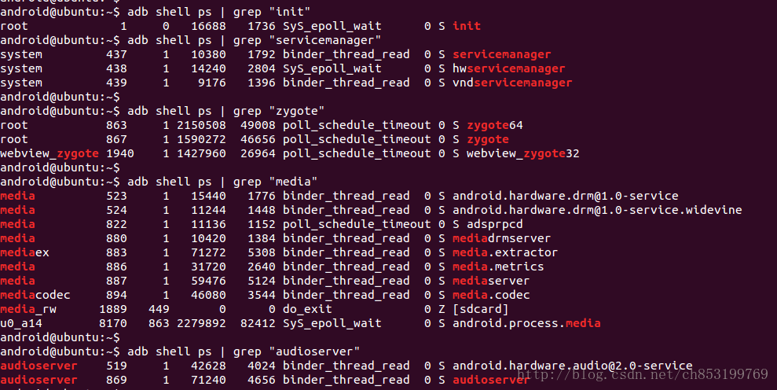
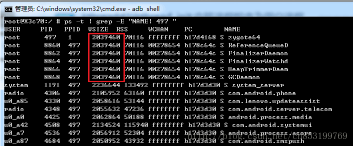
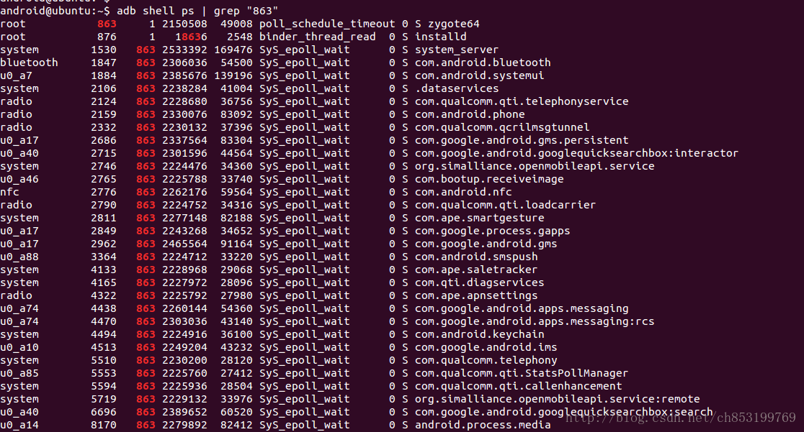

<h1 align="center">Android 系统进程间的关系</h1>

[TOC]

## 概括

系统启动架构图：


本文是从进程/线程的视角来分析该问题。

### 1.1 父进程

在所有进程中，以父进程的姿态存在的进程(即图中的浅红色项)，如下：

- **kthreadd进程**: 是所有内核进程的父进程
- **init进程** ： 是所有用户进程的父进程(或者父父进程)



- **zygote进程** ： 是所有上层Java进程的父进程，另外zygote的父进程是init进程。





### 1.2 重量级进程

在Android进程中，有3个非常重要的进程(即图中的深紫色项)，如下：

- **system_server**：是由zygote孵化而来的，是zygote的首席大弟子，托起整个Java framework的所有service，比如ActivityManagerService, PowerManagerService等等。
- **mediaserver**：是由init孵化而来的，托起整个C++ framework的所有service，比如AudioFlinger, MediaPlayerService等等。
- **servicemanager**：是由init孵化而来的，是整个Binder架构(IPC)的大管家，所有大大小小的service都需要先请示servicemanager。

## 进程

Android进程从大类来划分，可分为内核进程和用户进程。

### 2.1 kthreadd子进程

kthreadd进程（2号进程），是Linux系统的内核进程，是所有内核进程的鼻祖。

由Kthreadd孵化出来的内核守护进程，这些进程位于系统启动架构图中的kernel的深蓝色块。下面列举常见的内核进程：

| 进程            | 备注 |
| --------------- | ---- |
| ksoftirqd/0     |      |
| kworkder/0:0H   |      |
| migration/0     |      |
| watchdog/0      |      |
| binder          |      |
| rcu_sched       |      |
| perf            |      |
| netns           |      |
| rpm-smd         |      |
| mpm             |      |
| writeback       |      |
| system          |      |
| irq/261-msm_iom |      |
| mdss_dsi_event  |      |
| kgsl-events     |      |
| spi             |      |
| therm_core:noti |      |
| msm_thermal:hot |      |
| …               |      |

内核进程都不存在子进程与子线程，并且所有内核进程的用户都是root.
每个内核进程的作用，后续再补上

### 2.2 init子进程

init进程(1号进程)，是Linux系统的用户空间进程，或者说是Android的第一个用户空间进程。

下面列举常见的由init进程孵化而来的用户进程：

| 进程           | 进程文件                   | 备注                             |
| -------------- | -------------------------- | -------------------------------- |
| zygote         | /system/bin/app_process    | Java界的第一个进程，分32位和64位 |
| servicemanager | /system/bin/servicemanager | Binder的守护进程                 |
| mediaserver    | /system/bin/mediaserver    | 多媒体服务的进程                 |
| healthd        | /sbin/healthd              | 电池的守护进程                   |
| surfaceflinger | /system/bin/surfaceflinger | UI帧相关的进程                   |
| logd           | /system/bin/logd           | log的守护进程                    |
| ……             |                            |                                  |

servicemanager，作为Binder架构的一个大管家，所有注册服务、获取服务，都需要经过servicemanager

### 2.3 Zygote子进程

Zygote本身是一个Native的应用程序，刚开始的名字为“app_process”，运行过程中，通过系统调用将自己名字改为Zygote。是所有上层Java进程的父进程，android系统中还有另一个Zygote64进程，用于孵化64位的应用进程。

在图中的红色线，便是Zygote fork出来的进程，所有的App进程都是由Zygote fork产生的。

下面列举Zyogte进程孵化的部分子进程:

| 进程                  | 备注                                     |
| --------------------- | ---------------------------------------- |
| system_server         | Java framework的各种services都依赖此进程 |
| android.process.media | 多媒体应用进程                           |
| com.android.settings  | 设置进程                                 |
| com.android.wifi      | Wifi应用进程                             |
| com.android.phone     | 电话应用进程                             |
| ……                    |                                          |

## 线程

### 3.1 Zygote 子线程

在adb shell终端，输入:

```
ps -t | grep -E "NAME| 497 "1
```

解释： -E “NAME| 497 ” 是输出时能多显示NAME的那一行，方便查看每一列代表的具体含义，497是Zygote的进程号。

共享父进程的地址空间的便是子线程，即VSIZE必然相同，否则就是子进程，如下图：


图中红色圈起来的便是子线程，其他都是子进程。

可见Zygote的子线程如下：

| 进程            | 备注               |
| --------------- | ------------------ |
| ReferenceQueueD | 引用队列的守护线程 |
| FinalizerDaemon | 析构的守护线程     |
| FinalizerWatchd | 析构监控的守护线程 |
| HeapTrimmerDaem | 堆整理的守护线程   |
| GCDaemon        | 执行GC的守护线程   |

这5个线程都是与虚拟机息息相关的线程，之后所有由Zygote直接或间接孵化的子进程，都会包含这5个线程，那么就在其线程说明中，不再重复，而是以“用于GC”的字样来表示。

### 3.2 system_server 子线程

Java Framework中的service都运行在system_server进程中，system_server内的子线程很多，统计了下自己身边的手机有system_server有122个线程。下面列举部分子线程：

| 进程             | 备注                            |
| ---------------- | ------------------------------- |
| system_server    | 包含4个此同名线程               |
| Heap thread poo  | 异步的HeapWorker, 包含5个       |
| Signal Catcher   | 捕捉Kernel信号，比如SIGNAL_QUIT |
| JDWP             | 虚拟机调试的线程                |
| ReferenceQueueD  | 用于GC                          |
| FinalizerDaemon  | 用于GC                          |
| FinalizerWatchd  | 用于GC                          |
| HeapTrimmerDaem  | 用于GC                          |
| GCDaemon         | 用于GC                          |
| Binder_          | IPC线程， 包含16个              |
| Thread_          | 普通线程，包含若干个            |
| AsyncTask #      | 异步任务，包含若干个            |
| RenderThread     | 渲染线程，可以包含若干个        |
| ActivityManager  | ActivityManagerService线程      |
| PerformanaceCont | system_server专有               |
| FileObserver     | system_server专有               |
| CpuTracker       | 统计进程CPU信息                 |
| PowerManagerSer  | system_server专有               |
| PackageManager   | system_server专有               |
| watchdog         | system_server专有               |
| WifiMonitor      | system_server专有               |
| UEventObserver   | system_server专有               |
| …                | …                               |

ActivityManagerService线程是一个ServerThread线程。进程结构体task_struct的comm字段是一个长度为16的char型，故进程名最长为15个字符。

### 3.3 mediaserver 子线程

mediaserver 子线程，如下：

| 线程名          | 备注 |
| --------------- | ---- |
| mediaserver     |      |
| ApmTone         |      |
| ApmAudio        |      |
| ApmOutput       |      |
| Safe Speaker Th |      |
| AudioOut_2      |      |
| FastMixer       |      |
| AudioOut_4      |      |
| FastMixer       |      |
| AudioOut_6      |      |
| Binder_1        |      |
| Binder_2        |      |

### 3.4 app 子线程

此处以settings为例

| 线程名               | 备注                            |
| -------------------- | ------------------------------- |
| com.android.settings | settings进程                    |
| Heap thread poo      | 异步的HeapWorker, 包含5个       |
| Signal Catcher       | 捕捉Kernel信号，比如SIGNAL_QUIT |
| JDWP                 | 虚拟机调试的线程                |
| ReferenceQueueD      | 用于GC                          |
| FinalizerDaemon      | 用于GC                          |
| FinalizerWatchd      | 用于GC                          |
| HeapTrimmerDaem      | 用于GC                          |
| GCDaemon             | 用于GC                          |
| Binder_1             | 用于IPC                         |
| Binder_2             | 用于IPC                         |
| pool-m-thread-n      | 线程池m中的第n个线程,包含若干个 |
| AsyncTask #1         | 异常任务                        |
| RenderThread         | 会有若干个                      |
| WifiManager          | 管理wifi的线程                  |

一般地，每个apk都会产生2或3个Binder线程，Apk运行的Activity或service都会产生2个Binder线程。

关于Binder问题

主线程是由 Zygote母体生成的；
线程池：首次创建第一个Binder线程A，然后监听BR_SPAWN_LOOPER事件，收到后创建第二个Binder线程B，线程B继续监听BR_SPAWN_LOOPER事件，收到后创建第三个Binder线程C。总共创建3个Bindr线程，这是Binder协议决定。根据系统处理器数目以及应用程序的负载强度，线程池的线程数目可以动态调整，这是Binder优化需要考虑的。


## 链接

[Android 系统进程间的关系_ch853199769的博客-CSDN博客](https://blog.csdn.net/ch853199769/article/details/79091886)

[进程和线程概览  | Android 开发者  | Android Developers](https://developer.android.com/guide/components/processes-and-threads.html#java)

[进程、线程基础知识全家桶，30 张图一套带走 - 小林coding - 博客园 (cnblogs.com)](https://www.cnblogs.com/xiaolincoding/p/13289992.html)
