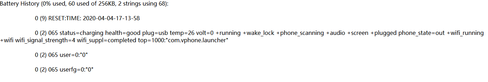
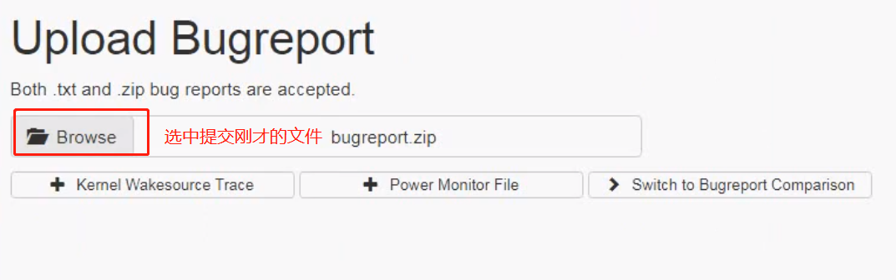
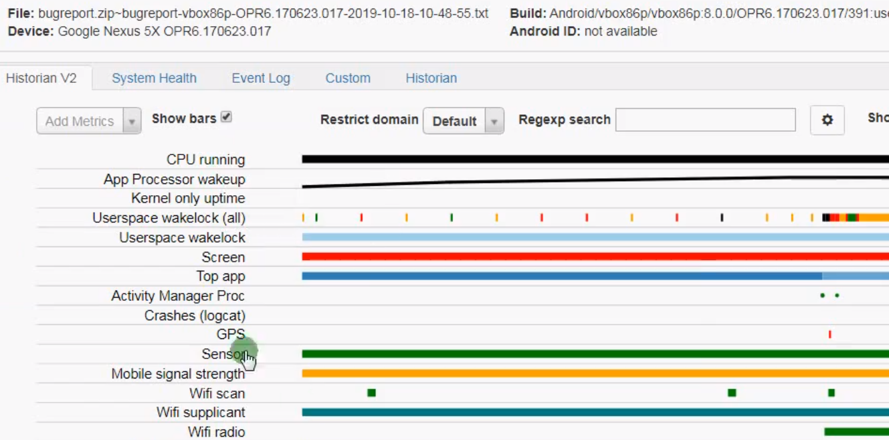
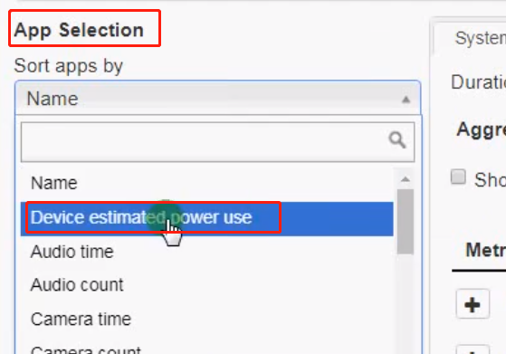
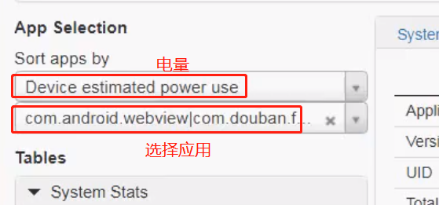
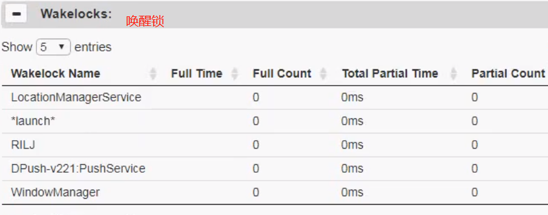
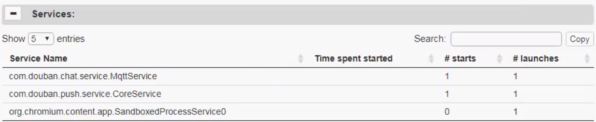
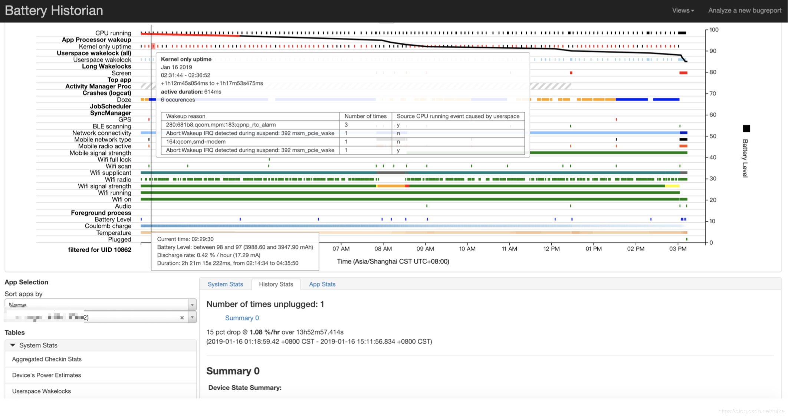

<h1 align="center">BugReport</h1>

[toc]

## 一、Bugreport

### 1. 系统build相关信息

系统build信息：

- dumpstate: `date`
- Build: getprop `ro.build.display.id`
- Build fingerprint: getprop `ro.build.fingerprint`
- Bootloader: getprop `ro.bootloader`
- Radio: getprop `ro.baseband`
- Network: getprop `gsm.operator.alpha`
- Kernel: dump_file `/proc/version`
- Command line: cat `/proc/cmdline`

系统运行时间：

```
------ UPTIME (`uptime`) ------
up time: 00:01:53, idle time: 00:02:44, sleep time: 00:00:00
[uptime: 0.015s elapsed]
```

- up time：系统运行时长
- idle time：系统空闲时长
- sleep time：系统休眠时长
- elapsed: uptime指令执行时长

### 2. 内存/CPU/进程等信息

下面列举bugreport结果相关项的title，其中括号中内容便是相应的命令

```
------ UPTIME MMC PERF (/sys/block/mmcblk0/) ------
------ MEMORY INFO (/proc/meminfo) ------
------ CPU INFO (top -n 1 -d 1 -m 30 -t) ------
------ PROCRANK (procrank) ------
------ VIRTUAL MEMORY STATS (/proc/vmstat) ------
------ VMALLOC INFO (/proc/vmallocinfo) ------
------ SLAB INFO (/proc/slabinfo) ------
------ ZONEINFO (/proc/zoneinfo) ------
------ PAGETYPEINFO (/proc/pagetypeinfo) ------
------ BUDDYINFO (/proc/buddyinfo) ------
------ FRAGMENTATION INFO (/d/extfrag/unusable_index) ------
------ KERNEL WAKELOCKS (/proc/wakelocks) ------
------ KERNEL WAKE SOURCES (/d/wakeup_sources: 1970-01-01 08:00:00) ------
------ KERNEL CPUFREQ (/sys/devices/system/cpu/cpu0/cpufreq/stats/time_in_state) ------
------ KERNEL SYNC (/d/sync) ------
------ PROCESSES (ps -P) ------
------ PROCESSES AND THREADS (ps -t -p -P) ------
------ PROCESSES (SELINUX LABELS) (ps -Z) ------
------ LIBRANK (librank) ------
```

这里的涉及的信息较多，这里就先介绍下`/sys/block/mmcblk0/`:

命令：dump_files(“UPTIME MMC PERF”, mmcblk0, skip_not_stat, dump_stat_from_fd); 输出/sys/block/mmcblk0/stat节点以及遍历/sys/block/mmcblk0/mmcblk0p/stat。

```
stat: 51897 32911 5984151 171690 198408 171047 29988513 2001070 0 334260 2172230
stat: read: 17845KB/s write: 1233KB/s
mmcblk0p24/stat: 16  28 346  50  6   2   64   20  0   70   70
mmcblk0p24/stat: read: 3543KB/s write: 1638KB/s
...
```

另外read = 512*data3/data4, write = 512*data7/data8。

| Name          | 单位          | 含义                       |
| :------------ | :------------ | :------------------------- |
| read I/Os     | requests      | 已处理的I/O读操作请求个数  |
| read merges   | requests      | I/O读操作的合并请求个数    |
| read sectors  | sectors(512B) | 读取的扇区数               |
| read ticks    | ms            | 读请求的总等待时间         |
| write I/Os    | requests      | 已处理的I/O写操作请求个数  |
| write merges  | requests      | I/O写操作的合并请求个数    |
| write sectors | sectors(512B) | 写入的扇区数               |
| write ticks   | ms            | 写请求的总等待时间         |
| in_flight     | requests      | 正在处理中的I/O请求数      |
| io_ticks      | ms            | 该块设备处于活跃态的总时长 |
| time_in_queue | ms            | 所有请求的总等待时长       |

### 3. kernel log

内核log信息，通过命令dmesg可获取

```
------ KERNEL LOG (dmesg) ------
```

### 4. lsof、map及Wait-Channels

#### 4.1 lsof

```
------ LIST OF OPEN FILES (/system/xbin/su root lsof) ------
COMMAND  PID  USER  FD  TYPE  DEVICE  SIZE/OFF  NODE   NAME
zygote   286  root  mem  ???   b3:17   16384   2827  /system/vendor/lib/libcneconn.so
...
```

所有进程打开的文件，例如pid=286的zygote进程打开libcneconn.so文件。

#### 4.2 show map

```
------ SHOW MAP 1 (/init) (/system/xbin/su root showmap 1) ------
------ SHOW MAP 2 () (/system/xbin/su root showmap 2) ------
...
------ SHOW MAP 3649 () (/system/xbin/su root showmap 3649) ------
```

所有进程的show map

#### 4.3 Wait-Channels

```
------ BLOCKED PROCESS WAIT-CHANNELS ------
1    /init     SyS_epoll_wait
...
```

所有线程的Wait-Channels，记录着所有线程最后停留所在位置，例如上面是指pid=1的进程init，最后blocked在SyS_epoll_wait方法内。

### 5. system log

```
------ SYSTEM LOG (logcat -v threadtime -d *:v) ------
```

### 6. event log

```
------ EVENT LOG (logcat -b events -v threadtime -d *:v) -----
```

### 7. radio log

```
------ RADIO LOG (logcat -b radio -v threadtime -d *:v) ------
```

另外log统计信息，记录main/radio/events/system/crash/kernel各个log使用情况 —— LOG STATISTICS (logcat -b all -S) ——

### 8. vm traces

```
------ VM TRACES JUST NOW (/data/anr/traces.txt.bugreport: 2016-06-09 18:57:29) ------
------ VM TRACES AT LAST ANR (/data/anr/traces.txt: 2016-06-09 18:47:39) ------
```

#### 8.1 just now的栈信息

关键词为”VM TRACES JUST NOW”，数据来源”/data/anr/traces.txt.bugreport”

#### 8.2 last ANR的栈信息

关键词为”VM TRACES AT LAST ANR”，数据来源”/data/anr/traces.txt”。

若存在该ANR则输出相应traces，否则输出：

```
*** NO ANR VM TRACES FILE (/data/anr/traces.txt): No such file or directory
```

#### 8.3 tombstones信息

tombstones则是由debuggerd生成的，后续再单独用一篇文章来说明debuggerd的工作原理

```
------ TOMBSTONE (/data/tombstones/tombstone_01: 2016-06-18 11:16:18) ------
```

如果tombstones文件不存在则输出：

```
*** NO TOMBSTONES to dump in /data/tombstones
```

### 9. network

```
------ NETWORK DEV INFO (/proc/net/dev) ------
------ QTAGUID NETWORK INTERFACES INFO (/proc/net/xt_qtaguid/iface_stat_all) ------
------ QTAGUID NETWORK INTERFACES INFO (xt) (/proc/net/xt_qtaguid/iface_stat_fmt) ------
------ QTAGUID CTRL INFO (/proc/net/xt_qtaguid/ctrl) ------
------ QTAGUID STATS INFO (/proc/net/xt_qtaguid/stats) ------
```

### 10. last kernel log

```
------ LAST KMSG (/proc/last_kmsg) ------
```

### 11. last system log

```
------ LAST LOGCAT (logcat -L -v threadtime -b all -d *:v) ------
```

### 12. ip相关

```
------ NETWORK INTERFACES (ip link) ------
------ IPv4 ADDRESSES (ip -4 addr show) ------
------ IPv6 ADDRESSES (ip -6 addr show) ------
------ IP RULES (ip rule show) ------
------ IP RULES v6 (ip -6 rule show) ------
------ RT_TABLES (/data/misc/net/rt_tables: 2016-06-08 22:21:12) ------
------ ROUTE TABLE IPv4 (ip -4 route show table 255) ------
------ ROUTE TABLE IPv6 (ip -6 route show table 255) ------
...
------ ARP CACHE (ip -4 neigh show) ------
------ IPv6 ND CACHE (ip -6 neigh show) ------
------ IPTABLES (/system/xbin/su root iptables -L -nvx) ------
------ IP6TABLES (/system/xbin/su root ip6tables -L -nvx) ------
------ IPTABLE NAT (/system/xbin/su root iptables -t nat -L -nvx) ------
------ IPTABLE RAW (/system/xbin/su root iptables -t raw -L -nvx) ------
------ IP6TABLE RAW (/system/xbin/su root ip6tables -t raw -L -nvx) ------
------ WIFI NETWORKS (/system/xbin/su root wpa_cli IFNAME=wlan0 list_networks) ------
```

### 13. 中断向量表

中断向量表，记录着中断号对应的中断模块。

```
------ INTERRUPTS (1) (/proc/interrupts) ------
------ NETWORK DIAGNOSTICS (dumpsys connectivity --diag) ------
------ INTERRUPTS (2) (/proc/interrupts) ------
```

### 14. property信息

```
------ SYSTEM PROPERTIES ------
------ VOLD DUMP (vdc dump) ------
------ SECURE CONTAINERS (vdc asec list) ------
------ FILESYSTEMS & FREE SPACE (df) ------
```

### 15. last radio log

```
------ LAST RADIO LOG (parse_radio_log /proc/last_radio_log) ------
```

当然，背光信息 —— BACKLIGHTS ——

- LCD brightness= dump_file `/sys/class/leds/lcd-backlight/brightness`
- Button brightness= dump_file `/sys/class/leds/button-backlight/brightness`
- Keyboard brightness= dump_file `/sys/class/leds/keyboard-backlight/brightness`
- ALS mode= dump_file `/sys/class/leds/lcd-backlight/als`
- LCD driver registers: dump_file `/sys/class/leds/lcd-backlight/registers`

### 16. Binder相关

```
------ BINDER FAILED TRANSACTION LOG (/sys/kernel/debug/binder/failed_transaction_log) ------
------ BINDER TRANSACTION LOG (/sys/kernel/debug/binder/transaction_log) ------
------ BINDER TRANSACTIONS (/sys/kernel/debug/binder/transactions) ------
------ BINDER STATS (/sys/kernel/debug/binder/stats) ------
------ BINDER STATE (/sys/kernel/debug/binder/state) ------
```

紧接着之后还有：

```
------ DUMP VENDOR RIL LOGS (/system/xbin/su root vril-dump) ------
```

### 17. dumpsys相关：

```
------ DUMPSYS (dumpsys) ------
```

通过`dumpsys -l`可查看系统所有服务，不带参数的`dumpsys`命令会输出系统中所有的服务：每个服务开头信息：

```
DUMP OF SERVICE SurfaceFlinger:
DUMP OF SERVICE alarm:
DUMP OF SERVICE cpuinfo:
DUMP OF SERVICE dropbox:
...
```

### 18. dumpsys checkin相关

```
------ CHECKIN BATTERYSTATS (dumpsys batterystats -c) ------
------ CHECKIN MEMINFO (dumpsys meminfo --checkin) ------
------ CHECKIN NETSTATS (dumpsys netstats --checkin) ------
------ CHECKIN PROCSTATS (dumpsys procstats -c) ------
------ CHECKIN USAGESTATS (dumpsys usagestats -c) ------
------ CHECKIN PACKAGE (dumpsys package --checkin) ------
```

dumpsys电池统计，内存、网络统计、进程、使用情况、包这些统计类信息。

### 19. dumpsys app相关

```
------ APP ACTIVITIES (dumpsys activity all) ------
------ APP SERVICES (dumpsys activity service all) ------
------ APP SERVICES (dumpsys activity provider all) ------
```

dumpsys应用activity信息以及service和provider信息。

### 20. Tips

当需要搜索bugreport中内容时，可通过搜索`------ `查找所有的子项目。 比如查看dumpsys信息，则可通过搜索`------ DUMPSYS`即可跳转到相应内容的开头。

bugreport具体内容涉及面很广，后续文章会介绍bugreport涉及的DropBoxManagerService，debuggerd等相关问题。 这里先说说一款开源的bugreport分析工具

## 二、ChkBugReport

ChkBugReport是一款由[sonymobile](http://developer.sonymobile.com/2012/01/25/new-bugreport-analysis-tool-released-as-open-source/)开源的工具，用于分析Bugreport并提供可视化阅读的html格式文件。

### 2.1 用法

(1)通过命令生成bugreport文件

```
adb shell bugreport > bugreport.txt
adb bugreport bug.zip
adb pull /data/user_de/0/com.android.shell/files/bugreports/bugreport-full_k61v1_64_bsp-PPR1.180610.011-2020-08-14-15-17-38.zip
```

(2)执行chkbugreport，命令中.jar 和.txt都必须填写相应文件所在的完全路径。

```
java –jar chkbugreport.jar bugreport.txt
```

当然也可以把.jar添加到path，则直接使用`chkbugreport bugreport.txt`

(3) 通过浏览器打开/bugreport_out/index.html，可视化信息便呈现眼前。

### 2.2 分析工具

* ChkBugReport：输出网页版错误报告
* 在线分析工具battery-historian：[https://bathist.ef.lc/](https://bathist.ef.lc/)
* battery-historian源码：https://github.com/google/battery-historian

### 2.3 chkbugreport分析

- [chkbugreport源码位于github](https://github.com/sonyxperiadev/ChkBugReport)；
- [chkbugreport jar](https://github.com/sonyxperiadev/ChkBugReport)直接下载，现有jar比较老，很久没有维护，建议自行下载源码，重新打包，功能更全。
- chkbugreport实例：
   - [进程死锁](http://sonyxperiadev.github.io/ChkBugReport/examples/bugreport_deadlock_out/index.html)
   - [AIDL死锁](http://sonyxperiadev.github.com/ChkBugReport/examples/bugreport_aidldeadlock_out/index.html)
   - [混合死锁](http://sonyxperiadev.github.io/ChkBugReport/examples/bugreport_hybriddeadlock_out/index.html)

对于死锁问题，要留意`state=MONITOR`的线程，以及main线程的情况。

### 2.4 Bugreport信息

* Stacktraces  ChkBugReport可以从bugreport中解析出输出bugreport的最后时刻、导致ANR时刻甚至更多时刻的堆栈信息。在[例子](http://sonyxperiadev.github.com/ChkBugReport/examples/bugreport_deadlock_out/data/f00034.html#ch504)中你可以看到进程的优先级和策略都已标示出来，堆栈中耗时的部分颜色是黑红，一些违反Strict Mode的部分（比如主线程中使用数据库）颜色标记为亮红。如果这个线程死锁，在报告的Errors将会出现。
* Logs  这部分是对system、main和kernel日志的分析，在这里你可以看到每个进程内存使用图、那个程序产生的log最多、Activity的启动耗时、数据库操作耗时统计、对象被锁定时间、AIDL调用时间、Activity和Service的生命周期及其在内存中使用频率等等，[详见](https://github.com/sonyxperiadev/ChkBugReport/wiki/Logs)
* Packages   ChkBugReport解析bugreport中存储的packages.xml并展示一系列的packages、user ids和 permissions。[参见](http://sonyxperiadev.github.com/ChkBugReport/examples/bugreport_aidldeadlock_out/data/f00006.html#ch435)
* Processes   操作app过程中产生的系统事件日志、内存使用信息等等，[参见](http://sonyxperiadev.github.com/ChkBugReport/examples/bugreport_aidldeadlock_out/data/f00149.html#ch414)
* Battery statistics  电池使用统计信息，[参见](https://github.com/sonyxperiadev/ChkBugReport/wiki/Battery-statistics)
* CPU Frequency statistics  CPU频率统计信息，[参见](http://sonyxperiadev.github.com/ChkBugReport/examples/bugreport_aidldeadlock_out/data/f00074.html#ch782)
* Raw data  被分割成小段的原始数据

### 2.5 chkbugreport的常见参数

| 参数     | 说明                                         |
| :------- | :------------------------------------------- |
| -ds:file | 分析dumsys输出(类似-pb)                      |
| -el:file | 分析event日志                                |
| -ft:file | 分析ftrace dump                              |
| -ml:file | 分析main日志                                 |
| -mo:file | 分析monkey输出并提取堆栈信息                 |
| -pb:file | 加载bugreport部分数据(例如dumpsys输出的数据) |
| -pk:file | 加载packages.xml                             |
| -ps:file | 分析 “processes”部分                         |
| -pt:file | 分析”processes and threads”部分              |
| -sa:file | 分析”vm traces at last anr”部分              |
| -sl:file | 分析system日志                               |
| -sn:file | 分析”vm traces just now”部分                 |
| -sd:dir  | 从指定目录加载部分bugreports                 |
| -uh:file | 加载usage-history.xml                        |

其他参数(较少使用):

| 不常用参数 | 说明                               |
| :--------- | :--------------------------------- |
| –browser   | 分析完后启动浏览器查看结果报告     |
| –gui       | 不指定文件名则启动图形界面(开发中) |
| –silent    | 不输出非严重错误信息               |
| –limit     | 限制要分析文件大小                 |
| –no-limit  | 不限制分析文件大小                 |

### 2.6 Battry historian电量分析

（1）工具：

​		battery-historian源码：https://github.com/google/battery-historian

​		在线分析工具battery-historian：[https://bathist.ef.lc/](https://bathist.ef.lc/)

（2）开始分析

　　　a、执行命令：adb shell dumpsys batterystats --reset  重置电池数据收集

　　　　

 　　　b、执行电池的数据收集命令

　　　　　　第一种：adb shell dumpsys batterystats > batterystats.txt 这个是把采集的结果导出到txt文件中

　　　　　　

　　　　　　第二种：

​									adb bugreport bugreport.zip   // 安卓7以上使用

　　　　　　　　   adb bugreport > bugreport.txt // 安6以下使用

　　　　　　操作之前我们做好先操作一下应用，然后再执行，我们这里用adb bugreport bugreport.zip收集,但是这个命令一直有问题，我们测试发现adb bugreport > bugreport.txt其实可以使用到安卓7以上的

　　　　　　那么就执行adb bugreport > bugreport.txt吧。

　　　　　　操作1：

　　　　　　

　　　　　　提交后的结果：　　　　　　

 　　　　　操作2：选中电量的收集选项

　　　　　　

　　　　　　

 

 　　　　　操作3：选中应用后查看右侧面板：唤醒锁----手机黑屏等情况，唤醒手机，造成耗电量大增



　　　　　　操作4：应用的服务---这些服务也可能会造成我们耗电的原因

 

 　　　详细分析可以去官方查看，比较详细：https://github.com/google/battery-historian

### 2.7 Bugreport指标



各指标的含义

- **横坐标：** 横坐标就是一个时间范围，咱们的例子中统计的数据是以重置为起点，获取 bugreport 内容时 刻为终点。我们一共采集了多长时间的数据；
- **纵坐标：** 关键数据点说明如下。

| 数据项                | 说明                                                         |
| :-------------------- | :----------------------------------------------------------- |
| battery_level         | 电量，可以看出电量的变化                                     |
| plugged               | 充电状态，这一栏显示是否进行了充电，以及充电的时间范围       |
| screen                | 屏幕是否点亮，这一点可以考虑到睡眠状态和点亮状态下电量的使用信息 |
| top                   | 该栏显示当前时刻哪个 app 处于最上层，就是当前手机运行的 app，用来判断某个 app 对手机电量的影响，这样也能判断出该 app 的耗电量信息。该栏记录了应用在某 一个时刻启动，以及运行的时间，这对我们比对不同应用对性能的影响有很大的帮助 |
| wake_lock             | wake_lock 该属性是记录 wake_lock 模块的工作时间。是否有停止的时候等 |
| running               | 界面的状态，主要判断是否处于 idle 的状态。用来判断无操作状态下电量的消耗 |
| Job                   | 后台的工作，比如服务 service 的运行                          |
| data_conn             | 数据连接方式的改变，上面的 edge 是说明采用的 gprs 的方式连接网络的。此数据可 以看出手机是使用 2g，3g，4g 还是 wifi 进行数据交换的。这一栏可以看出不同的连 接方式对电量使用的影响 |
| status                | 电池状态信息，有充电，放电，未充电，已充满，未知等不同状态   |
| phone_signal_strength | 手机信号状态的改变。 这一栏记录手机信号的强弱变化图，依次来判断手机信号对电 量的影响 |
| health                | 电池健康状态的信息，这个信息一定程度上反映了这块电池使用了多长时间 |
| plug                  | 充电方式，usb 或者插座，以及显示连接的时间                   |
| Sync                  | 是否跟后台同步                                               |
| phone_in_call         | 是否进行通话                                                 |
| gps                   | gps 是否开启                                                 |


## 参考

* [BugReport 分析利器 ChkBugReport](https://www.jianshu.com/p/9c4a8642ccbf)
* [Android神兵利器 | ChkBugReport输出网页版错误报告](https://www.jianshu.com/p/d872ea28c2fc)
* [调试系列1：bugreport源码篇](http://gityuan.com/2016/06/10/bugreport/)
* [调试系列2：bugreport实战篇](http://gityuan.com/2016/06/11/bugreport-2/)
* [adb之电量分析工具Battry historian和ChkBugReport(十一)](https://www.cnblogs.com/hally/p/12633105.html)
* [Android电量优化全解析](https://juejin.im/post/6844903779268034574)

