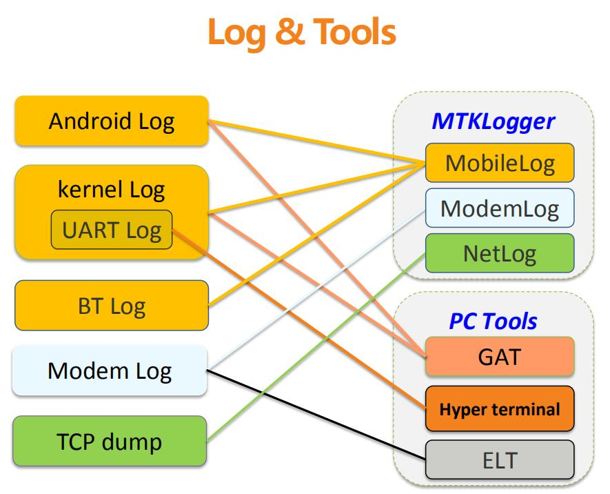
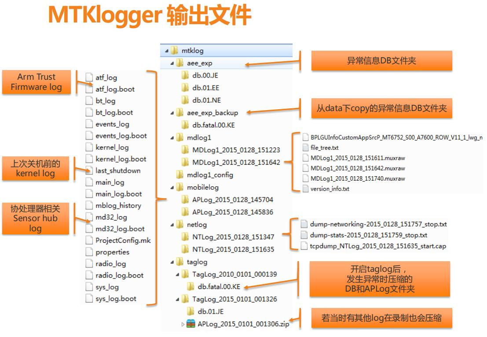
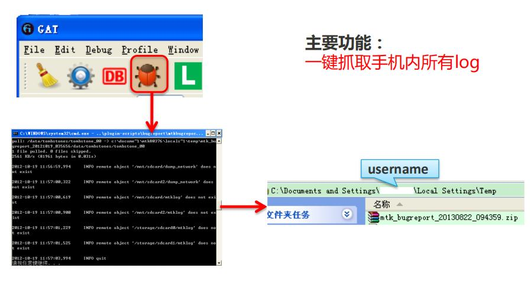
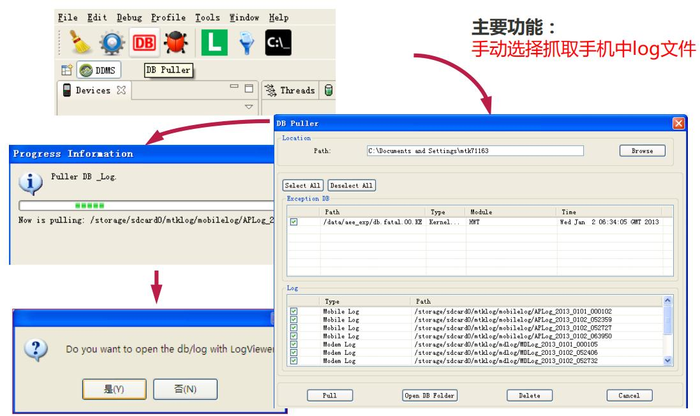
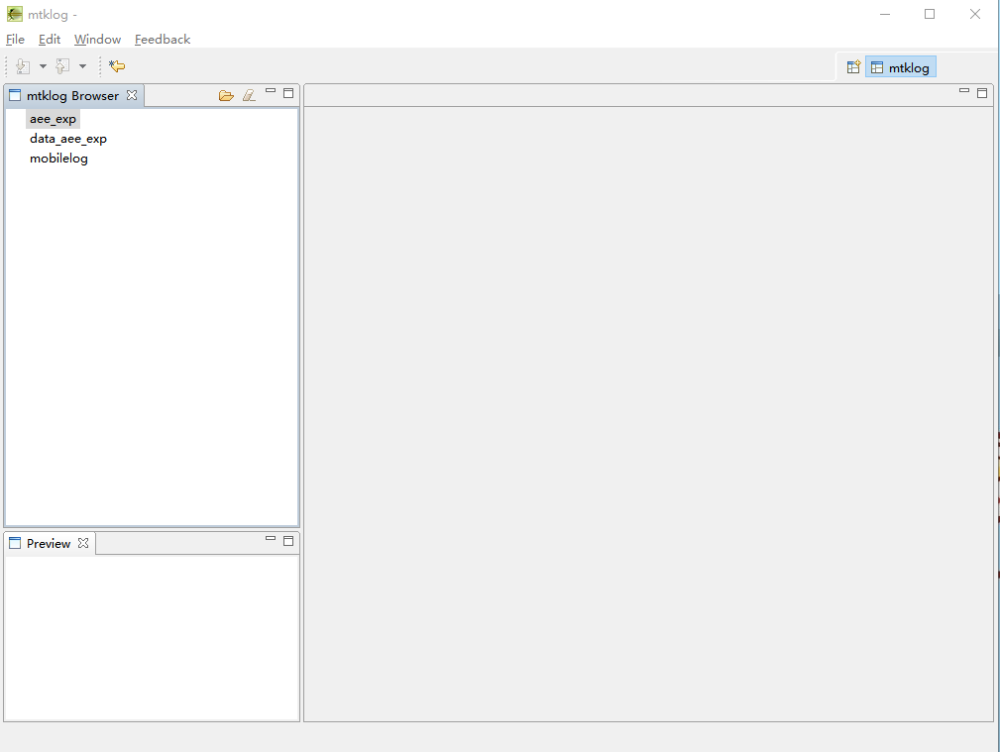
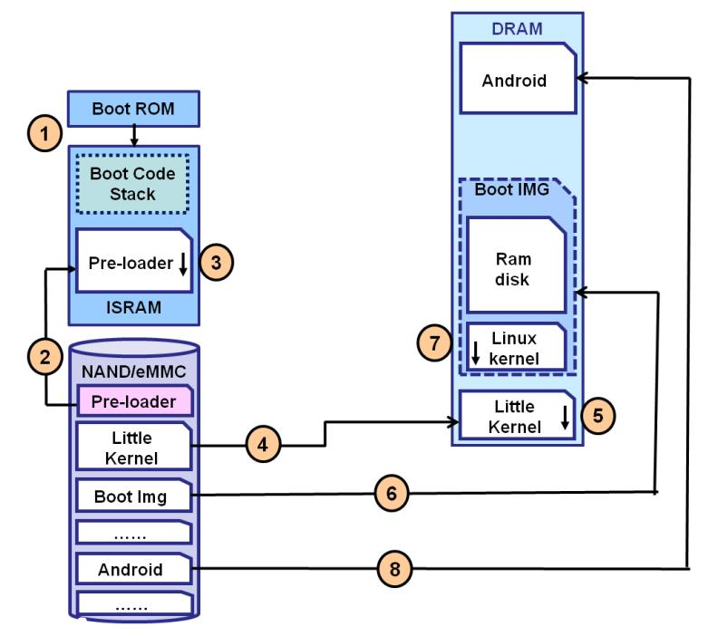
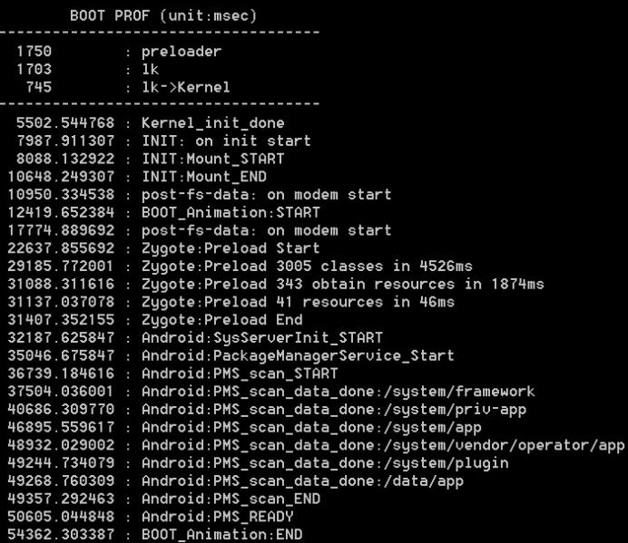

<h1 align="center">MTK Log</h1>

[toc]

## 一、log缓冲区

* Radio：输出通信系统的log
* System：输出系统组件的log
* Event：输出event模块的log
* Main：所有java层的log，遗迹不属于上面3层的log

缓冲区主要给系统组件使用，一般的应用不需要关心，应用的log都输出到main缓冲区中

默认log输出（不指定缓冲区的情况下）是输出System和Main缓冲区的log

## 二、手机的默认的日志目录

 /data/local/tmp/*

/data/tmp/*

/data/system/usagestats/*

/data/system/appusagestates/*

/data/system/dropbox/*

/data/tombstones/*

/data/anr/*

logcat的日志在

/dev/log/main

有/data/local/log目录的，可以保存3-4天的log。

## 三、mtklog分类

```
➜  mtklog tree
.
├── gpsdbglog
│   ├── GPSLog_2020_0819_165631
│   │   ├── gpsdebug.log.20200819165631.nma
│   │   └── gpsdebug.log.20200819165633.nma
│   └── file_tree.txt
├── mdlog1
│   ├── MDLog1_2020_0819_165631
│   │   ├── DbgInfo_LR12A.R2.MP_SW17G13O_0101_MOLY_LR12A_R2_MP_V21_P1_2018_03_26_17_21_1_ulwctg_n
│   │   ├── MDDB.META.ODB_MT6763_S00_MOLY_LR12A_R2_MP_V21_P1_1_ulwctg_n.XML.GZ
│   │   ├── MDDB.META_MT6763_S00_MOLY_LR12A_R2_MP_V21_P1_1_ulwctg_n.EDB
│   │   ├── MDDB_InfoCustomAppSrcP_MT6763_S00_MOLY_LR12A_R2_MP_V21_P1_1_ulwctg_n.EDB
│   │   ├── MDLog1_2020_0819_165631.muxz
│   │   ├── file_tree.txt
│   │   ├── mdm_layout_desc_1_ulwctg_n.dat
│   │   └── version_info.txt
│   └── file_tree.txt
├── mdlog1_config
│   └── filter_config
├── mobilelog
│   ├── APLog_2020_0819_165630__13
│   │   ├── ProjectConfig.mk
│   │   ├── atf_log_7__2020_0819_165739
│   │   ├── bootprof
│   │   ├── bsp_log_8__2020_0819_165739
│   │   ├── cmdline
│   │   ├── crash_log_5__2020_0819_165739
│   │   ├── events_log_3__2020_0819_165739
│   │   ├── kernel_log_6__2020_0819_165739
│   │   ├── last_kmsg
│   │   ├── main_log_1__2020_0819_165739
│   │   ├── mblog_history
│   │   ├── pl_lk
│   │   ├── properties
│   │   ├── radio_log_2__2020_0819_165739
│   │   ├── sspm_log_9__2020_0819_165739
│   │   └── sys_log_4__2020_0819_165739
│   └── file_tree.txt 
└── netlog
    ├── NTLog_2020_0819_165631
    │   ├── dump-networking-2020_0819_165736_stop.txt
    │   ├── dump-stats-2020_0819_165736_stop.txt
    │   └── tcpdump_NTLog_V2_2020_0819_165632_start_1.cap
    └── file_tree.txt
```

### 3.1 gpsdbglog

* GPSLog_2020_0819_165631 // 每次打开mtklog都会新建一个文件夹

### 3.2 MD log：medom 相关底层的log

* MDLog1_2010_0101_000152   // 每次打开mtklog都会新建一个文件夹
* MDLog1_2015_0101_000042

### 3.3 Mobile Log：主要是Android log 和kernel log

* APLog_2010_0101_000147  // 每次打开mtklog都会新建一个文件夹

* APLog_2015_0101_000037
   * atf_log // 所有_log都是进入安卓之后的
   * atf_log.boot // 所有.boot都是启动到进入安卓之前的log
   * bootprof // 启动的简要信息 - 可以分析启动时间 - 启动模式(普通or看门狗or按键())
   * cmdline// lk传给kernel的参数(包括lcm等) - 可以自己加
   * crash_log *// 崩溃log*
   * crash_log.boot
   * events_log *// 事件log，主要输出记录各个activity周期及事件*
   * events_log.boot：
   * kernel_log *// 内核log，常用*
   * kernel_log.boot
   * last_kmsg *// 上一次关机前的log - 可以分析重启原因*
   * main_log *// hal层的log打印在这里*
   * main_log.boot
   * mblog_history *// 本目录下所有log的大小等信息*
   * ProjectConfig.mk *// 工程配置*
   * properties *// 属性*
   * radio_log *// 输出通话，网络状态变化*
   * radio_log.boot
   * sys_log *// jni、framework层log，Exception定位点*
   * sys_log.boot

file_tree.txt ///storage/emulated/0/mtklog/mobilelog/APLog_2020_0819_165630__13/

### 3.4 Network log：网络相关log

* NTLog_2010_0101_000147
* NTLog_2015_0101_000037
   * tcpdump_NTLog_2015_0101_000037_start.cap.tmp

### 3.5 aee_exp log ：crash ANR 重启相关的log输出

### 3.6 running_file_tree.txt

## 四、mtklog 的开启和关闭

（1）在拨号盘界面输入*#9646633# ：

（2）进入EngineerMode的第一个Telephony界面：

（3）向左滑动进入Log and Debugging界面：

（4）点击MTKLogger 菜单：

点击log设置图标可进入log设置界面，如果我只要打印MobileLog可将ModemLog，NetworkLog，GPSlog关闭，点击蓝底色1 即可：

（5）点击开始（红色播放按键）按键：

（6）log 开启：

（7）当我们已经发现异常时，当关闭log，并截图记录时间点，下拉进入下拉栏界面，点击MTKLogger is running：

（8）点击停止按键：

## 五、mtklog的导出和分析

（1）MTKLogger停止后，手机USB，下拉下拉栏，点击USB for charging，切换至MTP模式：

 Transfer files(MTP);

（2）双击：便携设备：

（3）在内部存储中找到mtklog文件夹复制粘贴到本地：

（4）打开mtklog文件夹：

（4）关于分析log，我们主要分析mobilelog 文件夹中的对应Android log 和 kernel log：

对应log文件名称为：

### 5.1 Android Log：Android java层和native层 log

* main_log：详尽输出每一步的log

   命令： adb logcat -b mian -v time >main.txt

   -v time:表示log中加入了时间信息

* sys_log：系统日志，Exception定位点

* radio_log：输出通话，网络状态变化

   命令：adb logcat -b radio -v time > radio.txt

   -v time :表示log中加入了时间信息

* events_log：事件日志，主要输出记录各个activity周期及事件

   event log 属于system log

   命令：adb logcat -b events -v time>events.log

### 5.2 Kernel Log：Linux Kernel内核和驱动log

* kernel_log：底层驱动，按键，低内存相关log
* UART Log

### 5.3 Exception Datebase(db)：系统死机/重启等问题发生时候的原始RAW dataj

### 5.4 Log Tools

- mtklogger
- PC tool



### 5.5 手机端mtklogger




### 5.6 电脑端PC tool

#### 5.6.1 **adb**

##### 5.6.1.1 **logcat**

- **介绍**

logcat是android中的一个命令行工具，可以用于得到程序的log信息

常见的日志纪录方法包括：

| 方法                          | 描述         |
| :---------------------------- | :----------- |
| v(String,String) (vervbose)   | 显示全部信息 |
| d(String,String)(debug)       | 显示调试信息 |
| i(String,String)(information) | 显示一般信息 |
| w(String,String)(waning)      | 显示警告信息 |
| e(String,String)(error)       | 显示错误信息 |

例如：

```
//开发过程中获取log
Log.i("MyActivity","MyClass.getView() - get item number"+position);
//adb获取log
adb logcat
1234
```

adb logcat输出的日志格式如下：

```
I/ActivityManager( 1754): Waited long enough for: ServiceRecord{2b24178c u0 com.google.android.gms/.checkin.CheckinService}
```

- **实例**

```shell
adb logcat –b radio
adb logcat –b system
adb logcat –b events
adb logcat –b main
1234
```

- **优势**

1. 缓冲区强大，不会因为数据量过大而丢失log
2. 过滤性能好
3. 语法简洁，使用方便

##### 5.6.1.2 **提取db**

- **位置**

```
/data/aee_exp
/data/vendor/mtklog/aee_exp
```

#### 5.6.2 **GAT**


##### 5.6.2.1 **BugReport**



##### 5.6.2.2 **DB puller**



##### 5.6.2.3 **Mediatek LogView**



### 5.7 各种mode抓mobile log

#### 5.7.1 Normal mode

1. GAT (user版本只能抓main log，eng版本还能抓到kernel log)
2. mtklogger(user版本通过*#*#3646633#*#*进入工模选择)，会暂时录制到/data/log_temp下，等SD卡ready后再copy到mtklog/mobilelog/APLog路径下

#### 5.7.2 Meta mode(PC meta tool)

- 会先录制到/data/log_temp/meta/下，等外卡ready后再copy到sdcard1/mtklog/mobilelog/APLog路径下，然后删除源文件(data/log_temp)。

#### 5.7.3 Factory mode(power + down key)

- 同Meta mode

#### 5.7.4 Recovery mode(power + up key)

1. 先存在tmp/recovery.log，Reboot进入normal后存在cache/recovery
2. user 版本需要下载eng的recovery.img和boot.img才能抓log

#### 5.7.5 IPO mode

1. 设置IPO关机后，关机期间的log会录制到/data/log_temp/ipo/下，等再次开机后再copy到/mtklog/mobilelog/APLog路径下，然后删除源文件。
2. GAT

### 5.8 各种场景抓log

#### 5.8.1 Preloader & LK阶段（没有logo或卡在logo界面）开机log

- 抓取uart log

#### 5.8.2 Kernel阶段（有logo或开机动画)开机log

1. 如果是User版本，先用对应ENG 版本的lk 替换掉user 版本的lk
2. 或者在user load的`alps/bootable/bootloader/lk/app/mt_boot/mt_boot.c`中，将所有`printk.disable_uart=1`改成`printk.disable_uart=0`，然后重新编译lk, download lk 即可。

#### 5.8.3 Android阶段（有开机动画）开机log

Adbd进程起来后，可以使用GAT抓取开机log（录制前先关机）。

若mtklogger可用，可以通过设置mobile log开机自启动录制开机log。

停止录制状态下mtklogger->settings->mobile log->start automticaly

若TP无法使用，可以参考FAQ06939使用adb命令控制mtklogger录制。

#### 5.8.4 user build 抓开机向导或者不开机log

编译一版eng版本对应软件，做如下修改：

​	1. alps/system/core/rootdir/init.rc`

```r
on property:ro.debuggable=1
    # Give writes to anyone for the trace folder on debug builds.
    # The folder is used to store method traces.
    chmod 0773 /data/misc/trace
    start console
//add begin
on property:ro.debuggable=0
    # Give writes to anyone for the trace folder on debug builds.
    # The folder is used to store method traces.
    chmod 0773 /data/misc/trace
    start console
setprop persist.sys.usb.config mass_storage,adb //add end
123456789101112
```

​	2. alps/kernel-3.18/drivers/misc/mediatek/mtprof/bootprof.c`

```cpp
#ifdef CONFIG_MT_PRINTK_UART_CONSOLE
    //mt_disable_uart();
#endif
123
```

​	3. alps/build/make/core/main.mk`

```makefile
ifeq (true,$(strip $(enable_target_debugging)))  # Target is more debuggable and adbd is on by default
  ADDITIONAL_DEFAULT_PROPERTIES += ro.debuggable=1  # Enable Dalvik lock contention logging.
  ADDITIONAL_BUILD_PROPERTIES += dalvik.vm.lockprof.threshold=500   # Include the debugging/testing OTA keys in this build.
  INCLUDE_TEST_OTA_KEYS := true
else # !enable_target_debugging
  # Target is less debuggable and adbd is off by default
  ADDITIONAL_DEFAULT_PROPERTIES += ro.debuggable=1
endif # !enable_target_debugging
12345678
```

编译好后，user版本刷入eng版本的lk+boot， 抓取uart 或者上层log

如需抓取开机向导前的log，由于系统还未正式起来，请焊uart线，uart log中输入`adb logcat &`将上层log输出到uart log中

### 5.9 AEE异常机制

#### 5.9.1 AEE介绍

`AEE (Android Exception Engine)`是安卓的一个异常捕获和调试信息生成机制。

手机发生错误（异常重启/卡死）时生成db文件（一种被加密过的二进制文件）

#### 5.9.2 why do we need AEE

用来保存和记录异常发生时候的所有内存信息，通过调试和仿真这些信息，可以追踪到异常的原因

#### 5.9.3 DB文件介绍

| **File**              | **Description**                                              |
| :-------------------- | :----------------------------------------------------------- |
| **__exp_main.txt**    | 异常类型，调用栈等关键信息                                   |
| _exp_detail.txt       | 详细异常信息                                                 |
| **SYS_ANDROID_LOG**   | android buffer log(logcat -d -v time *:v)                    |
| **SYS_KERNEL_LOG**    | kernel log                                                   |
| **SYS_LAST_KMSG**     | 上次重启前的kernel log                                       |
| **SYS_MINI_RDUMP**    | 类似coredump，可以用gdb/trace32调试                          |
| SYS_WDT_LOG           | 看门狗复位信息                                               |
| SYS_REBOOT_REASON     | 重启时的硬件记录的信息                                       |
| SYS_VERSION_INFO      | kernel版本，用于和vmlinux对比，只有匹配的vmlinux才能用于分析这个异常 |
| SYS_ANDROID_EVENT_LOG | android event log(logcat -b events -v time -d *:v)           |
| SYS_ANDROID_RADIO_LOG | android buffer log(logcat -b radio -v time -d *:v)           |
| **PROCESS_COREDUMP**  | native program core dump                                     |
| **SYS_PROPERTIES**    | system properties                                            |
| SWT_JBT_TRACES        | /data/anr/.                                                  |
| ZZ_INTERNAL           | 基本异常信息                                                 |
| SYS_CPU_INFO          | cpu 信息(top -n 1 -d 1 -m 30 -t)                             |
| SYS_MEMORY_INFO       | memory information (/proc/meminfo)                           |

- **重启原因记录**

```cpp
struct last_reboot_reason
{
    uint32_t fiq_step;
    uint32_t exp_type; /* 0xaeedeadX: X=1 (HWT), X=2 (KE), X=3 (nested panic) */
    uint32_t reboot_mode;

    uint32_t last_irq_enter[NR_CPUS];
    uint64_t jiffies_last_irq_enter[NR_CPUS];

    uint32_t last_irq_exit[NR_CPUS];
    uint64_t jiffies_last_irq_exit[NR_CPUS];

    uint64_t jiffies_last_sched[NR_CPUS];
    char last_sched_comm[NR_CPUS][TASK_COMM_LEN];

    uint8_t hotplug_data1[NR_CPUS], uint8_t hotplug_data2;
    uint64_t hotplug_data3;

    uint32_t mcdi_wfi, mcdi_r15, deepidle_data, sodi_data, spm_suspend_data;
    uint64_t cpu_dormant[NR_CPUS];
    uint32_t clk_data[8], suspend_debug_flag;

    uint8_t cpu_dvfs_vproc_big, cpu_dvfs_vproc_little, cpu_dvfs_oppidx, cpu_dvfs_status;

    uint8_t gpu_dvfs_vgpu, gpu_dvfs_oppidx, gpu_dvfs_status;

    uint64_t ptp_cpu_big_volt, ptp_cpu_little_volt, ptp_gpu_volt, ptp_temp;
    uint8_t ptp_status;

    uint8_t thermal_temp1, thermal_temp2, thermal_temp3, thermal_temp4, thermal_temp5;
    uint8_t thermal_status;

    void *kparams;
};
12345678910111213141516171819202122232425262728293031323334
```

### 5.10 实际应用总结

#### 5.10.1 usr状态，不同现象手机如何抓取有效log

1. 可正常开机

A：MTKlogger基本足矣

1. 卡logo，不开机

A：

- 刷入eng的lk和boot，再跳线抓取uart log，并开启logcat抓取从开机到异常出现时的所有底层和上层log
- 如果偶尔可以开机，第一时间进入系统提取db信息
- 如上述方式无法提取到关键db，则需要通过flashtool来回读db的原始raw分区，再通过自制expdb解压工具展开

#### 5.10.2 debug阶段，手机如何抓取有效log

1. 无ctp情况下如何调试手机

A：连接adb，通过adb发送ctp报点与手势，来操作手机

1. 无lcd情况下如何调试手机

A：使用GAT工具，实时抓取手机内部frame buffer，投影到电脑上，并用adb命令操作手机

1. UART Log量太大，无法找出重要log怎么办

A：采用adb logcat方式实时过滤带关键字关键level的log （包括kernel log）

### 5.11 Log分析与调试技巧

#### 5.11.1 Android开机流程图



#### 5.11.2 bootprof

```
adb shell cat /proc/bootprof or mktlog bootprof file
```



### 5.12 实际案例（不开机类）

#### 5.12.1 文件系统损坏导致挂载失败

System mount fail 导致 service 起不来，readback system分区对比看是否文件破坏。

```
[138:kworker/u16:2]device-mapper: verity: 179:30: metadata block 716579 is corrupted
[246:init]JBD2: IO error reading journal superblock
[246:init]EXT4-fs (dm-0): error loading journal
[246:init]fs_mgr: __mount(source=/dev/block/dm-0,target=/system,type=ext4)=-1  <<===文件系统挂载失败
[246:init]EXT4-fs (mmcblk0p31): VFS: Can't find ext4 filesystem
12345
```

经常遇到无法开机的问题，低概率、难复现，而且软、硬体跨度大，不易掌握与追踪；

事后分析:

部分有硬件实际损坏、系统映像档被破坏，或用户拔电池导致系统核心文件损坏…等几种原因。其中一部分导致无法开机的问题是由于不当操作使得文件损坏导致的。

PS:产线也会报小概率不开机的问题。

Donwload完整性检查和开机检查客制化

检查kernel log是否有**emmc i/o error**相关log

如果是单机问题检查emmc相关供电或作替换物料交叉实验

```
[ 5.030802] <0>.(0)[165:mmcqd/0]mmcblk0: error -110 transferring data, sector 5448262, nr 442, cmd
response 0x900, card status 0x0
[ 5.032358] <0>.(0)[165:mmcqd/0]blk_update_request: I/O error, dev mmcblk0, sector 5448262
[ 5.130190] <0>.(0)[179:init]EXT4-fs (dm-0): unable to read superblock
[ 5.131325] <0>.(0)[179:init]fs_mgr: __mount(source=/dev/block/dm-0,target=/system,type=ext4)=-1  <<===文件系统挂载失败
12345
```

#### 5.12.2 preloader hang by mem test fail

```
[50:31:154] [MEM] complex R/W mem test fail :FFFFFFFF
[50:31:155] <ASSERT> memory.c:line 105 0
[50:31:155] PL fatal error
[50:31:155] PL delay for Long Press Reboot
[50:31:159] power key is pressed
[50:36:117] [PLF]Emergency Dwld mode(timeout: 5s)
[50:36:119] mtk_arch_reset at pre-loader!
1234567
```

- **场景追溯**

1. 此问题发生的背景，是产线样机？研发样机？还是客退机？
2. 问题发生概率如何？有固定的复现路径吗？目前遇到的问题是在什么测试下发生的？
3. 问题发生是在一台机器，还是多台机器都有遇到？---- 如果是单机问题该memory硬件问题可能性大
4. 用料是否为MTK QVL上已经验证OK的？其他项目上是否已经使用过？

## 六. 常见异常分析：

### 6.1 编译报错：

在build.log 中搜索unfinished 关键字，查找上文能够很快定位报错原因，或者搜索 error: 关键字能够直接定位相关报错文件（注意是搜索error和冒号）

### 6.2 程序崩溃（系统提示***已停止运行）：

（1）启动崩溃：一般情况为第三方预置缺少库文件，或者兼容性问题

（2）应用间交互崩溃：startActivity找不多对应包名或者类名，或者无对应启动Activity的权限

（3）APP内部逻辑空指针异常导致程序崩溃（NullPointerException）

以上三种情况都可在mtklog\mobilelog\APLog_2016_0505_115433\events_log 文件中搜索 crash 关键字快速定位问题点，crash_log中可查看对应问题产生原因：

```
Line 4201: 03-29 11:25:32.894092 939 949 I am_crash:[9337,0,com.bbm,954744388,java.lang.UnsatisfiedLinkError,dalvik.system.PathClassLoader[DexPathList[[zip file"/system/framework/com.google.android.maps.jar", zip file"/data/app/com.bbm-1/base.apk"],nativeLibraryDirectories=[/data/app-lib/com.bbm-1,/data/app/com.bbm-1/base.apk!/lib/armeabi-v7a, /vendor/lib, /system/lib]]]couldn't find "libgnustl_shared.so",Runtime.java,367]
Line 4202: 03-29 11:25:32.910190 939 949 Iam_finish_activity: [0,198242511,14,com.bbm/.ui.activities.StartupActivity,force-crash]
```

### 6.3 程序闪退：

（1）外部原因：物理内存不足，被kill，events_log中搜索 low_memory 关键字，以确定低内存杀死程序，kernal_log 中有存在对应时间点被 low memory kill如下：

```
05-10 11:36:22.588540 923 1439 Iam_low_memory: 19
05-10 11:36:22.594222 923 938 I am_destroy_activity:[0,205784777,125,com.mediatek.filemanager/.MainFilemanagerActivity,finish-idle]
05-10 11:36:22.599262 923 923 I notification_cancel_all:[1000,923,com.mediatek.filemanager,0,0,0,5,NULL]
05-10 11:36:22.601661 923 923 I notification_cancel_all:[1000,923,com.android.providers.downloads,0,0,0,5,NULL]
05-10 11:36:22.650000 2036 2036 I auditd : type=1400 audit(0.0:347): avc:denied

{ read } for comm="GpuAppSpectator" name="cmdline"dev="proc" ino=10905 scontext=u:r:gas_srv:s0tcontext=u:r:system_app:s0 tclass=file permissive=0
05-10 11:36:22.869048 923 1910 Iam_proc_bound: [0,3769,com.cyin.himgr]
05-10 11:36:23.403472 1532 1532 Iam_on_resume_called:[0,com.android.hios.launcher3.Launcher]
05-10 11:36:23.650000 2036 2036 I auditd :type=1400 audit(0.0:348): avc: denied { read }

forcomm="GpuAppSpectator" name="cmdline" dev="proc"ino=10905 scontext=u:r:gas_srv:s0 tcontext=u:r:system_app:s0 tclass=filepermissive=0
05-10 11:36:23.965602 923 938 I am_destroy_activity:[0,102727749,125,com.android.packageinstaller/.InstallAppProgress,finish-imm]
05-10 11:36:23.972491 241 241 I sf_frame_dur:[com.android.packageinstaller/com.android.packageinstaller.InstallAppProgress,2375,9,1,0,1,0,0]
05-10 11:36:24.126262 923 1520 I netstats_mobile_sample: [0,0,0,0,0,0,0,0,0,0,0,0,-1]
05-10 11:36:24.126560 923 1520 I netstats_wifi_sample:[64660,844,36398,408,33328,147,33388,197,32228,126,33388,197,-1]
05-10 11:36:24.244910 923 934 I am_proc_died: [0,3665,com.android.packageinstaller]
05-10 11:36:24.245968 923 934 I wm_task_removed: [125,removeAppToken: last token]
05-10 11:36:24.246168 923 934 I wm_task_removed: [125,removeTask]

05-10 11:36:24.248168 923 934 I am_low_memory: 19
05-10 11:36:24.255912 923 923 I notification_cancel_all:[1000,923,com.android.packageinstaller,0,0,0,5,NULL]
05-10 11:36:24.318915 923 933 Inetstats_mobile_sample: [0,0,0,0,0,0,0,0,0,0,0,0,-1]
```

（2）内部原因：main_log/sys_log 搜索Exception 或者 died关键字定位对应包名，进而定位问题

### 6.4 ANR问题：

出现ANR应当提供traces.txt文件，直接在文件中搜索 cmd 关键字，定位问题点。锁定三个方向：memoryleak（是否为低内存），CPU block（CPU使用率过高）、iowait（IO流使用过于频繁）

（1）memoryleak：首先根据Android log搜索低内存相关 low_memory 关键字，以确定是否存在低内存现象

（2）CPU block：搜索对应包出现ANR前后 TOTAL 关键字前的百分比，若百分比接近100% 说明CPU饥饿导致了ANR：

（3）iowait：搜索iowait 关键字查看出现ANR前的百分比，若百分比过高，说明I/O流使用过于频繁导致ANR，此项需修改相关数据库的加载流程，如下：

```
4-0113:12:15.872 E/ActivityManager( 220): 5.5%21404/com.android.email: 1.3% user + 4.1% kernel / faults: 10 minor
04-0113:12:15.872 E/ActivityManager( 220): 4.3%220/system_server: 2.7% user + 1.5% kernel / faults: 11 minor 2 major
04-0113:12:15.872 E/ActivityManager( 220): 0.9%52/spi_qsd.0: 0% user + 0.9% kernel
04-0113:12:15.872 E/ActivityManager( 220): 0.5%65/irq/170-cyttsp-: 0% user + 0.5% kernel
04-0113:12:15.872 E/ActivityManager( 220):  0.5%296/com.android.systemui:0.5% user + 0% kernel
04-0113:12:15.872 E/ActivityManager( 220): 100%TOTAL:4.8% user + 7.6% kernel + 87% iowait
04-0113:12:15.872 E/ActivityManager( 220):CPUusagefrom 3697ms to 4223ms later:-- ANR后CPU的使用量
04-0113:12:15.872 E/ActivityManager( 220): 25%21404/com.android.email: 25% user + 0% kernel / faults: 191 minor
04-0113:12:15.872 E/ActivityManager( 220):  16% 21603/__eas(par.hakan: 16% user + 0% kernel
04-0113:12:15.872 E/ActivityManager( 220):  7.2% 21406/GC: 7.2% user + 0% kernel
04-0113:12:15.872 E/ActivityManager( 220):  1.8% 21409/Compiler: 1.8% user + 0% kernel
04-0113:12:15.872 E/ActivityManager( 220): 5.5%220/system_server: 0% user + 5.5% kernel / faults: 1 minor
04-0113:12:15.872 E/ActivityManager( 220):  5.5% 263/InputDispatcher: 0% user + 5.5% kernel
04-0113:12:15.872 E/ActivityManager( 220): 32%TOTAL:28% user + 3.7% kernel
```

## 七、参考

* [ mtk log系统详解](https://www.pianshen.com/article/4121163154/)

