<h1 align="center">Android 9.0 最完整的新特性列表</h1>

谷歌在GoogleI / O 2018 上终于发布了Android 9.0。不管你是否已经更新了你的Android版本，当你运行Android9时，你终究会看到大量的新功能，下面列出了其中最炫酷的25个新特性。

**1.自适应电池**

如果你在Android6中使用了休眠功能，它会让所有的应用程序都休眠，而自适应电池功能是它的一个进阶版，默认情况下是启用的。

你可以在Settings> Battery > Adaptive Battery中进行设置该功能。

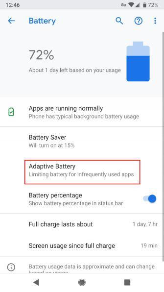

**2.黑暗模式**

你可以在Settings> System > Display > Advanced > Devicetheme中选中“Dark“项来打开该功能，来让Android设备上变暗。

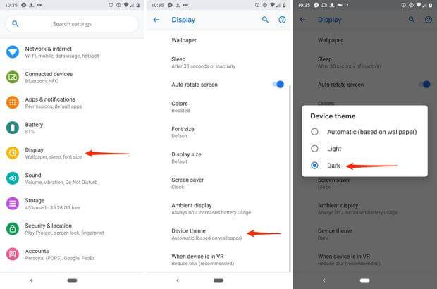

**3.应用程序操作**

这类似于你可以通过长时间按下图标来调用应用程序的快捷方式，但考虑到它是谷歌启动程序，它可以为你的手机提供一些建议，因此完全不同。

例如，当你把耳机连接到你的手机时，你的手机会显示你最近的播放列表。或者会建议你打个电话给你妈妈，让她在这周内来看你。

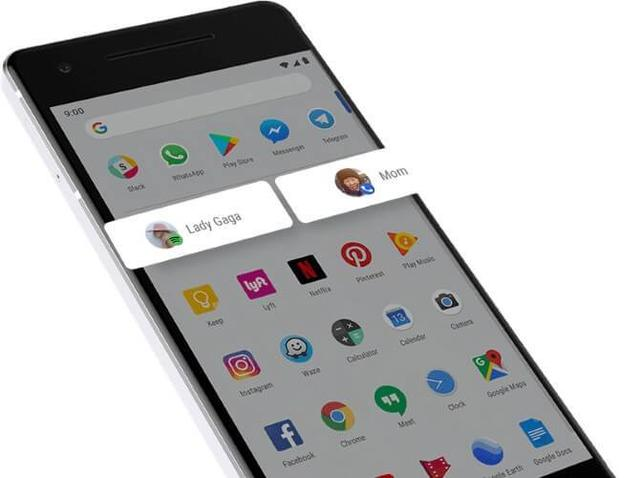

**4.应用定时器**

设置应用程序的时间限制，当你在指定的时间段内使用它们之后，Android会自动将应用程序的图标变灰——暗示你应该把时间花在使用应用程序以外的事情上。

您可以自由设置程序的使用时限。

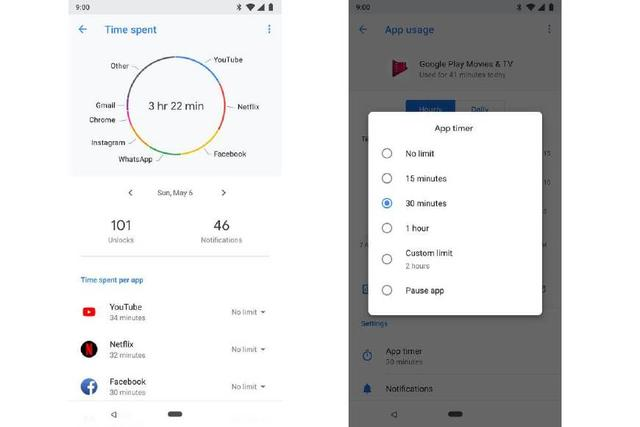

**5.自适应亮度**

Android的自动亮度调节现在更智能了，因为你可以训练它在使用特定的应用程序和不同的环境时知道你喜欢的亮度级别。

可以从快速设置下拉菜单中访问此设置。

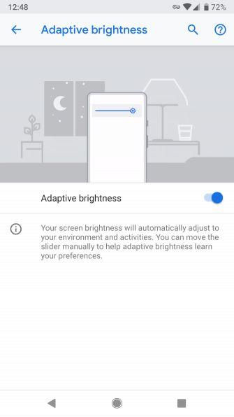

**6.切片**

通过“切片”功能，您可以在使用Google搜索应用搜索应用时看到丰富的数据。这个功能的好处是，你可以直接跳过执行信息对话中列出的操作。

例如，在谷歌搜索应用程序中搜索lyft，你可以选择叫车带你去你的办公室、房子等等，价格也会分别显示出来。

**7.辅助功能菜单**

在Settings> Accessibility > Accessibility Menu中你可以激活新的辅助功能菜单，该菜单会启用一个图标，您可以点按该图标以执行快速设置，设置最近的应用和音量等操作。

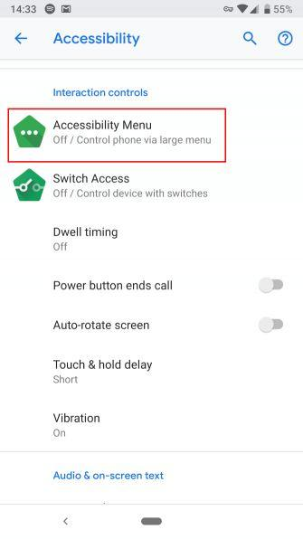

**8.更轻松的文本选择**

由于在选择模式中改进了的、响应更快的把手，选择与文本交互变得更加容易。

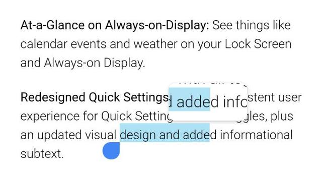

**9.新截图快捷方式**

告别默认的Power+ Volume Down按钮组合，现在通过点击Power菜单中的图标可以随时获取屏幕截图。

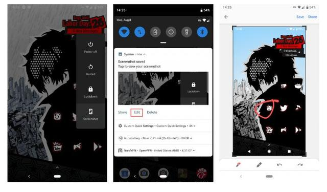

**10.一个新的Home按钮**

主按钮现在有一个更酷的图标，形状是水平对齐的药丸。这是Android有过的最酷的Home按钮。

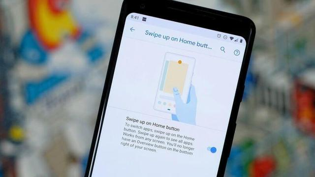

**11.新的手势导航**

和典型的back、home和recentbutton图标说再见吧，一起来使用支持手势导航的导航栏吧打，相信我，它也很容易使用。

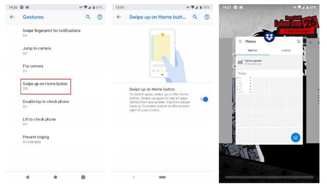

通过点击新的药丸形状的Home键回到主页。通过向上滑动主页按钮两次打开您的应用程序抽屉。要查看最近的应用程序，请向上滑动Home按钮。在这里，您可以与应用程序交互来选择和复制文本向上滑动以清除列表按住应用程序的图标来实现分屏要打开一个应用程序，向右滑动，按住Home键在应用程序之间滚动，然后就会打开中间的那个。如果要切换到以前的应用程序，请快速向右滑动并释放按住Home键可以打开谷歌助手。.如果你可以在任何应用程序中回到上一个屏幕，后退按钮就会出现。

**12.更容易的屏幕旋转**

在此之前，您只能使用自动旋转开关。现在，Android可以选择将屏幕旋转到横向模式，并在点击图标时回到纵向模式。

**13.通知信息**

在Settings> Apps & notifications > Notifications中，您可以看到最新的应用通知，以及最能向您发送令人分心的通知的应用。

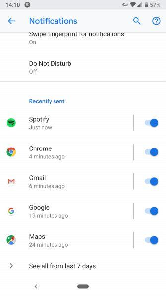

**14.仪表板**

Android的仪表板显示显示你花了多少时间使用手机，并通过以下方式将使用数据细分为更全面的部分:

一个饼图，表示每天花在应用程序上的时间解锁设备的次数您的通知总数您每天在设备上花费的小时数

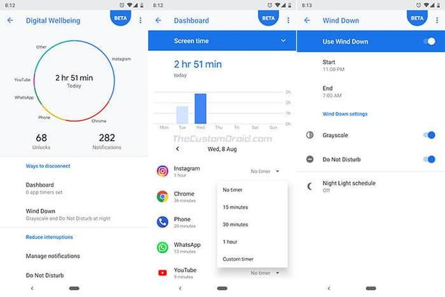

**15.通过Wi-FiRTT进行室内导航**

AndroidPie支持RTT（Round-Trip-Time）（即IEEE802.11mc WiFi协议），使用户可以使用室内GPS风格的导航，可以在连购物中心和电影院这样的建筑中导航。

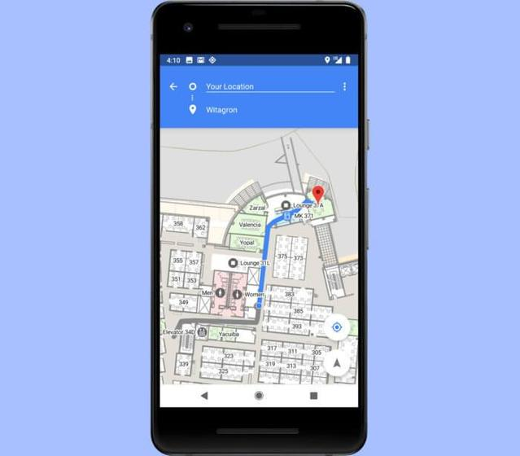

**16.改进的DND模式**

“请勿打扰”模式现在可以防止视觉中断，例如背景通知和频繁弹出窗口，您可以利用“Shush”模式完全消除手机的通知。

您需要做的就是将手机面朝下放置在任何表面上，DND将自动启用。

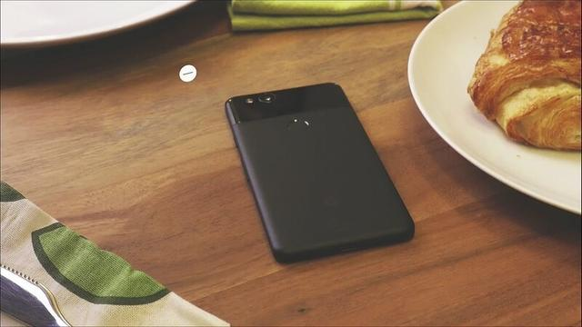

**17.锁定模式**

一个您可以从“电源”菜单切换的新选项：“锁定模式”，将禁用设备上的指纹解锁，你需要输入一个pin解锁你的设备。

如果一个不守规矩的人试图强迫你解锁你的设备，你可能会需要使用这个——你自己决定。

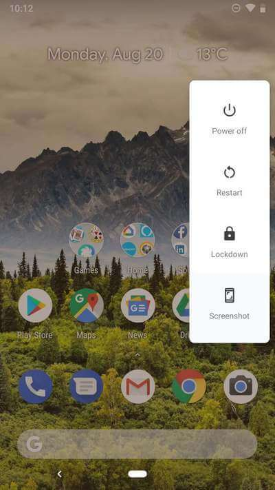

**18.改进的消息应用程序**

您现在可以在消息应用程序中查看图像，并使用smartreply使用notificationshade来回复邮件。此外，Android还会通过分析收到的消息来快速做出反应。

**19.所有应用都使用HTTPS**

这是对Android安全用户的肯定。AndroidPie上的所有应用程序默认都使用HTTPS。Android关心您的隐私。

**20.媒体面板**

由于音量控制专用于振铃器音量，Android的媒体设置现在将在屏幕右侧垂直对齐的滑块中显示音量控制，并且同一媒体面板为连接到您的Android手机的所有设备显示不同的音量控制设置。

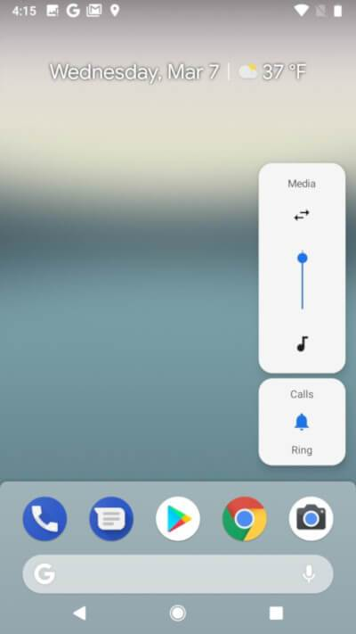

**21.ART的改进**

在不需要被告知的情况下，AndroidPie会对其AndroidRuntime进行重大更改，从而提高其效率和性能，从而为您提供愉快的用户体验。

**22.157个新的Emojis表情**

157是一个很大的数字，包括美洲驼、冷脸、热脸、芒果果、滑板等。谷歌严格遵守其Unicode标准，去掉了中性字符。

**23.WindDown**

WindDown是一项新功能，它可以在你选择的就寝时间自动打开夜灯和DND模式，让你更容易入睡。

**24.多摄像头支持**

使用AndroidPie，开发人员可以使用多摄像头API同时访问来自2个物理摄像头的流。只要您的手机使用双后置摄像头或双前置摄像头，您就可以开始使用了。

**25.Wi-Fi MAC随机化**

Wi-FiMAC随机化功能的工作原理是，每次连接到新的Wi-Fi网络时，都会为设备随机分配新的MAC地址。这是第9版Android隐私和安全功能的众多改进之一。

AndroidPie还有许多其他功能，包括：

日历事件和天气信息显示在锁定屏幕上Settings> Apps & notifications > Notifications来查看给你发送最多通知的应用音量按钮仅调整媒体音量一次最多可连接5个蓝牙设备更清晰的表情符号字符改进的文字放大镜Notch支持后台应用程序无法访问相机和麦克风