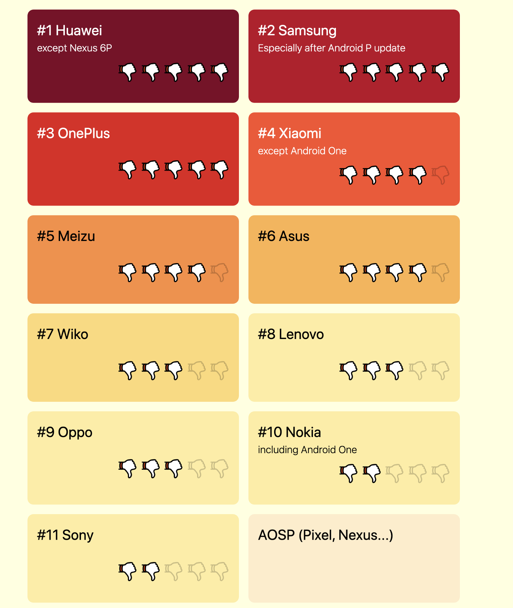

<h1 align="center">Don't kill my app!</h1>


## 1. foreground service



permission：

```java
private static final Intent[] POWERMANAGER_INTENTS = {
    new Intent().setComponent(new ComponentName("com.miui.securitycenter", "com.miui.permcenter.autostart.AutoStartManagementActivity")),
    new Intent().setComponent(new ComponentName("com.letv.android.letvsafe", "com.letv.android.letvsafe.AutobootManageActivity")),
    new Intent().setComponent(new ComponentName("com.huawei.systemmanager", "com.huawei.systemmanager.startupmgr.ui.StartupNormalAppListActivity")),
    new Intent().setComponent(new ComponentName("com.huawei.systemmanager", "com.huawei.systemmanager.optimize.process.ProtectActivity")),
    new Intent().setComponent(new ComponentName("com.huawei.systemmanager", "com.huawei.systemmanager.appcontrol.activity.StartupAppControlActivity")),
    new Intent().setComponent(new ComponentName("com.coloros.safecenter", "com.coloros.safecenter.permission.startup.StartupAppListActivity")),
    new Intent().setComponent(new ComponentName("com.coloros.safecenter", "com.coloros.safecenter.startupapp.StartupAppListActivity")),
    new Intent().setComponent(new ComponentName("com.oppo.safe", "com.oppo.safe.permission.startup.StartupAppListActivity")),
    new Intent().setComponent(new ComponentName("com.iqoo.secure", "com.iqoo.secure.ui.phoneoptimize.AddWhiteListActivity")),
    new Intent().setComponent(new ComponentName("com.iqoo.secure", "com.iqoo.secure.ui.phoneoptimize.BgStartUpManager")),
    new Intent().setComponent(new ComponentName("com.vivo.permissionmanager", "com.vivo.permissionmanager.activity.BgStartUpManagerActivity")),
    new Intent().setComponent(new ComponentName("com.samsung.android.lool", "com.samsung.android.sm.ui.battery.BatteryActivity")),
    new Intent().setComponent(new ComponentName("com.htc.pitroad", "com.htc.pitroad.landingpage.activity.LandingPageActivity")),
    new Intent().setComponent(new ComponentName("com.asus.mobilemanager", "com.asus.mobilemanager.MainActivity"))
};


for (Intent intent : POWERMANAGER_INTENTS)
    if (getPackageManager().resolveActivity(intent, PackageManager.MATCH_DEFAULT_ONLY) != null) {
            // show dialog to ask user action
        break;
}
```


