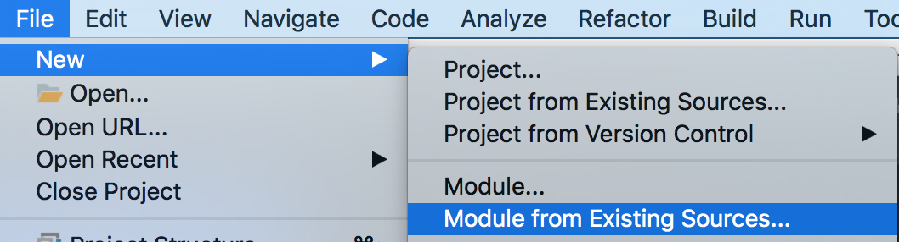
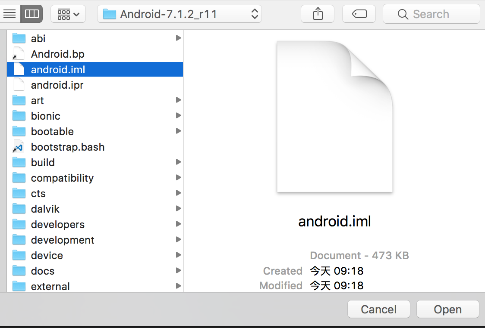
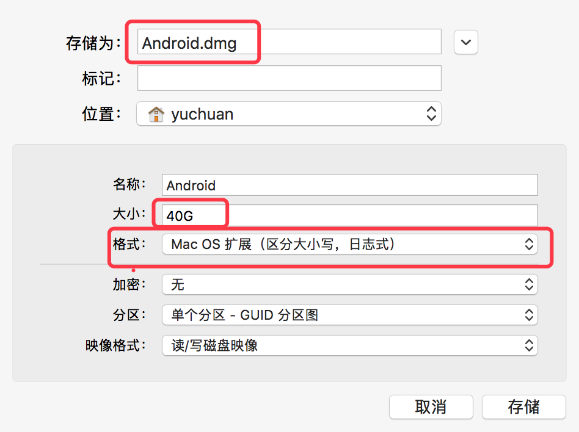

<h1 align="center">Android系统源码下载编译</h1>
## 1.切换源码分支(切换到android-7.1.2_r11版本)
```
repo init -b android-7.1.2_r11

## 如果不能连接google源码可以先切换到下面地址：
repo init -u https://aosp.tuna.tsinghua.edu.cn//platform/manifest -b android-10.0.0_r9

然后：
repo init -b android-10.0.0_r9
```

同步代码：

```
repo sync
```

查看源码分支：

```
build\core\version_defaults.mk //搜索该文件中的 PLATFORM_VERSION值
```

查看分支：

```
cd .repo/manifests
git branch -a | cut -d / -f 3
```

AOSP代号、标记和细分版本号

```
https://source.android.google.cn/setup/start/build-numbers.html#source-code-tags-and-builds
```


## 2.Idea导入源码方法：

>本教程基于Mac OS X 10.12。Android系统版本为：7.1.2_r11(7.1.2最终版)。先介绍方法，后面会给出各种问题解决方案。

#### 生成导入idea或者eclipse需要的文件：

* 1.首先是idea和eclipse导入项目需要的文件

```
.classpath (Eclipse)
android.ipr (IntelliJ / Android Studio)
android.iml (IntelliJ / Android Studio)
```

* 1.修改MacOS sdk 版本：

路径Android-7.1.2_r11/build/core/combo/mac_version.mk，加上你现在系统的版本：

 ```
 mac_sdk_versions_supported :=  10.8 10.9 10.10 10.11 10.12
 ```
* 2.生成idegen.jar过程：

命令：

```
$ source build/envsetup.sh
```
执行结果：

```
including device/asus/fugu/vendorsetup.sh
including device/generic/mini-emulator-arm64/vendorsetup.sh
including device/generic/mini-emulator-armv7-a-neon/vendorsetup.sh
including device/generic/mini-emulator-mips/vendorsetup.sh
including device/generic/mini-emulator-mips64/vendorsetup.sh
including device/generic/mini-emulator-x86/vendorsetup.sh
including device/generic/mini-emulator-x86_64/vendorsetup.sh
including device/google/dragon/vendorsetup.sh
including device/google/marlin/vendorsetup.sh
including device/htc/flounder/vendorsetup.sh
including device/huawei/angler/vendorsetup.sh
including device/lge/bullhead/vendorsetup.sh
including device/linaro/hikey/vendorsetup.sh
including device/moto/shamu/vendorsetup.sh
including sdk/bash_completion/adb.bash
```

命令：

```
$ mmm development/tools/idegen
```

执行结果：

```
...
date: 1496452336: No such file or directory
Starting build with ninja
ninja: Entering directory `.'
[ 25% 1/4] host Java: idegen (out/host/com...VA_LIBRARIES/idegen_intermediates/classes)
注: 某些输入文件使用或覆盖了已过时的 API。
注: 有关详细信息, 请使用 -Xlint:deprecation 重新编译。
[100% 4/4] Install: out/host/darwin-x86/framework/idegen.jar

#### make completed successfully (18 seconds) ####
```

命令：

```
$ development/tools/idegen/idegen.sh
```

执行结果：

```
bash-3.2$ development/tools/idegen/idegen.sh
Read excludes: 4ms
Traversed tree: 44148ms
```

此时会在根目录生成两个文件：android.ipr和android.iml，然后打开idea软件，执行下面操作：

接着打开如下界面，找到Android源码位置，然后找到生成的android.iml文件，鼠标选中，然后点击open即可。



注：mmm命令要先执行第一条命令。

#### 生成文件出现的问题：

* 1.在执行

```
$ source build/envsetup.sh
```

命令时会遇到下面问题：

```
build/envsetup.sh:630: command not found: complete
WARNING: Only bash is supported, use of other shell would lead to erroneous results
```

警告需要再bash下执行命令，我用的是zsh，临时切换回bash,直接输入bash：

```
$ bash
```

如果不切换回bash输入

```
$ mmm development/tools/idegen
```

命令则会报下面错误：

```
Couldn't locate the directory development/tools/idegen
```

* 2.由于生成该文件需要MacOS SDK，所以需要安装Xcode,最新版Xcode里面的sdk是10.12（与最新系统一样），而在Android源码里面最高到10.11，所以不支持，需要修改源码中的对sdk的支持：

打开路径Android-7.1.2_r11/build/core/combo/mac_version.mk，加上你现在系统的版本：

```
mac_sdk_versions_supported :=  10.8 10.9 10.10 10.11 10.12
```

其实这个方法也不能解决，因为后面的编译中还是不支持10.12，由于对里面不熟，所以采用了另一个方法，在Xcode中添加sdk，见下面方法。

* 3.问题：不支持Mac OS X 10.12，添加sdk

```
system/core/libcutils/threads.c:38:10: error: 'syscall' is deprecated: first deprecated in OS X 10.12 - syscall(2) is unsupported; please switch to a supported interface. For SYS_kdebug_trace use kdebug_signpost(). [-Werror,-Wdeprecated-declarations]
  return syscall(SYS_thread_selfid);
         ^
/Applications/Xcode.app/Contents/Developer/Platforms/MacOSX.platform/Developer/SDKs/MacOSX10.12.sdk/usr/include/unistd.h:733:6: note: 'syscall' has been explicitly marked deprecated here
int      syscall(int, ...);
         ^
1 error generated.
ninja: build stopped: subcommand failed.
make: *** [ninja_wrapper] Error 1
```
解决办法：

```
Here is how I fixed it:

Download earlier Mac OSX SDK(10.11 worked for me) from
https://github.com/phracker/MacOSX-SDKs/releases
Unzip and copy to /Applications/XCode.app/Contents/Developer/Platforms/MacOSX.platform/Developer/SDKs
```

* 4.Mac默认系统不区分大小问题：

报错：

```
Checking build tools versions...
build/core/main.mk:90: ************************************************************
build/core/main.mk:91: You are building on a case-insensitive filesystem.
build/core/main.mk:92: Please move your source tree to a case-sensitive filesystem.
build/core/main.mk:93: ************************************************************
build/core/main.mk:94: *** Case-insensitive filesystems not supported. Stop.
```

此时你可以建一个磁盘镜像，步骤如下：
打开磁盘工具-->文件-->新建映像-->空白映像-->弹出如下界面，填写下面框内的信息，格式选择区分大小写格式，点击存储，然后会在你的位置文件夹内生成一个Android.dmg文件，双击即可安装，然后将Android源码考入即可操作。



## 3.Android系统源码分支
| 大版本 | 起始版本号 | 终止版本号 | 名称 |
| --------   | :-----  | :----  | :----: |
|  |  |  |  |
|  |  |  |  |
| android-8.1.0 | android-8.1.0_r1 | android-8.1.0_r23 | Oreo |
| android-8.0.0 | android-8.0.0_r1 | android-8.0.0_r36 | Oreo |
| android-7.1.2 | android-7.1.2_r1 | android-7.1.2_r36 | Nougat |
| android-7.1.1 | android-7.1.1_r1 | android-7.1.1_r58 | Nougat |
| android-7.1.0 | android-7.1.0_r1 | android-7.1.0_r7 | Nougat |
| android-7.0.0 | android-7.0.0_r1 | android-7.0.0_r35 | Nougat |
| android-6.0.1 | android-6.0.1_r1 | android-6.0.1_r81 | Marshmallow |
| android-6.0.0 | android-6.0.0_r1 | android-6.0.0_r41 | Marshmallow |
| android-5.1.1 | android-5.1.1_r1 | android-5.1.1_r38 | Lollipop |
| android-5.1.0 | android-5.1.0_r1 | android-5.1.0_r5 | Lollipop |
| android-5.0.0 | android-5.0.0_r1.0.1 | android-5.0.2_r3 | Lollipop |
| android-4.4 | android-4.4_r1 | android-4.4.4_r2 | KitKat |
| android-4.1.1 | android-4.1.1_r1 | android-4.3.1_r1 | Jelly Bean |
| android-4.0.1 | android-4.0.1_r1 | android-4.0.4_r2.1 | Ice Cream Sandwich |
| android-2.3 | android-2.3_r1 | android-2.3.7_r1 | Gingerbread |
| android-2.2 | android-2.2_r1 | android-2.2.3_r2 | Froyo |
| android-2.1 | android-2.1_r1 | android-2.1_r2.1p2| Eclair |
| android-2.0 | android-2.0_r1 | android-2.0_r1 | Eclair |
| android-1.6 | android-1.6_r1.2 | android-1.6_r1.5 | Donut |


## 4.studio源码

```
$ mkdir studio-master-dev
$ cd studio-master-dev
$ repo init -u https://android.googlesource.com/platform/manifest -b studio-master-dev
$ repo sync
// 或者
$ repo init -u https://android.googlesource.com/platform/manifest -b studio-3.1.2
```
