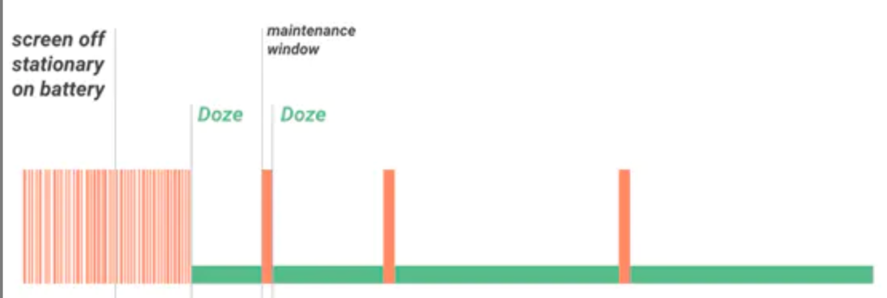
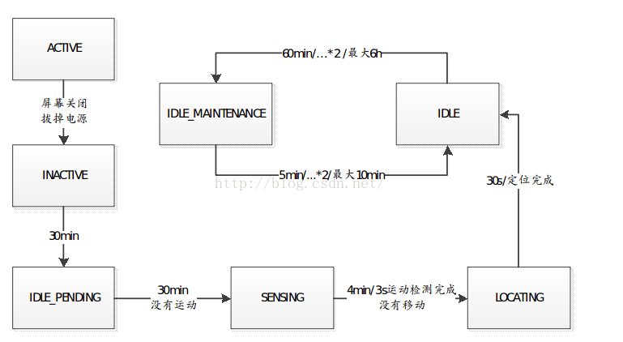
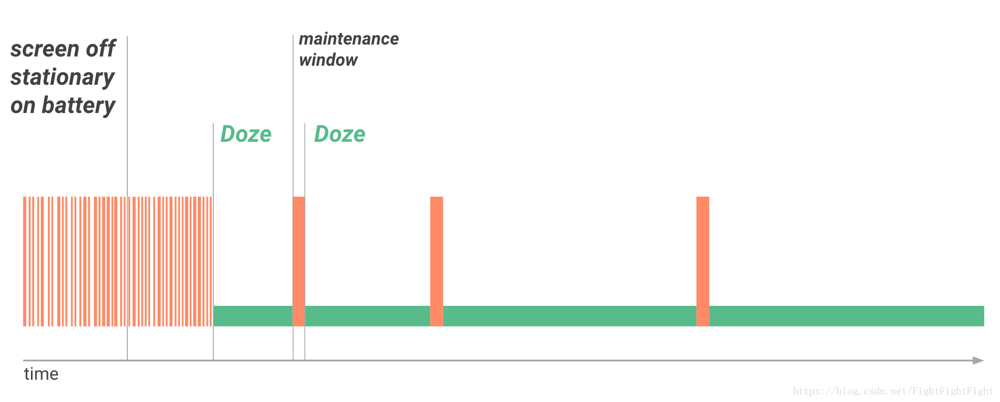

<h1 align="center">doze模式</h1>

[toc]

## Doze模式简介

* Doze机制在于节省系统耗电量，保护电池，延长电池的使用时间。当设备未连接至电源，且长时 间处于闲置状态时，系统会将应用进入Doze，置于 App Standby 模式。而最终的效果，能提升 30%的电量续航能力。
* doze 模式google导入的android 版本： Android 6.0 之后开始导入。 doze 模式的状态
* 在屏幕熄灭30分钟、没有晃动并且在不充电的时候，会进入Doze模式 在进入Doze模式后，每间隔一段时间，会进入一段时长为30s的 maintenance window 口期，可以唤醒系统，进行网络交互等等 进入Doze模式后，如果没有退出的话，系统唤醒的间隔时长会越来越长的窗
* doze 模式之后耗电的情况



* 当系统处于Doze模式下，系统和白名单之外的应用将受到以下限制：
   * 无法访问网络
   * Wake Locks被忽略 
   * AlarmManager闹铃会被推迟到下一个maintenance window响应
      * 使用 setAndAllowWhileIdle 或 SetExactAndAllowWhileIdle 设置闹铃的闹钟则不会受到Doze模式的影响
      * setAlarmClock`设置的闹铃在Doze模式下仍然生效，但系统会在闹铃生效前退出Doze 系统不执行Wi-Fi/GPS扫描； 系统不允许同步适配器运行； 系统不允许JobScheduler运行；

* 而位于白名单中的应用可以：
   * 继续使用网络并保留部分wake lock 
   * Job和同步仍然会被推迟 
   * 常规的AlarmManager闹铃也不会被触发

* doze 模式的几种状态交互




## Android10 Doze模式代码业务逻辑

### 概述

Doze模式，官方翻译为低电耗模式，是Andoriod6.0增加的一项系统服务，主要目的是为了优化电池性 能，增加电池续航时间，Doze模式又分两种模式：深度Doze模式(Deep Doze)和轻度Doze模式(Light Doze)，如果用户长时间没有主动使用其设备，处于静止状态且屏幕已关闭，则系统会使设备进入Doze 模式，也就是深度Doze模式。如果用户关闭设备屏幕但仍处于移动状态时，则设备进入轻度Doze模 式，此外，轻度Doze模式只适合Android7.0及以上版本。

当用户长时间未使用设备时，设备进入Doze模式，Doze模式会延迟应用后台 CPU 和网络活动，从而延 长电池续航时间。处于Doze模式的设备会定期进入维护时段，在此期间，应用可以完成待进行的活 动。然后，Doze模式会使设备重新进入较长时间的休眠状态，接着进入下一个维护时段。在达到几个 小时的休眠时间上限之前，平台会周而复始地重复Doze模式休眠/维护的序列，且每一次都会延长Doze 模式时长。处于Doze模式的设备始终可以感知到动作，且会在检测到动作时立即退出Doze模式。整个 Doze图示如下：



Deep Doze 和Light Doze模式对比如下：

| 操 作       | 低电耗模式                                                   | 轻度低电耗模式                                               |
| ----------- | ------------------------------------------------------------ | ------------------------------------------------------------ |
| 触 发 因 素 | 屏幕关闭、电池供电、静止                                     | 屏幕关闭、电池供电（未插电）                                 |
| 时 间       | 随维护时段依次增加                                           | 随维护时段反复持续 N 分钟                                    |
| 限 制       | 无法进行网络访问、唤醒锁忽略、 GPS/WLAN无法扫描、闹钟和 SyncAdapter/JobScheduler被延迟。 | 无法进行网络访问、 SyncAdapter/JobScheduler                  |
| 行为        | 仅接收优先级较高的推送通知消息。 低电耗模式                  | 接收所有实时消息（即时消息、来电等）。优先级较高的推送通知消息可以暂时访问网络。 |
| 操作        | 低电耗模式                                                   | 轻度低电耗模式                                               |
| 退 出       | 设备有移动、和用户有交互、屏幕开启、闹钟 响铃                | 屏幕开启。                                                   |
|             |                                                              |                                                              |

接下来就分析Doze的实现原理。Doze模式是通过DeviceIdleController来实现的。

### 1.DeviceIdleController的启动流程

DeviceIdleController(以下简称DIC)继承于SystemService，因此也是一个系统服务，在分析PMS的时 候说过，继承于SytemService的服务启动有以下几个共同点：

* 1.1. 在SystemServer中实例化并启动，启动时会执行SytemService的生命周期方法: Constructor()->onStart()->onBootPhase() ；
* 2.内部维护一个Binder和其他服务进行IPC通讯；
* 3.内部维护一个Internal类用于和System进程进行交互； 下面就从SystemServer开始分析DIC的启动流程。 在SystemServer启动其他服务时启动DIC：

```java
private void startOtherServices() { 
	.............
	mSystemServiceManager.startService(DeviceIdleController.class);
    ............
}
```

在SystemServiceManager中，通过反射的方式获取了DIC对象，并且调用了onStart()方法：

```java
public <T extends SystemService> T startService(Class<T> serviceClass) {
    try {
        ....................
		final String name = serviceClass.getName();
        Slog.i(TAG, "Starting " + name);
        final T service;
        try {
            //通过反射获取实例
            Constructor<T> constructor = serviceClass.getConstructor(Context.class);
            service = constructor.newInstance(mContext);
        } catch (InstantiationException ex) {
        }
        //调用同名重载方法
        startService(service);
        return service;
	} ....................
}
```

执行到这里，DIC的启动就开始了，再来看看最后一个生命周期方法`onBootPhase()`的调用，这个方法表示启动服务的过程，在SystemServer中会调用多次，从而在不同的启动阶段完成不同的工作，代码 如下：

```java
private void startOtherServices() {
	.............
	mSystemServiceManager.startBootPhase(SystemService. PHASE_LOCK_SETTINGS_READY);
    .............
        mSystemServiceManager.startBootPhase(SystemService. PHASE_SYSTEM_SERVICES_READY);
    .............	mSystemServiceManager.startBootPhase(SystemService.PHASE_ACTIVITY_MANAGER_READY); 	.............
	mSystemServiceManager.startBootPhase( 	SystemService.PHASE_THIRD_PARTY_APPS_CAN_START);
    .............
}
```

在SystemServiceManager中的`startBootPhase()`方法中，遍历已启动的服务列表，调用onBootPhase()：

```java
public void startBootPhase(final int phase) {
    if (phase <= mCurrentPhase) {
        throw new IllegalArgumentException("Next phase must be larger than previous");
	}
	mCurrentPhase = phase;
	Slog.i(TAG, "Starting phase " + mCurrentPhase);		
	try {
		for (int i = 0; i < serviceLen; i++) {
            final SystemService service = mServices.get(i);
            long time = SystemClock.elapsedRealtime();
            try {
                //调用每个service的onBootPhase() 
                service.onBootPhase(mCurrentPhase);
            } catch (Exception ex) {
            }
		}
	}
}
```

当这个方法执行完毕后，DIC的启动就完成了，下面我们看看DIC的生命周期方法中做了什么。首先看其 构造方法：

```java
public DeviceIdleController(Context context) {
	super(context);
	//创建可以执行原子操作的文件,/data/system/deviceidle.xml
    mConfigFile = new AtomicFile(new File(getSystemDir(), "deviceidle.xml"));
    //创建Handler,和BackgroundThread的Looper进行绑定
    mHandler = new MyHandler(BackgroundThread.getHandler().getLooper());
}
```

### 2.DeviceIdleController触发的时机

首先，只有在SystemServer中启动阶段为 PHASE_SYSTEM_SERVICE_READY 时，才会进入到 onBootPhase() 方法，也就是说，DIC的onBootPhase()方法在到达这一启动阶段时才执行。在 onBootPhase()方法中，获取了一些系统服务管理类和用于System进程的本地服务，如 AlarmManager、PowerManagerInternal等，用于和它们对应的系统服务进行交互； 其次获取一个Sensor，具体获取哪种类型的Sensor根据判断条件而定；接下来获取了一个 AnyMotionDector对象，该对象用来检测设备是否处于禁止状态；然后注册了四种广播的监听，分别 是：

* 1.电源状态发生改变时的广播： Intent.ACTION_BATTERY_CHANGED ,由BatteryService中发送。
* 2.卸载应用时的广播： Intent.ACTION_PACKAGE_REMOVED ，由PKMS发送；
* 3.网络连接状态改变时的广播： ConnectivityManager.CONNECTIVITY_ACTION ；
*  4亮灭屏时的广播： Intent.SCREEN_ON/SCREEN_OFF ，由PMS相关的Notifier发送；

最后，调用了一个用于更新交互状态的 updateInteractivityLocked() 方法和用于更新网络状态的 updateConnectivityState() 方法。先看看 updateInteractivityLocked() 方法：

```java
void updateInteractivityLocked() {
    // The interactivity state from the power manager tells us whether the display is 
    // in a state that we need to keep things running so they will update at a normal 
    // frequency.
	//获取设备是否处于交互状态
    boolean screenOn = mPowerManager.isInteractive();
    if (DEBUG) Slog.d(TAG, "updateInteractivityLocked: screenOn=" + screenOn);
    //表示当前不处于交互状态且上次处于交互状态
    if (!screenOn && mScreenOn) {
        mScreenOn = false;
        if (!mForceIdle) {
            //是否强制进入Idle
            //进入Idle模式的入口方法
            becomeInactiveIfAppropriateLocked();
        }
    } else if (screenOn) {
        mScreenOn = true;
        if (!mForceIdle) {
            //退出Idle模式
            becomeActiveLocked("screen", Process.myUid());
        }
	}
}
```

### 3.DeviceIdleController 的状态切换

Light mode 的7中状态

```java
/** Device is currently active. */ 
private static final int LIGHT_STATE_ACTIVE = 0; 
/** Device is inactive (screen off) and we are waiting to for the first light idle. */ 
private static final int LIGHT_STATE_INACTIVE = 1;
/** Device is about to go idle for the first time, wait for current work to complete. */ 
private static final int LIGHT_STATE_PRE_IDLE = 3; 
/** Device is in the light idle state, trying to stay asleep as much as possible. */ 
private static final int LIGHT_STATE_IDLE = 4; 
/** Device is in the light idle state, we want to go in to idle maintenance but are * waiting for network connectivity before doing so. */ 
private static final int LIGHT_STATE_WAITING_FOR_NETWORK = 5; 
/** Device is in the light idle state, but temporarily out of idle to do regular maintenance. */ 
private static final int LIGHT_STATE_IDLE_MAINTENANCE = 6; 
/** Device light idle state is overriden, now applying deep doze state. */ 
private static final int LIGHT_STATE_OVERRIDE = 7;
```

dark mode 的6中状态

```java
/** Device is currently active. */ 
private static final int STATE_ACTIVE = 0; 
/** Device is inactive (screen off, no motion) and we are waiting to for idle. */ 
private static final int STATE_INACTIVE = 1; 
/** Device is past the initial inactive period, and waiting for the next idle period. */ 
private static final int STATE_IDLE_PENDING = 2; 
/** Device is currently sensing motion. */ 
private static final int STATE_SENSING = 3; 
/** Device is currently finding location (and may still be sensing). */ 
private static final int STATE_LOCATING = 4; 
/** Device is in the idle state, trying to stay asleep as much as possible. */ 
private static final int STATE_IDLE = 5; 
/** Device is in the idle state, but temporarily out of idle to do regular maintenance. */ 
private static final int STATE_IDLE_MAINTENANCE = 6;
```

分别对应拉起两个 Alarm定时策略任务

```java
   void becomeInactiveIfAppropriateLocked() {
        if (DEBUG) Slog.d(TAG, "becomeInactiveIfAppropriateLocked()");
        if ((!mScreenOn && !mCharging) || mForceIdle) {
            // Screen has turned off; we are now going to become inactive and start
            // waiting to see if we will ultimately go idle.
            if (mState == STATE_ACTIVE && mDeepEnabled) {
                mState = STATE_INACTIVE;
                if (DEBUG) Slog.d(TAG, "Moved from STATE_ACTIVE to STATE_INACTIVE");
                resetIdleManagementLocked();
                scheduleAlarmLocked(mInactiveTimeout, false);
                EventLogTags.writeDeviceIdle(mState, "no activity");
            }
            if (mLightState == LIGHT_STATE_ACTIVE && mLightEnabled) {
                mLightState = LIGHT_STATE_INACTIVE;
                if (DEBUG) Slog.d(TAG, "Moved from LIGHT_STATE_ACTIVE to LIGHT_STATE_INACTIVE");
                resetLightIdleManagementLocked();
                scheduleLightAlarmLocked(mConstants.LIGHT_IDLE_AFTER_INACTIVE_TIMEOUT);
                EventLogTags.writeDeviceIdleLight(mLightState, "no activity");
            }
        }
    }
```

从log中看light mode 状态的切换（待机半个小时抓的system log）


从log中看dark mode 状态的切换（待机半个小时抓的system log）


两种状态一起的运行的log情况如下：


从状态切换情况可以得出，light mode进入之后状态如下：

1->LIGHT_STATE_IDLE (4)->LIGHT_STATE_WAITING_FOR_NETWORK(5)>LIGHT_STATE_IDLE_MAINTENANCE(6)

->LIGHT_STATE_IDLE (4)->LIGHT_STATE_WAITING_FOR_NETWORK(5)>LIGHT_STATE_IDLE_MAINTENANCE(6)

->LIGHT_STATE_IDLE (4)->LIGHT_STATE_WAITING_FOR_NETWORK(5)>LIGHT_STATE_IDLE_MAINTENANCE(6)

............

直到进入Dark mode 的 STATE_IDLE_MAINTENANCE 状态之后结束Light mode

```java
void cancelLightAlarmLocked() {
    Slog.d(TAG,"penwel cancelLightAlarmLocked" + android.util.Log.getStackTraceString(new Throwable()));
    if (mNextLightAlarmTime != 0) {
        mNextLightAlarmTime = 0;
        mAlarmManager.cancel(mLightAlarmListener);
    }
}

void stepIdleStateLocked(String reason) {
    ..............................
    .............................
	case STATE_IDLE_MAINTENANCE:
		scheduleAlarmLocked(mNextIdleDelay, true);
    	if (DEBUG) Slog.d(TAG, "Moved to STATE_IDLE. Next alarm in " + mNextIdleDelay + " ms.");
    	mNextIdleDelay = (long)(mNextIdleDelay * mConstants.IDLE_FACTOR);
    	if (DEBUG)
            Slog.d(TAG, "Setting mNextIdleDelay = " + mNextIdleDelay);
    	mNextIdleDelay = Math.min(mNextIdleDelay, mConstants.MAX_IDLE_TIMEOUT); 		if (mNextIdleDelay < mConstants.IDLE_TIMEOUT) {
            mNextIdleDelay = mConstants.IDLE_TIMEOUT;
        }
    	mState = STATE_IDLE;
    	if (mLightState != LIGHT_STATE_OVERRIDE) {
            mLightState = LIGHT_STATE_OVERRIDE;
            cancelLightAlarmLocked();
        }
    	EventLogTags.writeDeviceIdle(mState, reason);
    	addEvent(EVENT_DEEP_IDLE, null);
    	mGoingIdleWakeLock.acquire(); 
    	mHandler.sendEmptyMessage(MSG_REPORT_IDLE_ON);
	
    ............................
	............................
}
```

Dark的状态切换如下 STATE_INACTIVE(1) -> STATE_IDLE_PENDING(2)->STATE_SENSING(3)->STATE_LOCATING(4)

->STATE_IDLE(5) ->STATE_IDLE_MAINTENANCE(6)

->STATE_IDLE(5) ->STATE_IDLE_MAINTENANCE(6)

->STATE_IDLE(5) ->STATE_IDLE_MAINTENANCE(6) .....................................................

### 4. 各个状态的切换时间点（light mode）：

备注：进行流程debug阶段需要把COMPRESS_TIME 设置为true，相当于压缩时间调试模式

```java
private static final boolean DEBUG = true ;//false; //打开log 
private static /*final*/ boolean COMPRESS_TIME = true; //mtk default false;
mSmallBatteryDevice = true ;//ActivityManager.isSmallBatteryDevice(); 
```

所有的时间参数配置代码如下：

```java
private void updateConstants() {
	synchronized (DeviceIdleController.this) {
        try {
            mParser.setString(Settings.Global.getString(mResolver,
			Settings.Global.DEVICE_IDLE_CONSTANTS));
        } catch (IllegalArgumentException e) {
			// Failed to parse the settings string, log this and move on
			// with defaults.
			Slog.e(TAG, "Bad device idle settings", e);
        }
		LIGHT_IDLE_AFTER_INACTIVE_TIMEOUT = mParser.getDurationMillis( KEY_LIGHT_IDLE_AFTER_INACTIVE_TIMEOUT, !COMPRESS_TIME ? 3 * 60 * 1000L : 15 * 1000L);
        LIGHT_PRE_IDLE_TIMEOUT = mParser.getDurationMillis(KEY_LIGHT_PRE_IDLE_TIMEOUT, !COMPRESS_TIME ? 3 * 60 * 1000L : 30 * 1000L);
        LIGHT_IDLE_TIMEOUT = mParser.getDurationMillis(KEY_LIGHT_IDLE_TIMEOUT, !COMPRESS_TIME ? 5 * 60 * 1000L : 15 * 1000L);
        LIGHT_IDLE_FACTOR = mParser.getFloat(KEY_LIGHT_IDLE_FACTOR, 2f); 
        LIGHT_IDLE_MAINTENANCE_MIN_BUDGET = mParser.getDurationMillis( KEY_LIGHT_IDLE_MAINTENANCE_MIN_BUDGET, !COMPRESS_TIME ? 1 * 60 * 1000L : 15 * 1000L);
        LIGHT_IDLE_MAINTENANCE_MAX_BUDGET = mParser.getDurationMillis( KEY_LIGHT_IDLE_MAINTENANCE_MAX_BUDGET, !COMPRESS_TIME ? 5 * 60 * 1000L : 30 * 1000L);
        MIN_LIGHT_MAINTENANCE_TIME = mParser.getDurationMillis( KEY_MIN_LIGHT_MAINTENANCE_TIME, !COMPRESS_TIME ? 5 * 1000L : 1 * 1000L); 
        MIN_DEEP_MAINTENANCE_TIME = mParser.getDurationMillis( KEY_MIN_DEEP_MAINTENANCE_TIME, !COMPRESS_TIME ? 30 * 1000L : 5 * 1000L); long inactiveTimeoutDefault = (mSmallBatteryDevice ? 15 : 30) * 60 * 1000L;
	//COMPRESS_TIME = true;
        LIGHT_MAX_IDLE_TIMEOUT = mParser.getDurationMillis(KEY_LIGHT_MAX_IDLE_TIMEOUT, !COMPRESS_TIME ? 15 * 60 * 1000L : 60 * 1000L);
        INACTIVE_TIMEOUT = mParser.getDurationMillis(KEY_INACTIVE_TIMEOUT, !COMPRESS_TIME ? inactiveTimeoutDefault: (inactiveTimeoutDefault / 10)); 
        SENSING_TIMEOUT = mParser.getDurationMillis(KEY_SENSING_TIMEOUT, !DEBUG ? 4 * 60 * 1000L : 60 * 1000L);
        LOCATING_TIMEOUT = mParser.getDurationMillis(KEY_LOCATING_TIMEOUT, !DEBUG ? 30 * 1000L : 15 * 1000L);
        LOCATION_ACCURACY = mParser.getFloat(KEY_LOCATION_ACCURACY, 20); 
        MOTION_INACTIVE_TIMEOUT = mParser.getDurationMillis(KEY_MOTION_INACTIVE_TIMEOUT, !COMPRESS_TIME ? 10 * 60 * 1000L : 60 * 1000L); long idleAfterInactiveTimeout = (mSmallBatteryDevice ? 15 : 30) * 60 * 1000L;
        IDLE_AFTER_INACTIVE_TIMEOUT = mParser.getDurationMillis( KEY_IDLE_AFTER_INACTIVE_TIMEOUT, !COMPRESS_TIME ? idleAfterInactiveTimeout : (idleAfterInactiveTimeout / 10));
        //COMPRESS_TIME = false; //penwel add
		//penwel add
		IDLE_PENDING_TIMEOUT = mParser.getDurationMillis(KEY_IDLE_PENDING_TIMEOUT,!COMPRESS_TIME ? 5 * 60 * 1000L : 30 * 1000L);
        MAX_IDLE_PENDING_TIMEOUT = mParser.getDurationMillis(KEY_MAX_IDLE_PENDING_TIMEOUT, !COMPRESS_TIME ? 10 * 60 * 1000L : 60 * 1000L);
        IDLE_PENDING_FACTOR = mParser.getFloat(KEY_IDLE_PENDING_FACTOR, 2f); IDLE_TIMEOUT = mParser.getDurationMillis(KEY_IDLE_TIMEOUT, !COMPRESS_TIME ? 60 * 60 * 1000L : 6 * 60 * 1000L);
        MAX_IDLE_TIMEOUT = mParser.getDurationMillis(KEY_MAX_IDLE_TIMEOUT, !COMPRESS_TIME ? 6 * 60 * 60 * 1000L : 30 * 60 * 1000L); IDLE_FACTOR = mParser.getFloat(KEY_IDLE_FACTOR, 2f);
        MIN_TIME_TO_ALARM = mParser.getDurationMillis(KEY_MIN_TIME_TO_ALARM, !COMPRESS_TIME ? 60 * 60 * 1000L : 6 * 60 * 1000L); 	
        MAX_TEMP_APP_WHITELIST_DURATION = mParser.getDurationMillis( KEY_MAX_TEMP_APP_WHITELIST_DURATION, 5 * 60 * 1000L); 
        MMS_TEMP_APP_WHITELIST_DURATION = mParser.getDurationMillis( KEY_MMS_TEMP_APP_WHITELIST_DURATION, 60 * 1000L);
        SMS_TEMP_APP_WHITELIST_DURATION = mParser.getDurationMillis( KEY_SMS_TEMP_APP_WHITELIST_DURATION, 20 * 1000L);
        NOTIFICATION_WHITELIST_DURATION = mParser.getDurationMillis( KEY_NOTIFICATION_WHITELIST_DURATION, 30 * 1000L); WAIT_FOR_UNLOCK = mParser.getBoolean(KEY_WAIT_FOR_UNLOCK,false);
	}
}
```

1.进入becomeInactiveIfAppropriateLocked之后15000毫秒（15秒 ) 

拉起Light mode 状态一（LIGHT_STATE_INACTIVE）。

 时间段：16:58:12.273-16:58:28.000

```java
//log begin weiliji
Line 107885: 08-04 16:57:18.740 1000 1041 1041 I SystemServer: StartDeviceIdleController
Line 107886: 08-04 16:57:18.741 1000 1041 1041 I SystemServiceManager: Starting com.android.server.DeviceIdleController
Line 107887: 08-04 16:57:18.743 1000 1041 1041 D DeviceIdleController: 
Reading config from /data/system/deviceidle.xml
Line 109707: 08-04 16:58:12.273 1000 1041 1041 D DeviceIdleController: Moved from LIGHT_STATE_ACTIVE to LIGHT_STATE_INACTIVE
Line 109749: 08-04 16:58:28.000 1000 1041 1041 stepLightIdleStateLocked: mLightState=1
//log end weiliji
//code begin weiliji 
void becomeInactiveIfAppropriateLocked() {
	if (DEBUG) Slog.d(TAG, "becomeInactiveIfAppropriateLocked()");
	if ((!mScreenOn && !mCharging) || mForceIdle) {
        // Screen has turned off; we are now going to become inactive and start 
        // waiting to see if we will ultimately go idle.
		if (mState == STATE_ACTIVE && mDeepEnabled) {
            mState = STATE_INACTIVE;
			if (DEBUG)
                Slog.d(TAG, "Moved from STATE_ACTIVE to STATE_INACTIVE"); 
            resetIdleManagementLocked();
            scheduleAlarmLocked(mInactiveTimeout, false); 
            EventLogTags.writeDeviceIdle(mState, "no activity");
        }
        if (mLightState == LIGHT_STATE_ACTIVE && mLightEnabled) {
            mLightState = LIGHT_STATE_INACTIVE;
            if (DEBUG)
                Slog.d(TAG, "Moved from LIGHT_STATE_ACTIVE to LIGHT_STATE_INACTIVE");
            resetLightIdleManagementLocked();
		scheduleLightAlarmLocked(mConstants.LIGHT_IDLE_AFTER_INACTIVE_TIMEOUT); 
            EventLogTags.writeDeviceIdleLight(mLightState, "no activity"); }
		}

	} //code end weiliji
	LIGHT_IDLE_AFTER_INACTIVE_TIMEOUT = mParser.getDurationMillis(KEY_LIGHT_IDLE_AFTER_INACTIVE_TIMEOUT, !COMPRESS_TIME ? 3 * 60 * 1000L : 15 * 1000L);
15000 = 15*1000；
```

2.状态一（LIGHT_STATE_INACTIVE）之后15000毫秒（15秒 )

切换为状态二（LIGHT_STATE_IDLE）。

 备注：LIGHT_STATE_INACTIVE 没有break，会执行到 LIGHT_STATE_PRE_IDLE、 LIGHT_STATE_IDLE_MAINTENANCE:

时间段：16:58:28.000 -16:58:43.002

```java
//log begin weiliji Line 181:
Line 109749: 08-04 16:58:28.000 1000 1041 1056 D DeviceIdleController: stepLightIdleStateLocked: mLightState=1
Line 217: Line 109796: 08-04 16:58:43.002 1000 1041 1056 D DeviceIdleController: stepLightIdleStateLocked: mLightState=4
//log end weiliji
//code begin weiliji

void stepLightIdleStateLocked(String reason) {
    if (mLightState == LIGHT_STATE_OVERRIDE) {
        // If we are already in deep device idle mode, then
        // there is nothing left to do for light mode. return; }
		if (DEBUG)
            Slog.d(TAG, "stepLightIdleStateLocked: mLightState=" + mLightState); 
        EventLogTags.writeDeviceIdleLightStep();
		switch (mLightState) {
			case LIGHT_STATE_INACTIVE:
				mCurIdleBudget = mConstants.LIGHT_IDLE_MAINTENANCE_MIN_BUDGET;
                // Reset the upcoming idle delays.
				mNextLightIdleDelay = mConstants.LIGHT_IDLE_TIMEOUT;
				mMaintenanceStartTime = 0;
                if (!isOpsInactiveLocked()) {
                    // We have some active ops going on...give them a chance
                    // to finish
					// before going in to our first idle.
					mLightState = LIGHT_STATE_PRE_IDLE; 
                    EventLogTags.writeDeviceIdleLight(mLightState, reason); 
                    scheduleLightAlarmLocked(mConstants.LIGHT_PRE_IDLE_TIMEOUT); 
                    break;
				} // Nothing active, fall through to immediately idle.
			case LIGHT_STATE_PRE_IDLE:
			case LIGHT_STATE_IDLE_MAINTENANCE:
				if (mMaintenanceStartTime != 0) {
                    long duration = SystemClock.elapsedRealtime() mMaintenanceStartTime;
                    if (duration < mConstants.LIGHT_IDLE_MAINTENANCE_MIN_BUDGET) {
                        // We didn't use up all of our minimum budget; add this to the reserve.
						mCurIdleBudget += (mConstants.LIGHT_IDLE_MAINTENANCE_MIN_BUDGET-duration);
                    } else {
                        // We used more than our minimum budget; this comes out of the reserve.
						mCurIdleBudget -= (durationmConstants.LIGHT_IDLE_MAINTENANCE_MIN_BUDGET);
                    }
                }
                mMaintenanceStartTime = 0; 
                scheduleLightAlarmLocked(mNextLightIdleDelay); 
                mNextLightIdleDelay = Math.min(mConstants.LIGHT_MAX_IDLE_TIMEOUT, (long)(mNextLightIdleDelay * mConstants.LIGHT_IDLE_FACTOR));
                if (mNextLightIdleDelay < mConstants.LIGHT_IDLE_TIMEOUT) { 
                    mNextLightIdleDelay = mConstants.LIGHT_IDLE_TIMEOUT;
                }
                if (DEBUG)
                    Slog.d(TAG, "Moved to LIGHT_STATE_IDLE.");
                mLightState = LIGHT_STATE_IDLE; 
                EventLogTags.writeDeviceIdleLight(mLightState, reason); 
                addEvent(EVENT_LIGHT_IDLE, null);
                mGoingIdleWakeLock.acquire(); 
                mHandler.sendEmptyMessage(MSG_REPORT_IDLE_ON_LIGHT);
                break;
                .............
				.............
			}
		} //weiliji code end
	LIGHT_IDLE_TIMEOUT = mParser.getDurationMillis(KEY_LIGHT_IDLE_TIMEOUT, !COMPRESS_TIME ? 5 * 60 * 1000L : 15 * 1000L);
    mNextLightIdleDelay = mConstants.LIGHT_IDLE_TIMEOUT;
	scheduleLightAlarmLocked(mNextLightIdleDelay);
    15000毫秒 = 15 *1000
```

3.状态二（LIGHT_STATE_IDLE）之后30000毫秒（30秒 )

切换为状态三（LIGHT_STATE_WAITING_FOR_NETWORK）。

时间段：16:58:43.002 -16:59:13.004

```java
//log begin weiliji Line 217: 
Line 109796: 08-04 16:58:43.002 1000 1041 1056 D DeviceIdleController: stepLightIdleStateLocked: mLightState=4 
Line 109807: 08-04 16:58:43.003 1000 1041 1056 D DeviceIdleController: Moved to LIGHT_WAITING_FOR_NETWORK.
Line 233: Line 109806: 08-04 16:58:43.002 1000 1041 1056 D DeviceIdleController: scheduleLightAlarmLocked(30000) 
Line 109807: 08-04 16:58:43.003 1000 1041 1056 D DeviceIdleController: Moved to LIGHT_WAITING_FOR_NETWORK.
Line 109878: 08-04 16:59:13.004 1000 1041 1056 D DeviceIdleController: stepLightIdleStateLocked: mLightState=5 
//log end weiliji
//code end weiliji 
void stepLightIdleStateLocked(String reason) {
	..............
	..............
	case LIGHT_STATE_IDLE:
	case LIGHT_STATE_WAITING_FOR_NETWORK:
		if (mNetworkConnected || mLightState == LIGHT_STATE_WAITING_FOR_NETWORK) {
            // We have been idling long enough, now it is time to do some work.
			mActiveIdleOpCount = 1;
            mActiveIdleWakeLock.acquire();
            mMaintenanceStartTime = SystemClock.elapsedRealtime(); 
            if (mCurIdleBudget < mConstants.LIGHT_IDLE_MAINTENANCE_MIN_BUDGET) { 
                mCurIdleBudget = mConstants.LIGHT_IDLE_MAINTENANCE_MIN_BUDGET;
            } else if (mCurIdleBudget > mConstants.LIGHT_IDLE_MAINTENANCE_MAX_BUDGET) {
                mCurIdleBudget = mConstants.LIGHT_IDLE_MAINTENANCE_MAX_BUDGET;
            }
            scheduleLightAlarmLocked(mCurIdleBudget);
            if (DEBUG)
                Slog.d(TAG, "Moved from LIGHT_STATE_IDLE to LIGHT_STATE_IDLE_MAINTENANCE."); 
            mLightState = LIGHT_STATE_IDLE_MAINTENANCE; 
            EventLogTags.writeDeviceIdleLight(mLightState, reason); 
            addEvent(EVENT_LIGHT_MAINTENANCE, null); 
            mHandler.sendEmptyMessage(MSG_REPORT_IDLE_OFF);
        } else { 
            // We'd like to do maintenance, but currently don't have network
			// connectivity... let's try to wait until the network comes back.
			// We'll only wait for another full idle period, however,and then give up.
			scheduleLightAlarmLocked(mNextLightIdleDelay);
			if (DEBUG) 
                Slog.d(TAG, "Moved to LIGHT_WAITING_FOR_NETWORK."); 
            mLightState = LIGHT_STATE_WAITING_FOR_NETWORK; 
            EventLogTags.writeDeviceIdleLight(mLightState, reason);
        }
    break;
	..............
	..............
}
//code end weiliji
scheduleLightAlarmLocked(mNextLightIdleDelay);
mNextLightIdleDelay = Math.min(mConstants.LIGHT_MAX_IDLE_TIMEOUT, (long)(mNextLightIdleDelay * mConstants.LIGHT_IDLE_FACTOR));
if (mNextLightIdleDelay < mConstants.LIGHT_IDLE_TIMEOUT) {
    mNextLightIdleDelay = mConstants.LIGHT_IDLE_TIMEOUT;
}
LIGHT_IDLE_TIMEOUT = mParser.getDurationMillis(KEY_LIGHT_IDLE_TIMEOUT, !COMPRESS_TIME ? 5 * 60 * 1000L : 15 * 1000L);
30000毫秒 = mNextLightIdleDelay = mNextLightIdleDelay * mConstants.LIGHT_IDLE_FACTOR) = 15*1000*2
```

4.状态三（LIGHT_STATE_WAITING_FOR_NETWORK）之后15000毫秒（15秒 ) 

切换为状态四（LIGHT_STATE_IDLE_MAINTENANCE）。 

备注：LIGHT_STATE_INACTIVE 没有break，会执行到 LIGHT_STATE_PRE_IDLE、 LIGHT_STATE_IDLE_MAINTENANCE:

时间段：16:59:13.004-

```java
Line 109878: 08-04 16:59:13.004 1000 1041 1056 D DeviceIdleController: stepLightIdleStateLocked: mLightState=5 
Line 109888: 08-04 16:59:13.004 1000 1041 1056 D DeviceIdleController: scheduleLightAlarmLocked(15000)
```

5.之后就是 ->LIGHT_STATE_IDLE

->LIGHT_STATE_WAITING_FOR_NETWORK

->LIGHT_STATE_IDLE_MAINTENANCE 状态的循环。

### 5. 各个状态的切换时间点（dark mode）：

1.进入becomeInactiveIfAppropriateLocked之后90000毫秒（1.5分钟) 拉起Dark mode 状态一（STATE_INACTIVE）。

时间段：16:58:12.269-16:59:42.272

```java
//log begin weiliji 
Line 107885: 08-04 16:57:18.740 1000 1041 1041 I SystemServer: StartDeviceIdleController 
Line 107886: 08-04 16:57:18.741 1000 1041 1041 I SystemServiceManager: Starting com.android.server.DeviceIdleController 
Line 107887: 08-04 16:57:18.743 1000 1041 1041 D DeviceIdleController: Reading config from /data/system/deviceidle.xml 
Line 107888: 08-04 16:57:18.744 1000 1041 1041 D DeviceIdleController: mInactiveTimeout 1=90000
Line 109641: 08-04 16:58:12.269 1000 1041 1041 D DeviceIdleController: Moved from STATE_ACTIVE to STATE_INACTIVE
Line 109943: 08-04 16:59:42.272 1000 1041 1056 D DeviceIdleController: stepIdleStateLocked: mState=1 ,reason = s:alarm //log end weiliji

//code begin weiliji
	public void onStart() {
    	final PackageManager pm = getContext().getPackageManager();
		synchronized (this) {
            ...................
			...................
			mInactiveTimeout = mConstants.INACTIVE_TIMEOUT; Slog.d(TAG, "mInactiveTimeout 1=" + mInactiveTimeout);
			...................
			...................
        }
	}

void becomeInactiveIfAppropriateLocked() {
    if (DEBUG)
        Slog.d(TAG, "becomeInactiveIfAppropriateLocked()");
    if ((!mScreenOn && !mCharging) || mForceIdle) {
        // Screen has turned off; we are now going to become inactive and start 
        // waiting to see if we will ultimately go idle.
		if (mState == STATE_ACTIVE && mDeepEnabled) {
            mState = STATE_INACTIVE;
            if (DEBUG) 
                Slog.d(TAG, "Moved from STATE_ACTIVE to STATE_INACTIVE"); 
            resetIdleManagementLocked();
            scheduleAlarmLocked(mInactiveTimeout, false); 
            EventLogTags.writeDeviceIdle(mState, "no activity");
        }
        if (mLightState == LIGHT_STATE_ACTIVE && mLightEnabled) {
            mLightState = LIGHT_STATE_INACTIVE;
            if (DEBUG)
                Slog.d(TAG, "Moved from LIGHT_STATE_ACTIVE to LIGHT_STATE_INACTIVE");
            resetLightIdleManagementLocked();
		scheduleLightAlarmLocked(mConstants.LIGHT_IDLE_AFTER_INACTIVE_TIMEOUT);
			EventLogTags.writeDeviceIdleLight(mLightState, "no activity"); } }
		}
		long inactiveTimeoutDefault = (mSmallBatteryDevice ? 15 : 30) * 60 * 1000L; INACTIVE_TIMEOUT = mParser.getDurationMillis(KEY_INACTIVE_TIMEOUT, !COMPRESS_TIME ? inactiveTimeoutDefault: (inactiveTimeoutDefault / 10)); //code end weiliji
	90000(mInactiveTimeout) = 15*60*1000/10
```

2.状态一（STATE_INACTIVE）之后90000毫秒（1.5分钟)

切换为状态二（STATE_IDLE_PENDING）。

时间段：16:59:42.272 -17:01:12.338

```java
//log begin weiliji 
Line 316: Line 109943: 08-04 16:59:42.272 1000 1041 1056 D DeviceIdleController: stepIdleStateLocked: mState=1 ,reason = s:alarm Line 435: 
Line 110045: 08-04 17:01:12.338 1000 1041 1056 D DeviceIdleController: stepIdleStateLocked: mState=2 ,reason = s:alarm //log end weiliji

//code begin weiliji 
void stepIdleStateLocked(String reason) {
    .............
	.............
	case STATE_INACTIVE:
		// We have now been inactive long enough, it is time to start looking 
    	// for motion and sleep some more while doing so. 
    	startMonitoringMotionLocked(); 
    	scheduleAlarmLocked(mConstants.IDLE_AFTER_INACTIVE_TIMEOUT, false);
    	// Reset the upcoming idle delays.
		mNextIdlePendingDelay = mConstants.IDLE_PENDING_TIMEOUT; 
    	mNextIdleDelay = mConstants.IDLE_TIMEOUT; 
    	mState = STATE_IDLE_PENDING; 
    	if (DEBUG) 
            Slog.d(TAG, "Moved from STATE_INACTIVE to STATE_IDLE_PENDING."); 
    	EventLogTags.writeDeviceIdle(mState, reason); break;
		.............
		.............
}
long idleAfterInactiveTimeout = (mSmallBatteryDevice ? 15 : 30) * 60 * 1000L; IDLE_AFTER_INACTIVE_TIMEOUT = mParser.getDurationMillis( KEY_IDLE_AFTER_INACTIVE_TIMEOUT, !COMPRESS_TIME ? idleAfterInactiveTimeout : (idleAfterInactiveTimeout / 10)); //code end weiliji
90000(IDLE_AFTER_INACTIVE_TIMEOUT) = 15*60*1000/10;
```

3.状态二（STATE_IDLE_PENDING）之后60000毫秒（1分钟) 切换为状态三（STATE_SENSING）。 时间段：17:01:12.338 - 17:02:12.300 (理论) 时间时间段：17:01:12.338 - 17:01:20.142 （时间8秒，reason = s:stationary，onAnyMotionResult 的回调） sensor回调自己的状态已经不动了，所以状态进入提前，没等到alrm的1分钟才行就已经进入 STATE_SENSING阶段。

```java
//log begin weiliji 
Line 435: Line 110045: 08-04 17:01:12.338 1000 1041 1056 D DeviceIdleController: stepIdleStateLocked: mState=2 ,reason = s:alarm 
Line 110046: 08-04 17:01:12.339 1000 1041 1056 D DeviceIdleController: Moved from STATE_IDLE_PENDING to STATE_SENSING.
Line 110047: 08-04 17:01:12.339 1000 1041 1056 D DeviceIdleController: scheduleSensingAlarmLocked(60000) 
Line 474: Line 110102: 08-04 17:01:20.142 1000 1041 1041 D DeviceIdleController: stepIdleStateLocked: mState=3 ,reason = s:stationary //log end weiliji

//code begin weiliji 
void stepIdleStateLocked(String reason) { 
    .............
	.............
	case STATE_IDLE_PENDING:
		mState = STATE_SENSING; 
    	if (DEBUG) 
            Slog.d(TAG, "Moved from STATE_IDLE_PENDING to STATE_SENSING."); 	
    	EventLogTags.writeDeviceIdle(mState, reason); 
    	scheduleSensingTimeoutAlarmLocked(mConstants.SENSING_TIMEOUT); 
    	cancelLocatingLocked(); 
    	mNotMoving = false; 
    	mLocated = false; 
    	mLastGenericLocation = null; 
    	mLastGpsLocation = null; 
    	mAnyMotionDetector.checkForAnyMotion();
.............
.............
}

public void onAnyMotionResult(int result) {
    if (DEBUG) 
        Slog.d(TAG, "onAnyMotionResult(" + result + ")"); 
    if (result != AnyMotionDetector.RESULT_UNKNOWN) { 
        synchronized (this) { 
            cancelSensingTimeoutAlarmLocked(); 
        }
    }
	if ((result == AnyMotionDetector.RESULT_MOVED) || (result == AnyMotionDetector.RESULT_UNKNOWN)) { 
        synchronized (this) { 
            handleMotionDetectedLocked(mConstants.INACTIVE_TIMEOUT, "non_stationary"); }
	} else if (result == AnyMotionDetector.RESULT_STATIONARY) {
		if (mState == STATE_SENSING) {
            // If we are currently sensing, it is time to move to locating. 
            synchronized (this) { 
                mNotMoving = true;
                stepIdleStateLocked("s:stationary"); 
            }
        } else if (mState == STATE_LOCATING) {
            // If we are currently locating, note that we are not moving and step
			// if we have located the position. 
            synchronized (this) {
                mNotMoving = true; 
                if (mLocated) { 
                    stepIdleStateLocked("s:stationary");
                }
            }
		}
	}
}

SENSING_TIMEOUT = mParser.getDurationMillis(KEY_SENSING_TIMEOUT, !DEBUG ? 4 * 60 * 1000L : 60 * 1000L);
//code end weiliji
60000 = 60* 1000
```

4.状态三（STATE_SENSING）之后15000毫秒（15秒)

切换为状态四（STATE_LOCATING）。

时间段：17:01:20.142 -17:01:35.143

```java
//log begin weiliji Line 474: 
Line 110102: 08-04 17:01:20.142 1000 1041 1041 D DeviceIdleController: stepIdleStateLocked: mState=3 ,reason = s:stationary 
Line 110117: 08-04 17:01:20.143 1000 1041 1041 D DeviceIdleController: Moved from STATE_SENSING to STATE_LOCATING.
Line 110118: 08-04 17:01:20.143 1000 1041 1041 D DeviceIdleController: scheduleAlarmLocked(15000, false) Line 517: 
Line 110144: 08-04 17:01:35.143 1000 1041 1056 D DeviceIdleController: stepIdleStateLocked: mState=4 ,reason = s:alarm //code end weiliji //code begin weiliji

void stepIdleStateLocked(String reason) {
	.............
	.............
	case STATE_SENSING:
		cancelSensingTimeoutAlarmLocked(); 
    	mState = STATE_LOCATING; 
    	if (DEBUG) 
            Slog.d(TAG, "Moved from STATE_SENSING to STATE_LOCATING."); 
    	EventLogTags.writeDeviceIdle(mState, reason); 
    	scheduleAlarmLocked(mConstants.LOCATING_TIMEOUT, false);
    	if (mLocationManager != null && mLocationManager.getProvider(LocationManager.NETWORK_PROVIDER) != null) {
			mLocationManager.requestLocationUpdates(mLocationRequest, mGenericLocationListener, mHandler.getLooper()); 
            mLocating = true; 
        } else {
            mHasNetworkLocation = false; 
        }
    	if (mLocationManager != null && mLocationManager.getProvider(LocationManager.GPS_PROVIDER) != null) { 
            mHasGps = true;
			mLocationManager.requestLocationUpdates(LocationManager.GPS_PROVIDER, 1000, 5, mGpsLocationListener, mHandler.getLooper());
            mLocating = true;
        } else {
            mHasGps = false; 
        } 
    // If we have a location provider, we're all set, the listeners will move state
	// forward.
		if (mLocating) {
            break;
        }
    	.............
        .............
	}

LOCATING_TIMEOUT = mParser.getDurationMillis(KEY_LOCATING_TIMEOUT, !DEBUG ? 30 * 1000L : 15 * 1000L);

15000 = 15*1000

//code end weiliji
```

5.状态四（STATE_LOCATING）之后30000毫秒（30秒) 切换为状态五（STATE_IDLE）。 时间段：17:01:35.143 - 17:02:03.334 备注：STATE_LOCATING的base没有break，即会把STATE_LOCATING、STATE_IDLE_MAINTENANCE 内容都执行 包含结束Light mode模式 所以此时为进入Battery History上正式进入进入Doze mode图形的时间：

```java
//log begin weiliji Line 517: 
Line 110144: 08-04 17:01:35.143 1000 1041 1056 D DeviceIdleController: stepIdleStateLocked: mState=4 ,reason = s:alarm
Line 598: Line 110212: 08-04 17:02:03.334 1000 1041 1056 D DeviceIdleController: stepIdleStateLocked: mState=5 ,reason = s:alarm //log end weiliji //code begin weiliji

void stepIdleStateLocked(String reason) {
    .............
	.............
	case STATE_LOCATING:
		cancelAlarmLocked();
    	cancelLocatingLocked(); 
    	mAnyMotionDetector.stop();
	case STATE_IDLE_MAINTENANCE:
		scheduleAlarmLocked(mNextIdleDelay, true);
    	if (DEBUG)
            Slog.d(TAG, "Moved to STATE_IDLE. Next alarm in " + mNextIdleDelay + " ms."); 
    	mNextIdleDelay = (long)(mNextIdleDelay * mConstants.IDLE_FACTOR); 
    	if (DEBUG) 
            Slog.d(TAG, "Setting mNextIdleDelay = " + mNextIdleDelay); 
    	mNextIdleDelay = Math.min(mNextIdleDelay, mConstants.MAX_IDLE_TIMEOUT); 		if (mNextIdleDelay < mConstants.IDLE_TIMEOUT) { 
            mNextIdleDelay = mConstants.IDLE_TIMEOUT; 
        } 
    	mState = STATE_IDLE; 
    	if (mLightState != LIGHT_STATE_OVERRIDE) {
            mLightState = LIGHT_STATE_OVERRIDE;
            cancelLightAlarmLocked();
        }
    	EventLogTags.writeDeviceIdle(mState, reason); 
    	addEvent(EVENT_DEEP_IDLE, null); 
    	mGoingIdleWakeLock.acquire(); 
    	mHandler.sendEmptyMessage(MSG_REPORT_IDLE_ON);
    	break;
    case STATE_IDLE:
	// We have been idling long enough, now it is time to do some work.
		mActiveIdleOpCount = 1;
    	mActiveIdleWakeLock.acquire();
    	scheduleAlarmLocked(mNextIdlePendingDelay, false); 
    	if (DEBUG) 
            	Slog.d(TAG, "Moved from STATE_IDLE to STATE_IDLE_MAINTENANCE. " + "Next alarm in " + mNextIdlePendingDelay + " ms."); 
    	mMaintenanceStartTime = SystemClock.elapsedRealtime(); 
    	mNextIdlePendingDelay = Math.min(mConstants.MAX_IDLE_PENDING_TIMEOUT, (long)(mNextIdlePendingDelay * mConstants.IDLE_PENDING_FACTOR));
        if (mNextIdlePendingDelay < mConstants.IDLE_PENDING_TIMEOUT) { 
            mNextIdlePendingDelay = mConstants.IDLE_PENDING_TIMEOUT; 
    	}
    	mState = STATE_IDLE_MAINTENANCE;
    	EventLogTags.writeDeviceIdle(mState, reason); 	
    	addEvent(EVENT_DEEP_MAINTENANCE, null); 	
    	mHandler.sendEmptyMessage(MSG_REPORT_IDLE_OFF);
        break;
	............. 
    .............
}
```

Battery History的时间阶段如下，跟此时时间点对应得上。

6.之后如果继续保持灭屏、不插入USB、静止待机的话 就是STATE_IDLE（5）、STATE_IDLE_MAINTENANCE（6）的循环切换

### 6. FAQ

1.Doze的ligh mode和 dark mode执行的先后循序是什么？ 从正常的Battery History看是执行了ligh mode之后一段时间再执行dark mode，从代码逻辑看进入 becomeInactiveIfAppropriateLocked之后

```java
void becomeInactiveIfAppropriateLocked() {
    if (DEBUG) 
        Slog.d(TAG, "becomeInactiveIfAppropriateLocked()"); 
    if ((!mScreenOn && !mCharging) || mForceIdle) { 
        // Screen has turned off; we are now going to become inactive and start 		// waiting to see if we will ultimately go idle.
		if (mState == STATE_ACTIVE && mDeepEnabled) { 
            mState = STATE_INACTIVE; 
            if (DEBUG) 
                Slog.d(TAG, "Moved from STATE_ACTIVE to STATE_INACTIVE"); 
            resetIdleManagementLocked(); 
            scheduleAlarmLocked(mInactiveTimeout, false); 	
            EventLogTags.writeDeviceIdle(mState, "no activity"); 
        }
        if (mLightState == LIGHT_STATE_ACTIVE && mLightEnabled) { 
            mLightState = LIGHT_STATE_INACTIVE; 
            if (DEBUG) 
                Slog.d(TAG, "Moved from LIGHT_STATE_ACTIVE to LIGHT_STATE_INACTIVE"); 
            resetLightIdleManagementLocked();
		scheduleLightAlarmLocked(mConstants.LIGHT_IDLE_AFTER_INACTIVE_TIMEOUT);
		EventLogTags.writeDeviceIdleLight(mLightState, "no activity"); } } }
```

同时执行对应的scheduleAlarmLocked和scheduleLightAlarmLocked的流程，只是定时任务的定时点 不同，所以看起来是先执行了Light 再执行Dark。

2.什么时候执行完成Light mode 进入dark Mode？ 执行到dark mode的STATE_IDLE_MAINTENANCE状态，就会结束Light mode； 而执行顺序是 STATE_ACTIVE =》STATE_INACTIVE=》STATE_IDLE_PENDING=》STATE_SENSING=》 STATE_LOCATING=》 STATE_IDLE_MAINTENANCE，逐步往下的。

3.004 watch项目开发过程doze模式无效原因？ 前期项目的包配置包含GMS包，GMS包中有override 如下的值，GMS开发到中期移除了。默认不带 GMS包的项目中该值为false，配置为True即可。

```java
mLightEnabled = mDeepEnabled = getContext().getResources().getBoolean( com.android.internal.R.bool.config_enableAutoPowerModes);
```

4.为什么设置COMPRESS_TIME = true之后，飞行模式待机电流偏大？ 该值从字面理解为压缩时间，是google/mtk 调试使用的。该成true之后整个light mode和dark mode 的时间是会缩短，

```java
mAlarmManager.set(AlarmManager.ELAPSED_REALTIME_WAKEUP, mNextAlarmTime, "DeviceIdleController.deep", mDeepAlarmListener, mHandler); mAlarmManager.set(AlarmManager.ELAPSED_REALTIME_WAKEUP, mNextLightAlarmTime, "DeviceIdleController.light", mLightAlarmListener, mHandler);
```

因为每一种状态之前切换用的是mAlarmManager的定时接口，时间缩短的同时wakeup的频率自然加 大，所以就产生电流偏大现象。

5.如果快速进入 doze 的 Dark mode 模式？ 方法一：保持Doze的所有参数和逻辑直接使用adb 指令进入（目前手表管家的功能使用该方法）

adb shell dumpsys deviceidle step light adb shell dumpsys deviceidle step deep

系统处理该逻辑的代码如下：

```java
int onShellCommand(Shell shell, String cmd) {
	PrintWriter pw = shell.getOutPrintWriter();
    if ("step".equals(cmd)) {
					getContext().enforceCallingOrSelfPermission(android.Manifest.permission.DEVICE_ POWER, null); 
        synchronized (this) { 
            long token = Binder.clearCallingIdentity();
            String arg = shell.getNextArg(); 
            try {
                if (arg == null || "deep".equals(arg)) { 
                    stepIdleStateLocked("s:shell"); 
                    pw.print("Stepped to deep: "); 
                    pw.println(stateToString(mState)); 
                } else if ("light".equals(arg)) { 
                    stepLightIdleStateLocked("s:shell");
                    pw.print("Stepped to light: "); 
                    pw.println(lightStateToString(mLightState)); 
                } else { 
                    pw.println("Unknown idle mode: " + arg);
                }
            } finally {
                Binder.restoreCallingIdentity(token); 
            }
}
```

方法二： 修改时间及业务逻辑（待验证）

a.修改的inactiveTimeoutDefault的时间：

```java
long inactiveTimeoutDefault = (mSmallBatteryDevice ? 15 : 30) * 60 * 1000L; INACTIVE_TIMEOUT = mParser.getDurationMillis(KEY_INACTIVE_TIMEOUT, !COMPRESS_TIME ? inactiveTimeoutDefault: (inactiveTimeoutDefault / 10)); //code end weiliji

90000(mInactiveTimeout) = 15*60*1000/10
```

b.强制切换状态为STATE_IDLE_MAINTENANCE

```java
void becomeInactiveIfAppropriateLocked() {
    if (DEBUG) 
        Slog.d(TAG, "becomeInactiveIfAppropriateLocked()"); 
    if ((!mScreenOn && !mCharging) || mForceIdle) { 
        // Screen has turned off; we are now going to become inactive and start 
        // waiting to see if we will ultimately go idle.
		if (mState == STATE_ACTIVE && mDeepEnabled) { 
            mState = STATE_INACTIVE; //weiliji modify 
            if (DEBUG) 
                Slog.d(TAG, "Moved from STATE_ACTIVE to STATE_INACTIVE"); 
            resetIdleManagementLocked(); 
            scheduleAlarmLocked(mInactiveTimeout, false); 
            EventLogTags.writeDeviceIdle(mState, "no activity");
			mState = STATE_IDLE_MAINTENANCE;//
		}
		if (mLightState == LIGHT_STATE_ACTIVE && mLightEnabled) { 
            mLightState = LIGHT_STATE_INACTIVE;
            if (DEBUG) 
                Slog.d(TAG, "Moved from LIGHT_STATE_ACTIVE to LIGHT_STATE_INACTIVE");
            resetLightIdleManagementLocked();
		scheduleLightAlarmLocked(mConstants.LIGHT_IDLE_AFTER_INACTIVE_TIMEOUT); 
            	EventLogTags.writeDeviceIdleLight(mLightState, "no activity");
			}
	}
}
```

最后附下网络上两张Doze模式的逻辑图（此图不包含light 状态）