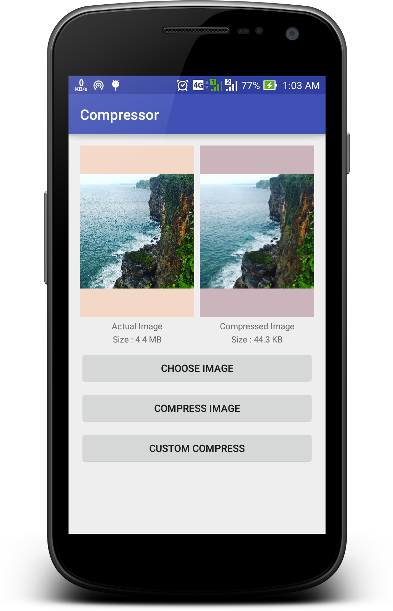

<h1 align="center">Android图片压缩开源库</h1>

>推荐两个Github上开源的Android图片压缩库，两个库的代码量不多，可以直接使用或者借鉴学习。商业使用，别忘了遵循其对应的开源协议。

需求场景

图片压缩在Android开发的需求中非常常见，如：拍照上传服务器，选择原图上传或者压缩上传，这里必然会涉及到压缩处理图片的问题。

## Luban

[https://github.com/Curzibn/Luban](https://github.com/Curzibn/Luban)

Luban，也称鲁班。该库作者一针见血的提出当前图片压缩处理的一些问题：单纯对图片进行裁切，压缩已经有很多文章介绍。但是裁切成多少，压缩成多少却很难控制好，裁切过头图片太小，质量压缩过头则显示效果太差。所以，他通过微信朋友圈发送近100张不同分辨率图片，对比原图与微信压缩后的图片逆向推算出来的压缩算法，具体的算法实现在项目中有详细说明介绍。使用上，支持普通调用方式外，也支持RxJava！

## Compressor

[https://github.com/zetbaitsu/Compressor](https://github.com/zetbaitsu/Compressor)

它可以满足动则几MB的图片高保真的压缩到几十KB的效果。

API调用上和Luban一样，支持普通方式也支持RxJava。

 **总结**
以上两者都是目前Github上关注热度比较高的了，作者也一直不断在维护更新。纯粹使用亦可，学习源码亦可，如果你也有不错的Android图片压缩方案推荐，欢迎给我评论留言。

本文为技术视界原创作品，转载请注明原文出处：http://blog.coderclock.com/2017/04/12/android/open-source-android-image-compression-library ，欢迎关注我的微信公众号！

## guetzli

[guetzli](https://github.com/google/guetzli)：Perceptual JPEG encoder

支持webp压缩，Android上webp需要做兼容，可以压缩module、jar、aar中的图片，支持压缩算法扩展，支持压缩包含透明度的webp图片，并且兼容了aapt2对资源的hook。
