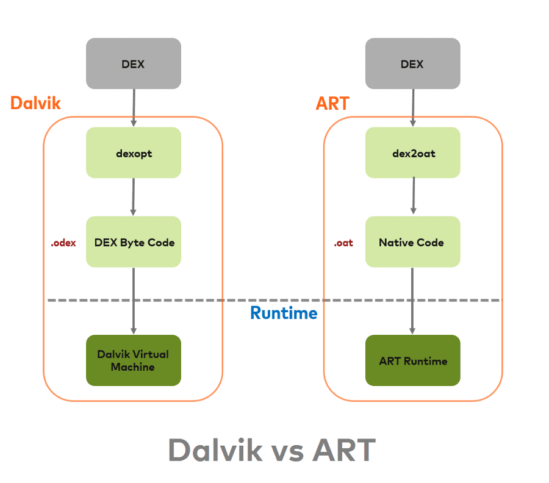
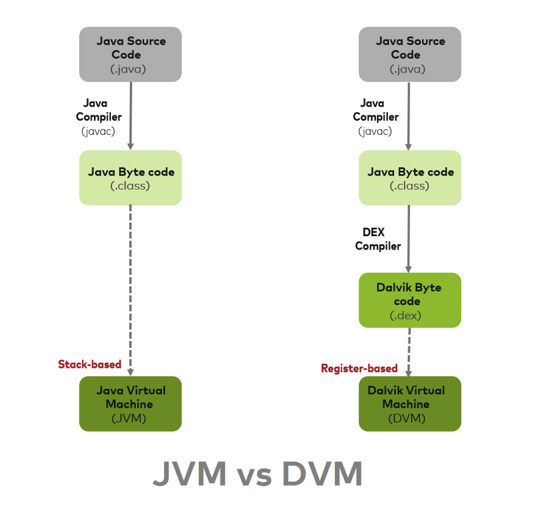

<h1 align="center">ART vs Dalvik</h1>

[toc]

## 一. Dalvik

Dalvik 是一个 Google 开发的 VM(Virtual Machine)，用在 Android 手机里的运行系统。

DVM is based on JIT (Just In Time) compilation

这代表说，每一次使用者在 run app 的時候，有部分将被执行的 code 会在那时候被转译成装置懂的语言。 当使用者在使用 app 的时候，其他的 code 也会被转译再被储存于內存。因为 JIT 只转译部分的 Code ，所以也不会占太多内存空间。

## 二. ART

2014年，[Google I/O](https://www.google.com/events/io/io14videos/b750c8da-aebe-e311-b297-00155d5066d7) 发表了 ART(Android Runtime)。在 Android 4.4 (KitKat) 中开始使用 ART。

ART is based AOT (Ahead Of Time) compliation。

和 JIT 不同的地方在于，当使用者在安裝 App 的时候，DEX bytecode 转译成装置懂的語言，转译好后就被存在手机的內存中。所以每次使用者开启 App 的時候，就不用再 JIT 一次，Code 能夠更快的被执行。

### 2.1 Android 系统如何执行 code ?

> In Android Java classes converted into DEX bytecode. The DEX bytecode format is translated to native machine code via either ART or the Dalvik runtimes. Here DEX bytecode is independent of device architecture.

Android JAVA class 格式的档案被转成 DEX bytecode 格式。DEX bytecode 格式再由 Dalvik 或 ART 编译器懂的语言。

### 2.2 ART的优点

1. App跑得更快更顺畅

2. 开启App的时间缩短

3. 电池续航力更长因为减少了转译 bytecode 时所需要的电力

4. GC效能改善

### 2.3 ART 的缺点

1. 安裝App较耗时
2. 占用较多內存空间

ART 代表 Android Runtime，其处理应用程序执行的方式完全不同于 Dalvik，Dalvik 是依靠一个 Just-In-Time (JIT) 编译器去解释字节码。开发者编译后的应用代码需要通过一个解释器在用户的设备上运行，这一机制并不高效，但让应用能更容易在不同硬件和架构上运 行。ART 则完全改变了这套做法，在应用安装时就预编译字节码到机器语言，这一机制叫 Ahead-Of-Time (AOT）编译。在移除解释代码这一过程后，应用程序执行将更有效率，启动更快。

### 2.4 预先 (AOT) 编译

ART 引入了预先编译机制，可提高应用的性能。ART 还具有比 Dalvik 更严格的安装时验证。在安装时，ART 使用设备自带的 dex2oat 工具来编译应用。该实用工具接受 DEX 文件作为输入，并为目标设备生成经过编译的应用可执行文件。该工具应能够顺利编译所有有效的 DEX 文件。

### 2.5 垃圾回收优化

垃圾回收 (GC) 可能有损于应用性能，从而导致显示不稳定、界面响应速度缓慢以及其他问题。ART 通过以下几种方式对垃圾回收做了优化：

- 只有一次（而非两次）GC 暂停
- 在 GC 保持暂停状态期间并行处理
- 在清理最近分配的短时对象这种特殊情况中，回收器的总 GC 时间更短
- 优化了垃圾回收的工效，能够更加及时地进行并行垃圾回收，这使得 GC_FOR_ALLOC 事件在典型用例中极为罕见
- 压缩 GC 以减少后台内存使用和碎片

### 2.6 开发和调试方面的优化

- 支持采样分析器

一直以来，开发者都使用 Traceview 工具（用于跟踪应用执行情况）作为分析器。虽然 Traceview 可提供有用的信息，但每次方法调用产生的开销会导致 Dalvik 分析结果出现偏差，而且使用该工具明显会影响运行时性能

ART 添加了对没有这些限制的专用采样分析器的支持，因而可更准确地了解应用执行情况，而不会明显减慢速度。KitKat 版本为 Dalvik 的 Traceview 添加了采样支持。

- 支持更多调试功能

ART 支持许多新的调试选项，特别是与监控和垃圾回收相关的功能。例如，查看堆栈跟踪中保留了哪些锁，然后跳转到持有锁的线程；询问指定类的当前活动的实例数、请求查看实例，以及查看使对象保持有效状态的参考；过滤特定实例的事件（如断点）等。

- 优化了异常和崩溃报告中的诊断详细信息

当发生运行时异常时，ART 会为您提供尽可能多的上下文和详细信息。ART 会提供 ``java.lang.ClassCastException``、``java.lang.ClassNotFoundException`` 和 ``java.lang.NullPointerException`` 的更多异常详细信息（较高版本的 Dalvik 会提供 ``java.lang.ArrayIndexOutOfBoundsException`` 和 ``java.lang.ArrayStoreException`` 的更多异常详细信息，这些信息现在包括数组大小和越界偏移量；ART 也提供这类信息）。

### 2.7 ART GC

ART 有多个不同的 GC 方案，这些方案包括运行不同垃圾回收器。默认方案是 CMS（并发标记清除）方案，主要使用粘性 CMS 和部分 CMS。粘性 CMS 是 ART 的不移动分代垃圾回收器。它仅扫描堆中自上次 GC 后修改的部分，并且只能回收自上次 GC 后分配的对象。除 CMS 方案外，当应用将进程状态更改为察觉不到卡顿的进程状态（例如，后台或缓存）时，ART 将执行堆压缩。

除了新的垃圾回收器之外，ART 还引入了一种基于位图的新内存分配程序，称为 RosAlloc（插槽运行分配器）。此新分配器具有分片锁，当分配规模较小时可添加线程的本地缓冲区，因而性能优于 DlMalloc。

与 Dalvik 相比，ART CMS 垃圾回收计划在很多方面都有一定的改善：

- 与 Dalvik 相比，暂停次数从 2 次减少到 1 次。Dalvik 的第一次暂停主要是为了进行根标记，即在 ART 中进行并发标记，让线程标记自己的根，然后马上恢复运行。

- 与 Dalvik 类似，ART GC 在清除过程开始之前也会暂停 1 次。两者在这方面的主要差异在于：在此暂停期间，某些 Dalvik 环节在 ART 中并发进行。这些环节包括 java.lang.ref.Reference 处理、系统弱清除（例如，jni 弱全局等）、重新标记非线程根和卡片预清理。在 ART 暂停期间仍进行的阶段包括扫描脏卡片以及重新标记线程根，这些操作有助于缩短暂停时间。

- 相对于 Dalvik，ART GC 改进的最后一个方面是粘性 CMS 回收器增加了 GC 吞吐量。不同于普通的分代 GC，粘性 CMS 不移动。系统会将年轻对象保存在一个分配堆栈（基本上是 java.lang.Object 数组）中，而非为其设置一个专属区域。这样可以避免移动所需的对象以维持低暂停次数，但缺点是容易在堆栈中加入大量复杂对象图像而使堆栈变长。

ART GC 与 Dalvik 的另一个主要区别在于 ART GC 引入了**移动垃圾回收器**。使用移动 GC 的目的在于通过堆压缩来减少后台应用使用的内存。目前，触发堆压缩的事件是 ActivityManager 进程状态的改变。当应用转到后台运行时，它会通知 ART 已进入不再“感知”卡顿的进程状态。此时 ART 会进行一些操作（例如，压缩和监视器压缩），从而导致应用线程长时间暂停。目前正在使用的两个移动 GC 是同构空间压缩和半空间压缩。

- 半空间压缩将对象在两个紧密排列的碰撞指针空间之间进行移动。这种移动 GC 适用于小内存设备，因为它可以比同构空间压缩稍微多节省一点内存。额外节省出的空间主要来自紧密排列的对象，这样可以避免 RosAlloc/DlMalloc 分配器占用开销。由于 CMS 仍在前台使用，且不能从碰撞指针空间中进行收集，因此当应用在前台使用时，半空间还要再进行一次转换。这种情况并不理想，因为它可能引起较长时间的暂停。

- 同构空间压缩通过将对象从一个 RosAlloc 空间复制到另一个 RosAlloc 空间来实现。这有助于通过减少堆碎片来减少内存使用量。这是目前非低内存设备的默认压缩模式。相比半空间压缩，同构空间压缩的主要优势在于应用从后台切换到前台时无需进行堆转换。

## 参考

* [Android ART vs Dalvik 差別](https://medium.com/@chloe.thhsu/android-art-vs-dalvik-%E5%B7%AE%E5%88%A5-c69df49f0b31)

