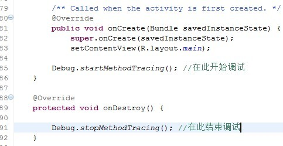
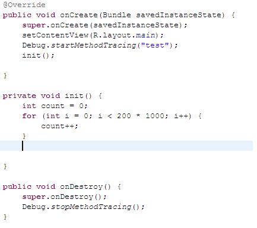
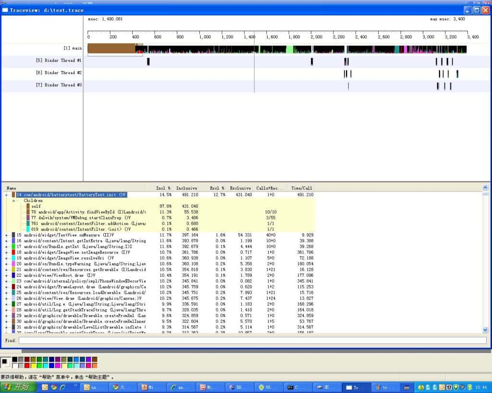

<h1 align="center">内存优化工具</h1>

[toc]

## 开发工具

* Memory Profiler
* Memory Analyzer
* dumpsys meninfo
* Leakinspector
* JHat
* ART GC Log
* Chrome Devtoll

## 代码工具

* [leakcanary](https://github.com/square/leakcanary): LeakCanary is a memory leak detection library for Android. https://square.github.io/leakcanary
* [AndroidPerformanceMonitor](https://github.com/markzhai/AndroidPerformanceMonitor):A transparent ui-block detection library for Android. (known as BlockCanary)
* [AndroidGodEye](https://github.com/Kyson/AndroidGodEye): An app performance monitor(APM) , like "Android Studio profiler", you can easily monitor the performance of your app real time in browser
* [bugsnag-android](https://github.com/bugsnag/bugsnag-android): Bugsnag crash monitoring and reporting tool for Android apps
* [AnotherMonitor](https://github.com/AntonioRedondo/AnotherMonitor): Monitors and records the CPU and memory usage of Android devices
* [AndroidMonitor](https://github.com/jackuhan/AndroidMonitor): Android开发辅助工具fps,topActivity,activity启动耗时,电量cpu内存分析。适配全机型悬浮窗权限。
* [DoraemonKit](https://github.com/didi/DoraemonKit): A full-featured App (iOS & Android) development assistant. You deserve it. 简称 "DoKit" 。一款功能齐全的客户端（ iOS 、Android、微信小程序 ）研发助手，你值得拥有。https://www.dokit.cn/
* [matrix](https://github.com/Tencent/matrix)：**Matrix** 是一款微信研发并日常使用的应用性能接入框架，支持iOS, macOS和Android。 Matrix 通过接入各种性能监控方案，对性能监控项的异常数据进行采集和分析，输出相应的问题分析、定位与优化建议，从而帮助开发者开发出更高质量的应用。
* [iqiyi/xCrash](https://github.com/iqiyi/xCrash)：xCrash provides the Android app with the ability to capture java crash, native crash and ANR. No root permission or any system permissions are required.
* [AppMethodOrder](https://github.com/zjw-swun/AppMethodOrder)：Android代码方法执行时间监控工具
* [scalpel](https://github.com/JakeWharton/scalpel)：A surgical debugging tool to uncover the layers under your app.
* [Cockroach](https://github.com/android-notes/Cockroach)：降低Android非必要crash
* [Takt](https://github.com/wasabeef/Takt)：Takt is Android library for measuring the FPS using Choreographer.
* [SoloPi](https://github.com/alipay/SoloPi)：Soloπ是一个无线化、非侵入式的Android自动化工具，公测版拥有录制回放、性能测试、一机多控三项主要功能，能为测试开发人员节省宝贵时间。
* [AabResGuard](https://github.com/bytedance/AabResGuard)：The tool of obfuscated aab resources.(Android app bundle资源混淆工具
* [bytedance/tailor](https://github.com/bytedance/tailor): Tailor是西瓜Android团队开发的一款通用内存快照裁剪压缩工具，通过它可以在异常时直接dump出一个迷你内存快照。快照中没 有任何敏感信息，更重要的是文件非常小的同时数据也相对完整，非常适合离线分析OOM及其他类型异常的调查定位。
  * [Android Camera内存问题剖析](https://mp.weixin.qq.com/s/-oaN-bOqHDjN30UP1FMpgA)
  * [西瓜视频稳定性治理体系建设一：Tailor 原理及实践](https://mp.weixin.qq.com/s/DWOQ9MSTkKSCBFQjPswPIQ)
  * [西瓜视频稳定性治理体系建设二：Raphael 原理及实践](https://mp.weixin.qq.com/s/RF3m9_v5bYTYbwY-d1RloQ)

## 内存监控

```
adb shell dumpsys meminfo package_name|pid [-d]
```

### Dalvik Heap

The RAM used by Dalvik allocations in your app. The Pss Total includes all Zygote allocations (weighted by their sharing across processes, as described in the PSS definition above). The Private Dirty number is the actual RAM committed to only your app’s heap, composed of your own allocations and any Zygote allocation pages that have been modified since forking your app’s process from Zygote.

>Note: On newer platform versions that have the Dalvik Other section, the Pss Total and Private Dirty numbers for Dalvik Heap do not include Dalvik overhead such as the just-in-time compilation (JIT) and GC bookkeeping, whereas older versions list it all combined under Dalvik.

The Heap Alloc is the amount of memory that the Dalvik and native heap allocators keep track of for your app. This value is larger than Pss Total and Private Dirty because your process was forked from Zygote and it includes allocations that your process shares with all the others.

### .so mmap and .dex mmap

The RAM being used for mapped .so (native) and .dex (Dalvik or ART) code. The Pss Total number includes platform code shared across apps; the Private Clean is your app’s own code. Generally, the actual mapped size will be much larger—the RAM here is only what currently needs to be in RAM for code that has been executed by the app. However, the .so mmap has a large private dirty, which is due to fix-ups to the native code when it was loaded into its final address.

### .oat mmap

This is the amount of RAM used by the code image which is based off of the preloaded classes which are commonly used by multiple apps. This image is shared across all apps and is unaffected by particular apps.

### .art mmap

This is the amount of RAM used by the heap image which is based off of the preloaded classes which are commonly used by multiple apps. This image is shared across all apps and is unaffected by particular apps. Even though the ART image contains Object instances, it does not count towards your heap size.

### .Heap (only with -d flag)

This is the amount of heap memory for your app. This excludes objects in the image and large object spaces, but includes the zygote space and non-moving space.

### .LOS (only with -d flag)

This is the amount of RAM used by the ART large object space. This includes zygote large objects. Large objects are all primitive array allocations larger than 12KB.

### .GC (only with -d flag)

This is the overhead cost for garbage collection. There is not really any way to reduce this overhead.

### .JITCache (only with -d flag)

This is the amount of memory used by the JIT data and code caches. Typically, this is zero since all of the apps will be compiled at installed time.

### .Zygote (only with -d flag)

This is the amount of memory used by the zygote space. The zygote space is created during device startup and is never allocated into.

### .NonMoving (only with -d flag)

This is the amount of RAM used by the ART non-moving space. The non-moving space contains special non-movable objects such as fields and methods. You can reduce this section by using fewer fields and methods in your app.

### .IndirectRef (only with -d flag)

This is the amount of RAM used by the ART indirect reference tables. Usually this amount is small, but if it is too high, it might be possible to reduce it by reducing the number of local and global JNI references used.

### Unknown

Any RAM pages that the system could not classify into one of the other more specific items. Currently, this contains mostly native allocations, which cannot be identified by the tool when collecting this data due to Address Space Layout Randomization (ASLR). Like the Dalvik heap, the Pss Total for Unknown takes into account sharing with Zygote, and Private Dirty is unknown RAM dedicated to only your app.

### TOTAL

The total Proportional Set Size (PSS) RAM used by your process. This is the sum of all PSS fields above it. It indicates the overall memory weight of your process, which can be directly compared with other processes and the total available RAM.
The Private Dirty and Private Clean are the total allocations within your process, which are not shared with other processes. Together (especially Private Dirty), this is the amount of RAM that will be released back to the system when your process is destroyed. Dirty RAM is pages that have been modified and so must stay committed to RAM (because there is no swap); clean RAM is pages that have been mapped from a persistent file (such as code being executed) and so can be paged out if not used for a while.

### ViewRootImpl

The number of root views that are active in your process. Each root view is associated with a window, so this can help you identify memory leaks involving dialogs or other windows.

### AppContexts and Activities

The number of app Context and Activity objects that currently live in your process. This can help you to quickly identify leaked Activity objects that can’t be garbage collected due to static references on them, which is common. These objects often have many other allocations associated with them, which makes them a good way to track large memory leaks.


## 性能分析工具

### 1. TraceView性能分析工具介绍

#### 1.1 TraceView简介

   TraceView是AndroidSDK里面自带的工具，用于对Android的应用程序以及Framework层的代码进行性能分析。

   TraceView是图形化的工具，最终它会产生一个图表，用于对性能分析进行说明。

   TraceView可以跟踪到具体的Method

#### 1.2 TraceView的原理

   TraceView通过修改code，在需要调试的起始位置加入调试函数，程序运行之后会在SD的根目录下产生*.trace文件来保存运行时的数据，然后把*.trace文件考到pc机上，通过traceview命令对*.trace文件进行分析。

#### 1.3 TraceView的使用

   TraceView使用的前提是无论手机还是模拟器，都要有SD卡的支持，因为它产生的数据文件将会存到SD卡上。对于手机需要插入SD卡，对于模拟器要在建立/启动模拟器的时候加入SD卡的支持就可以了。

   需要TraceView起作用，需要在对code进行修改。具体修改内容如下：



   只要在打算调试的开始位置和结束位置加上相应的函数就可以，至于调试的起始位置的选择需要根据具体情况而定。

   通过命令traceview *.trace对数据文件进行分析。

#### 1.4 TraceView举例

   下面的例子是我在一个Activity的里面对于TraceView的应用。



​    在这个例子里面特意对init()进行处理，使其耗费比较大的时间。

​    通过traceview得到的结果是：



从这个图里面可以很明显的看到init占用了大量的时间。

对于TraceView的详细说明，可以参考其官方文档：

http://developer.android.com/guide/developing/tools/traceview.html

### 2. trace在线分析工具

* https://ui.perfetto.dev/#!/
* [全新下一代平台级跟踪工具：Perfetto使用指南](https://mp.weixin.qq.com/s/0uDlSTk4Sf1E6_NyjgIC9A)

### 3. Memory Profiler

Memory profiler是Android Studio自带的一个内存检测工具，通过实时图表的方式展示内存信息，具有可以识别内存泄露，内存抖动等现象，并可以将捕获到的内存信息进行堆转储、强制GC以及跟踪内存分配的能力。

Android Studio打开Profiler工具


观察Memory曲线，比较平缓即为内存分配正常，如果出现大的波动有可能发生了内存泄露。

>GC：可手动触发GC
>
>Dump：Dump出当前Java Heap信息
>
>Record：记录一段时间内的内存信息

**点击Dump后**


可查看当前内存分配对象

>Allocations：分配对象个数
>
>Native Size：Native内存大小
>
>Shallow Size：对象本身占用内存的大小，不包含其引用的对象

>Retained Size: 对象的Retained Size = 对象本身的Shallow Size + 对象能直接或间接访问到的对象的Shallow Size，也就是说 Retained Size 就是该对象被 Gc 之后所能回收内存的总和

点击Bitmap Preview可以进行预览图片，对查看图片占用内存情况比较有帮助

**点击Record后**


可以记录一段时间内内存分配情况，可查看各对象分配大小及调用栈、对象生成位置

### 4. Memory Analyzer（MAT）

比Memory Profiler更强大的Java Heap分析工具，可以准确查找内存泄露以及内存占用情况，还可以生成整体报告，用来分析问题等。

MAT一般用来线下结合Memory Profiler分析问题使用，Memory Profiler可以直观看出内存抖动，然后生成的hdprof文件，通过MAT深入分析及定位内存泄露问题。
