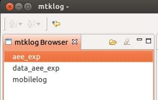
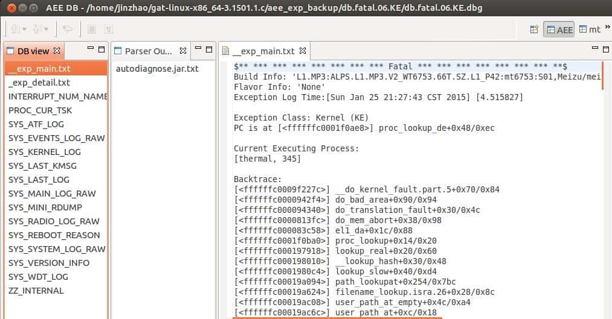
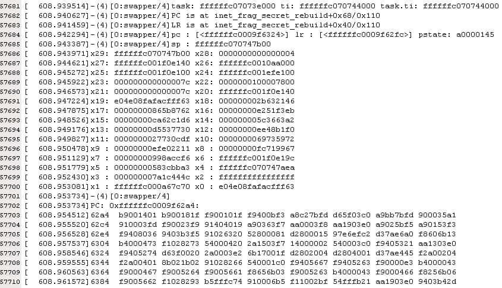
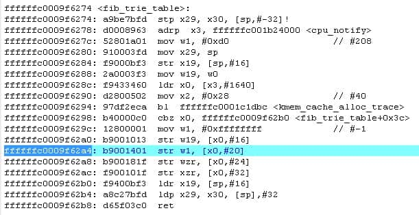
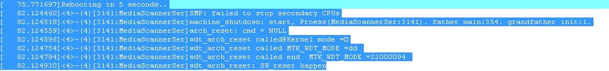
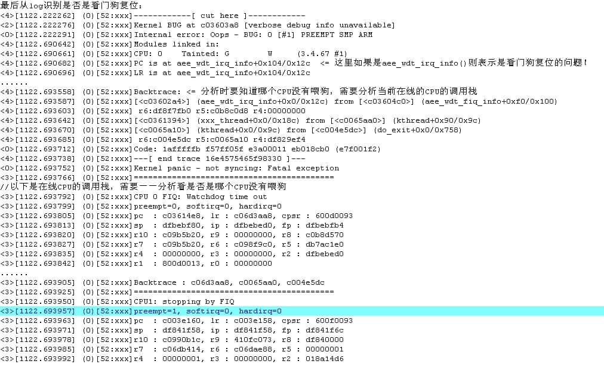
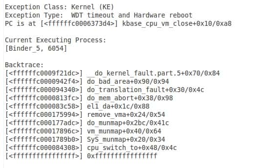

<h1 align="center">内存优化测试</h1>

[toc]

## 测试TP报点率：（正常范围：80-120Hz）

* adb shell getevent -help  // 查看获取事件的帮助，所有命令

* adb shell getevent

```
➜  ~ adb shell getevent
//直接显示
add device 1: /dev/input/event0    //物理按键
  name:     "sci-keypad"
add device 2: /dev/input/event4    //耳机线控
  name:     "headset-keyboard"
add device 3: /dev/input/event2    //加速传感器/重力传感器
  name:     "accelerometer"
add device 4: /dev/input/event1    //屏幕
  name:     "focaltech_ts"
add device 5: /dev/input/event3
  name:     "alps_pxy"
//触摸屏幕后开始打印
/dev/input/event1: 0003 0035 000001e6
/dev/input/event1: 0003 0036 00000370
/dev/input/event1: 0001 014a 00000001
/dev/input/event1: 0000 0002 00000000
/dev/input/event1: 0000 0000 00000000
/dev/input/event1: 0003 0035 000001de
/dev/input/event1: 0003 0036 0000036b
/dev/input/event1: 0000 0002 00000000
/dev/input/event1: 0000 0000 00000000
/dev/input/event1: 0003 0035 000001d5
/dev/input/event1: 0003 0036 00000365
/dev/input/event1: 0000 0002 00000000
/dev/input/event1: 0000 0000 00000000
/dev/input/event1: 0003 0035 000001cb
/dev/input/event1: 0003 0036 00000360
```

* adb shell getevent -r 

```
➜  ~ adb shell getevent -r
//直接打印
add device 1: /dev/input/event0
  name:     "sci-keypad"
add device 2: /dev/input/event4
  name:     "headset-keyboard"
add device 3: /dev/input/event2
  name:     "accelerometer"
add device 4: /dev/input/event1
  name:     "focaltech_ts"
add device 5: /dev/input/event3
  name:     "alps_pxy"
//触摸屏幕后开始打印
/dev/input/event1: 0003 0035 00000159
/dev/input/event1: 0003 0036 000002fa
/dev/input/event1: 0001 014a 00000001
/dev/input/event1: 0000 0002 00000000
/dev/input/event1: 0000 0000 00000000
/dev/input/event1: 0003 0035 00000155
/dev/input/event1: 0003 0036 000002f9
/dev/input/event1: 0000 0002 00000000
/dev/input/event1: 0000 0000 00000000 rate 70
/dev/input/event1: 0003 0035 00000150
/dev/input/event1: 0003 0036 000002f9
/dev/input/event1: 0000 0002 00000000
/dev/input/event1: 0000 0000 00000000 rate 99
/dev/input/event1: 0003 0035 00000149
/dev/input/event1: 0003 0036 000002f9
/dev/input/event1: 0000 0002 00000000
/dev/input/event1: 0000 0000 00000000 rate 100
```

* adb shell getevent -ltr

```
➜  ~ adb shell getevent -ltr
//直接打印
add device 1: /dev/input/event0
  name:     "sci-keypad"
add device 2: /dev/input/event4
  name:     "headset-keyboard"
add device 3: /dev/input/event2
  name:     "accelerometer"
add device 4: /dev/input/event1
  name:     "focaltech_ts"
add device 5: /dev/input/event3
  name:     "alps_pxy"
//触摸屏幕后打印
[   57824.065040] /dev/input/event1: EV_ABS       ABS_MT_POSITION_X    00000135
[   57824.065040] /dev/input/event1: EV_ABS       ABS_MT_POSITION_Y    00000336
[   57824.065040] /dev/input/event1: EV_KEY       BTN_TOUCH            DOWN
[   57824.065040] /dev/input/event1: EV_SYN       SYN_MT_REPORT        00000000
[   57824.065040] /dev/input/event1: EV_SYN       SYN_REPORT           00000000
[   57824.079200] /dev/input/event1: EV_ABS       ABS_MT_POSITION_X    0000011c
[   57824.079200] /dev/input/event1: EV_ABS       ABS_MT_POSITION_Y    0000032f
[   57824.079200] /dev/input/event1: EV_SYN       SYN_MT_REPORT        00000000
[   57824.079200] /dev/input/event1: EV_SYN       SYN_REPORT           00000000             rate 70
[   57824.089210] /dev/input/event1: EV_ABS       ABS_MT_POSITION_X    00000109
[   57824.089210] /dev/input/event1: EV_ABS       ABS_MT_POSITION_Y    0000032a
[   57824.089210] /dev/input/event1: EV_SYN       SYN_MT_REPORT        00000000
[   57824.089210] /dev/input/event1: EV_SYN       SYN_REPORT           00000000             rate 99
[   57824.099281] /dev/input/event1: EV_ABS       ABS_MT_POSITION_X    000000f2
[   57824.099281] /dev/input/event1: EV_ABS       ABS_MT_POSITION_Y    00000325
[   57824.099281] /dev/input/event1: EV_SYN       SYN_MT_REPORT        00000000
[   57824.099281] /dev/input/event1: EV_SYN       SYN_REPORT           00000000             rate 99
```

* getevent -c 10 //输出10条信息后退出


* getevent -l  //将type、code、value以对应的常量名称显示


## 手机上抓取log：
* 在拨号界面输入：##3646633## ，然后找到DEBUG&LOG抓取对应log数据


## adb 命令抓取log：

* adb monkey -s 1 -p  com.freeme.launcher --ingorncrashs --ingorntimeout 999999999 跑monkey，com.freeme.launcher为包名，999999999为次数
* adb shell top -d 3 > top.log  log
* adb shell top > top.log
* adb bugreport > bug.log
* adb shell pm list packages    获取手机中所有应用包名
* adb monkey 获取跑monkey的所有命令 


## 手机常见问题及测试方法：
* 能开机，卡死在一些界面上。
----这种情况，有几个步骤：先按power键看是否可以正常休眠唤醒。如果power键有反应，再插USB，看是否可以正常检测到ADB，如果可以正常检测到ADB，那可以通过ADB shell getevent 来看是否是TP驱动没有报点。
* 开机卡死，按power键没反应。
  ----需要抓取mtklog，看是否有生成aee的log文件夹，有的话需要通过gat工具来解析。

步骤如下：

1：电脑端打开应用程序 gat-linux-x86_64-3.1501.1.c\gat-linux-x86_64-3\modules\MediatekLogView\MediatekLogView；



2：打开aee目录里面的文件，如” db.fatal.06.KE.dbg“，可以直接拖进来。



* 不能开机，需要抓取串口log分析。
简单分析步骤： 
1：抓取串口log[MTK 的波特率需要设置为921600]


2：确认PC指针指到具体函数和具体函数
在alps/prebuilts/gcc/linux-x86/aarch64-linux-anroid-4.9/bin$./aarch64-linux-android-addr2line -e vmlinux -f -C 0xffffffc0009f62a4
确定具体文件和行号
alps/prebuilts/gcc/linux-x86/aarch64-linux-anroid-4.9/bin$./aarch64-linux-android-objdump -d vmlinux


3：有时候kernel看到了异常，但不一定就是kernel的问题，有可能是上层主动发了重启之类的命令，可以在log中看类似的打印：


*  WatchDog超时



*  HW reboot
Hardware reboot的成因：MT6592平台芯片有一个External watch dog，软件每隔30秒要去踢一次，若没有踢到，就会触发软件Watch Dog Timeout重启；

若软件有在规定的时间内(30秒)去踢这个External Watch Dog，但是由于硬件原因，导致External Watch Dog没有及时被踢到，那么这个External Watch Dog最多会等待60秒的时间，60秒之后会直接触发硬件重启，这就是所谓的Hardware reboot 

至于是什么样的硬件原因导致无法及时提到External Watch Dog，最常见的一种是bus hang住， 比如不合理的读写寄存器就会导致bus hang住；也有一些是硬件设计不合理，或者硬件出现故障导致机器乱死，或者硬件某些器件不稳定，导致Hardware reboot 如果是因为读写寄存器导致bus hang住，进而触发Hardware reboot，一般在last pc 和last kmsg中会有体现，每次最后的PC或者最后打印出来的几句log都是一样或者相似的 若是硬件不合理或者硬件出现故障或者硬件不稳，这种在last pc 和last kmsg中就没有规律性了， 这种case，一般都是对照之前的项目，看之前项目是否有出现？ 若之前项目稳定，而现在项目有Hardware reboot，则对照之前项目跟现在项目在硬件上的差异，然后通过硬件实验来理清问题


## 通过查找关键字查看log：
通过查找："null" "error" " "E/"，"Fatal","NullPointerException","Build fingerprint:","exception","anr"，"DexOpt"等的错误信息，来定位问题

* 空指针问题：
NullPointerException： 这个直接找到java代码，首先分析为什么会是空指针，如果逻辑上没有问题，加上一个判断就可以，也就是说如果为空的时候再次赋值或者直接返回

* 没有捕获异常问题：
Exception：能捕获的话捕获

* ANR问题:
例如：E/ActivityManager( 957): ANR in com.ipanel.join.appstore

* Fatal问题
Fatal： 比较严重了，很多都很动态库和空指针有关，一般会接下来打印"Build fingerprint:"或”NullPointerException“

* 动态库问题

* 执行DexOpt错误 
DexOpt:解压或优化extract+optimize DEX出的问题

* 死机问题：
例如：WARN/SharedBufferStack(312): waitForCondition(LockCondition) timed out (identity=19, status=0). CPU may be pegged. trying again.  
　　12-

* 


## 通过命令查看内存

```
adb shell dumpsys meminfo 包名
```

## 查看进程

```
adb shell ps|grep 包名
```

